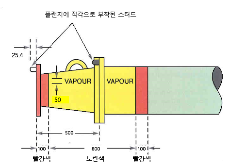

# 제9편 추가설비

> 선급 및 강선규칙/적용지침 / RA-09-K / 2025 / KO / Rules

## 제 9 장 화물증기 배출제어장치

### 제 1 절 일반사항

#### 101. 적용

- **1.** 이 장은 우리 선급에 등록하고자하는 탱커 또는 등록된 탱커로서 액체화물로부터 발생하는 증기배출을 제어하기 위하여 선내에 설치되는 화물증기 배출제어장치에 대하여 선주의 신청이 있는 경우에 적용한다. 이 장에서 탱커라 함은 유조선 및 케미컬탱커를 말한다.
- **2.** 이 장은 **IMO MSC/Circ. 585** 및 **USCG CFR 46 Part 39**의 기술요건을 기본으로 하고 있으며 **1편 1장 2절**에 따라 부기하여 등록하는 것에 적용한다. *(2020)*

#### 102. 용어의 정의

이 장에서 사용하는 용어의 정의는 다음에 따른다.

- **1.** **화물증기 수집장치(vapour collection system)**라 함은 탱커의 화물탱크로부터 배출되는 증기를 수집하고 증기처리장치로 이송하기 위하여 사용되는 관장치 및 호스로 구성된 장치를 말한다.
- **2.** **화물증기 처리장치(vapour processing unit)**라 함은 탱커로부터 수집된 증기를 회수, 소실 또는 분산하는 증기제어장치의 일부장치를 말한다.
- **3.** **화 물증기 배출제어장치(vapour emission control system)**라 함은 탱커로부터 배출된 증기를 수집하고 제어하기 위하여 사용되는 관장치 및 호스로 구성된 장치를 말하며 증기수집장치 및 증기처리장치를 포함한다.
- **4.** **지 원선(service ship)**이라 함은 육상시설과 다른 선박 간에 화물을 운송하는 선박을 말한다.

#### 103. 선급부호

이 장의 요건에 적합한 선박은 선주의 요청에 따라 다음의 추가설비부호를 부여할 수 있다.

- **1.** VEC1 : **2절**에 적합한 화물증기 배출제어장치를 설치한 선박
- **2.** VEC2 : **3절**에 적합한 화물증기 배출제어장치를 설치한 선박
- **3.** VECL : 육상시설과 다른 선박 간에 화물을 운송하는 선박으로서 선박대선박 화물이송작업을 위하여 **4절**에 적합한 증기균형(vapour balancing)설비를 설치한 선박

### 제 2 절 VEC1 부호 요건

#### 201. 화물증기관장치

- **1.** 탱커는 하역용 매니폴드에서 가능한 가까운 위치에 화물증기 연결구를 포함한 고정된 화물증기수집 관장치를 설치하여야 한다. 케미컬탱커는 고정된 관장치 대신에 각 탱크에 고정된 화물증기 연결구를 설치하여 증기호스를 연결할 수 있다. 이 경우, 증기호스는 가능한 짧아야 하고 3 $\mathrm{m}$를 초과해서는 안 된다.
- **2.** 서로 위험한 반응을 일으키는 다른 종류의 화물로부터 증기를 동시에 수집할 경우, 이러한 증기는 전체 증기수집장치에 걸쳐서 서로 분리된 상태로 유지되어야 한다.
- **3.** 응축된 액체를 제거하기 위하여 관장치의 낮은 위치에서 액체를 드레인하여 수집할 수 있는 장치를 설치하여야 한다.
- **4.** 화물증기 수집관은 선체와 전기적으로 접지가 되어야 하고 전기적으로 연속성을 가져야 한다.
- **5.** 불활성가스 공급관을 화물증기 수집관으로 사용하는 경우에는 화물증기 수집관과 불활성가스 공급관을 분리할 수 있는 수단을 갖추어야 한다. 이 요건을 만족하기 위하여 **지침 8편 부록 8-5 2**항 (9)호 (다)에서 요구되는 불활성가스 주관에 설치된 차단밸브를 사용할 수 있다.
- **6.** 화물증기 수집장치는 화물탱크 벤트장치의 정상적인 작동에 영향을 주지 않아야 한다.

#### 202. 화물증기 연결구

- **1.** 수동조작이 가능한 격리밸브를 각 화물증기 연결구에 설치하여야 한다. 이 밸브는 개폐지시기를 설치하여 밸브의 개폐상태를 육안으로 쉽게 확인할 수 있어야 한다.
- **2.** 각 화물증기 수집관 또는 화물증기 수집호스의 끝단은 잘못 연결하는 것을 방지하기 위하여 쉽게 구분할 수 있도록 표시되어야 한다. 각 매니폴드의 끝단 1 $\mathrm{m}$는 배관의 외측 표면에 페인트를 칠하여야 한다. 페인트는 양 끝에 100 $\mathrm{mm}$의 폭으로 빨간색, 중간에 800 $\mathrm{mm}$ 의 폭으로 노란색으로 칠하여야 하고. 노란색 폭에는 검은색으로 "VAPOUR" 를 50 $\mathrm{mm}$의 크기로 표시하여야 한다. (**그림 9.9.1** 참조)
  
  **그림 9.9.1 화물증기 매니폴드의 식별**
- **3.** 화물증기 매니폴드를 육상 터미널 측의 액체 적하관에 잘못 연결하는 것을 방지하기 위하여 각 선박의 화물증기 연결플랜지는 선박의 크기에 관계없이 **OCIMF**의 **유조선 매니폴드 및 관련 장비에 대한 권고(Recommendation for Oil Tanker Manifolds and Associated Equipment)**를 적용하여야 한다.
- **4.** 화물증기 연결구에 연결되는 화물증기 수집호스는 다음에 적합하여야 한다.
  - **(1)** 호스의 재료는 취급되는 화물증기에 적합하여야 한다.
  - **(2)** 최대 허용사용압력은 0.034 $\mathrm{MPa}$이상이어야 하고 설계파열압력은 허용사용압력의 5배 이상이어야 한다.
  - **(3)** 최대 허용부압은 0.014 $\mathrm{MPa}$이상이어야 한다.
  - **(4)** 전기적으로 연속성을 가져야 한다.
  - **(5)** 호스의 각 플랜지에는 화물증기 연결플랜지에 부착된 스터드(stud)에 대응하는 16 $\mathrm{mm}$의 볼트체결구가 있어야 한다.

#### 203. 화물계측장치

- **1.** 화물증기 수집장치와 연결된 각 화물탱크에는 다음을 만족하는 화물계측기를 설치하여야 한다.
  - **(1)** 화물계측기는 화물이송 중 대기 중으로 개구가 형성되지 않는 밀폐형이어야 한다.
  - **(2)** 작업자가 화물액면의 전체 범위에 대하여 화물액면을 식별할 수 있어야 한다.
  - **(3)** 화물이송을 제어하는 장소에 화물액면을 나타내어야 한다.
  - **(4)** 휴대식인 경우 화물작업 중에는 탱크에 고정되어 있어야 한다.

#### 204. 넘침제어장치 (2020)

- **1.** 탱커의 각 화물탱크는 다음을 만족하는 넘침제어장치를 설치하여야 한다.
  - **(1)** **203.**의 화물계측장치와는 독립적이어야 한다.
  - **(2)** 정상적인 탱크 적재절차로 화물액면이 정상적인 만재상태를 초과하는 것을 방지하지 못하였을 때 넘침경보장치가 작동하여야 한다. 넘침경보는 탱크의 넘침을 방지하기 위한 조치를 하기에 충분한 시간을 갖도록 설정하여야 한다.
  - **(3)** 선박 내의 화물제어장소 및 화물갑판지역에서 작업자가 인지할 수 있도록 가시가청의 넘침경보를 제공하여야 한다.
  - **(4)** 육상 측의 펌프, 밸브 또는 두 가지 모두 및 선내 밸브의 순차적인 차단을 위한 합의된 신호를 제공하여야 한다. 펌프 및 밸브의 차단 뿐 아니라 신호도 작업자가 조정할 수 있다. 선내 자동 차단밸브의 사용은 우리 선급의 승인을 받은 경우에만 허용된다.
  - **(5)** 화물제어장소에 경보가 설치된 경우 작업자가 즉시 인지할 수 있는 위치에 설치되어야 한다.
  - **(7)** 각 탱크로의 화물이송 전에 장치가 적절히 작동하는지 확인하기 위하여 넘침경보장치는 탱크 측에서 점검하는 것이 가능하거나 또는 경보회로 및 센서의 상태를 감시하는 자기감시 기능이 있어야 한다.
  - **(8)** 넘침경보장치는 흰색바탕에 검은색 글자로 각각 "TANK OVERFILL ALARM"을 50 $\mathrm{mm}$의 크기로 표시하여야 한다.

#### 205. 과압 및 부압 방지장치

- **1.** 화물탱크 내의 압력이 설계압력을 초과하는 것을 방지하기 위하여 각 화물탱크에 최대 적재율의 1.25배 이상의 배출능력을 가지는 제어식 압력도출장치를 설치하여야 한다.
- **2.** 각 화물탱크에 최대 배출률로 화물 또는 증기를 배출함으로서 발생하는 화물탱크 내의 진공이 화물탱크의 설계부압을 초과하지 않도록 제어식 부압벤트장치를 설치하여야 한다.
- **3.** 벤트장치는 우리 선급의 형식승인을 받아야 한다.
- **4.** 두 개 이상의 화물탱크에 공통 증기수집장치가 설치된 탱커는 화물증기 수집주관에 다음을 만족하는 압력감지장치를 설치하여야 한다.
  - **(1)** 화물탱크 벤트장치용 도출밸브의 가장 낮은 설정압력보다 낮은 압력에서 고압경보를 발하여야 한다.
  - **(2)** 불활성화 된 탱커에 대하여는 대기압 이상의 압력에서 경보를 발하는 저압경보가 있어야 하고, 불활성화 되지 않은 탱커에 대하여는 화물탱크 벤트장치의 최저 진공도출밸브 설정값 이상의 압력에서 경보를 발하는 저압경보가 있어야 한다.

#### 206. 작업절차

- **1.** **화물이송률**
  - **(1)** 화물이송률은 다음 중에서 작은 값으로 결정된 최대 허용이송률 초과하지 않아야 한다.
    - **(가)** 화물탱크 벤트장치에서 압력도출밸브의 벤트용량을 1.25로 나눈 값
    - **(나)** 화물탱크 벤트장치에서 진공도출밸브의 도출용량
    - **(다)** 화물증기수집장치에 연결된 어떤 화물탱크에서의 압력이 화물탱크 벤트장치에 있는 어떤 압력도출밸브의 개방 설정압력의 80 %를 초과하지 않도록 육상연결부에서 주어진 압력에 대한 압력강하 계산을 기초로 한 값
  - **(2)** (1)호 (다)의 적용에 있어서 압력강하를 계산할 때, 다음 식을 사용하여야 한다.
    $VGR=1+0.25 \frac{P _{v}}{0.0862}$
    $\rho _{va} =(SG _{v} \cdot V _{v} +V _{a} )10.9 \cdot P _{p/v}$ ($\mathrm{kg}/m ^{3}$)
    $V _{v} = \frac{P _{v}}{P _{p/v}}$, $V _{a} = \frac{P _{p/v} -P _{v}}{P _{p/v}}$
    $VGR$ : 증기생성률 (무차원), 계산된 값이 1.25보다 적은 경우 1.25로 한다.
    $P _{v}$ : 46.1℃에서 포화증기압 ($\mathrm{MPa}$, 절대압력)
    $P _{p/v}$ : 46.1℃에서 화물탱크 PV 밸브의 설정압력 ($\mathrm{MPa}$, 절대압력)
    $\rho _{va}$ : 46.1℃에서 화물증기-공기 혼합기체의 밀도 ($\mathrm{kg}/m ^{3}$)
    $SG _{v}$ : 화물증기의 비중 (무차원)
    $V _{v}$ : 46.1℃에서 화물증기의 부피비율 (무차원)
    $V _{a}$ : 46.1℃에서 공기의 부피비율 (무차원)
  - **(3)** PV밸브의 용량시험을 공기로 한 경우 화물증기에 대한 용량으로 수정하기 위해 다음 식을 사용하여야한다.
    $Q _{A} =Q _{L} ․VGR ․C$ ($\mathrm{m} ^{3} /h$)
    $C= \sqrt {\frac{\rho _{va}}{\rho _{a}}}$
    $Q _{A}$ : 요구되는 공기의 유량(용적기준) ($\mathrm{m} ^{3} /h$)
    $Q _{L}$ : 화물이송률(용적기준) ($\mathrm{m} ^{3} /h$)
    $C$ : 비중 보정계수 (무차원)
    $\rho _{va}$ : 46.1℃에서 화물증기-공기 혼합기체의 밀도 ($\mathrm{kg}/m ^{3}$)
    $\rho _{a}$ : 46.1℃에서 공기의 밀도 ($\mathrm{kg}/m ^{3}$)
- **2.** 화물탱크는 **204.**에서 요구하는 넘침경보의 설정값 이하로 적재되어야 한다.
- **3.** 탱커가 화물증기배출제어장치에 연결되어 있는 동안에는 측심 또는 시료채취를 위해 화물탱크를 대기로 개방하여서는 안 된다. 다만, 다음을 모두 만족하는 경우, 대기로 개방하는 것을 허용할 수 있다.
  - **(1)** 탱크는 화물적재를 중지한 상태이어야 한다.
  - **(2)** 탱크는 적재가 진행 중인 다른 탱크로부터 격리되어야 한다.
  - **(3)** 화물탱크의 화물증기구역의 압력감소 및 정전기 방지를 위한 예방조치를 취해야 한다.
- **4.** 불활성가스장치가 설치된 탱커의 경우, 화물증기이송 중에는 **201.**의 **5**항에서 요구하는 격리밸브를 폐쇄상태로 유지하여야 한다.
- **5.** 적재하고자하는 탱크의 넘침경보장치에 **204.**의 **1**항 (7)호에서 요구하는 경보회로 및 센서의 상태를 감시하는 자기감시기능이 없는 경우, 화물 이송작업을 시작하기 전에 넘침경보장치를 탱크 측에서 시험하여야 한다.

#### 207. 화물증기 배출제어장치의 취급설명서

- **1.** 화물증기 배출제어장치의 작업원리 및 절차를 설명하는 취급설명서를 작성하여 선내에 비치하여야 한다.
- **2.** 취급설명서는 다음의 내용을 포함하여야 한다.
  - **(1)** 화물증기수집관장치의 관계통도
  - **(2)** 최대 허용 화물이송률
  - **(3)** 다양한 화물이송률에서 화물증기 수집장치 내부의 최대 압력강하
  - **(4)** PV밸브의 설정값
  - **(5)** 화물이송전의 준비절차(pre-transfer procedure)
  - **(6)** 화물증기수집 작업 중에 장치의 고장 발생 시의 대응절차

### 제 3 절 VEC2 부호 요건

#### 301. 일반사항

- **1.** **2 절**의 요건에 추가하여 **302.** 및 **303.**을 만족하여야 한다.

#### 302. 고액면경보장치 (2020)

- **1.** 각 화물탱크는 다음을 만족하는 고액면경보장치를 설치하여야 한다.
  - **(1)** 화물탱크의 넘침경보장치와는 독립적이어야 한다.
  - **(2)** 화물제어장소 내에 설치된 고액면경보장치는 흰색바탕에 검은색 글자로 각각 "HIGH LEVEL ALARM"을 50 $\mathrm{mm}$의 크기로 표시하여야 한다.
  - **(3)** 고액면경보는 탱크용량의 95 %이상으로 설정하여야 하고, 넘침경보 전에 작동하여야 한다.
  - **(4)** 선박내의 화물제어장소 및 화물갑판지역에서 작업자가 인지할 수 있도록 가시가청의 고액면경보를 제공하여야 한다. *(2023)*
  - **(5)** 경보장치의 동력상실 또는 화물액면 감지기의 전기회로 고장 시에 경보를 발하여야 한다.
  - **(6)** 각 탱크로의 화물이송 전에 적절한 운전을 위하여 탱크에서 점검하는 것이 가능하거나 경보회로 및 센서의 상태를 감시하는 자기감시기능이 있어야 한다.

#### 303. 과압 및 부압 방지장치

- **1.** 압력밸브의 설정값은 7 $\mathrm{kPa}$ 이상이어야 한다.
- **2.** 진공밸브의 설정값은 대기압 보다 3.5 $\mathrm{kPa}$ 이상 낮은 압력이어야 한다.
- **3.** PV밸브의 도출용량은 **API 2000**의 **1.5.1.3**항에 따라 시험되어야 한다.
- **4.** PV밸브의 양호한 작동 및 개방상태로 유지되지 않는 지를 점검할 수 있는 수단을 갖추어야 한다.
- **5.** **2 05.**의 **4**항 대신에 화물증기 수집주관에 다음을 만족하는 압력감지장치를 설치하여야 한다.
  - **(1)** 화물제어장소에 압력지시기를 갖추어야 한다.
  - **(2)** 다음을 만족하는 저압 및 고압경보를 갖추어야 한다.
    - **(가)** 화물제어장소에 가시가청의 경보를 발하여야 한다.
    - **(나)** 화물탱크 벤트장치용 도출밸브의 가장 낮은 설정압력의 90 % 이하 압력에서 고압경보를 발하여야 한다.
    - **(다)** 불활성화 된 탱커에 대하여는 1 $\mathrm{kPa}$ 이상의 압력에서 경보를 발하는 저압경보가 있어야 하고, 불활성화 되지 않은 탱커에 대하여는 화물탱크 벤트장치의 최저 진공도출밸브 설정값 이상의 압력에서 경보를 발하는 저압경보가 있어야 한다.

### 제 4 절 VECL 부호 요건

#### 401. 일반사항

- **1.** 이 절의 요건은 육상설비와 다른 선박사이의 화물운송에 종사하는 선박(이하, 지원선이라 한다.)에 적용한다.
- **2.** **3 절**의 요건에 추가하여 **402.**을 만족하여야 한다.

#### 402. 설계 및 장치

- **1.** 화물을 배출하고 선박 및 화물을 받는 선박의 화물탱크가 불활성화 되는 경우, 지원선은 다음을 만족하여야 한다.
  - **(1)** 화물증기를 이송하기 전에 화물증기 이송호스를 불활성화하는 장치를 갖추어야 한다.
  - **(2)** 선박의 화물증기 연결구의 3 $\mathrm{m}$ 이내에 센서 또는 시료채취구가 설치된 산소분석기 갖추어야 한다. 산소분석기는 다음을 만족하여야 한다.
    - **(가)** 산소농도가 용적의 8 % 초과 시 지원선의 화물제어장소에 가시가청의 경보를 발하여야 한다.
    - **(나)** 지원선의 화물제어장소에 산소농도지시기를 갖추어야 한다.
    - **(다)** 산소분석기의 검교정 및 시험을 위하여 시험용 가스를 주입할 수 있는 연결구를 갖추어야 한다.
- **2.** 화물을 배출하는 선박의 화물탱크가 불활성화 되지 않은 경우, 지원선의 화물증기 수집관 연결구의 3 $\mathrm{m}$ 이내에 승인된 데토네이션 플레임어레스터(detonation flame arrester)를 설치하여야 한다.
- **3.** 지원선의 화물증기연결구와 탱커선의 화물증기연결구 사이에는 절연된 플랜지 또는 비전도성 호스를 갖추어야 한다.

### 제 5 절 검사

#### 501. 일반사항

- **1.** **검사의 종류**
  우리 선급에 등록된 또는 등록을 받고자 하는 화물증기 배출제어장치는 다음의 검사를 받아야 한다.
  - **(1)** 등록을 위한 검사(이하, 등록검사라 한다.)
  - **(2)** 등록을 계속적으로 유지하기 위한 검사(이하, 등록유지검사라 한다)의 종류는 다음과 같다.
    - **(가)** 연차검사
    - **(나)** 정기검사
    - **(다)** 임시검사
- **2.** **검사의 시기**
  - **(1)** 등록검사는 선주 또는 선박검사 신청자로부터 등록신청이 있을 경우 실시한다.
  - **(2)** 등록유지검사는 선박의 정기적 검사와 동일하게 실시한다.

#### 502. 등록검사

- **1.** **제출도면 및 자료**
  등록검사를 받으려 하는 화물증기 배출제어장치에 대하여는 공사 착수 전에 다음 도면 및 자료를 제출하여 승인을 받아야 한다.
  - **(1)** 화물증기 관장치도
  - **(2)** 화물액면계측장치, 넘침방지장치, 압력제어장치 및 산소농도지시기(설치된 경우)관련 계통도 및 상세구조도
  - **(3)** 최대 허용 화물이송률 및 PV밸브 용량 관련 계산서
  - **(4)** 넘침경보 설정값의 계산서
  - **(5)** **207.**에 따른 화물증기 배출제어장치의 취급설명서
- **2.** **시험 및 검사**
  화물증기 배출제어장치는 **5편 6장** 및 **7편 6장**의 해당 요건에 따라 시험 및 검사하여야 한다.

#### 503. 등록유지검사

- **1.** **연차검사**
  - **(1)** VEC1 및 VEC2를 부여받은 선박에 대하여는 다음 사항을 검사한다.
    - **(가)** 모든 화물증기관창치의 외관을 검사한다.
    - **(나)** 화물증기 매니폴드에 설치된 격리밸브의 작동이 양호한지 확인한다.
    - **(다)** 화물증기 연결플랜지의 스터드의 상태를 확인한다.
    - **(라)** 화물증기를 이송하는데 사용되는 호스가 **202.**의 **4**항에 적합한지를 확인한다.
    - **(마)** 불활성가스 배관장치가 화물증기 수집장치에 사용되는 경우, 불활성가스 주격리밸브의 작동이 양호한지 확인한다.
    - **(바)** 화물증기 수집장치와 연결된 각 탱크의 밀폐형 액면계측장치의 작동이 양호한지 확인한다.
    - **(사)** 화물탱크의 압력진공밸브 및 플레임스크린을 검사한다.
    - **(아)** 다음 장치의 작동이 양호한지 확인한다.
      - **(a)** 화물증기 수집주관의 고압경보장치
      - **(b)** 화물증기 수집주관의 저압경보장치
      - **(c)** 화물탱크의 넘침경보장치
      - **(d)** 화물탱크의 고액면 경보장치(VEC1 부호에는 해당안됨)
      - **(e)** 동력상실 경보장치
      - **(f)** 자동차단장치(설치된 경우)
    - **(자)** 정비 및 작동기록부를 검토하여 장치의 정비와 작동이 적절한 지를 확인한다.
  - **(2)** VECL을 부여받은 선박에 대하여는 (1)호에 추가하여 다음 사항을 검사한다.
    - **(가)** 데토네이션 플레임어레스터(detonation flame arrester)(설치된 경우)를 검사한다.
    - **(나)** 화물증기 매니폴드 연결부에 절연장치가 설치되었는지 확인한다.
    - **(다)** 시료가스를 사용하여 산소분석기의 정확성을 확인한다.
    - **(라)** 화물증기의 유량을 증가시키는데 사용되는 장치(압축기 또는 송풍기)에 대한 일반적인 검사를 한다.
- **2.** **정기검사**
  - **(1)** VEC1 및 VEC2를 부여받은 선박에 대하여는 **503.**의 **1**항 (1)호에서 요구하는 연차검사에 추가하여 다음 사항을 검사한다.
    - **(가)** 화물증기 배출제어장치의 모든 밸브를 검사한다.
    - **(나)** 밀폐식 측심장치를 검사한다.
    - **(다)** 독립식 화물탱크 넘침경보를 검사한다.
    - **(라)** 화물증기 수집장치에 사용되는 호스의 전기적 연속성 또는 비전도성을 시험한다.
    - **(마)** 불활성가스 관장치가 화물증기 수집장치에 사용되는 경우, 갑판 수밀봉의 검사한다.
  - **(2)** VECL을 부여받은 선박에 대하여는 **503.**의 **1**항 (2)호에서 요구하는 연차검사 및 (1)호에서 요구하는 사항을 검사한다. 
