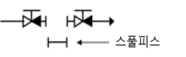
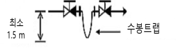
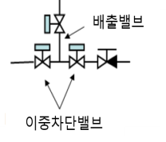
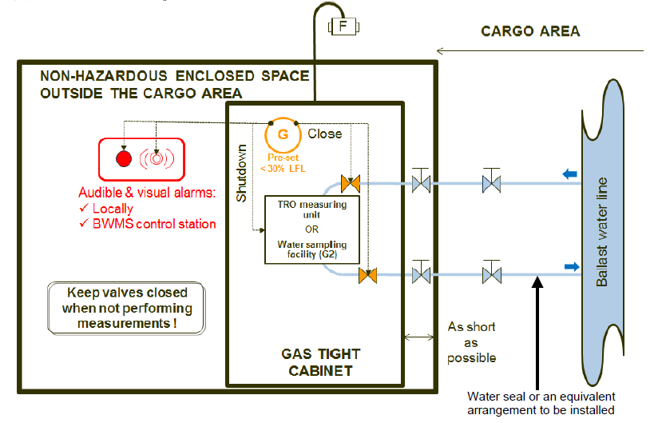

# 제9편 추가설비

> 선급 및 강선규칙/적용지침 / RA-09-K / 2025 / KO / Rules

## 제 10 장 평형수관리

### 제 1 절 일반사항

#### 101. 적용

- **1.** 이 장은 우리 선급에 등록하고자하는 선박 또는 등록된 선박으로서, **평형수 및 침전물의 통제 및 관리를 위한 국제협약**(이하 협약이라 한다.)에 따라 선박에 설치된 평형수관리설비에 대하여 적용한다.
- **2.** 이 장에서 인용하는 “지침(Guideline)”이라 함은 협약에서 사용하는 지침(Guideline)을 말한다.

#### 102. 용어의 정의

이 장은 사용하는 용어의 정의는 다음에 따른다.

- **1.** **평 형수관리(ballast water management)**라 함은 평형수와 침전물 내에 포함된 유해한 수중 생물체에 대하여 평형수의 처리 또는 교환으로 그 유입 및 배출을 방지하는 절차로서 여러 가지 방법의 어느 하나 또는 이들을 복합적으로 행하는 것을 말한다.
- **2.** **평 형수관리계획(ballast water management plan)**이라 함은 평형수 및 침전물 내에 포함된 유해한 수중 생물체의 이동을 최소화하기 위하여 선내 평형수를 취급 또는 처리하기 위한 계획서를 말한다.
- **3.** **협 약(convention)**이라 함은 평형수 및 침전물의 통제 및 관리를 위한 국제협약을 말한다.
- **4.** **평 형수교환(ballast water exchange)**이라 함은 다음에서 정의하는 방법 또는 기구에서 권고하거나 요구하는 기타 교환방법을 사용하여 평형수탱크의 평형수를 교환하는 과정을 말한다.
  - **(1)** **배출후주입방식(sequential method)**이라 함은 먼저 평형수탱크 또는 화물창 용적의 95 % 이상을 비우고 난 다음 새로운 평형수로 다시 채우는 방법을 말한다.
  - **(2)** **넘침흐름방식(flow-through method)**이라 함은 평형수탱크 또는 화물창에 교체되는 평형수를 주입하면서 넘침장치 또는 기타 장치를 통하여 물을 넘치게 하는 방법을 말한다. 각 평형수탱크 용적의 3배 이상의 물을 평형수탱크에 주입하여야 한다.
  - **(3)** **희석방식(dilution method)**이라 함은 평형수탱크 또는 화물창 상부로 교체되는 평형수를 주입함과 동시에 하부로 동일한 유량으로 평형수를 배출하면서 탱크 또는 화물창의 수위를 일정하게 유지하는 방법을 말한다. 각 평형수탱크 용적의 3배 이상의 물을 평형수탱크에 주입하여야 한다.
- **5.** **평 형수처리장치(ballast water management system)**라 함은 협약의 D-2규칙의 평형수 배출 성능기준에 부합하거나 그 이상으로 평형수를 처리하는 모든 장치를 말한다. 평형수처리장치는 평형수처리장비, 관련된 모든 제어장치, 감시장치 및 시료채취설비를 포함한다. 평형수처리장치 형식의 분류는 **표 9.10.1**과 같으며, 형식에 따른 요구사항의 적용항목은 **표 9.10.2**를 따른다. *(2022)*
- **6.** **평 형수처리장비(ballast water treatment equipment)**라 함은 평형수 및 침전물 내의 유해수중생물이나 병원균의 배출 혹은 주입을 막거나, 무해하게 만들거나, 제거하기 위해 단독 또는 복합적으로 기계, 물리, 화학 및 생물학적으로 처리하는 장비를 말한다. 평형수처리장비는 항해 중 평형수를 주입하거나 배출시에 작동되고, 주입과 배출 두 경우 모두에서 작동 될 수도 있다.
- **7.** **평형수처리장치실(ballast water management room)**이라 함은 평형수처리장치에 속하는 장비를 포함하는 구역이다. 평형수처리장치용 원격 제어 장치가 포함된 구역 또는 평형수처리장치용 액체 또는 고체 화학물질을 저장하는 전용구역은 이 규칙의 목적상 평형수처리장치실로 간주하지 않는다.
- **8.** **기 구(organization)**라 함은 국제해사기구(IMO)를 말한다.
- **9.** **탱 커**라 함은 **규칙 8편 1장 103.**의 **48**항에서 정의된 탱커를 말한다.

#### 103. 선급부호

이 장의 요건에 적합한 선박은 다음의 부호를 하나 또는 이들의 조합으로 부여할 수 있다.

- **1.** BWE : 평형수 관리를 위하여 **2절**의 요건에 따라 평형수를 교환하는 장치를 설치한 선박
- **2.** BWT : 평형수 관리를 위하여 **3절**의 요건에 따라 평형수를 처리하는 장비를 설치한 선박
  **표 9.10.1 평형수처리장치의 형식(Category)** ***(2022)***

  | **평형수처리장치의 형식 (3) →** **(부록 9-4의 그림 참조)** |   |   | **1** | **2** | **3a** | **3b** | **3c** | **4** | **5** | **6** | **7a** | **7b** | **8** |
  | --- | --- | --- | --- | --- | --- | --- | --- | --- | --- | --- | --- | --- | --- |
  | **특징↓** |   |   | 관 내 UV 또는 UV + 산화기술 또는 UV + 이산화티타늄 또는 UV + 플라즈마 | 관 내 침전 | 관 내 투과 및 탈산소화(N2 발생기에서 생성된 N2 주입) | 관 내 탈산소화 (불활성 가스 발생기에서 생성된 불활성가스 주입) | 불활성 가스 발생기를 사용한 탱크 내 탈산소화 | 관 내 전체 유량 전기분해 | 관 내 전해수 주입 방식 (2) | 관 내 화학물질 주입 | 기/액 분리 탱크 및 배출 처리 탱크가 없는 라인 내 오존 주입 | 기/액 분리 탱크 및 배출 처리 탱크가 있는 라인 내 오존 주입 | N2 발생기를 사용한 탱크 내 저온 살균 및 탈산소화 |
  | **평형수 주입시 처리** | 활성 물질 사용 |   |   | X |   |   | 평형수 주입/배출시 별도의 처리 필요 없음 | X | X | X | X | X | 평형수 주입/배출시 별도의 처리 필요 없음 |
  | **평형수 주입시 처리** | 모든 평형수가 평형수처리장치 통과 |   | X | X | X | X | 평형수 주입/배출시 별도의 처리 필요 없음 | X |   |   |   | X | 평형수 주입/배출시 별도의 처리 필요 없음 |
  | **평형수 주입시 처리** | 일부 평형수가 평형수처리장치를 통과하여 활성물질 생성 |   |   |   |   |   | 평형수 주입/배출시 별도의 처리 필요 없음 |   | X |   |   |   | 평형수 주입/배출시 별도의 처리 필요 없음 |
  | **평형수 배출시 처리** | 모든 평형수가 평형수처리장치 통과 |   | X |   |   |   | 평형수 주입/배출시 별도의 처리 필요 없음 |   |   |   |   | X | 평형수 주입/배출시 별도의 처리 필요 없음 |
  | **평형수 배출시 처리** | 중화제 투입 |   |   |   |   |   | 평형수 주입/배출시 별도의 처리 필요 없음 | X | X | X | X | X | 평형수 주입/배출시 별도의 처리 필요 없음 |
  | **평형수 배출시 처리** | 주관청의 형식승인증서가 요구되지 않음 |   |   | X | X |   | 평형수 주입/배출시 별도의 처리 필요 없음 |   |   |   |   |   | 평형수 주입/배출시 별도의 처리 필요 없음 |
  | **제 3절 301. 2. (2)에 명시된 위험가스의 예** |   |   |   | **(1)** | O_2 N_2 | CO_2 CO |   | H_2 Cl_2 | H_2 Cl_2 | **(1)** | O_2 O_3 N_2 |   | O**_2** N**_2** |
  |   |   | 비고: (1) G9 지침에 따를 기본 및 최종 승인을 위한 IMO (GESAMP) MEPC 보고서의 결과를 기반으로 사례별로 조사되어야 한다. (2) 탱크 내 순환모드에서 적용 가능함 (평형수 주입/배출시 별도의 처리는 필요 없음) (3) 평형수처리장치 기술의 추가 개발을 고려하여 위의 형식 1~8과 동일한 방법으로 특성을 식별하여 형식이 추가될 수 있다. |   |   |   |   |   |   |   |   |   |   |   |

  **표 9.10.2 평형수처리장치의 형식에 따라 요구되는 적용항목** ***(2022)***

  | **평형수처리장치의 형식 →** **(부록 9-4의 그림 참조)** |   | **1** | **2** | **3a** | **3b** | **3c** | **4** | **5** | **6** | **7a** | **7b** | **8** |
  | --- | --- | --- | --- | --- | --- | --- | --- | --- | --- | --- | --- | --- |
  | **요건↓** |   | 관 내 UV 또는 UV + 산화기술 또는 UV + 이산화티타늄 또는 UV + 플라즈마 | 관 내 침전 | 관 내 투과 및 탈산소화(N2 발생기에서 생성된 N2 주입) | 관 내 탈산소화 (불활성 가스 발생기에서 생성된 불활성가스 주입) | 불활성 가스 발생기를 사용한 탱크 내 탈산소화 | 관 내 전체 유량 전기분해 | 관 내 전해수 주입 방식 | 관 내 화학물질 주입 | 기/액 분리 탱크 및 배출 처리 탱크가 없는 라인 내 오존 주입 | 기/액 분리 탱크 및 배출 처리 탱크가 있는 라인 내 오존 주입 | N2 발생기를 사용한 탱크 내 저온 살균 및 탈산소화 |
  | **301. 1 및 2** |   | X | X | X | X | X | X | X | X | X | X | X |
  | **302. 1 및 2 (1) (2)** |   | X | X | X | X | X | X | X | X | X | X | X |
  | **302. 2 (3) (4) 및 3 (6) (7)** |   |   |   | X | X | X |   |   |   |   |   | X |
  | **302. 3 (1)부터 (5)** |   | X | X | X | X | X | X | X | X | X | X | X |
  | **302. 4 (1)** |   |   |   | X | X | X |   |   |   |   |   | X |
  | **302. 4 (2)** |   |   |   |   | X |   |   |   |   |   | X |   |
  | **302. 4 (3)** |   | X | X | X | X | X | X | X | X | X | X | X |
  | **303. 1 (1) (A)** |   |   |   |   | X | X |   |   |   | X | X |   |
  | **303. 1 (1) (B)** |   |   |   |   |   |   | X | X | X |   |   |   |
  | **303. 1 (2)** |   | X | X | X | X |   | X | X | X | X | X |   |
  | **303. 1 (3)** |   | X | X | X | X | X | X | X | X | X | X | X |
  | **303. 1 (4) (5)** |   | X | X | X | X |   | X | X | X | X | X |   |
  | **304. 1 (1)** |   |   | X | X |   |   | X | X | X | X | X | X |
  | **304. 1 (2)** |   |   |   | X | X | X |   |   |   | X | X | X |
  | **304. 1 (3)** |   |   |   |   |   |   |   |   |   | X | X |   |
  | **304. 1 (4)** |   |   |   |   |   |   | X | X | X | X | X |   |
  | **304. 1 (5)** |   |   |   |   |   |   | X | X | X |   |   |   |
  | **304. 1 (6)** |   |   |   | X | X | X |   |   |   | X | X | X |
  | **304. 2 (1)부터 (5)** |   |   | X | X | X | X | X | X | X | X | X | X |
  | **304. 2 (6)** |   |   |   | X |   |   | X | X | X | X | X | X |
  | **304. 2 (7)** |   |   |   | X |   |   |   |   |   | X | X | X |
  | **304. 2 (8)** |   |   |   | X |   |   | X | X | X | X | X | X |
  | **304. 3** |   |   | X |   |   |   | X | X | X | X | X |   |
  | **304. 4** |   |   |   |   |   |   | X | X | X | X | X |   |

### 제 2 절 평형수교환장치

#### 201. 일반사항

- **1.** **적용**
  - **(1)** 이 절은 평형수 관리 방법으로서 해상에서 평형수교환을 채택한 선박에 적용한다.
  - **(2)** 평형수교환장치는 협약의 평형수 교환기준(D-1)에 적합하여야 한다.
  - **(3)** 이 절에 따라 평형수교환장치가 설치된 선박에 대하여는 추가설비부호로서 BWE를 부여한다.
  - **(4)** 이 절의 요건에 추가하여 **5편 6장 4절**의 관련 요건에 만족하여야 한다.

#### 202. 평형수교환장치

- **1.** **밸브 배치**
  - **(1)** 평형수 운송을 위한 모든 평형수탱크 및 화물창에 연결된 평형수관장치는 평형수 주입 및 배출을 위한 차단밸브를 설치하여야 한다.
  - **(2)** (1)호의 차단밸브는 평형수의 주입, 배출 또는 교환 작업을 실시하고 있는 경우를 제외하고는 항상 폐쇄상태를 유지하여야 한다.
- **2.** **평형수교환을 위한 시체스트 및 선측 개구**
  평형수 흡입구 및 배출구의 상대적인 위치는 배출되는 물에 의해 교환되는 평형수가 오염되지 않도록 가능한 멀리 떨어져 위치하여야 한다.
- **3.** **장치의 배치**
  - **(1)** 평형수교환장치는 최소한의 조작절차로 평형수교환작업을 할 수 있도록 설계하여야 한다.
  - **(2)** 평형수탱크의 내부배치 및 평형수배관 입구 및 출구의 배치는 **지침 G12, 선박에서 침전물 관리를 위한 설계 및 구조기준에 관한 지침(IMO Res. MEPC.150(55))**을 참고하여 평형수를 완전히 교환하고 침전물을 제거할 수 있도록 배치하여야 한다.
  - **(3)** 평형수교환작업에 지장을 주지 않고 해수흡입관의 여과기를 청소할 수 있도록 설계하여야 한다.
- **4.** **평형수교환방법에 따른 특별 규정**
  - **(1)** 배출후주입방식
    - **(가)** 각 평형수펌프의 용량은 승인된 평형수 관리계획서에 따라 가장 큰 전용 평형수탱크 또는 동시에 평형수교환이 진행되는 탱크들의 합계 중에서 더 큰 쪽을 교환할 수 있는 평형수를 공급할 수 있어야 한다.
    - **(나)** 평형수용으로 사용되는 화물창의 평형수교환에는 (가)의 경우보다 더 많은 시간이 요구될 수 있으며, 통상 한 대의 펌프로 24시간 내에 평형수교환을 완료하여야 한다.
  - **(2)** 넘침흐름방식
    - **(가)** 탱크 또는 화물창에 설계압력을 초과하는 압력이 걸리지 않도록 평형수 배출장치를 설계하여야 한다.
  - **(3)** 희석방식
    - **(가)** 평형수교환장치는 자동으로 탱크 내의 평형수 수위를 일정하게 유지할 수 있어야 한다. 이들 장치는 밸브 또는 제어장치의 오작동 시에 작동 중인 모든 평형수펌프를 수동으로 비상 정지할 수 있는 설비를 갖추어야 한다.
    - **(나)** 평형수를 교환하는 동안 선박의 안전을 위하여 탱크 내의 수위를 일정하게 유지하는 것이 필수적인 경우에는 고수위 및 저수위 경보를 설치하여야 한다.

#### 203. 검사

- **1.** **일반사항**
  - **(1)** 검사의 종류
    우리 선급에 등록을 한 또는 등록을 받고자 하는 평형수교환장치는 다음의 검사를 받아야 한다.
    - **(가)** 등록을 위한 검사(이하, 등록검사라 한다.)
    - **(나)** 등록을 계속적으로 유지하기 위한 검사(이하, 등록유지검사라 한다). 등록유지검사의 종류는 다음과 같다.
      - **(a)** 연차검사
      - **(b)** 정기검사
      - **(c)** 임시검사
  - **(2)** 검사의 시기
    - **(가)** 등록검사는 선주 또는 선박검사 신청자로부터 등록신청이 있을 경우 실시한다.
    - **(나)** 등록유지검사는 선급의 정기적 검사와 동일하게 실시한다.
- **2.** **등록검사**
  - **(1)** 제출도면 및 자료
    제조중등록검사를 받으려 하는 평형수교환장치에 대하여는 공사 착수 전에 다음과 같은 도면 및 자료를 제출하여 승인을 받아야 한다.
    - **(가)** 평형수탱크 및 평형수펌프의 배치도
    - **(나)** 평형수탱크 및 평형수펌프의 용량
    - **(다)** 넘침장치, 벤트장치, 밸브, 밸브제어, 평형수탱크 측심장치를 포함하는 평형수관계통도
    - **(라)** 평형수탱크의 과압 또는 부압을 방지하기 위한 벤트 및 넘침장치의 적절함을 증명하는 계산서
    - **(마)** 평형수 및 침전물의 시료채취구 배치도
    - **(바)** 평형수관리계획서
    - **(사)** 종경사 및 복원성 책자, 적하지침서
  - **(2)** 시험 및 검사
    평형수교환장치의 관장치 및 제어설비는 **5편** 및 **6편**의 해당 요건에 따라 시험하여야 한다.
- **3.** **등록유지검사**
  - **(1)** 연차검사
    - **(가)** 제어장치 및 관장치에 대하여 일반적인 외관을 검사한다.
    - **(나)** 평형수관리계획서 및 평형수기록부를 검토한다.
    - **(다)** 경보 및 안전장치의 작동상태를 확인한다.
  - **(2)** 정기검사
    - **(가)** (1)호에서 요구하는 연차검사 사항을 검사한다.
    - **(나)** 밸브, 펌프, 제어반, 벤트, 공기관 및 각종 센서 등의 구성품 상태를 검사한다.

### 제 3 절 평형수처리장치

#### 301. 일반사항

- **1.** **적용**
  - **(1)** 이 절은 평형수관리 방법으로서 평형수처리장치를 설치하는 선박에 적용한다.
  - **(2)** 평형수처리장치는 평형수 협약의 평형수 배출 성능기준(D-2)에 적합하여야 한다.
  - **(3)** 평형수처리장치는 다음에 따라 우리 선급 및 기국의 형식승인을 받아야 한다. *(2021)*
    - **(가)** 2020년 10월 28일 이후 설치된* 평형수처리장치: IMO의 **Res. MEPC.300(72)** (BWMS Code) 또는 **Res. MEPC.279(70)** (2016 G8 지침)
    - **(나)** 2020년 10월 28일 전에 설치된* 평형수처리장치: IMO의 **Res. MEPC.300(72)** (BWMS Code), **Res. MEPC.279(70)** (2016 G8 지침) 또는 **Res. MEPC.174(58)**(G8 지침)
    - **(다)** (가)호와 (나)호에서 ‘설치된’이란 평형수처리장치를 본선에 인도하기로 한 계약상 일자를 말한다. 계약상 일자가 없는 경우, 평형수처리장치를 본선에 실제 인도한 일자를 말한다. 또한 국제평형수관리증서(International Ballast Water Management Certificate)에는 평형수처리장치의 설치와 관련하여 앞서 설명한 설치일과 그 이후 시운전한 일자, 두 일자가 존재할 수 있다.
  - **(4)** 이 절에 따라 평형수처리장치가 설치된 선박에 대하여는 추가설비부호로서 BWT를 부여한다.
  - **(5)** 평형수처리장치의 **형식승인은 제조법 및 형식승인 등에 관한 지침 3장 35절**에 따른다.
- **2.** **용어의 정의**
  - **(1)** **위험구역(hazardous area)**이라 함은 IEC60092-502:1999에 명시되어 있고, 장비의 제조, 설치 및 사용에 특별한 주의가 요구될 정도로 많은 양의 폭발성 가스분위기가 존재하거나 존재할 수 있는 구역을 말하며 위험구역의 분류는 **6편 1장 101.**의 **4**항 (1)호에 따른다. 가스분위기가 존재할 때 독성, 질식성, 부식성, 반응성의 위험 또한 존재할 수도 있다. *(2022)*
  - **(2)** **위험가스(dangerous gas**)라 함은 가연성, 폭발성, 독성, 질식, 부식성 또는 반응성으로 인해 선원 및/또는 선박에 위험한 환경을 조성할 수 있고, 위험에 대한 적절한 고려가 필요한 모든 가스를 의미한다. 수소(H_2), 탄화수소가스, 산소(O_2), 이산화탄소(CO_2), 일산화탄소(CO), 오존(O_3), 염소(Cl_2), 이산화염소(ClO_2) 등이 해당된다. *(2022)*
  - **(3)** **위험액체(dangerous liquid**)라 함은 물질안전보건자료 또는 이 액체와 관련된 기타 문서에서 위험하다고 식별된 액체를 말한다.
  - **(4)** **비위험구역(Non-hazardous area**)이라 함은 (1)에서 정의한 위험구역이 아닌 구역을 의미한다. *(2022)*
  - **(5)** **화물지역(Cargo area**)이라 함은 다음과 같다.
    - **(가)** 탱커의 경우, **8편 1장 103.**의 **6**항
    - **(나)** 케미컬탱커의 경우, **7편 6장 106.**의 **6**항
    - **(다)** 액화가스 산적운반선의 경우, **7편 5장 105.**의 **6**항
    - **(라)** 해양작업지원선의 경우, IMO Res. A.673(16)의 1.3.1 또는 IMO Res. A.1122(30)의 1.2.7

#### 302. 평형수처리장치

- **1.** **일반사항**
  - **(1)** 평형수처리장치는 형식승인증서에 명시된 조건에 따르고, 정격 처리 용량으로 운전되어야 한다. 이를 위해서 선박의 평형수 펌프의 용량은 제한될 수 있다. 평형수처리장치의 바이패스 또는 오버라이드는 형식승인에 의해 승인된 운영 유지 관리 및 안전 매뉴얼과 일치되어야 한다. 평형수 펌프의 최대 용량이 형식승인증서에 명시된 평형수처리장치의 정격 처리 용량을 초과하는 경우, 평형수관리계획서에서 평형수처리장치의 정격 처리 용량을 초과하지 않는 평형수 펌프의 최대 허용 유량을 제한하여야 한다. *(2022)*
  - **(2)** 평형수펌프의 용량이 평형수처리장치의 처리용량을 초과하는 경우, 유량제어장치가 설치되어야 하고 유량제어장치의 운전에 대한 안내를 평형수관리계획서에 명시하여야 한다.
  - **(3)** 평형수처리장치는 규칙을 만족하는지 확인하기 위해 우리 선급에 설계 검토를 받아야 한다. 제조자는 형식 승인시 설계 검토를 신청할 수 있다. 일반적으로 평형수처리장치의 정보수집/관리 기능은 **6편 2장 표 2.2.2**에 따라 시스템 분류 I에 포함한다. 그러나 바이패스 밸브가 밸브 원격 제어 시스템에 통합된 경우, 분류 II에 속하는 평형수 이송 원격 제어 시스템에 포함된다. 평형수처리장치의 구성 요소는 **5편** 및 **6편**에서 요구되는 압력용기, 1급관 또는 2급관, 필터, 배전반(switchboard) 등을 포함하여 제조자가 우리 선급의 시험 및 검사를 받아야 한다. *(2022)*
  - **(4)** 이 장의 규정에 추가하여, **5편 6장 4절**의 규정을 만족하여야 한다. *(2022)*
- **2.** **관장치**
  - **(1)** 관장치의 재료 및 설계는 **5편 6장 1절**에 따른다.
  - **(2)** 평형수처리장치는 평형수관리계획서에 명시된 최대용량으로 가장 멀리 떨어진 평형수탱크까지 이송할 수 있도록 배치되어야 한다.
  - **(3)** 높이 차이, 불활성 가스 또는 질소 주입으로 인해 평형수관 또는 평형수탱크에 진공 또는 과압이 발생할 수 있는 경우, PV밸브, P/V차단기, 브리더 밸브, 안전밸브, 또는 고압/저압 경보와 같은 적절한 보호장치가 제공되어야 한다. 보호장치의 압력 및 진공 설정은 평형수관 (형식 3a 및 3b), 평형수처리장치 (형식 3a, 3b 및 3c)의 설계압력을 초과할 수 없다. *(2022)*
  - **(4)** 평형수처리장치 (형식 3a, 3b 및 3c)는 불활성 가스 설비 및 평형수탱크에 설치된 보호장치에서 배출되는 불활성 가스 또는 질소 생성물을 개방갑판의 안전한 장소로 배출하여야 한다. *(2022)* **【지침 참조】**
- **3.** **전기설비 및 제어시스템**
  - **(1)** 이 항에 규정되지 않은 사항에 대하여는 **6편**을 따른다.
  - **(2)** 위험구역 내의 전기설비의 배치는 **6편 1장 9절**에 따른다.
  - **(3)** 평형수처리장치의 기기측에는 다음을 확인할 수 있는 지시기를 설치하여야 한다.
    - **(가)** 평형수펌프의 작동상태
    - **(나)** 평형수처리장치의 작동상태
    - **(다)** 원격제어밸브가 설치된 경우, 밸브의 개폐상태
  - **(4)** 평형수처리장치와 연결된 모든 필수적인 선박 시스템을 효과적으로 분리하기 위해 바이패스 또는 오버라이드 장치가 설치되어야 한다. 신조 설치 또는 현존선 개조의 경우, 선박평형수관리계획서에 명시된 평형수 주입 및 배출시의 정상 작동 조건에서 선박에 설치된 발전 설비 용량의 적절성은 전력조사표에 의해 입증되어야 한다. 단, 필수용도가 아닌 부하의 우선차단을 전력조사표에 반영할 수 있다. *(2022)*
  - **(5)** 전기 및 전자 부품은 해당 위험구역에서 사용할 수 있는 인증된 안전 유형이 아닌 한 해당 지역에 설치해서는 안 된다. 갑판과 격벽 사이의 압력차가 유지되어야 하는 경우에는 케이블 관통부가 밀봉되어야 한다. *(2022)*
  - **(6)** 평형수탱크가 위험 구역으로 분류되는 경우 보호장치의 출구에서부터 위험 구역의 연장이 고려되어야 한다. 즉, IEC 60092-502:1999 §4.2.2.9를 참조하여 개방 갑판의 반폐위구역, 보호장치의 출구로부터 1.5m 이내는 위험 구역 1로 분류되며, IEC 60092-502:1999 §4.2.3.1을 참조하여 위험 구역 1을 둘러싼 추가의 1.5m는 위험 구역 2로 분류된다. 앵커 윈들러스 또는 체인 로커로의 개구와 같은 점화원은 위험 구역 외부에 위치해야 한다. *(2022)*
  - **(7)** IEC 60092-502:1999에서 다루는 물질이 평형수처리장치 작동 중에 생성되거나 선내에 저장되는 경우, 다음 표준 요구 사항을 따라야 한다. *(2022)*
    - 위험 구역 및 허용 가능한 전기 설비의 정의
    - 환기 시스템 설계
- **4.** **불활성 가스 시스템** *(2022)*
  - **(1)** 탈산소화 평형수처리장치(형식 3a, 3b, 3c 및 8)의 불활성가스시스템은 다음 요구사항에 따라 설계되어야 한다.
    - **(가)** **8편 부록 8-5**의 요구사항 :
      - **(a)** **1** (2) (3)
      - **(b)** **2** (6) (7) (8)(가~다)(바) (11)(가)~(마)(단, (마)(a)(iii) 및 (c) 제외)
      - **(c)** **3** (1)(나) (2) (4)(나) (5)~(7)(단, (7)(나)(a) 제외)
      - **(d)** **4** (5) (8) (9)
      - **(e)** 평형수 처리장치(형식 8) 탈산소 탱크 내의 불활성 가스 시스템이 설치된 경우, **2** (9) (10)(단, (10)(바)(사)(차) 제외)
    - **(나)** 일반적으로 **8편 부록 8-5**의 요건을 불활성가스 기반 평형수처리장치에 적용할 때 다음의 사항을 고려해야 한다.
      - **(a)** "화물탱크" 및 "화물관"은 해당되는 경우 "평형수탱크" 또는 "평형수관"으로 대체한다.
      - **(b)** "화물 제어실"이라는 용어는 해당되는 경우 "평형수처리장치 제어실"로 대체한다.
      - **(c)** 복합운반선의 슬롭탱크에 대한 요건은 적용되지 않는다.
      - **(d)** **8편 부록 8-5**의 **2** (11) (마) (a) (i)를 적용할 때 산소 허용량은 제조자가 정하는 바에 따르며, 반드시 5%의 산소 농도가 적용되지는 않는다.
    - **(다)** 추가적으로 다음의 요구사항에 따라야 한다.
      - **(a)** 도식적 형태의 계획은 평가를 위해 제출되어야 하며 다음을 포함하여야 한다.
      - **(i)** 모든 제어 및 모니터링 장치를 포함한 불활성가스 발생장치의 세부 사항 및 배치
        - **(ii)** 불활성 가스의 이송을 위한 배관 시스템의 배치.
      - **(b)** 이후의 검사는 우리 선급이 요구하는 간격으로 실시하여야 한다.
      - **(c)** **8편 부록 8-5**의 아래의 요건을 만족하여야 한다.
      - **(i)** **4** (3) (4) (10) (11)
        - **(ii)** **5** (4) (5) (6) (단, **5항** (6)호를 적용함에 있어서 “화물탱크” 및 “화물관”은 각각 “평형수탱크” 및 “평형수관”으로 대체한다. 탈산소화 평형수처리장치(형식 3a, 3b, 3c 및 8)의 경우, (가) 및 (나)의 요건을 우선 적용한다.)
  - **(2)** 캐비테이션이 평형수처리장치의 처리 과정(예 : 수직형의 평형수 이송 라인과 함께 작동하는 압력 진공 반응기 사용), 평형수처리장치의 처리 과정의 일부(예: 형식 7b의 "스마트 파이프" 또는 "특수 파이프" 또는 형식 3b의 "벤츄리 파이프" 사용) 또는 기타의 방법으로 활용되는 경우, 캐비테이션이 발생하는 배관의 설계 및 두께, 재료 등급, 내부 코팅 또는 표면 처리가 특별히 고려되어야 한다.
  - **(3)** 안전상의 이유로 평형수처리장치의 자동 긴급정지(automatic shutdown)가 필요한 경우, 평형수처리장치의 제어 시스템과는 독립적인 안전 시스템에 의해 작동되어야 한다.

#### 303. 탱커의 추가요건 (2022)

- **1.** 탱커에 대하여는 다음의 요건을 적용하여야 한다.
  - **(1)** 위험구역의 분류는 IACS UI SC274를 충분히 고려하여, **IEC 60092-502:1999**에 따른다.
    - **(가)** 오존 발생기를 사용하는 평형수처리장치(형식 7a 및 7b) 및 기름이나 가스를 연소시키는 불활성 가스 발생장치 또는 주/보조 보일러의 처리된 배기가스를 사용하는 탈산소 평형수처리장치(형식 3b 및 3c)는 **8편 부록 8-5 3항** (1) (나)에 따라 화물지역 외부에 위치하여야 한다. **【지침 참조】**
    - **(나)** 관 내 전체유량 전기분해(형식 4), 관 내 전해수 주입(형식 5) 및 관 내 화학물질 주입(형식 6)의 평형수처리장치는 **302.**의 **3**항 (5)호의 요건을 충분히 고려하여 위험 구역 내부에 위치할 수 있다. 다만, 제조자가 평형수처리장치에서 저장되거나 방출되는 위험액체 및 위험가스로 인해 다음과 같이 예상되는 추가적인 위험이 없다는 것이 입증되지 않는 한 화물 펌프실 내부에는 위치할 수 없다. (예: H_2 발생) **【지침 참조】**
      - **(a)** 화물 펌프실의 위험 구역 등급 상향으로 이어지지 않을 것
      - **(b)** 화물 펌프실에 존재할 것으로 예상되는 화물 증기와 반응하지 않을 것
      - **(c)** 화물 펌프실 내부에 설치된 소화제와 반응하지 않을 것
      - **(d)** 화물 펌프실 내부에 제공된 기존 소방 시스템의 성능에 영향을 미치지 않을 것
      - **(f)** 적절한 대응 조치에 의해 사전에 처리되지 않았을 독성 위험과 같은 추가 위험을 화물 펌프실 내부에 없을 것
  - **(2)** 일반적으로 화물지역 내에 위치한 평형수 탱크용 및 화물지역 외부에 위치한 평형수 탱크용으로 2개의 독립적인 평형수처리장치가 필요하다. 단일 관 내 평형수처리장치(형식 1, 2, 3a, 3b, 4, 5, 6, 7a 및 7b)만 허용될 수 있는 특정 배치는 **표 9.10.3**에 따른다. **【지침 참조】**
  - **(3)** 화물지역 내/외부의 평형수 탱크에 사용되는 평형수관 사이의 격리는 다음 요건에 따른다.

    |  |  |  |
    | --- | --- | --- |
    | **그림 9.10.2(a)** | **그림 9.10.2(b)** | **그림 9.10.2(c)** |
    - **(가)** **305.**에 따라 적절한 격리 수단이 제공되는 경우 화물지역 내에 위치한 밸러스트 탱크에 사용되는 밸러스트 배관과 화물지역 외부에 위치한 밸러스트 탱크에 사용되는 밸러스트 배관 사이의 상호 연결이 허용될 수 있다. 적절한 격리 수단의 예는 다음과 같다. **【지침 참조】**
      - **(a)** 스풀 피스를 사이에 두고 직렬로 닫히는 확실한 수단이 있는 체크 밸브 2개(**305**에 명시된 "분리 수단" 참조)(**그림**
      - **(a)** **(a)** 참조) **【지침 참조】**
      - **(b)** 최소 1.5m 깊이의 액체 밀봉과 직렬로 닫히는 확실한 수단이 있는 체크 밸브 2개(**그림 9.10.2(b)** 참조) **【지침 참조】**
      - **(c)** 자동 이중 차단 및 블리드 밸브 및 확실한 폐쇄 수단이 있는 체크밸브. (**그림 9.10.2(c)** 참조) **【지침 참조】**
    - **(나)** 화물지역의 개방갑판에는 (가)의 적절한 격리장치를 설치하여야 한다. **【지침 참조】**
  - **(4)** 화물 지역의 탱크에 사용되는 평형수 배관 시스템에 연결되고, 모든 평형수처리장치의 BWM 협약(2004)의 G2 가이드라인에서 요구하는 평형수 샘플링 라인 또는 평형수처리장치 형식 4, 5, 6, 7a 및 7b의 폐쇄 루프 시스템에서 총 잔류 산화제(TRO) 분석의 목적을 위해 제공되는 샘플링 라인은 화물지역 외부의 비위험 폐위구역으로 이어져서는 안된다.
  - **(5)** (4)호의 요건에도 불구하고, 샘플링 라인은 다음의 요구 사항이 충족되는 경우, 화물지역 외부의 비위험 폐위구역으로 이어질 수 있다.
    
    **그림 9.10.3**
    - **(가)** 시료채취설비(평형수처리장지의 감시/제어용)는 가스안전구역 내에 위치하여야 하며, 다음의 요건에 적합하여야 한다.
      - **(a)** 시료채취설비의 각 시료채취관에는 스톱 밸브를 설치해야 한다.
      - **(b)** 시료채취설비에 가스탐지장치를 설치해야 하며, 가스탐지장치가 작동하면 상기 (a)의 밸브는 자동으로 닫혀야 한다.
      - **(c)** 폭발성 가스의 농도가 가연성범위하한치(LFL) 30%를 초과하지 않는 사전 설정 값(pre-set value)에 도달할 때, 현장 및 평형수처리장치 제어장소에서 가시가청경보가 모두 작동되어야 한다. 경보가 작동되면 시료채취설비에 대한 모든 전력이 자동으로 차단되어야 한다. **【지침 참조】**
      - **(d)** 시료채취설비는 개방갑판상 비위험지역의 안전한 장소로 통풍되어야 하며, 통풍구에는 플레임어레스터(flame arrester)가 설치되어야 한다.
    - **(나)** 시료채취관의 표준내경은 최소한 시료채취장치의 기능요건을 만족 시킬 수 있어야 한다.
    - **(다)** 시료채취설비는 화물지역을 향한 격벽에 가능한 한 가깝게 설치되어야 하며, 화물지역 외부에 위치한 시료채취관은 최단 경로로 배치되어야 한다.
    - **(라)** 화물지역 외부의 폐위된 비위험구역에 위치하고 화물지역 방향의 격벽 관통부에 가까운 흡입관 및 재순환관 모두에 차단밸브를 설치하여야 한다. "측정하지 않을 때 밸브를 닫은 상태로 유지"라는 경고판을 밸브 근처에 게시해야 한다. 또한, 역류를 방지하기 위하여 재순환관의 위험구역측에 수봉트랩 또는 이와 동등한 장치를 설치하여야 한다.
    - **(마)** 화물지역의 각 시료채취관(흡입관과 재순환관)에는 차단밸브를 설치하여야 한다.
    - **(바)** 화물지역 내의 탱크에 사용되는 평형수 관장치로부터 추출된 시료는 화물지역 외부에 위치한 탱크로 배출되어서는 안 되며, 화물지역 외부에 위치한 공간으로 공급하는 배관으로 배출되어서도 안 된다. (**그림 9.10.3** 참조)

#### 304. 위험가스를 생성하거나 위험액체를 취급하는 평형수처리장치 형식 2, 3a, 3b, 4c, 4, 5, 6, 7a, 7b 및 8에 대한 특별 요구사항 (2022)

- **1.** 평형수처리장치가 작동하면서 위험가스를 발생시키는 경우에는 다음 요건을 만족하여야 한다.
  - **(1)** 가스탐지장치는 위험가스가 존재할 수 있는 구역에 설치되어야 하며, 누출이 발생한 경우 해당장소 및 평형수처리장치 제어장소에서 가시가청경보가 작동되어야 한다. 가스 감지기는 위험가스가 축적될 수 있는 평형수처리장치 구성 품에 최대한 가깝게 위치해야 한다. H_2를 포함하되 이에 국한되지 않는 가연성 가스 및 폭발성 대기의 경우, 가스 탐지장치의 구성, 시험 및 성능은 해당되는 경우 IEC 60079-29-1:2016, IEC 60079-29-2:2015, IEC 60079-29-3:2014 및/또는 IEC 60079-29-4:2009에 따라야 한다. 독성, 질식성, 부식성 및 반응위험성과 같은 기타의 위험성이 고려되는 경우, 우리 선급에서 인정할 수 있는 관련 표준을 선택할 때는 검출하고자 하는 특정 가스와 검출장치를 사용하는 특정 분위기(atmosphere)에 대한 검출장치의 성능을 충분히 고려하여야 한다.
  - **(2)** 불활성 가스 발생장치(평형수처리장치 형식 3b 및 3c)가 설치되어 있거나 질소 발생기가 설치된(평형수처리장치 형식 3a 및 8) 구역에서는 산소 농도가 19% 미만으로 떨어질 때 경보를 발하도록 최소한 2개의 산소 감지 장치를 적절한 위치에 설치해야 한다. (**8편 부록 8-5 2** (11) (마) (d)).
    - **(가)** 가시가청경보가 다음의 구역에서 작동되어야 한다.
      - **(a)** 평형수처리장치가 설치된 구역
      - **(b)** (a)의 구역으로 들어가는 입구
      - **(c)** 평형수처리장치의 제어장소.
    - **(나)** 평형수처리장치 형식 7a 및 7b의 경우, 최소 2개의 산소 감지기를 다음 공간 중 적절한 위치에 설치해야 한다.
      - **(a)** 오존 발생기가 설치된 공간
      - **(b)** 오존 제거기가 설치된 공간
      - **(c)** 오존 배관이 설치된 공간
    - **(다)** 산소 농도가 23% 이상으로 상승하면 경보를 발생시켜야 한다. 경보는 가시가청이어야 하며 다음 위치에서 작동하여야 한다.
      - **(a)** 평형수처리장치가 설치된 구역
      - **(b)** (a)의 구역으로 들어가는 입구
      - **(c)** 평형수처리장치의 제어장소.
    - **(라)** 산소 농도가 25% 이상으로 상승하는 경우, 평형수처리장치는 자동으로 긴급정지(automatic shutdown)하어야 한다. 상기에 명시된 것과는 별개인 가시가청경보는 평형수처리장치가 자동으로 긴급정지 되기 전에 작동되어야 한다.
  - **(3)** 평형수처리장치 형식 7a 및 7b의 경우, 오존 농도가 0.1ppm 이상으로 상승할 때 경보를 발하도록 안전한 장소의 오존 제거기에서 개방 갑판까지 배출구 부근에 적어도 하나의 오존 감지기가 제공되어야 한다. 경보는 가시가청이어야 하며 평형수처리장치의 제어장소에 작동되어야 한다. **【지침 참조】**
    - **(가)** 또한, 다음 공간 중 적절한 위치에 최소 2개의 산소 감지기를 설치해야 한다.
      - **(a)** 오존 발생기가 설치된 공간
      - **(b)** 오존 제거기가 설치된 공간
      - **(c)** 오존 배관이 설치된 공간
    - **(나)** 오존 농도가 0.1ppm 이상으로 상승하면 경보를 발생시켜야 한다. 경보는 가시가청이어야 하며 다음 위치에서 작동되어야 한다.
      - **(a)** 평형수처리장치가 설치된 구역
      - **(b)** (a)의 구역으로 들어가는 입구
      - **(c)** 평형수처리장치의 제어장소.
    - **(다)** 구역 내부의 두 센서 중 하나에서 측정된 오존 농도가 0.2ppm 이상으로 상승할 때, 평형수처리장치는 자동 긴급정지되어야 한다.
  - **(4)** **지침 304. 6**항 (1)호를 목적으로 하는 이중벽 공간 또는 파이프 덕트 내부에는 H_2 누출(평형수처리장치 형식 4, 5, 6 중 해당되는 경우) 또는 O_2 누출(평형수처리장치 형식 7a 및 7b)을 감지하기 위한 센서를 설치하여야 한다. 센서는 (1)~(3)에서 명시하는 고농도(high) 설정값에서 경보를 활성화하고 고-고농도(high-high) 설정값에서 평형수처리장치를 자동으로 차단시킨다. **【지침 참조】**
  - **(5)** 관 내 전체 유량 전기분해식 평형수처리장치(형식 4), 관 내 전해수 주입식 평형수처리장치(형식 5) 및 관 내 화학물질 주입식 평형수처리장치(형식 6)에 수소 탈기 장치가 제공되는 경우, 이에 대한 환기 팬 및 환기 시스템의 모니터링은 이중화되어야 한다. 또한, 방폭인증을 받은 환기 팬을 사용하여야 하며, 잔존 H_2 가스가 위험한 농도로 존재할 수 있으므로 점화원이 환기 시스템으로 들어가는 것을 방지하기 위해 스파크 어레스터(spark arrester)가 설치되어야 한다. 가시가청경보 및 평형수처리장치의 자동 차단은 각각 H2의 고농도(high) 설정값 및 고-고농도(high-high) 설정값에서 작동되어야 한다. 수소부산물 농축가스 배출장치의 개구부는 개방갑판상의 안전한 장소로 유도되어야 한다. **【지침 참조】**
  - **(6)** 불활성 가스 또는 질소 가스 농축 공기(형식 3a, 3b, 3c 및 8) 또는 산소 농축 공기(형식 3a, 7a, 7b 및 8)의 개구는 개방갑판상 안전한 장소로 유도되어야 한다. **【지침 참조】**
- **2.** **301.**의 **2항** (2)호 및 (3)호에 각각 정의된 위험가스 또는 위험액체를 포함하는 활성 물질, 부산물 또는 중화제를 배관으로 이송하는 경우 다음 요건을 충족해야 한다. **【지침 참조】**
  - **(1)** 배관은 설계압력 및 온도에 관계없이 **5편 6장 표 5.6.1**에 따라 1급관(특수안전장치 없음) 또는 2급관(특수안전장치 있음)을 사용하여야 한다. 선택된 재료, 재료의 시험, 용접, 용접의 비파괴 시험, 연결 유형, 수압 시험 및 선상 조립 후의 수압 시험은 **5편 6장**에 따른다. 기계식 이음이 허용되는 경우에는 **5편 6장 표 5.6.11**에 따라 선정하여야 한다. **【지침 참조】**
  - **(2)** 관의 길이 및 연결부의 수는 최소화되어야 한다.
  - **(3)** 이중벽 공간 내부 또는 **지침 304. 6** (1)의 목적을 위한 특수안전장치로 구성된 파이프 덕트에는 개방 시 개방갑판상 안전한 장소로 유도되는 기계적 배기 환기 장치를 설치해야 한다. **【지침 참조】**
  - **(4)** 관장치의 경로는 가열원, 발화원 및 내부로 운반되는 위험한 가스 또는 액체와 위험하게 반응할 수 있는 기타 공급원으로부터 멀리 유지되어야 한다. 관은 적절하게 지지되어야 하고 기계적 손상으로부터 보호되어야 한다.
  - **(5)** 산을 운반하는 관은 누출시 선원에게 비산되지 않도록 배치하여야 한다.
  - **(6)** H_2 부산물 농축 공기 배출관(형식 4, 5 및 6) 또는 O_2 농축 공기 배출관(형식 3a, 7a, 7b 및 8) 또는 O_3 배관(형식 7a 및 7b)은 거주구역, 업무구역, 제어구역을 통과해서는 안된다.
  - **(7)** O_2 농축 공기 배출관(형식 3a, 7a, 7b 및 8)은 **1항** (4)호에 명시된 적절한 가스 감지기 및 **2항** (3)호에 명시된 기계적 배기 환기 장치가 제공되고, **지침 304. 6** (1)의 목적을 위한 특수안전장치로 구성된 이중관 또는 파이프 덕트 내부에 배치되지 않는 한 위험구역을 통과할 수 없다.
  - **(8)** H_2 부산물 농축 공기 배출관(형식 4, 5 및 6) 또는 O_2 농축 공기 배출관(형식 3a, 7a, 7b 및 8)의 경로는 가능한 한 짧고 직선이어야 한다. 필요한 경우, 제조자의 권고에 따라 최소한의 경사로 수평부를 배치할 수 있다.
- **3.** 평형수처리장치에 사용하기 위해 선상에 보관하고 있는 화학물질 또는 위험가스는 형식 2 및 6의 활성 물질, 형식 4, 5, 6, 7a 및 7b의 중화제 또는 형식 2에서 생성된 재활용 폐기물이 있으며, 다음 요건을 충족해야 한다.
  - **(1)** 물질안전보건자료(Material Safety Data Sheet) 및 BWM.2/Circ.20 “화학물질의 안전한 취급 및 보관, 평형수 처리 준비, 처리 과정에서 발생하는 선박 및 선원의 위험에 대한 안전 절차 개발 지침"에 따르는 절차 및 다음의 조치가 적절하게 취해져야 한다.
    - **(가)** 화학물질 저장탱크에 사용되는 재료, 내부도장, 배관 및 부속품은 이러한 화학물질에 대한 내성을 가져야 한다.
    - **(나)** 화학 물질(**301. 2** (3)에 정의된 위험 액체가 아닌 경우를 포함) 및 가스 저장 탱크는 다음에 따라 설계, 설치, 시험, 검사, 승인 및 유지될 수 있어야 한다.
      - **(a)** 위험액체(예: 황산 H_2SO_4) 또는 위험가스(예: 산소 O_2)를 보관하는 선내에 영구적으로 고정된 독립형탱크는 압력 용기에 적용되는 선급 규칙을 따른다.
      - **(b)** 위험액체 및 위험가스를 포함하지 않는 선내에 영구적으로 고정된 독립형탱크는 선급 규칙 또는 우리 선급이 인정하는 기타 산업 표준을 따른다. (예: 아황산나트륨, 바이오아황산나트륨 또는 티오황산나트륨 중화제)
      - **(c)** 선체의 일부를 구성하지 않는 탱크의 경우는 IMDG 코드 또는 선급이 인정한 기타 산업 표준을 따른다.
    - **(다)** 화학물질이 일체형 탱크 내부에 저장될 때, 탱크의 경계는 선체외판의 일부를 형성하지 않아야 한다.
    - **(라)** 위험액체 및 위험가스 저장탱크의 공기관은 개방갑판의 안전한 장소로 유도되어야 한다. **【지침 참조】**
    - **(마)** 화학물질 주입 절차, 경보장치, 비상시 조치 등이 포함된 운용 매뉴얼을 본선에 비치하여야 한다.
    - **(바)** 위험액체 저장 탱크, 펌프 및 필터와 같은 관련 구성 요소에는 탱크 개구부, 게이지 유리, 펌프, 필터 및 배관 부착품에서의 잠재적인 누설에 대한 충분한 부피의 기름받이 또는 2차 격납 수단이 제공되어야 한다. 해당되는 경우, 관련 화학 물질의 안전성 및/또는 오염 평가에 더하여, 기름받이(또는 2차 수단)의 드레인과 기관실 빌지 또는 화물 펌프실 빌지의 배관계통의 격리가 고려되어야 한다. 필요한 경우에는 **301.**의 **2항** (2)호 및 (3)호에 정의된 위험액체 또는 위험가스를 감지하기 위한 기름받이(또는 2차 격납 시스템)에 감지기를 설치해야 한다. **【지침 참조】**
- **4.** **302.의 1항** (3)호에 따른 설계검토 시 위험성평가를 일반적인 방식으로 실시하며, 평형수처리장치 형식 4, 5, 6(MSDS 중 하나가 선상에 저장된 화학 물질이 가연성, 독성, 부식성 또는 반응성임을 나타내는 경우), 7a 및 7b에 대한 승인을 위해 이를 우리 선급에 제출하여야 한다. **【지침 참조】**
  - **(1)** 평형수처리장치 및 기타 지침에 대해 권장되는 위험성 평가 기법의 예는 다음과 같으나, 이에 한정하지는 않는다.
    - **(가)** FMEA, FMECA, HAZID, HAZOP 등
    - **(나)** ISO 31010 - 위험성 평가 기법
    - **(다)** IACS 권고사항 Rec. 146
    - **(라)** 위험성 평가 기법에 관한 선급 기준
  - **(2)** 위험성 평가는 평형수처리장치의 제조업체가 제공한 설비가 본질적으로 안전한지 확인하고/하거나 **302.**의 **1항** (3)호에 언급된 설계 검토 중에 식별되었지만 설치중에 구현해야 하는 평형수처리장치에 의해 발생되는 위험에 대한 완화 조치를 제공하여야 한다.

#### 305. 탱커에 단일 설치되는 평형수처리장치 (2022)

이 장은 형식 3c 및 8에는 적용하지 않는다.

#### 306. 시험 및 검사

- **1.** **일반사항** ***(2018)***
  - **(1)** 등록검사 및 등록유지검사는 **203.**의 **1**항을 따른다.
  - **(2)** 형식승인된 제품의 시험 및 검사는 **306.**의 **4**항을 따른다.
- **2.** **등록검사** ***(2021)***
  - **(1)** 제출도면 및 자료
    평형수처리장치를 최초로 설치하거나 우리 선급에 등록하고자 하는 경우, 설치 공사 착수 전에 평형수처리장치에 대한 다음의 도면 및 자료를 제출하여 승인을 받아야 한다.
    - **(가)** 평형수처리장치의 기본사양서
    - **(나)** 평형수 관계통도
    - **(다)** 평형수의 시료채취구 배치도
    - **(라)** 전기계통도
    - **(마)** 주입관, 드레인, 벤트, 드립트레이(drip tray) 등을 포함하는 화학품 저장탱크 도면 (해당하는 경우)
    - **(바)** 독성 또는 인화성 가스 탐지장치의 배치도
    - **(사)** 작동 및 정비 지침서
  - **(2)** 시험 및 검사
    - **(가)** 평형수처리장치의 관장치 및 제어설비는 **5편** 및 **6편**의 해당 요건에 따라 시험하여야 한다.
    - **(나)** **IMO Res. MEPC.279(70)** 또는 **Res. MEPC.300(72)**의 **8.2**항에서 요구하는 문서가 본선에 비치되어 있는지를 확인한다. 단, **IMO Res. MEPC.174(58)**에 따라 승인된 평형수처리장치의 경우, **IMO Res. MEPC.174(58))**의 **8.1**항에서 요구하는 문서를 확인 한다.
    - **(다)** **IMO Res. MEPC.279(70))** 또는 **Res. MEPC.300(72)**의 **8.3**항에서 요구하는 사항을 확인한다. 단, **IMO Res. MEPC.174(58)**에 따라 승인된 평형수처리장치의 경우, **IMO Res. MEPC.174(58)**의 **8.2**항에서 요구하는 사항을 확인 한다.
    - **(라)** 평형수처리장치는 선내시험 또는 시운전 시에 성능시험을 하여야 한다.
- **3.** **등록유지검사**
  - **(1)** 연차검사
    - **(가)** 구조, 장비, 제어장치 및 관장치에 대하여 외관을 검사한다.
    - **(나)** 평형수관리계획서 및 평형수기록부를 검토한다.
    - **(다)** 경보 및 안전장치의 작동상태를 확인한다.
  - **(2)** 정기검사
    - **(가)** (1)호에서 요구하는 연차검사 사항을 검사한다.
    - **(나)** 평형수처리장치의 작동상태를 확인한다.
- **4.** **형식승인된 제품에 대한 시험 및 검사** ***(2018)***
  - **(1)** 일반사항
    형식승인된 평형수처리장치는 그 구조가 적합한지 확인하고 (2)호의 완성시험을 하여야 하며, 상세한 시험 방법은 **제조법 및 형식승인등에 관한 지침 제3장 35절**에 따른다. 다만, 기국의 요건에 따라 검정이 실시되는 경우에는 시험 및 검사를 생략할 수 있다.
  - **(2)** 완성시험
    - **(가)** 외관시험
    - **(나)** 작동시험 (경보 및 정지 관련) *(2023)*
    - **(다)** 절연저항시험 및 내전압시험(전기기기, 전자기기 등에 적용)
    - **(라)** 수압시험
    - **(마)** 기타 우리 선급이 필요하다고 인정하는 시험

### 제 4 절 평형수처리장치의 선상 설치 (2022)

#### 401. 일반사항

- **1.** **적용**
  - **(1)** 이 절은 평형수처리장치의 선상 설치와 관련하여 **선급 및 강선규칙 8편** 방화 및 소화 요건 이외의 화재안전요건이며, **제 3절**에 추가하여 적용한다.
  - **(2)** 이 절의 요건은 **표 9.10.1**에 나열된 평형수처리장치 형식에 적용된다. **표 9.10.1** 이외의 평형수처리장치 형식에 대해서는 우리 선급의 승인을 받아야 한다.
- **2.** **용어의 정의**
  - **(1)** **에어로크(Air lock)**라 함은 2개의 확실한 가스밀의 문이 설치된 가스밀 격벽으로 폐위된 구역이며 2.5 m 이하의 간격으로 떨어져 배치되어야 한다. 문은 자동폐쇄식이어야 하며 어떠한 개방고정용 장치도 설치하여서는 안 된다. 에어로크는 기계적 통풍이 되어야 하고, 이 구역을 다른 용도로 사용하여서는 안 된다. 양쪽 문이 닫힘 위치에서 벗어나는 경우, 이를 알리는 가시가청의 경보장치를 설치하여야 한다. 에어로크 구역은 **301. 2.** (2)에 정의된 위험가스에 대하여 감시되어야 한다. *(2022)*
  - **(2)** 화학물질을 저장, 도입(introducing) 또는 생성하는 평형수처리장치는 일반적으로 **표 9.10.1** 형식 2의 관 내 침전식(In-line flocculation), 형식 6의 화학물질 주입식(Chemical injection), 형식 4,5,6,7의 중화제 주입식(neutralizers injection)이다.
    독성, 인화성 화학물질을 저장, 도입(introducing) 또는 생성하지 않는 평형수처리장치는 아래 **표 9.10.4**에 따라 완화요건을 고려할 수 있다.
    **표 9.10.4 독성 및 인화성 화학물질을 저장, 도입, 생성하지 않는 평형수처리장치에 대한 완화요건**

    | 요건 | 완화요건을 적용하기 위한 조건 |
    | --- | --- |
    | **402. 3.** (4) | 저장된 화학물질이 독성 및 인화성이 아님 |
    | **403. 1.** (1) | **301. 2.** (2)에 정의된 위험가스를 생성하지 않는 평형수처리장치 |
    | **403. 2.** (1) | 독성 또는 인화성 화학물질을 사용하지 않는 평형수처리장치 |
    | **406. 1.** (1) | 독성 화학물질을 저장 및 생성하지 않는 평형수처리장치 |
    | **407. 1** **407. 3** **407. 6** | 독성 화학물질이 사용되지 않거나 생성되지 않는 평형수처리장치 |
    | 비고 : (1) **선급 및 강선규칙 7편 6장 17절** (IBC Code 17장)의 적용을 받는 활성물질(G9 지침) 및 “안전 위험 요소(safety hazard)”를 사용하는 평형수처리장치의 기본 및 최종 승인 절차 중에 발행된 IMO 보고서는 이 표를 적용할 때 고려되어야 한다. (2) 화학물질에는 평형수처리장치용 첨가제를 포함한다. |   |

#### 402. 화재차단

- **1.** **일반사항**
  평형수처리장치실은 **8편**의 요건을 적용할 때 다음과 같이 분류된다.
  - **(1)** 연료 연소식 불활성가스 발생기가 포함된 평형수처리장치실 (**표 9.10.1**의 형식 3b 및 3c)은 A류 기관구역으로 간주된다.
  - **(2)** 상기 이외의 평형수처리장치실은 **8편 7장 102.**의 **3항**(SOLAS II-2/9.2.2.3) (2) (나)의 ⑩ 또는 ⑪, **8편 7장 102.**의 **4항, 103.**의 **3항** 및 **104.**의 **2항**의 (2) (나) ⑦에 따른 기타기관구역으로 간주된다.
- **2.** **탱커의 화물지역 내에 위치한 평형수처리장치**
  **1항**에도 불구하고 평형수처리장치가 **3절**에서 허용하는 탱커의 화물지역 내에 위치하는 경우 평형수처리장치실은 **8편 7장 104**의 **2항** (2) (나) ⑧에서 정의하는 화물펌프실로 분류된다.
- **3.** **화학물질 보관**
  - **(1)** 평형수처리장치용 액체 또는 고체 화학물질을 보관하기 위한 구역은 **8편** 요건 상 다음과 같은 저장실로 분류된다.
    - **(가)** 36인 초과 여객선
      - **(a)** 가연성 제품을 보관하는 경우, **8편 7장 102. 3** (2) (나) ⑭에 정의된 가연성 액체를 보관하는 기타 장소
      - **(b)** 비가연성 제품을 보관하는 경우, **8편 7장 102. 3** (2) (나) ⑬에 정의된 창고, 작업실, 식품실 등
    - **(나)** 화물선
      - **(a)** 탱커의 화물지역에 위치한 경우 **104.**의 **2** (2) (나) ⑧에 정의된 화물펌프실
      - **(b)** 4m2 미만으로 인화성 물질이 아닌 경우 **102. 4** ⑤, **103. 3** (2) (나)의 ⑤ 및 **104. 2** (2) (나)의 ⑤에 따른 업무구역 (저위험)
      - **(c)** **표 9.10.1** 형식2의 관 내 침전식(In-line flocculation), 형식 6의 화학물질 주입식(Chemical injection), 형식 4,5,6,7의 중화제 주입식(neutralizers injection)에 쓰이는 화학물질의 경우, **102. 4** ⑨, **103. 3** (2) (나)의 ⑨ 및 **104. 2** (2) (나)의 ⑨에 따른 업무구역 (고위험)
  - **(2)** 평형수처리장치와 같은 구역에 화학물질이 보관되는 경우, (1)에 따른 기관구역과 저장실로 간주된다.
  - **(3)** 화학물질이 일체형 탱크 내부에 저장될 경우, 탱크의 경계가 선체의 외판을 형성해서는 안 된다.
  - **(4)** 화학물질을 포함하는 탱크는 코퍼댐, 보이드 구역, 화물펌프실, 빈 탱크, 연료유 탱크, 평형수처리장치실 또는 기타 유사한 구역을 통해 거주구역, 업무구역, 제어장소, 평형수처리장비가 설치되지 않은 기관구역 및 선원용 식수/식품을 저장하는 장소와 분리되어야 한다. 개방갑판 상에 영구적으로 설치된 탱크에 보관하거나 다른 빈 저장 구역에 독립식 탱크가 설치된 경우 이 조항에 적합한 것으로 간주한다.

#### 403. 평형수처리장치실의 위치 및 경계

- **1.** **일반사항**
  - **(1)** 다음 형식의 평형수처리장치용 장비를 포함하는 평형수처리장치실은 기밀의 자동폐쇄식 문이 설치되어야 하며, 개방고정용 장치를 설치하여서는 안 된다. 단, 개방갑판으로 이어지는 경우 자동폐쇄식 문을 설치할 필요는 없다.
    - **(가)** 화학물질을 저장, 도입 또는 생성하는 평형수처리장치
    - **(나)** 불활성가스발생기 기반의 탈산소 방식
    - **(다)** 전기 분해식
    - **(라)** 오존 주입식
- **2.** **화학물질을 이용하는 평형수 처리장치의 추가요건**
  - **(1)** 화학물질을 저장, 도입 또는 생성하는 평형수처리장치의 경우, 평형수처리장치실 및 화학물질 저장실을 거주구역에 두어서는 안 된다. 평형수처리장치실의 모든 통풍의 배기구 또는 개구는 거주구역의 입구, 공기흡입구 및 개구로부터 3 m 이상 떨어져야 한다. 평형수처리장치가 기관구역에 있는 경우에는 적용하지 않는다.
- **3.** **오존을 사용하는 평형수 처리장치의 추가요건**
  - **(1)** 형식 7a 및 7b와 같이 오존을 이용하는 평형수처리장치는 다른 구역과 분리된 전용의 구획에 위치하여야 하며, 경계는 가스밀이어야 한다. 다른 밀폐된 구역에서 평형수처리장치실로의 접근은 에어로크를 통해서만 가능하도록 해야 한다. 단, 해당 구역으로 개방갑판을 통해서만 접근이 가능할 경우는 적용하지 않는다. 기관구역을 통한 접근은 다음을 모두 만족하는 경우에만 가능하다.
    - **(가)** 에어로크를 통하여야 한다.
    - **(나)** 기관구역의 활성화된 경보를 반복하여 알려주는 alarm repeater가 평형수처리장치실에 설치되어야 한다.
  - **(2)** 출입구에 오존이 있을 수 있다는 경고문과 출입 전 준수해야 하는 지침을 부착하여야 한다.

#### 404. 소화

- **1.** **고정식 소화장치**
  - **(1)** 설치된 경우, 고정식 소화장치는 FSS Code에 적합하여야 한다.
  - **(2)** 오존 기반의 평형수처리장치와 관련된 장비는 A류 기관구역에 적합하고, 수동 작동이 가능한 고정식소화장치를 설치하여야 한다.
  - **(3)** 고정식 소화장치가 평형수처리장치실에 설치되는 경우, 평형수처리장치실 및 평형수처리장치실에서 사용, 생성 또는 저장되는 화학물질에 적합하여야 한다. 소화 매체와 수처리에 사용되는 화학물질 간의 잠재적인 화학반응도 고려하여야 한다. 특히, 황산을 저장하는 경우 물 기반의 소화장치는 설치하여서는 안 된다.
  - **(4)** 고정식 포말소화장치가 평형수처리장치실에 설치되는 경우, 평형수처리장치에서 사용하는 화학물질로 인해 효율성이 저하되어서는 안 된다.
  - **(5)** 고정식 소화장치가 평형수처리장치실에 설치되는 경우, 고정식 소화장치가 작동되면 평형수처리장치가 자동차단되도록 배치하여야 한다. 자동차단 시퀀스에는 안전한 차단에 필요한 냉각(cooldown)이 고려되어야 한다.
  - **(6)** 고정식 가스소화장치로 보호되는 공기 또는 산소(O2) 저장실을 포함한 평형수처리장치가 설치된 구역에는 공기 또는 산소 저장실을 가스 용량 계산 시 포함하여야 한다. 공기 또는 산소 저장실용 안전밸브의 배출관이 평형수처리장치실 밖으로 직접 연결된 경우는 제외한다.
- **2.** **휴대식 소화장치**
  - **(1)** UV 형식의 평형수처리장치가 설치된 평형수처리장치실에는 FSS Code 및 전기 화재에 적합한 하나 이상의 휴대식 소화기를 비치하여야 한다.

#### 405. 방화

- **1.** **장비 보호**
  - **(1)** UV 형식의 평형수처리장치를 보호하기 위한 과전압 또는 과전류 보호장치를 설치하여야 한다.
  - **(2)** 전기분해 반응기를 감시할 수 있는 두 개 이상의 독립된 감시장치가 설치되어야 한다. 감시장치에 이상이 탐지되면 가시 가청의 경보 및 자동차단이 작동되어야 한다. 자동차단은 **302. 4** (3)에 따라 배치되어야 한다.
    단, 압력 도출 밸브가 설치되는 경우, 이 밸브의 벤트출구는 **3절**에 따라 개방갑판의 안전한 장소로 유도되어야 한다. 압력 도출 밸브는 전기분해 반응기에서 가스를 최적으로 제거할 수 있는 위치에 설치되어야 한다.
- **2.** **화재 탐지**
  - **(1)** 불활성 가스 발생기 또는 오존 발생기가 설치된 구역에는 FSS Code에 적합한 고정식 화재탐지장치 및 경보장치가 설치되어야 한다.
  - **(2)** 제어장소, 업무구역 및 거주구역용 화재탐지장치는 오존 기반의 평형수처리장치와 관련된 장비가 설치된 평형수처리장치실의 화재탐지장치와 독립되어야 한다.

#### 406. 통풍장치

- **1.** **통풍장치의 배치**
  - **(1)** 다음 형식의 평형수처리장치가 설치된 평형수처리장치실의 통풍장치는 다른 구역의 통풍장치와 독립되어야 한다.
    - **(가)** 화학물질을 저장, 도입, 생성하는 평형수처리장치
    - **(나)** 살균 및 탈산소화를 포함한 탈산소 기반의 평형수처리장치 (**표 9.10.1**의 형식 3 및 8)
    - **(다)** 전기 분해식
    - **(라)** 오존 주입식
  - **(2)** 질소발생장치가 설치된 평형수처리장치실용 통풍장치의 배기구는 **301. 2** (2)에 정의된 공기보다 무거운 위험가스를 효율적으로 배출할 수 있도록 구역의 하부에 위치하여야 한다.
  - **(3)** 전기 분해 장치가 설치된 평형수처리장치실용 통풍장치의 배기구는 전기 분해 과정 중 생성될 수 있는 **301. 2** (2)에 따른 위험가스를 효율적으로 배출할 수 있도록 위치하여야 한다. 통풍장치의 배기구를 설계할 때 위험가스의 예상량 및 밀도를 고려하여 계산하여야 한다.
  - **(4)** 오존 기반의 평형수처리장치가 설치된 평형수처리장치실용 통풍장치는 다음의 요건에 따른다.
    - **(가)** 평형수처리장치실 외부에 있는 덕트의 일부는 강으로 제조되어야 하고, 실제 단면적이 0.075 $\mathrm{m} ^{2}$ 미만인 경우 최소 3 $\mathrm{mm} ^{}$, 0.075 $\mathrm{m} ^{2}$에서 0.45 $\mathrm{m} ^{2}$ 사이는 최소 4 mm, 0.45 $\mathrm{m} ^{2}$를 초과하는 경우에는 최소 5 $\mathrm{mm} ^{}$의 두께를 가져야 한다.
    - **(나)** 덕트를 적절히 지지하고 보강해야 한다.
    - **(다)** 통풍용 덕트의 외부 개구부에는 13 $\mathrm{mm}$ × 13 $\mathrm{mm}$ 메시 이하의 보호스크린을 설치하여야 한다.
  - **(5)** 오존 기반의 평형수처리장치가 설치된 평형수처리장치실용 통풍장치 또는 **304. 1** (5)에서 요구하는 수소 가스 제거장치의 통풍장치는 다음과 같이 평형수처리장치에 연동되어야 한다.
    - **(가)** 1차 및 2차 통풍이 손실될 경우 평형수처리장치실 내부 및 선원이 근무하는 외부 장소에 가시가청의 경보가 작동되어야 한다. 미리 설정된 시간이 지난 후에도 통풍장치가 복원되지 않을 경우 평형수처리장치는 자동차단되어야 한다. 안전한 차단을 위하여 필요한 냉각절차가 종료된 이후에 진행되도록 하여야 한다.
    - **(나)** 통풍장치가 다시 작동되기 전에 평형수처리장치를 작동시켜서는 안 된다.
  - **(6)** 위험가스를 포함하거나 위험가스가 이동(conveying)하는 평형수처리장치실용 통풍장치는 304항의 해당 요건에 적합하여야 한다.
- **2.** **통풍율**
  - **(1)** 폐위된 평형수처리장치실에는 적합한 강제통풍장치가 설치되어야 한다.
  - **(2)** 통풍용량은 평형수처리장치 작동 중에 인화성 또는 독성의 가스가 생성될 수 있는 경우 시간당 최소 30회 이상이어야 한다. **7편 6장 17절** (IBC Code 17장)의 적용을 받는 활성물질(G9 지침) 및 “안전 위험 요소(safety hazard)”를 사용하는 평형수처리장치의 기본 및 최종 승인 절차 중에 발행된 IMO 보고서를 이러한 사례 식별을 위한 참고자료로 사용할 수 있다.
  - **(3)** 통풍용량은 다음과 같이 감소시킬 수 있다. (단, 화물지역 내에 위치한 구역에 대하여는 IBC Code 등 다른 규정에 의하여 증가된 통풍용량이 요구될 수 있다.)
    - **(가)** 침전식 평형수처리장치에 대하여 시간당 6회 통풍
    - **(나)** 저온 살균 및 탈산소를 이용한 탈산소식 평형수처리장치(**표 9.10.1**의 형식 3 및 8)에 대하여 시간당 6회 통풍
    - **(다)** 완전(full) 전기 분해식 평형수처리장치에 대하여 시간당 6회 통풍
    - **(라)** 전해수 주입식 평형수처리장치에 대하여 시간당 20회 통풍
    - **(마)** 오존 주입식 평형수처리장치에 대하여 시간당 20회 통풍
    - **(바)** 화학물질 주입식 평형수처리장치에 대하여 시간당 6회 통풍

#### 407. 인신보호

- **1.** 화학물질을 저장, 도입 또는 생성되는 평형수처리장치의 작업, 유지 보수 및 수리에 종사하는 승무원의 보호를 위해 제조업체가 권장하는 것에 따라 인신보호장치를 선상에서 사용할 수 있어야 한다. 보호장비는 큰 앞치마, 긴 소매의 특별한 장갑, 적절한 신발, 전신보호복 및 밀착식 보호안경이나 안면보호구 또는 이들을 함께 만든 적절한 보호장구를 선내에 비치하여야 한다. 보호복 및 보호장구는 전신을 보호하기 위하여 피부 전체를 가릴 수 있는 것이어야 한다. 이 보호장비는 다른 규칙 및 규정에서 요구되는 것에 추가하여 별도로 비치되어야 한다.
- **2.** 작업복 및 보호장구는 쉽게 접근할 수 있는 장소 및 특별한 로커에 보관하여야 한다. 이들 장구는 신품, 미사용품 및 세정 후 사용하지 않은 것을 제외하고 거주구역 내에 보관하여서는 아니 된다. 다만, 우리 선급은 이들 장구의 보관실이 선실, 통로, 식당, 욕실 등과 같은 생활구역으로부터 적절히 격리되어 있는 경우에 한하여 거주구역 내에 보관실을 두는 것을 인정할 수 있다.
- **3.** 화학물질을 저장, 도입 또는 생성되는 평형수처리장치가 선내에 설치되는 경우 적절히 표시된 오염제거용 샤워기 및 세안기를 평형수처리장치실 및 화학물질 저장실에서 가까운 편리한 위치에서 사용할 수 있어야 한다.
- **4.** 평형수처리장치실에는 비상탈출용 호흡구를 비치하여야 한다. 이 비상탈출용 호흡구는 **8편 10장**에서 요구하는 장비 중 하나를 사용할 수 있다. **표 9.10.1**의 형식 1의 평형수처리장치의 경우에는 적용하지 않는다.
- **5.** 오존 기반의 평형수처리장치의 작업, 유지보수 및 수리에 종사하는 선원이 사용할 수 있는 오존감지기를 선박에 비치하여야 한다.
- **6.** 오존 기반의 평형수처리장치의 작업, 유지보수 및 수리 시 전용으로 사용할 수 있는 쌍방향 휴대식 무전기를 8편에서 요구되는 것에 추가하여 별도로 제공되어야 한다. 무전기는 소방용과 식별될 수 있어야 한다. 평형수처리장치가 인화성 가스를 배출할 수 있는 경우에는 이 쌍방향 휴대식 무전기는 IEC 60079에서 정의하는 구역 “1”에서 사용하기에 적합한 승인된 안전형이어야 한다. 평형수처리장치가 화학물질을 저장, 사용 또는 도입하는 경우 사용 후에 무전기의 오염물질을 제거하여야 한다. **표 9.10.1**의 형식 1의 평형수처리장치의 경우에는 비치하지 않아도 된다. 
