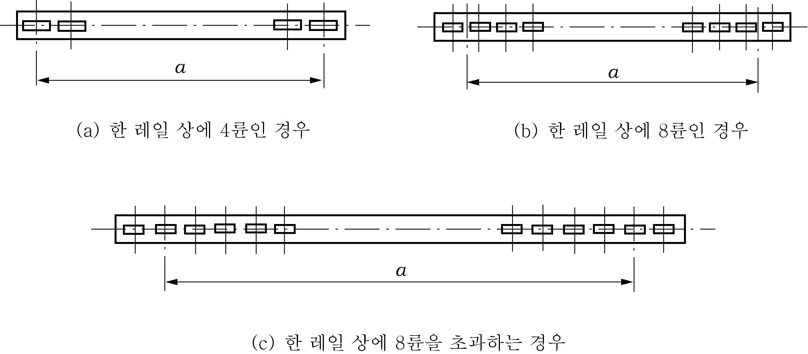
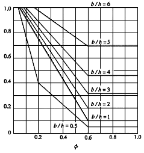

# 제9편 추가설비

> 선급 및 강선규칙/적용지침 / RA-09-K / 2025 / KO / Guidance

## 제 2 장 하역설비

### 제 1 절 일반사항

#### 101. 일반

- **1.** **적용** ***(2025)*** **【규칙 참조】**
  - **(1)** **규칙 101.**의 **1**항 (1)호를 적용함에 있어서, 기국이 하역장치의 종류 및 안전사용하중 한도를 별도 명시하는 경우, 등록 대상으로 규정하지 않은 하역설비에 대해서는 이 규칙에 따른 설비 등록을 면제할 수 있다.
  - **(2)** **규칙 101.**의 **1**항 (1)호를 적용함에 있어서, SOLAS II-1/3-13 규칙을 적용받지 않는 하역설비는 다음 각호에 해당되는 것을 말한다.
    - **(가)** 이동식 해양 시추선(MODU)로 인증된 선박의 하역설비. 이동식 해양 시추선으로 인증된 선박은 MODU 코드의 적용을 받는 선박으로, 주관청 또는 위임기관에 의해 발급된 MODU 코드 증서를 본선에 보유하고 있다. 이 증서의 소지에는 본선에서 사용 가능한 공인된 전자 버전이 포함된다.
    - **(나)** 주관청이 인정하는 기준을 만족하는 파이프/케이블 설치/수리 또는 해상 설치 선박과 해체 작업을 위한 선박 등, 해상 건설 선박에서 사용되는 하역설비를 포함한다.
    - **(다)** 화물창 해치 커버를 여닫기 위한 통합 기계 장비
    - **(라)** 국제 구명설비 코드(LSA Code)를 만족하는 구명 진수 장비
  - **(3)** **규칙 101.**의 **1**항 (1)호 및 (2)호를 적용함에 있어, 대한민국 국적을 갖는 선박의 하역설비는 다음 각 호에 해당되는 것을 말한다.
    - **(가)** 선박안전법을 적용받는 선박에 장치하는 1톤 이상의 하역설비. 다만, 하역램프는 제외한다.
    - **(나)** 어선법을 적용받는 선박(총톤수 300톤 이상)에 장치하는 1톤 이상의 하역설비
    - **(다)** (가)부터 (나) 이외의 선박에 장치하는 하역설비로서 안전사용하중 등의 지정신청이 있는 하역설비
- **2.** **동등효력 【규칙 참조】**
  **규칙 101.**의 **2**항에 추가하여 우리 선급은 이 규칙의 요건에 따라 설계되고 제작되지 않고 본선에 사용되는 모든 하역장치 및 하역장구에 대하여 우리 선급이 요구하는 시험 및 검사에 합격한 경우, 이 규칙에 적합한 것으로 인정할 수 있다. 여기서 “우리 선급이 요구하는 시험 및 검사”라 함은 원칙적으로 **규칙 203.**의 **1**항에 규정된 설계에 대한 검사 및 **규칙 203.**의 **2**항에 규정된 제작에 대한 시험을 말한다. 다만, 우리 선급이 적절하다고 인정하는 공공기관 또는 제3자의 도면검토 및 기관과 설비에 대한 시험에 합격한 것이 증명되는 경우에는 그 일부를 생략할 수 있다. *(2025)*

#### 102. 용어의 정의

- **1.** 데릭장치에는 **그림 9.2.1**에 나타낸 것을 포함한다. **【규칙 참조】**
   
  - **(1)** 선회식 데릭장치 (2) 유니언퍼처스 데릭장치
     
  - **(3)** 단일토핑 데릭크레인장치 (4) 이중토핑 데릭크레인장치
    **그림 9.2.1 데릭장치**
- **2.** **규칙 102.**의 **10**항에서 “우리선급이 필요하다고 인정하는 기타 제한사항“이라 함은 해당되는 하역설비의 특성에 따라 안전한 사용을 위해 제한되어야 할 사항을 말한다. **【규칙 참조】**

#### 103. 배치, 구조, 재료 및 용접

- **1.** **일반구조 【규칙 참조】**
  - **(1)** **규칙 103.**의 **2**항 (1)호에서 우리 선급이 적절하다고 인정하는 추가요건에 적합하여야 하는 하역장치는 (가)부터 (라)를 포함한다.
    - **(가)** 이동식해양구조물에 설치된 하역장치
    - **(나)** 작업선에 설치된 하역장치
    - **(다)** 잠수선 및 잠수설비용 권상/격납장치
    - **(라)** 우리 선급이 특별고려가 필요하다고 인정하는 기타의 설비
  - **(2)** **규칙 103.**의 **2**항 (2)호에서 우리 선급이 별도로 정하는 지침이라 함은 (가)부터 (라)를 포함한다.
    $5.0K+1.0$ ($\mathrm{mm}$)
    여기서,
    $K= \sigma _{yM} / \sigma _{yH}$
    $\sigma _{yM}$ : 규정된 연강의 항복응력
    $\sigma _{yH}$ : 규정된 고장력강의 항복응력
    $5hK$ ($\mathrm{cm}$)
    여기서,
    $h$ : **규칙 305.**의 **2**항에 따른다.
    $K$ : (a)에 따른다.
    $5.0K+1.0$ ($\mathrm{mm}$)
    여기서,
    $K$ : (a)에 따른다.
    노출부 : $5.0K+1.0$ ($\mathrm{mm}$)
    폐위부 : $5.0K$ ($\mathrm{mm}$)
    여기서,
    $K$ : (a)에 따른다.
    - **(가)** 구조부에 다양한 강도의 강재가 사용되는 경우, 높은 강도의 강재에 인접한 낮은 강도의 강재에 발생하는 응력에 충분한 고려를 하여야 한다.
    - **(나)** 고장력강이 사용되는 경우, 심각한 응력집중이 생기지 않도록 구조 상세에 특별히 주의하여야 한다.
    - **(다)** 구조부에 고장력강이 광범위하게 사용되는 경우, 세심한 고려를 하여야 한다. 이 경우, 좌굴강도의 확보와 관련하여 상세히 검토하고 그 결과를 우리 선급에 제출하여야 한다.
    - **(라)** 부재의 치수는 (a)부터 (e)의 요건에 적합하여야 한다.
      - **(a)** **규칙 303.**의 **3**항에 규정된 포스트의 최소두께는 다음 식으로부터 구할 수 있다.
      - **(b)** **규칙 305.**의 **2**항에 규정된 기부에서의 포스트 최소바깥지름은 다음 식으로부터 구할 수 있다.
      - **(c)** **규칙 305.**의 **3**항 (1)호 (가) 및 **표 9.2.8**에 규정된 계수 $C _{2}$의 값은 $C _{2}$의 값에 (a)에 규정된 계수 $K$를 곱한 값으로 대치할 수 있다.
      - **(d)** **규칙 403.**의 **6**항에 규정된 구조부의 최소두께는 다음 식으로부터 구한 값으로 대치할 수 있다.
      - **(e)** **규칙 803.**의 **4**항에 규정된 구조부의 최소두께는 다음 식으로부터 구한 값으로 대치할 수 있다.
- **2.** **재료 【규칙 참조】**
  - **(1)** **규칙 103.**의 **4**항 (1)호에서 우리 선급이 적절하다고 인정하는 경우라 함은 (가)부터 (다)를 말한다.
    - **(가)** 크레인의 (a)부터 (c)의 구조부에 두께가 25 $\mathrm{mm}$를 넘는 $B$급 강재가 사용되는 경우
      - **(a)** 집크레인의 선회링(베어링)에 설치된 플랜지
      - **(b)** 집크레인의 하우징베이스
      - **(c)** 보강을 위하여 두께를 증가시킨 판을 포함하여 갠트리크레인 등의 움직이는 부분을 구성하는 부재. 다만, 작용응력에 따라 **규칙 표 9.2.1**에 규정된 요건을 적용할 수 있다.
    - **(나)** 데릭붐, 데릭포스트, 집크레인, 크레인포스트 및 기타 유사한 구조부를 제작하는데 (a)부터 (c)의 요건에 따르는 강관이 사용되는 경우
      - **(a)** 강관의 두께는 20 $\mathrm{mm}$ 이하이어야 한다.
      - **(b)** **규칙 2편**에 규정된 압력배관용 강관에는 제1종 또는 제2종 강관, 또는 이와 동등한 것을 사용하여야 한다.
      - **(c)** 용접되는 강관의 탄소함유량은 0.23 % 보다 작아야 한다.
    - **(다)** 우리 선급이 적절하다고 인정하는 기준에 적합한 두께 1.25 $\mathrm{mm}$를 넘지 않는 압연강재 및 압연강관이 화물호스를 제외하고 하역작업에 사용되지 아니하는 하역장치의 구조부에 사용되는 경우. 다만, 선체구조에 직접 용접되는 구조부의 재료는 **규칙 103.**의 **4**항 (1)호 또는 전 (나) (a)부터 (c)의 요건에 적합하여야 한다.
  - **(2)** 통상 특히 온도가 낮은 구역 또는 냉장창고 내에서 사용되는 하역장치의 구조부, 주행거더, 트랙 등의 강재종류는 설계온도에 따라 **표 9.2.1**에 적합하여야 한다.
  - **(3)** (가)부터 (바)의 구조부에 사용되는 주강 또는 단강품은 국제표준규격(ISO) 및 국가표준규격(KS) 또는 이와 동등한 기준에 따라야 한다. *(2025)*
    - **(가)** 데릭장치의 토핑브래킷
    - **(나)** 데릭장치의 구즈넥브래킷 및 구즈넥핀
    - **(다)** 데릭붐의 데릭힐러그 및 정부의 부속장구
    - **(라)** 집크레인의 힐브래킷
    - **(마)** 집크레인의 힐부속장구
    - **(바)** 갠트리크레인, 하역리프트 및 하역램프의 움직이는 부분용의 브래킷 및 핀
  - **(4)** **규칙 103.**의 **4**항 (4)호에서 “우리 선급이 적절하다고 인정하는 것”이라 함은 국제표준규격(ISO) 및 국가표준규격(KS) 또는 이와 동등한 기준에 따라 인정하는 것을 말한다.
  - **(5)** **규칙 103.**의 **4**항 (6)호에서 “우리 선급이 적절하다고 인정하는 기준”이라 함은 국제표준규격(ISO) 및 국가표준규격(KS) 또는 이와 동등한 기준을 말한다.

    **표 9.2.1 저온에 노출된 강재의 종류** ***(2019)***

    | 설계온도 $T$ (℃) | 재료두께 $t$ ($\mathrm{mm}$) |   |   |   |   |
    | --- | --- | --- | --- | --- | --- |
    | 설계온도 $T$ (℃) | $t \leq 10$ | $10 \prec t \leq 20$ | $20 \prec t \leq 25$ | $25 \prec t \leq 40$ | $40 \prec t$ |
    | $-10 \leq T$ | *A/AH* |   | *B/AH* | *D/DH* | *E/EH* |
    | $-20 \leq T \prec -10$ | *B/AH* | *D/DH* | *E/EH* |   |   |
    | $-30 \leq T \prec -20$ | *E/EH* |   |   | *RL235A* | *RL235B* |
    | $-40 \leq T \prec -30$ | *RL235A* |   | *RL235B* |   | * |
    | $-50 \leq T \prec -40$ | *RL235B* |   | * |   |   |
    | (비고) 1. 열응력을 경감할 수 있는 구조용 강재의 종류는 우리 선급이 특별히 고려한다. 2. 우리 선급은 설계온도가 -50℃ 이하이거나 또는 재료의 작용응력이 항복점의 60%를 넘는 저온에 노출된 경우, 재료의 두께 및 구조에 따라 높은 노치강성을 갖는 재료를 요구할 수 있다. 3. *표시된 재료의 강재종류는 우리 선급이 특별히 고려한다. 4. 이 표에 사용된 기호는 **규칙 표 9.2.1**과 동일하다. |   |   |   |   |   |
- **3.** **용접 【규칙 참조】**
  **규칙 103.**의 **5**항을 적용함에 있어서 다음에 따라야 한다.
  - **(1)** 데릭포스트의 용접은 (가)부터 (아)의 요건에 적합하여야 한다.
    
    **그림 9.2.2 포틀과 포스트의 용접**
    - **(가)** 포스트의 용접은 가능한 양면용접이어야 한다.
    - **(나)** 포스트와 갑판의 용접은 포스트의 하단을 양면개선으로 하여야 한다. 포스트 내부에서의 작업이 작은 지름 또는 기타의 다른 이유로 인하여 곤란한 경우, 일면개선으로 하여 뒷댐판을 대고 용입용접하는 것을 허용할 수 있다.
    - **(다)** 포틀을 구성하는 상하판에 측판을 용접하는 경우, 포틀의 단부 및 토핑브래킷, 아이 등이 설치되는 부분에서 필릿의 크기는 **규칙 3편 표 3.1.11**에 규정된 $F1$이어야 한다.
    - **(라)** 포틀과 포스트의 용접은 가능한 양면용접이어야 한다. **그림 9.2.2**에 나타낸 각도($\alpha$)가 작은 경우, 포틀의 끝단에 너클을 주어 포스트표면과 직각으로 교차시켜 필릿용접을 실행가능한 한 완성하도록 한다.
    - **(마)** 토핑브래킷 및 구즈넥브래킷은 포스트 또는 거치대를 관통하여 설치되어야 한다. 포스트 또는 거치대의 판두께가 12.5 $\mathrm{mm}$를 넘는 경우, 용접은 개선을 만들고 용입용접을 하여야 한다.
    - **(바)** 데릭붐의 횡방향 연결은 양면용접으로 하고 뒷면 치핑으로 용접면의 결함을 제거한 후 뒷면용접을 하여야 한다. 다만, 뒷댐판을 사용한 용입용접은 수리를 위한 부분 신환과 같이 불가피한 경우에 한하여 허용할 수 있다. 이 경우, 해당 용접이음은 전 용접선을 따라 적당한 비파괴시험을 시행하여 유해한 결함이 없음이 검증되어야 한다.
    - **(사)** 데릭붐의 종방향연결을 위한 뒷댐판은 전 길이에 걸쳐 이음이 없이 매끈한 표면이어야 한다.
    - **(아)** 화물의 하역에 사용되지 아니하는 데릭에 대하여 안전사용하중 및 구조의 방식을 고려하여 (나), (마) 및 (바)의 요건을 수정할 수 있다.
  - **(2)** 크레인의 용접은 (가)부터 (마)의 요건에 적합하여야 한다.
    - **(가)** (1)호 (바) 및 (사)의 요건은 “데릭붐”을 “크레인”으로 하여 집의 맞대기이음과 종방향이음에 적용하여야 한다.
    - **(나)** 집의 맞대기 및 종방향이음 이외의 용접이음에 대하여 양면용접(필릿용접 포함)을 하기 곤란한 경우, 용입용접 또는 뒷댐판을 사용한 용접을 하여야 한다.
    - **(다)** 크레인 포스트의 용접에 대하여는 (1)호 (가) 및 (나)를 적용하여야 한다.
    - **(라)** 다음의 부분은 원칙적으로 완전용입용접으로 고정하여야 한다.
      - **(a)** 크레인 포스트와 선회링용 포스트플랜지의 고정부
      - **(b)** 집상단과 시브용 브래킷의 고정부
      - **(c)** 크레인 조종실과 시브용 브래킷의 고정부
      - **(d)** 집의 기부 브래킷의 고정부
      - **(e)** 크레인 조종실 및 회전거치대의 고정부
    - **(마)** 1차 구조부재의 필릿용접은 원칙적으로 **규칙 3편 표 3.1.11**에 규정된 $F1$ 또는 이와 동등한 것이어야 한다.
  - **(3)** 하역리프트 및 하역램프의 용접은 (가)부터 (다)의 요건에 적합하여야 한다.
    - **(가)** 1차 구조부재의 필릿용접은 (2)호 (마)에 적합하여야 한다.
    - **(나)** 1차 구조부재에 직접 설치되는 미끄럼방지 바 등의 용접은 그 부재에 어떠한 유해한 영향을 끼치지 아니하는 방법으로 시행되어야 한다.
    - **(다)** 장치의 격납에 사용되는 스토퍼, 걸쇠 및 유사한 부속장구의 용접방법은 구조부 또는 선체구조에 어떠한 악영향도 끼치지 않는 방법으로 선택되거나 시행되어야 한다.
  - **(4)** 통상 특히 온도가 낮은 구역 또는 냉장창고 내에서 사용되는 하역장치 구조부의 용접은 구조, 작용응력 등을 고려하여 저온취성파괴의 발생을 방지하는데 어떠한 악영향을 끼치지 아니하는 방법으로 시행되어야 한다.
  - **(5)** 단강 또는 주강품이 맞대기용접 또는 겹침용접으로 강판에 연결되는 경우, 용접이음의 상세는 **규칙 2편 2장 3절**에 적합하여야 한다.
  - **(6)** 하역장치 및 하역램프 구조부의 용접이음에 대한 비파괴검사는 (가)부터 (다)의 요건에 적합하여야 한다.
    - **(가)** (a)부터 (c)의 장소는 방사선투과시험 또는 초음파탐상시험을 하여야 한다.
      - **(a)** (1)호 (바)에 규정된 장소
      - **(b)** (2)호 (가)의 장소뿐만이 아니라 크레인의 구조부와 그 구조 및 구조의 방식에 따라 우리 선급이 특별하다고 인정하는 장소
      - **(c)** 용접이음의 보전성이 의심되는 장소
    - **(나)** 우리 선급이 필요하다고 인정하는 경우, (a)부터 (d)의 장소는 자분탐상시험 또는 액체침투탐상시험을 하여야 한다.
      - **(a)** 압연강판과 단강 또는 주강의 용접이음
      - **(b)** 구조부에 임시로 용접된 피스, 지그 등을 떼어낸 자국
      - **(c)** 하역부속장구의 용접
      - **(d)** 보전성이 의심되는 구조부의 필릿용접
    - **(다)** (가) 및 (나)에 규정된 비파괴시험의 방법 및 결함판정기준은 해당 장소의 구조에 따라 우리 선급이 정하는 바에 따른다.

### 제 2 절 검사

#### 201. 일반

- **1.** **적용 【규칙 참조】**
  **규칙 201.**의 **1**항을 적용함에 있어서 다음에 따라야 한다.
  - **(1)** 선체구조에 직접 설치되는 데릭 및 크레인의 포스트와 하역리프트/램프의 지지는 이 절에 추가하여 **규칙 1편**에 규정된 시험 및 검사를 받아야 한다.
  - **(2)** 하역리프트 및 하역램프가 선체구조의 일부를 형성하는 경우, 이 부분은 선체구조의 방식 및 배치에 따라 **규칙 1편**의 요건에 적합한 시험 및 검사를 하여야 한다.
  - **(3)** **규칙 201.**의 **1**항 (4)호를 적용함에 있어서 하역장치가 (가) 또는 (나) 중 한 조건에 적합한 경우, **규칙 202.**에 규정된 하중시험은 생략할 수 있다.
    - **(가)** 헤비 데릭장치인 경우 : 자주 사용하지 아니하고 사용 전에 하중시험을 시행할 것
    - **(나)** 유니언퍼처스 데릭장치인 경우 : 선회식 데릭장치로서 하중시험을 통과하고 프리벤터 스테이의 아이플레이트의 상태가 양호할 것
  - **(4)** **규칙 201.**의 **1**항 (3)호에서 “정기적인 검사 시 검사원이 필요하다고 인정하는 경우”라 함은 **지침 1편 1장 801.**의 **1**항에 해당하는 경우를 말한다.
- **2.** **검사의 준비 및 입회 【규칙 참조】**
  **규칙 201.**의 **2**항 (3)호에서 검사원이 검사시행을 위한 안전이 확보되지 아니하였다고 판단하는 경우라 함은 고소에서 검사를 시행하는 경우, 추락방지 등의 안전조치를 말한다.

#### 202. 하역설비의 검사 【규칙 참조】

**규칙 202.**의 **2**항 (4)호 (라)에서 “기타 우리 선급이 필요하다고 인정하는 경우”라 함은 이전 검사 시 임시검사가 지적된 경우 또는 선주의 요청에 의해 임시검사를 시행하는 경우 등을 말한다.

#### 203. 등록검사

- **1.** **제조중등록검사** ***(2025)***
  - **(1)** 도면 및 기타자료의 제출 **【규칙 참조】**
    **규칙 203. 1**항의 (1)호를 적용함에 있어서 다음에 따라야 한다.
    도면제출이 생략될 수 있다. 다만, 사용되는 윈치 또는 주행기관의 승인도면에는 제조자의 이름, 형식 및 주요요목이 기재되어야 한다.
    주요요목, 구조상세도면 및 강도계산서 1부를 참고용으로 제출하여야 한다.
    기계장치가 우리 선급선에 처음으로 탑재되는 경우에도, 출력이 375 $\mathrm{kW}$보다 작으면 (b)의 요건에 따라야 한다.
    - **(가)** **규칙 203. 1**항의 (1)호 요건에도 불구하고, 하역설비 전체 또는 일부가 이미 승인된 도면 및 문서에 따라 동일한 작업장에서 제작되는 경우, (a) 및 (b) 이외의 도면 및 문서의 승인은 생략할 수 있다.
      - **(a)** 도면제출생략 신청서
      - **(b)** 하역설비의 일반배치도
    - **(나)** 하역설비에 사용되는 각종 구동윈치 및 주행기관용 유압모터, 유압펌프, 증기실린더, 공압모터 및 내연기관은 출력에 따라 (a)부터 (c)의 요건에 따라야 한다.
      - **(a)** 출력이 375 $\mathrm{kW}$보다 작은 경우:
      - **(b)** 출력이 375 $\mathrm{kW}$ 이상인 경우:
      - **(c)** 기타:
    - **(다)** 데릭장치의 일반배치도 및 구조도면은 적어도 (a) 및 (b)의 항목을 포함하여야 한다.
      - **(a)** 일반배치도
      - **(i)** 마스트, 포스트, 가이포스트, 슈라우드, 스테이(부착된 리깅스크류 포함), 데릭붐 및 선체구조에 설치된 하역부속장구의 배치
        - **(ii)** 선폭 및 아웃리치
        - **(iii)** 하역블록의 위치 및 명칭과 러닝로프의 배치(권상 및 선회인 경우)
        - **(iv)** 윈치의 위치, 형식 및 용량
      - **(v)** 리프팅빔, 그랩, 리프팅마그넷, 스프레더 등의 자중
      - **(b)** 일반배치도
      - **(i)** 마스트, 포스트, 가이포스트 및 데릭붐의 구조, 치수 및 재료
        - **(ii)** 슈라우드 및 스테이의 치수 및 재료
        - **(iii)** 구즈넥브래킷, 토핑브래킷, 프리벤터 스테이 상하단의 아이플레이트 및 기타 하역부속장구의 치수 및 재료
  - **(2)** 제작에 대한 시험 **【규칙 참조】**
    **규칙 203.** 1항의 (2)호를 적용함에 있어서 다음에 따라야 한다.
    유압펌프는 구동모터의 출력에 따라 (a) (ⅰ)부터 (ⅲ)와 동일한 방법으로 취급하여야 한다.
    각 출력에 따라 (a) (ⅰ)부터 (ⅲ)와 동일한 방법으로 취급하여야 한다. 증기실린더에 대한 수압시험은 설계증기압의 1.5배의 압력으로 시행하고, 실린더에 직접 연결된 밸브는 설계증기압의 2배의 압력으로 시행하여야 한다.
    **규칙 6편**에 규정된 요건에 적합하여야 하고 **규칙 6편**에 규정된 시험 및 검사에 합격하여야 한다.
    재료 및 제작에 실제로 유해한 결함이 없음을 확인하고 움직이는 각 부분이 원활히 움직이는지를 확인하여야 한다.
    윈치는 무부하에서 최대속도로 30분간(정회전 및 역회전 각 15분) 운전되어야 하고 성능 및 각 구조 부분이 양호한 상태임을 확인하여야 한다.
    윈치는 정격하중을 30분간 연속하여 올리고 내려야 한다.(들어 올리고 내리는 각 작동의 사이에 20초 동안은 이를 중단시킬 수 있으며, 들어 올리고 내리는 유효거리는 10 $\mathrm{m}$ 이상일 것을 권장한다) 이 작동을 하는 동안, 베어링의 온도상승, 들어 올리는 속도, 내리는 속도 및 투입전력이 계측되어야 하고 이들이 양호한 상태임을 확인하여야 한다.
    윈치로 정격하중으로 들어 올리고 내리는 동안, 조종핸들을 중립위치로 돌려 하중의 미끄러짐이 1.5 $\mathrm{m}$ 이하임을 확인하여야 한다. 제동장치의 수동투하시험도 시행하여야 하고 양호한 상태임을 확인하여야 한다.
    정격하중을 내리는 동안 전원공급을 차단하여 윈치에 설치된 비상보증장치의 효력을 확인하여야 한다.
    윈치는 정격하중의 125% 무게의 하중을 몇 차례에 걸쳐 올리고 내려야 한다. 윈치는 하중을 내리는 동안 적어도 세 차례 정지시키고 양호한 상태임을 확인하여야 한다.
    필요시 조종압력을 확인한다.
    우리 선급은 이상이 발견된 부분에 대하여 개방검사를 요구할 수 있다.
    - **(가)** 하역장치용 구동기관 등에 대한 시험 및 검사는 (a)부터 (d)의 요건에 따라야 한다.
      - **(a)** 유압모터 및 유압모터에 부착된 제어밸브
      - **(i)** 출력이 375 $\mathrm{kW}$보다 작은 경우, 공장시험은 제조자에 의하여 수행된 시험으로 대신할 수 있다. 우리 선급이 필요하다고 인정하는 경우, 그 시험결과를 제출할 것을 요구할 수 있다.
        - **(ii)** 출력이 375 $\mathrm{kW}$ 이상인 경우, 성능확인시험 및 개방검사 이외의 시험은 제조자가 자체시험을 실시하고 그 결과를 우리 선급에 제출할 경우 검사원의 입회를 생략할 수 있다. 수압(또는 유압)시험은 설계압력의 1.5배의 압력으로 시행하여야 한다. *(2017)*
        - **(iii)** (ⅰ) 및 (ⅱ)의 요건에도 불구하고, 구동기관이 우리 선급선에 처음으로 탑재되는 경우, 수압시험, 성능확인시험 및 개방검사는 검사원 입회하에 시행되어야 한다.
      - **(b)** 유압펌프
      - **(c)** 증기실린더, 공압모터 및 내연기관
      - **(d)** 윈치 및 유압펌프용 구동모터 및 그 제어장치
    - **(나)** 하역장치((다)에 규정된 것은 제외)에 사용되는 윈치는 구동기관 등의 설치를 포함하여 조립이 완성된 후에 공장시험 시 (a) 및 (b)에 언급된 시험 및 검사를 하여야 한다. 이 경우, 동일형식으로 동시에 제조되어 동일한 선박에 설치되는 것 중 한 개의 윈치는 검사원 입회하에 시험하여야 하고, 나머지 윈치에 대한 시험 및 검사는 제조자가 발행한 시험성적서를 확인하는 것으로 대신할 수 있다.
      - **(a)** 유압윈치
      - **(i)** 육안검사 및 구조확인
        - **(ii)** 무부하시험
        - **(iii)** 부하시험
        - **(iv)** 제동시험
      - **(v)** 속도제어시험
        - **(vi)** 비상보증시험
        - **(vii)** 과부하시험

#### (viii)

과압방지장치의 조정

        - **(ix)** 개방검사
      - **(x)** 검사원이 필요하다고 인정하는 기타의 시험
      - **(b)** 증기윈치, 전동윈치 및 내연기관으로 구동되는 윈치에 대한 공장시험도 유압윈치에 대하여 (a)에 규정된 요건((a) (ⅷ) 제외)에 따라 시행하여야 한다.
    - **(다)** 크레인, 특수데릭, 하역리프트 또는 하역램프에 사용되고 이들의 움직이는 본체와 일체로 된 윈치는 원칙적으로 (나)호의 요건에 따라 취급되어야 한다. 다만, 윈치의 구조 또는 배치를 고려하여 실행 불가능하다고 인정되는 경우, (나)호에 규정된 시험 및 검사의 일부 또는 전체는 **규칙 204.**의 **2**항에 규정된 하중시험 시 시행하는 것을 허용할 수 있다.
  - **(3)** **규칙 203. 1**항 (3)호 (가)의 (b)에서 ‘검사원이 필요하다고 인정하는 경우’라 함은 **적용지침 1편 1장 8절 801.2**에 따른다. *(2020)*

#### 204. 정기적 검사 (2025)

- **1.** **연차검사**
  - **(1)** **규칙 204. 1**항을 적용함에 있어서 연차검사 시 다음에 규정된 부식, 마모 또는 기타 결함이 발견된 구조부 및 하역장구는 원칙적으로 수리되거나 또는 신환되어야 한다. **【규칙 참조】**
    마모 및 찢어짐의 양이 원래치수의 10%에 이르는 구조부. 다만, 규칙에서 요구되는 두께보다 충분한 여유를 가지는 강판이 사용된 경우에는 이를 적용하지 아니할 수 있다.
    핀 또는 유사한 부속장구와 그 구멍 사이의 간격이 핀의 원래 지름의 10%에 이르는 구조부. 다만, 구즈넥핀의 경우에는 크로스볼트와 브래킷구멍 사이의 간격은 크로스볼트의 원래 지름의 5% 이내 이어야 한다.
    와이어로프를 제외한 하역장구인 경우, 다음 중 하나에 해당되는 것
    다음 중 하나에 해당되는 와이어로프
    - **(가)** 구조부(판부재 및 핀구조 이외의 하역부속장구)
    - **(나)** 핀구조의 하역부속장구
    - **(다)** 하역장구(와이어로프 제외)
      - **(a)** 유해한 변형이 발생한 것
      - **(b)** 균열이 발생한 것
      - **(c)** 마모 또는 부식의 양이 원래 치수의 10% 이상인 것
      - **(d)** 시브가 원활히 회전하지 않는 블록
    - **(라)** 와이어로프
      - **(a)** 와이어로프 지름의 10배의 길이 이내에 소선(필러와이어 제외) 총수의 5% 이상이 파단된 것
      - **(b)** 와이어로프 지름의 감소가 지름의 7% 이상인 것
      - **(c)** 킹크 또는 기타 유해한 변형이 발생한 것
      - **(d)** 소선의 표면 또는 와이어로프 내부에 심각한 부식이 발생한 것
      - **(e)** 검사원이 필요하다고 인정하는 것
  - **(2)** **규칙 204. 1**항 (1)호, (2)호, (3)호, (4)호, (5)호, 및 (6)호의 (가)에서 “검사원이 필요하다고 인정하는 경우”라 함은 **지침 1편 1장 801.**의 **2**항에 해당하는 경우를 말한다. #underline{**【규칙 참조】**}
- **2.** **하중시험** ***(2021)***#underline{**【규칙 참조】**}
  **규칙 204.의 2**항을 적용함에 있어서 다음에 따라야 한다.
  - **(1)** 새로이 제작되는 크레인에 대한 하중시험은 원칙적으로 본선에 설치된 후 뿐만이 아니라 공장에서 조립된 후에도 시행되어야 한다. 동일형식으로 동시에 제작되어 동일한 선박에 설치되는 것 중 한 개의 크레인에 대한 공장시험결과가 만족한 경우, 나머지 크레인은 제조자가 발행한 시험성적서를 확인하는 것으로 대신할 수 있다. 제조자의 공장에서 하중시험을 시행할 수 없다고 검사원이 인정하는 경우 본선에서 하중시험을 시행하는 조건으로 공장에서의 하중시험은 생략할 수 있다.
  - **(2)** 그랩, 리프팅빔, 마그넷, 스프레더 및 기타 유사한 하역장구(이하 “하역파지장구”라 한다)를 전적으로 사용하는 하역장치인 경우, 시험하중 및 안전사용하중은 신청에 따라 (가) 또는 (나)의 어느 쪽으로 취급될 수 있다.
    시험하중 = $\alpha$ × {(최대화물질량)+(하역파지장구의 질량)}
    안전사용하중 = (최대화물질량)+(하역파지장구의 질량)
    여기서,
    $\alpha$ : **규칙 표 9.2.2**에 규정된 시험하중을 안전사용하중으로 나누어 구한 계수. 다만, 안전사용하중이 20 $\mathrm{t}$ 이상 50 $\mathrm{t}$ 미만인 경우, 시험하중은 안전사용하중에 5 $\mathrm{t}$을 더한 것이어야 한다.
    시험하중 = $\alpha$ × (최대화물질량)
    안전사용하중 = 최대화물질량
    여기서,
    $\alpha$ : (가)에 따른다.
    - **(가)** 하역장구의 질량이 안전사용하중에 포함되는 경우:
    - **(나)** 하역장구의 질량이 안전사용하중에 포함되지 아니하고 최대화물질량만이 안전사용하중으로 지정되는 경우, 하역장치는 다음 조건에 만족하여야 한다.
      - **(a)** 하중시험은 해당 하역장치에 사용되는 하역장구 또는 동일한 구조 및 질량을 가지는 하역장구를 사용하여 시행되어야 한다.
      - **(b)** 본선에 사용되는 하역장구는 하중시험에 사용된 것과 동일한 장구 또는 동일한 구조 및 질량을 가지는 장구이여야 한다.
  - **(3)** 하역훅에 의한 전통적인 하역에 전적으로 사용되는 하역장구에 대한 하중시험은 원칙적으로 (2)호 (나)에 규정된 방법에 따라야 한다.
  - **(4)** 하역장치에 대한 하중시험 및 작동시험의 상세는 규칙에 규정된 것에 추가하여 (가)부터 (마)의 요건에 적합하여야 한다.
    **규칙 902.**의 **2**항 (가)에 규정된 추가의 안전사용하중이 지정된 경우, 추가의 안전사용하중에 대한 하중시험은 생략될 수 있다. 이 경우, 안전사용하중 등 사이의 관계는 다음 식에 만족하여야 한다.
    $B=W \frac{\cos \alpha}{\cos \beta}$
    여기서,
    $W$ : 안전사용하중($\mathrm{t}$)
    $\alpha$ : 허용최소각도(*degree*)
    $B$ : 추가의 안전사용하중($\mathrm{t}$)
    $\beta$ : 추가의 허용각도(*degree*)
    - **(가)** 데릭
    - **(나)** 집크레인
      - **(a)** **규칙 902.**의 **2**항 (나)에 규정된 추가의 안전사용하중이 지정된 경우, 추가의 안전사용하중에 대한 하중시험은 생략될 수 없다.
      - **(b)** 선회반지름에 관계없이 일정한 안전사용하중이 지정된 크레인의 경우, 선회시험은 안전사용하중에 기초한 시험하중으로 최대반지름에서 시행하고, 최소반지름 또는 가능한 가장 작은 반지름에서 러핑작동을 시행하여야 하며 가능한 그 반지름에서 선회시험도 시행하여야 한다.
      - **(c)** 선회반지름에 따라 안전사용하중이 변하는 크레인의 경우, 선회시험은 각 지름에 따른 시험하중을 매달은 후 최대 및 최소선회반지름에서 시행하여야 한다.
      - **(d)** 권상, 선회 및 러핑작동의 세 가지 모두 또는 이들 중 두 가지를 동시에 할 수 있는 크레인의 경우, 설계사양에 명기된 이들 조합된 작동이 제한된 반지름에 따른 시험하중을 매달고 만족한 상태인지를 검증하여야 한다.
    - **(다)** 갠트리크레인 및 기타 주행크레인
      - **(a)** 크레인은 안전사용하중을 매달고 주행범위내의 트랙 상에서 주행되어야 한다. 이 경우, 주행트랙을 지지하는 선체구조도 결함이 없는지를 확인하여야 한다.
      - **(b)** 주행트롤리가 있는 경우, 안전사용하중을 매달고 전체 주행범위에 걸쳐 주행되어야 한다.
      - **(c)** 주행트롤리용 격납식 주행거더가 있는 경우, 주행거더의 펼침과 격납작동이 양호한 상태임을 확인하여야 한다.
    - **(라)** 안전사용하중의 1.25배를 넘는 시험하중을 들어 올릴 수 없도록 압력이 제한된 유압크레인의 경우, 시험을 할 수 있는 최대의 하중을 들어 올리는 것으로 할 수 있다. 다만, 이 하중은 일반적으로 안전사용하중의 1.1배 보다 작아서는 아니된다.
    - **(마)** **규칙 204. 2**항 (4)호의 (나)에서 “우리 선급이 적절하다고 인정하는 방법”이라 함은 최소한 다음 요건을 말한다.
      - **(a)** 하중부하기의 정밀도는 ±2.5%의 범위 이내에 있어야 한다.
      - **(b)** 하중을 부하하는 위치는 승인된 작동범위 내에서 구조부에 가장 가혹한 응력이 발생되는 개소를 선택하여야 한다.
      - **(c)** 하중은 하중지시기가 안정될 수 있도록 5분 이상의 충분한 기간 동안 지속되어야 한다.

### 제 3 절 데릭장치

#### 302. 설계하중

- **1.** **고려하는 하중 【규칙 참조】**
  **규칙 302.**의 **1**항을 적용함에 있어서, 데릭장치의 직접강도계산을 하는 경우 붐의 정부에 작용하는 외력은 토핑리프트의 인장력, 가이로프의 인장력, 하역폴(화물 무게에 따른)의 인장력, 비상 하중 해제 시 인장력, 붐 자중의 반 및 하역블록, 훅, 로프 등의 자중을 포함한 추가 하중을 포함하여야 한다. 다만, 추가 하중은 **표 9.2.2**에 따를 수 있다. *(2025)*
- **2.** **선체경사에 따른 하중 【규칙 참조】**
  **규칙 302.**의 **3**항을 적용함에 있어서 다음에 따라야 한다.
  - **(1)** 규칙에 규정된 것보다 작은 횡경사 각도가 구조부의 설계에 사용되는 경우, 최소한 (가)부터 (다)의 운항상태의 선체경사에 관련된 자료를 우리 선급에 제출하여야 한다. 이러한 상태의 선체종강도 및 복원성은 별도로 시험되어야 한다.
    - **(가)** 경하상태
    - **(나)** 적하의 중간상태
    - **(다)** 만재 직전의 상태
  - **(2)** 하역작업 시 **규칙 302.**의 **3**항에 규정된 횡경사 각도를 유지하기 위하여 평형수를 조정하는 선박인 경우, (가)부터 (다)에 관련된 자료를 우리 선급에 제출하여야 한다. 이러한 모든 자료는 **규칙 905.**의 **2**항에서 언급하는 하역설비의 작동지침서에 포함되어야 한다.

    **표 9.2.2 추가의 하중**

    | 안전사용하중 $W$ ($\mathrm{t}$) | 추가의 하중 ($\mathrm{t}$) |
    | --- | --- |
    | $W \leq 2$ $2 \prec W \leq 15$ $15 \prec W \leq 50$ $50 \prec W$ | $0.283W$ $0.4 \sqrt {W}$ $0.1W$ 우리 선급이 적절하다고 인정하는 값 |
    - **(가)** 평형수 조정장치의 상세
    - **(나)** 평형수 조정방법 및 절차
    - **(다)** 평형수 조정장치의 고장 시 조치요령

#### 303. 데릭포스트, 마스트 및 스테이의 강도 및 구조 【규칙 참조】

**규칙 303.**의 **6**항 (1)호에서 “우리 선급이 적절하다고 인정하는 다른 방법”이라 함은 직접강도계산 방법에 의해 검증된 강도로 지지되는 기타 방법을 말한다.

#### 306. 데릭붐에 대한 단순계산법

- **1.** **규 칙 306.**의 **2**항의 **표 9.2.10, 표 9.2.11,** 및 **3**항의 **표 9.2.14**를 적용함에 있어서 “우리 선급이 적절하다고 인정하는 값”이라 함은 **지침 1편 1장 105.**에 따라 인정하는 값을 말한다. 【규칙 참조】
- **2.** **규 칙 306.**의 **2**항 (2)호를 적용함에 있어서 “우리 선급이 동등하다고 인정하는 다른 기준”이라 함은 국제표준규격(ISO) 및 국가표준규격(KS) 또는 이와 동등한 기준을 말한다. 【규칙 참조】

### 제 4 절 크레인

#### 402. 설계하중

- **1.** **규칙 402**.의 **1**항 (카) 및 **9**항 (2)호의 (아), (5)호의 (마)에서 “우리 선급이 필요하다고 인정하는 기타의 하중”이라 함은 눈이나 얼음에 의한 하중 및 온도 변화에 의한 하중 등 크레인의 구조부에 작용할 수 있는 하중을 말한다. **【규칙 참조】**
- **2.** **규 칙 402.**의 **5**항의 **표 9.2.16**을 적용함에 있어서 “우리 선급이 적절하다고 인정하는 값”은 **부선예항검사규칙 3장 1절 103.**의 **1**항에 따른다. **【규칙 참조】**
- **3.** **선체경사에 따른 하중 【규칙 참조】**
  **규칙 402.**의 **7**항을 적용함에 있어서, 크레인 설계에 고려되어야 하는 선체경사에 따른 하중의 계산에 데릭장치에 대하여 규정된 **302.**의 **2**항 (1)호 및 (2)호의 요건도 크레인에 적용할 수 있다.
- **4.** **하중조합 【규칙 참조】**
  **규칙 402.**의 **9**항을 적용함에 있어서, (가) 및 (나)에 규정된 하역장치에 대하여는 바람하중을 고려할 필요가 없다.

#### 403. 강도 및 구조

- **1.** **일반 【규칙 참조】**
  **규칙 403.**의 **1**항을 적용함에 있어서 다음에 따라야 하며, **규칙 403.**의 **1**항 (3)호에서 “우리 선급이 필요하다고 인정하는 경우”라 함은 **표 9.2.15**에 규정되어 있는 크레인 이외의 특수한 크레인에 해당하는 경우 등을 말한다.
  - **(1)** 크레인의 선회링인 경우, (가)부터 (마)에 주어진 도면 및 자료를 우리 선급에 제출하여야 한다. 다만, 우리 선급의 등록선에 사용된 실적이 있는 것은 (나)에 규정된 것만으로 그 요건을 경감할 수 있다.
    - **(가)** 선회링의 구조상세 및 재료를 표시하는 것
    - **(나)** 선회링에 작용하는 수직하중, 반지름방향의 하중 및 전도모멘트의 허용값
    - **(다)** 선회링의 설치기준
    - **(라)** 강도계산서
    - **(마)** 사용실적 및 제작시의 품질관리에 대한 자료
  - **(2)** 집크레인 조종실의 구조에서 시브용 브래킷의 고정부분 및 와이어로프 스토퍼와 같이 집중하중을 받는 부분은 유효하게 보강되어야 한다.
- **2.** **고정포스트 【규칙 참조】**
  **규칙 403.**의 **8**항을 적용함에 있어서 다음에 따라야 한다.
  - **(1)** 포스트상부의 집크레인 선회링의 고정플랜지가 브래킷에 의하여 보강되는 경우, 최소한 매 두개의 선회링용 고정볼트마다 브래킷을 설치하여야 한다.
  - **(2)** (1)호에 규정된 보강방법은 갠트리크레인 및 선회링을 가지는 기타 특수한 크레인에도 적용하여야 한다.

#### 404. 주행크레인에 대한 특별요건

- **1.** **안정성 【규칙 참조】**
  **규칙 404.**의 **1**항을 적용함에 있어서, 주행크레인의 주행로는 (가)부터 (다)의 요건에 적합하여야 한다.

### 제 5 절 하역부속장구

#### 502. 하역부속장구

- **1.** **규칙 502**.의 **1**항 (3)호, **2**항 (2)호 및 **3**항에서 “우리 선급이 인정하는 기준”이라 함은 국제표준규격(ISO) 및 국가표준규격(KS) 또는 이와 동등한 기준을 말한다. **【규칙 참조】**
- **2.** **규칙 502**.의 **표 9.2.21, 9.2.22** 및 **표 9.2.25**를 적용함에 있어서, “우리 선급이 적절하다고 인정하는 값”이라 함은 **지침 1편 1장 105.**에 따라 인정하는 값을 말한다. **【규칙 참조】**

### 제 6 절 하역장구

#### 602. 하역블록

- **1.** **규칙 602.**의 **1**항을 적용함에 있어서, 이퀄라이저시브 및 과부하방지장치용 시브의 피치원 지름은 각기 와이어로프 지름의 11배 및 6배보다 작아서는 안 된다. *(2025)*#underline{**【규칙 참조】**}
- **2.** **규칙 602. 1**항 및 **2**항을 적용함에 있어서, 주요부분이 용접된 강판으로 조립된 시브는 사용하기 전에 (1)부터 (6)에 규정된 시험 및 검사로 충분한 구조강도를 가지는지 검증되어야 한다. *(2025)*#underline{**【규칙 참조】**}
  - **(1)** 용접법시험(시험 항목은 **규칙 2편 2장 4절**에 규정에 따른다). 다만, 이음의 형태에 따라 가감한다.
  - **(2)** 구조강도시험(국부 및/또는 전체강도)
  - **(3)** 피로시험(시험은 블록의 가장 가혹한 하중조건에서 시브를 최소한 $10 ^{6}$번 회전시켜 시행한다)
  - **(4)** 하중시험
  - **(5)** 담금질과 같은 특수제작법에 대한 검증시험
  - **(6)** 제조기준에 따른 제작법의 검증시험(변형과 같은 결함의 발생이 없는지를 검증한다)

#### 603. 로프

- **1.** **와이어로프 【규칙 참조】**
  - **(1)** **규칙 603.**의 **1**항을 적용함에 있어서, 와이어로프의 끝단 처리는 (가)부터 (바)에 적합한 것을 표준으로 한다. *(2025)*
    - **(가)** 루프스플라이스는 로프의 전체 스트랜드를 최소한 3회 감은 후, 각 스트랜드의 소선 절반을 잘라 남은 소선으로 추가로 2회를 더 감아야 한다
    - **(나)** 첫 번째 이외의 모든 감김은 로프의 층과 반대방향이어야 한다. 다른 형태의 스플라이스가 사용되는 경우, (가)에 언급한 것과 같은 효력의 것이어야 한다.
    - **(다)** 모든 감김이 로프의 층 내에 있는 스플라이스는 슬링의 구조 또는 로프가 그 축방향으로 회전하기 쉬운 하역설비의 어느 부분에도 사용되어서는 아니된다.
    - **(라)** 루프 또는 팀블이 압축된 금속페룰에 의하여 와이어로프에 고정되는 경우, 와이어로프 끝단은 (a)부터 (e)를 만족하는 제조자의 기준에 따라 시공되어야 한다.
      - **(a)** 페룰의 제작에 사용되는 재료는 특히 균열이 발생하지 않고 소성변형에 견딜 수 있어야 한다.
      - **(b)** 로프의 지름에 따라 적정한 치수(지름 및 길이)의 페룰을 사용하여야 한다.
      - **(c)** 루프백되는 로프의 끝단은 페룰을 완전히 통과하여야 한다.
      - **(d)** 페룰의 치수에 따라 적정한 형틀을 사용하여야 한다.
      - **(e)** 형틀에는 적정한 폐쇄 또는 압축압력을 적용하여야 한다.
    - **(마)** 로프의 끝단을 고정하기 위하여 소켓에 아연 또는 기타의 합금을 주조하는 경우, 와이어로프 끝단은 (a)부터 (d)를 만족하는 제조자의 기준에 따라 시공되어야 한다.
      - **(a)** 합금 주조에 필요한 로프의 길이를 적절히 확보하여야 한다.
      - **(b)** 가공 전처리로서 소선에 묻어있는 기름 및 먼지는 완전히 제거되어야 하고 표면처리를 통해 적절히 깨끗한 표면이 확보되어야 한다.
      - **(c)** 합금의 특성에 적합한 주조 온도가 적절히 유지되어야 한다.
      - **(d)** 소켓은 합금을 주입하기 전에 예열되어야 한다.
    - **(바)** 모든 와이어로프의 끝단 부속장구는 (a) 또는 (b)의 하중에 견딜 수 있어야 한다.
      - **(a)** 로프의 지름이 50 $\mathrm{mm}$ 이하인 경우 로프의 최소파단하중의 95% 이상
      - **(b)** 로프의 지름이 50 $\mathrm{mm}$ 초과인 경우 로프의 최소파단하중의 90% 이상
  - **(2)** **규칙 603.**의 **1**항 (나)호, **2**항 (가)호에서 “우리 선급이 적절하다고 인정하는 기준”이라 함은 국제표준규격(ISO) 및 국가표준규격(KS) 또는 이와 동등한 기준을 말한다.

### 제 7 절 기계장치, 전기설비 및 제어장치

#### 701. 일반

- **1.** **적용 【규칙 참조】**
  **규칙 701.**의 **1**항을 적용함에 있어서, 하역램프용 윈치에 대하여는 **규칙 702.**의 **2**항 (1)호 (가), (나), (마), (바), **704.**의 **2**항 (3)호 및 **704.**의 **3**항 (1)호에 규정된 요건을 적용하지 않을 수 있다. *(2025)*

#### 702. 기계장치

- **1.** **권상장치 【규칙 참조】**
  **규칙 702.**의 **2**항을 적용함에 있어서 다음에 따라야 한다.
  - **(1)** 윈치는 재료의 최종인장강도에 기초한 구조부분의 안전계수가 해당 윈치로 작동하는 하역장치의 안전하용하중에 따라 다음에 주어진 값보다 작아서는 아니된다.
    안전사용하중이 10 $\mathrm{t}$ 이하인 경우 : 5
    안전사용하중이 10 $\mathrm{t}$ 초과인 경우 : 4
  - **(2)** 윈치드럼에 하중이 걸린 상태로 일정기간동안 정지상태를 유지하여야 하는 윈치는 **규칙 702.**의 **2**항 (1)호 (라)에 규정된 제동장치에 추가하여 미늘톱니바퀴와 같은 기계적 수단에 의하여 드럼의 회전을 능동적으로 방지할 수 있는 장치가 제공되어야 한다. 일반적으로 (가) 및 (나)의 구조를 가지는 윈치가 이러한 윈치에 해당된다.
    - **(가)** 하역호이스트드럼 및 토핑드럼(또는 가이드럼)을 클러치를 통하여 동일한 구동장치로 구동하는 윈치의 토핑드럼(또는 가이드럼)
    - **(나)** 사용위치에서 붐을 고정하는 와이어로프의 끝단 스토퍼로서 사용되는 토핑윈치 또는 가이윈치
  - **(3)** **규칙 702.**의 **2**항 (2)호에서 “로프의 끝단은 드럼에 고정되어야 하고”라 함은 와이어로프가 드럼에 완전한 4바퀴가 감긴 상태에 드럼하중의 두 배의 하중을 지탱할 수 있어야 함을 말한다.

#### 703. 동력공급

- **1.** **일반 【규칙 참조】**
  **규칙 703.**의 **1**항을 적용함에 있어서, 이동식 하역장치용 전기설비에 사용되는 600 $\mathrm{V}$ 이하의 전원회로에 사용되는 전선 중, 유연성 및 굽힘강도가 요구되는 위치에 사용되는 고무재질의 유연성 전선은 국제표준규격(IEC) 및 국가표준규격(KS) 또는 이와 동등한 기준에 따르는 것이어야 한다. *(2025)*

#### 704. 제어장치

- **1.** **안전장치 【규칙 참조】**
  **규칙 704.**의 **3**항을 적용함에 있어서 다음에 따라야 한다.
  - **(1)** 데릭장치에는 과도하게 권상, 선회 및 러핑되는 것을 방지하기위한 리밋스위치가 제공되어야 한다.
  - **(2)** 크레인에는 (가)부터 (라)에 규정된 안전장치가 제공되어야 한다.
    - **(가)** 과부하방지장치 및 과부하경보. 화물의 하역에 사용되지 아니하는 크레인은 이 장치를 생략할 수 있다.
    - **(나)** 과도하게 권상, 선회 및 러핑되는 것을 방지하기위한 리밋스위치
    - **(다)** 트롤리 또는 크랩이 수평집 또는 러핑집 상을 주행하고 트롤리 또는 크랩의 하중 및 반지름방향 위치에 따라 안전사용하중이 변하는 경우, (a) 및 (b) 항목의 표시를 운전자가 명확히 볼 수 있는 반지름방향 하중지시기
      - **(a)** 호이스트로프에 설치된 훅 또는 기타의 권상장치의 반지름방향 위치에 따른 크레인의 안전사용하중
      - **(b)** 집의 러핑운동 또는 트롤리/크랩의 종방향운동의 한계값. 다만, 운전실에 정격하중선도가 게시된 경우에는 이를 적용하지 아니한다.
    - **(라)** 본체 또는 호이스트장치에 주행장치를 가지는 크레인의 경우, 주행트랙에 이탈방지장치. 이에 추가하여 과속방지장치가 제공될 것을 권고한다.
  - **(3)** 하역리프트에는 가능한 (가)부터 (다)에 주어진 안전장치가 제공되어야 한다.
    - **(가)** 과부하경보
    - **(나)** 호이스트로프 또는 체인이 느슨해진 경우, 구동장치의 전원공급에 대한 자동차단장치
    - **(다)** 잠금장치용 바가 리프트의 격납장치로 사용되는 경우, (a) 및 (b)의 기능이 있는 인터록장치
      - **(a)** 모든 잠금장치용 바가 풀리기 전에 리프트에 전원이 공급되어서는 아니된다.
      - **(b)** 유압리프트인 경우, 유압이 리프트를 지탱하기에 충분한 압력까지 도달하기 전까지 잠금장치용 바는 풀려서는 아니된다.
  - **(4)** **규칙 704.**의 **2**항 (4)호에 규정된 비상정지장치는 다른 제어장치와 독립적으로 작동되어야 한다.
  - **(5)** 하역램프에는 (가) 및 (나)에 규정된 안전장치가 제공되어야 한다.
    - **(가)** 선박의 경사가 **802.**의 **1**항 (1)호의 요건에 따라 결정된 값에 이르기 전에 경보를 발하는 경보장치
    - **(나)** 화물을 적재한 상태로 선회 또는 주행하는 램프인 경우, 작동방식에 따라 (1)호부터 (3)호의 요건에 따라 결정된 안전장치

### 제 8 절 하역리프트 및 하역램프

#### 802. 설계하중

- **1.** **기타 하중 【규칙 참조】**
  **규칙 802**.의 **1**항 (사), **6**항 (2)호의 (마), (4)호의 (바) 및 (5)호의 (마)에서 “우리 선급이 필요하다고 인정하는 기타의 하중”이라 함은 눈이나 얼음에 의한 하중 및 온도 변화에 의한 하중 등 하역리프트 및 하역램프의 구조부에 작용할 수 있는 하중을 말한다.
- **2.** **선체경사에 따른 하중 【규칙 참조】**
  **규칙 802.**의 **4**항을 적용함에 있어서 다음에 따라야 한다.
  - **(1)** 선체경사에 따른 하중은 원칙적으로 **규칙 402.**의 **7**항의 요건에 적합하여야 한다. 다만, 운항상태의 선체경사에 대한 자료가 제출되고 우리 선급이 적절하다고 인정하는 경우, 우리 선급은 제시된 선체경사값을 적용하는 것을 허용할 수 있다.
  - **(2)** 하역램프는 원칙적으로 1/10을 초과하는 경사에서 사용될 수 있도록 설계되어서는 아니된다.

#### 803. 강도 및 구조

- **1.** **변형 허용치 【규칙 참조】**
  **규칙 803.**의 **5**항을 적용함에 있어서, 하역리프트 및 하역램프의 변형과 관련하여 작동실적, 모형시험결과 등을 토대로 판단하여 장치의 강도 및 작동에 지장이 없다고 인정되는 경우, 우리 선급은 **규칙 803.**의 **5**항에 규정된 것보다 큰 값을 적용하는 것을 허용할 수 있다. 

### 부록 9-2 인원용 승강장치 (2017)

#### 101. 일반

- **1.** **적용** ***(2025)***
  - **(1)** **선급 및 강선 규칙 9편 2장**(이하 규칙이라 한다.)에 따라 등록된 크레인을 인원 승강에 사용하고자 하는 경우에는 규칙의 요건에 추가하여 이 부록의 요건을 만족하여야 한다.
  - **(2)** SOLAS 협약에서 요구하는 승하선 수단을 이 부록에 따른 인원용 승강장치로 대체하여서는 안 된다.

#### 102. 검사

- **1.** **등록검사**
  - **(1)** 제출 도면 및 자료
    (ⅰ) 풍속, 파고, 및 가시성
    (ⅱ) 크레인의 최대 각도와 선회 반경 (승강의 목적에 따른 수평 및 수직 거리)
    (ⅲ) 안전사용하중, 권상속도, 하강속도, 선회속도
    (ⅳ) 인원의 승강에 사용되는 장비(예: 바스켓)의 승선 구역
    (ⅰ) 운영책임자의 역할
    (ⅱ) 크레인 운전자의 자격
    (ⅲ) 크레인의 제어 위치에서 승강되는 인원을 볼 수 없는 경우의 신호수 배치 *(2025)*
    (ⅳ) 바스켓 내의 인원과 작업에 참여한 작업자의 안전을 보장하기 위한 수단
    (ⅴ) 운영책임자와 작업자 간의 통신
    (ⅵ) 크레인 오작동 시의 구조 수단과 같은 비상사태를 해결하기 위한 수단
    (ⅶ) 인원 승강 작업에 앞서 검사 및 시험해야 하는 항목
    (ⅰ) 바스켓의 자중, 안전사용하중 및 용량 등과 같은 바스켓의 사양
    (ⅱ) 관리 기록
    (ⅲ) 국가 기관 또는 제3자 기관에 의해 발행된 증서
    - **(가)** 승인 도면
      - **(a)** 인원 승강을 위해 추가된 장비
    - **(나)** 참고 자료
      - **(a)** 인원 승강을 위한 작동지침서
      - **(b)** **규칙 101.**의 **4**항 (4)호의 인원용 승강장치의 경우 하역장치 및 관련 장치에 대한 고장평가(예, 정성적 고장분석(QFA) 또는 FMEA 및 관련 보고서) *(2025)*
    - **(다)** (나) (a)의 작동지침서에는 다음의 (a)부터 (c)가 포함되어야 한다. *(2025)*
      - **(a)** 적어도 다음 사항이 포함된 인원 승강 작업에 대한 제한 :
      - **(b)** 적어도 다음 사항이 포함된 인원 승강 작업에 종사하는 사람에 관한 항목 :
      - **(c)** 적어도 다음을 포함하는, 바스켓의 사용에 앞서 점검되어야 할 항목
    - **(라)** (나) (b)의 고장평가에는 다음의 (a)와 (b)가 포함되어야 한다. 단일 고장이 하나 이상의 구성요소 고장을 초래하는 경우(공통 원인 고장) 또는 고장 발생이 직접적인 추가 고장으로 이어지는 경우, 초래되거나 추가된 모든 고장은 함께 고려해야 한다. *(2025)*
      - **(a)** 하역장치의 가용성에 영향을 미치는 단일 고장, 모든 구역의 화재 또는 수밀 구획의 침수로 인한 모든 고장 영향
      - **(b)** (a)에서 식별된 고장 관련 모든 사람의 안전과 인원용 승강장치의 가용성을 보장하기 위한 해결책
  - **(2)** 등록검사 *(2025)*
    - **(가)** 인원용 승강장치는 다음의 시험 및 검사에 의해 이상이 없음을 검사하고 확인되어야 한다.
      - **(a)** 인원 승강을 위해 추가된 장비의 작동시험
      - **(b)** 우리 선급이 필요하다고 인정하는 기타 시험
    - **(나)** **106.**에 규정된 선내의 장치 및 **107.**에 규정된 표시를 검사하여야 한다.
- **2.** **연차검사**
  연차검사 시 인원용 승강장치는 **규칙 204. 1**항의 (2)호 요건에 추가하여, 다음의 시험 및 검사에 의해 이상이 없음을 검사하고 확인되어야 한다. *(2025)*

#### 103. 크레인

- **1.** **안전사용하중**
  인원 승강을 위한 크레인의 안전사용하중은 **규칙 102.**에 규정된 안전사용하중의 50 % 미만이어야 한다. 바스켓의 총 중량(자중과 용량 하중의 합계)은 이 중량 이하이어야 한다. *(2025)*
- **2.** **사용제한**
  응급시 사용을 제외하고, 인원용 승강장치의 사용제한은 다음과 같다.
- **3.** **배치 및 구조** ***(2025)***
  우리 선급에 등록되어 있는 하역설비로서, **규칙 101.**의 **4**항 (4)호의 인원용 승강장치로 추가 등록검사를 신청하는 경우, **규칙 103.**의 **1**항 (5)호 및 (6)호와 **지침 103.**의 **1**항 (1)호에도 적합하여야 한다.

#### 104. 하역장구

- **1.** **일반**
  하역장구의 안전 계수는 **103.**에 규정된 안전사용하중에 대해 파단강도 기준으로 10 이상이어야 한다.
- **2.** **와이어로프**
  **규칙 2장 603.**의 **1**항에 규정된 요건에 추가하여, 와이어로프는 회전방지형이어야 한다. *(2025)*

#### 105. 기계장치, 전기설비 및 제어장치

- **1.** **일반**
  인원용 승강장치에 사용되는 기계장치, 전기설비 및 제어장치는 바스켓의 낙상 사고를 방지하도록 구성되어야 하며, 전원공급이 차단된 경우에도 바스켓을 안전하게 내릴 수 있는 수단을 갖추어야 한다.
- **2.** **제동장치**
  - **(1)** 권상 및 러핑 윈치에는 2개의 기계적으로 그리고 기능상으로 독립된 제동장치가 설치되어야 한다.
  - **(2)** 각각의 제동장치의 개별 검사를 위한 수단이 제공되어야 한다.
  - **(3)** 기계적인 제동장치는 실제 하중상태에 대한 안전사용하중에 기초한 **규칙 702.**의 **2**항에 규정된 제동장치의 요건을 충족하여야 한다. 단, 인원 승강모드에만 사용하는 기계적인 제동장치는 인원 승강을 위한 정격용량을 안전사용하중으로 대체할 수 있다. *(2025)*
  - **(4)** 실린더가 크레인의 러핑, 폴딩 또는 텔레스코핑(telescoping) 동작에 사용되는 경우, 크레인에 유압차단밸브가 설치되어야 한다. 대체안으로, 각각의 동작마다 2개의 독립적인 실린더를 가져야 하며, 각 실린더는 인원 승강의 정격용량을 유지할 수 있어야 한다.
- **3.** **인원 승강을 위한 모드 선택**
  제어 위치에는 화물모드와 인원 승강모드간의 선택을 위한 수동 스위치가 설치되어야 한다. 인원 승강모드가 선택되는 경우, 다음의 기능들이 유지되어야 한다.

#### 106. 기타 장치

- **1.** **통신장치**
  적절한 통신장치가 운영책임자, 크레인 운전자, 신호수 및 바스켓내의 인원에게 제공되어야 한다.
- **2.** **풍속계**
  운영책임자가 풍속을 통보받을 수 있도록 풍속계가 제공되어야 한다.
- **3.** **바스켓**
  바스켓을 승인받고자 하는 경우, **EN 14502-1** 또는 이와 동등한 기준을 만족하여야 한다.
- **4.** **조명장치** ***(2025)***
  **규칙 101.**의 **4**항 (4)호의 인원용 승강장치는 하역장치, 하역장치 하부의 수면 및 **규칙 103.**의 **1**항 (5)호의 통행 수단을 비추기 위해 비상전원이 공급되는 조명을 설치하여야 한다.

#### 107. 표시

- **1.** **안전사용하중 등의 표시**
  - **(1)** 크레인에 대한 표시
    - **(가)** **규칙 903.**의 **1**항에 명시된 위치에 안전사용하중, 최대선회반경 및 인원 승강시의 기타 제한 조건을 표시하여야 한다.
    - **(나)** 크레인 제어 위치 및 승선 지역에 안전사용하중, 최대선회반경, 최대풍속, 최대파고, 최소한의 가시성 및 인원 승강시의 기타 제한 조건을 나타내는 표시가 제공되어야 한다.
    - **(다)** 모든 인원용 승강장치는 각 장치별로 조사, 검사 및 기록 관리가 가능하도록 영구적인 식별 표기를 하여야 한다. *(2025)* 

### 부록 9-3 해양 크레인 (2025)

#### 101. 일반

- **1.** **적용**
  - **(1)** **선급 및 강선규칙 9편 2장**(이하 **“규칙”**이라 한다.)에 따라 등록하는 해양 크레인의 경우에는 규칙의 요건에 추가하여 이 부록에서 별도 명시한 요건을 만족하여야 한다.
  - **(2)** 규칙과 이 부록의 요건이 동일 사항을 다르게 명시한 경우, 더 엄격한 요건을 적용함을 원칙으로 한다.
  - **(3)** 해양 크레인에 대하여 국제표준규격, 국가표준규격 또는 이와 동등한 기준에 따라 우리 선급이 도면 승인 및 등록 검사하는 경우, 이 규칙에 적합한 것으로 인정할 수 있다.

#### 102. 검사

- **1.** **하중시험**
  - **(1)** **103.**의 **2**항에 규정한 해양 크레인의 충격하중계수가 1.33을 초과하는 경우, 하역장치 및 하역장구의 시험하중은 **규칙 204.**의 **2**항 (2)호에 규정된 시험하중에 충격하중계수를 1.33으로 나눈 값을 곱하여 산정한다.

#### 103. 크레인

- **1.** **일반**
  **규칙 4절**의 요건을 적용함에 추가하여, 이 절의 요건도 만족하여야 한다.
  **2 충격하중**
  - **(1)** 해양 크레인의 권상에 따른 충격하중에는 정상 권상 충격과 동적 효과 외에도 크레인과 화물의 상대적 움직임의 효과가 포함되어야 한다.
  - **(2)** 충격하중은 권상하중과 충격하중계수의 곱이어야 한다. 유의파고($H _{s}$)가 0.6m 이상인 해양 조건에서의 사용을 목적으로 하는 해양 크레인의 충격하중계수는 (3)호 또는 (4)호에 따라 구할 수 있다. 단, 충격하중계수는 선내(on-board) 권상의 경우 1.15이상, 선외(off-board) 권상의 경우 1.30이상이어야 한다.
  - **(3)** 충격하중계수는 설계 운전 및 해양 상태에 따라 달라지며, 다음 식으로 산정한다.
    $1+ \frac{V _{R}}{g} \sqrt {\frac{K}{SWL}}$
    여기서
    $K$ : 크레인장치의 강성 (kN/m)
    $SWL$ : 안전사용하중 (t)
    $g$ : 9.81 m/s²
    $V _{R}$ : 들어 올릴 때 화물과 훅의 상대 속도 (m/s)
    $V _{R} =\max(0.5V _{H} ,V _{H,\min} )+ \sqrt {V _{D}^{2} +V _{C}^{2}}$
    여기서
    $V _{H}$ : 안전사용하중으로 들어 올릴 때 크레인의 권상속도
    $V _{D}$ : 화물을 지지하는 갑판의 수직 속도 (m/s). 단, 프로젝트별 데이터가 있는 경우 자료를 제출하여 우리 선급이 인정하는 경우, 그 값을 사용할 수 있다.
    $V _{D} =0$ : 바닥이 고정된 구조물
    $V _{D} =4.0 H _{s} /(H _{s} +7.0)$ : 강재부선
    $V _{D} =6.0 H _{s} /(H _{s} +8.0)$ : 지원선
    $V _{C}$ : 크레인 설치부의 거동으로 인한 크레인 붐 팁의 수직 속도 (m/s). 단, 프로젝트별 데이터가 있는 경우 자료를 제출하여 우리 선급이 인정하는 경우, 그 값을 사용할 수 있다.
    $V _{C} = 0.50 H _{s}$
    $V _{H,\min}$ : 화물을 들어 올릴 때 놓여있던 바닥과의 재접촉을 방지하기 위한 최소 권상속도(m/s)
    $V _{H,\min} =K _{H} \sqrt {V _{D}^{2} +V _{C}^{2}}$
    여기서
    $K _{H}$ : 안전사용하중으로 들어 올릴 때 권상 방법에 따른 계수
    $K _{H}$=0.50 : 1줄걸이
    $K _{H}$=0.28 : 여러줄걸이
    - **(가)** 화물을 들어 올릴 때 화물과 훅의 상대속도($V _{R}$)는 유의 파고($H _{s}$)에 따라 다음 식으로 구할 수 있다.
    - **(나)** 크레인 장치의 강성 계산은 훅에서부터 페데스탈 지지 구조까지 모든 요소를 고려하여 수행해야 하며, 와이어 로프는 제조업체의 권장 사항에 따라 탄성계수와 관련 면적을 반영하여 고려하여야 한다.
  - **(4)** (3)호의 충격하중계수 계산 방법을 사용하지 않는 경우 해양 설비, 해양 크레인 및 지원선의 운동 거동을 분석하여 계산해야 한다.
    - **(가)** 충격하중 계산은 다음을 포함해야 한다.
      - **(a)** 지원선의 수직 운동
      - **(b)** 지원선의 수평 운동
      - **(c)** 크레인의 하중 지지 구조
      - **(d)** 해양 설비의 운동 거동
    - **(나)** 충격 흡수 장치, 운동 보상기 또는 이와 유사한 장치의 효과를 추가로 고려할 수 있으며, 이러한 장치의 작동 상태를 크레인 운전자에게 제공할 수 있는 수단을 마련해야 한다.
  - **(5)** 그랩을 사용하는 해양 크레인은 (3)또는 (4)에서 산정한 충격하중계수에 25%의 안전 여유를 두어야 한다.
  - **(6)** 크레인 팁에 대한 선박 데크 위 화물의 반경 변위에 의한 오프리드(offlead) 및 사이드리드(sidelead) 하중은 특별히 고려되어야 하며, 설계자는 이에 대하여 명시해야 한다. 오프리드 및 사이드리드 하중은 동적 하중으로 충격하중계수와 곱하여 값을 산정한다.
    $2.5+1.5H _{s}$
    $0.5(2.5+1.5H _{s} )$
    - **(가)** 오프리드 하중을 산정하기 위한 유의파고($H _{s}$)에 따른 크레인 붐 팁 기준 선박 데크 위 화물의 반경 변위는 다음 식으로 구할 수 있다.
    - **(나)** 사이드리드 하중을 산정하기 위한 유의파고($H _{s}$)에 따른 크레인 붐 팁 기준 선박 데크 위 화물의 반경 변위는 다음 식으로 구할 수 있다.

#### 104. 하역장구

- **1.** **일반**
  **규칙 6절**의 요건을 적용함에 추가하여, 이 절의 요건도 만족하여야 한다.
- **2.** **와이어의 안전계수**
  - **(1)** **103.**의 **2**항에 규정한 충격하중계수가 1.33을 초과하는 해양 크레인에서 사용하고자 하는 와이어의 안전계수는 **규칙 6절**에 규정된 안전계수에 충격하중계수를 1.33으로 나눈 값을 곱하여 산정한다.
  - **(2)** 하역장구의 파단강도는 (1)호에서 계산된 안전계수와 안전사용하중을 곱한 값보다 커야 한다.

#### 105. 기계장치, 전기설비 및 제어장치

- **1.** **일반**
  **규칙 7절**의 요건을 적용함에 추가하여, 이 절의 요건도 만족하여야 한다.
- **2.** **권상장치**
  - **(1)** 화물을 들어올릴 때 화물과 바닥의 재접촉을 방지하기 위해 권상속도는 충분히 높아야 한다. 권상속도는 일반적으로 **103.**의 **3**항 (1)호 (가)목에 규정된 최소 권상속도($V _{H,\min}$) 이상이어야 한다.
- **3.** **안전장치**
  - **(1)** 과부하 및 과모멘트로부터 해양 크레인을 보호하기 위하여 자동 과부하 보호 장치(AOPS) 및 수동 과부하 보호 장치(MOPS)가 제공되어야 한다. 대체 설계는 특별히 고려될 수 있으며, 우리 선급의 승인을 얻어야 한다.

#### 106. 기타 장치

- **1.** **통신장치**
  운영책임자, 크레인 운전자 및 신호수에게 적절한 통신장치가 제공되어야 한다.
- **2.** **풍속계**
  운영책임자가 실시간으로 풍속 정보를 확인할 수 있도록 풍속계가 제공되어야 한다.

#### 107. 표시

- **1.** **안전사용하중 등의 표시**
  - **(1)** 크레인에 대한 표시
    - **(가)** **규칙 903.**의 **1**항에 명시된 위치에 최대유의파고, 안전사용하중, 최대선회반경 및 기타 제한 조건을 명확하게 표시해야 한다.
    - **(나)** 크레인의 안전사용하중이 유의 파고 및/또는 작업 반지름에 따라 변하는 경우, 크레인 운전 위치에는 유의 파고, 작업 반지름 및 안전사용하중의 관계를 나타내는 비교표가 제공되어야 한다. 
