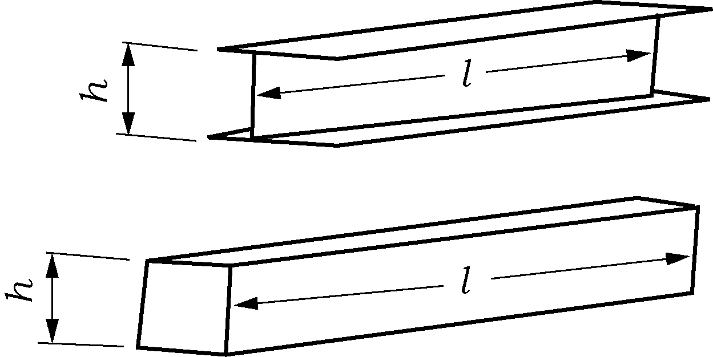

# 제9편 추가설비

> 선급 및 강선규칙/적용지침 / RA-09-K / 2025 / KO / Guidance

## 제 3 장 자동화설비

### 제 2 절 자동화설비의 검사

#### 201. 일반사항

- **1.** **검사의 준비 등** ***(2020)*** **【규칙 참조】**
  **규칙 201.**의 **3**항 (1)을 적용함에 있어서 “우리 선급이 적당하다고 인정하는 기준”이라 함은 **규칙 1편 1장 104.**에 따라 인정하는 것을 말한다.

#### 202. 등록검사

- **1.** **제출도면 및 자료 【규칙 참조】**
  **규칙 202.**의 **1**항 (3)호 (라)에서 말하는 제자동화설비의 도면 및 자료는 다음과 같다.
  - **(1)** 평형수 적재 및 배수의 원격제어장치
    - **(가)** 평형수 적재 및 배수를 위한 배관계통도(평형수탱크, 밸브, 펌프 및 해수흡입구의 배치가 기재된 것으로 경사조정 전용 배관도 포함한다.)
    - **(나)** 평형수 적재 및 배수를 위한 원격감시 및 경보반, 펌프 및 밸브 등의 원격제어반 배치도
    - **(다)** 탱크의 원격 액면감시장치의 계통도
    - **(라)** 밸브의 구동장치 및 원격제어장치의 계통도
  - **(2)** 자동조타장치
    자동조타장치에 관한 승인도면에는 최소한 다음 사항이 포함되어야 한다.
    - **(가)** 시스템 구성(조타계통)
    - **(나)** 경보 및 표시램프에 대한 블록선도
    - **(다)** 조타 스탠드, 경보판넬 등의 배치
    - **(라)** 기능설명
  - **(3)** 액체화물의 원격제어 하역장치
    - **(가)** 액체화물의 배관계통도(화물탱크, 밸브, 펌프 배치 및 탱크용량을 기재한 것)
    - **(나)** 하역집중제어실(장소) 내의 기기배치도
    - **(다)** 하역집중제어실(장소)에 설치되어 있는 원격감시 및 경보반, 펌프 및 밸브 등의 원격제어반 배치도
    - **(라)** 탱크의 원격 액면감시장치의 계통도
    - **(마)** 밸브의 구동장치 및 원격제어장치의 계통도
  - **(4)** 동력개폐장치
    - **(가)** 개폐장치의 배치도 및 개폐조작장소의 위치도
    - **(나)** 개폐동력원의 계통도
    - **(다)** 제어용 동력원(개폐동력원과 별도로 되어 있는 경우에 한함)의 계통도
    - **(라)** 안전확보를 위한 설비 또는 장치를 갖는 경우에는 그 상세도
  - **(5)** 주기관 운전상태의 자동기록장치
    - **(가)** 기관 운전상태의 자동기록장치에 대한 동작설명서(시스템 구성, 정시 기록시간 간격 및 정시기록, 이상기록 및 임의기록 등에 관한 사항이 기재되어 있는 것)
  - **(6)** 원격제어 계선장치
    - **(가)** 계선장치 배치도(원격제어 스탠드 및 계선삭의 배치 위치를 기입한 것)
    - **(나)** 계선장치의 동력 계통도
  - **(7)** 제어실용 공기조화장치
    - **(가)** 제어실용 공기조화장치에 대한 동작설명서
    - **(나)** 경보반의 배치도
    - **(다)** 공기조화장치의 전기계통도
  - **(8)** 원격제어 연료유 수급장치
    - **(가)** 연료유 수급용 관장치도(탱크, 밸브, 펌프의 배치 및 탱크용량을 기재한 것)
    - **(나)** 탱크액면의 원격감시 및 경보장치의 계통도
    - **(다)** 밸브의 구동장치 및 원격제어장치의 계통도
    - **(라)** 원격감시 및 경보반, 밸브 원격제어반의 배치도
  - **(9)** 냉동컨테이너 운전상태 집중감시장치
    - **(가)** 감시반의 배치도
    - **(나)** 감시반의 전기계통도
    - **(다)** 감시 및 경보항목의 일람표
  - **(10)** 하역호스 연결용 크레인
    - **(가)** 크레인의 전체장치도 및 배치도
    - **(나)** 동력원의 계통도
    - **(다)** 제어원(동력원과 별도로 되어 있는 경우에 한함)의 계통도
  - **(11)** 자동 갑판세정장치
    - **(가)** 세정장치의 전체장치도 및 배치도
    - **(나)** 세정용 배관도
    - **(다)** 세정장치 및 제어장치의 동력원 계통도
  - **(12)** 선수 및 선미 계선장치의 현측 원격제어장치
    - **(가)** 계선장치의 배치도(원격제어 스탠드 및 계선삭의 배치위치를 기입한 것)
    - **(나)** 계선장치의 동력 계통도
  - **(13)** 도선사용 사다리의 동력조작장치
    - **(가)** 동력조작장치의 전체장치도 및 배치도
    - **(나)** 동력원의 계통도
    - **(다)** 제어원(동력원과 별도로 되어 있는 경우에 한함)의 계통도
  - **(14)** 기관집중 감시장치
    - **(가)** 감시반의 배치도
    - **(나)** 감시 및 경보항목의 일람표
  - **(15)** 기관집중 제어장치
    - **(가)** 제어반의 배치도
    - **(나)** 감시, 경보 및 제어항목의 일람표
  - **(16)** 선박지휘실 현측에서 기관 원격조정 및 원격 조타장치
    - **(가)** 기관원격조정장치 및 원격조타장치의 전체장치도와 배치도
    - **(나)** 동력원의 계통도
    - **(다)** 제어원(동력원과 별도로 되어 있는 경우에 한함)의 계통도
  - **(17)** 화물창 빌지의 고액면 경보장치
    - **(가)** 경보장치의 계통도 및 전체장치도
    - **(나)** 경보반의 배치도
  - **(18)** 1개의 드럼방식인 계류윈치
    - **(가)** 계선장치의 배치도(원격제어 스탠드 및 계선삭의 배치상태를 기입한 것)
    - **(나)** 계선장치 동력원의 계통도
    - **(다)** 계선장치의 원격제어장치 계통도
  - **(19)** 비상용 예인삭의 동력조작장치
    - **(가)** 조작장치의 전체장치도 및 배치도
    - **(나)** 동력원의 계통도
    - **(다)** 제어원(동력원과 별도로 되어 있는 경우에 한함)의 계통도

#### 203. 공장시험

- **1.** **형식승인 【규칙 참조】**
  - **(1)** **규칙 203.**의 **1**항에서 형식승인을 받아야 하는 자동화기기는 원칙적으로 다음과 같다.
    (파) 전기추진장치용 전력변환장치
    (갸) 기타 우리 선급이 필요하다고 인정하는 것
    - **(가)** 경보 및 감시장치(alarm and monitoring systems)
    - **(나)** 주기관, 발전기, 보일러 및 중요보기 등의 제어장치(control systems)
    - **(다)** 컴퓨터기반시스템(computer based systems)
    - **(라)** 화재탐지장치(fire detection systems)
    - **(마)** 가스탐지장치(gas detection systems)
    - **(바)** 전자식 조속기(electronic governor systems)
    - **(사)** 속도 및 축마력 감지기(speed and shaft horsepower sensing equipment)
    - **(아)** 조절기(controller)
    - **(자)** 검출기(flow, level, limit, pressure, temperature switches)
    - **(차)** 오일미스트 디텍터(oil mist detectors)
    - **(카)** 무정전전원장치(UPS)
    - **(타)** 전기, 전자식 표시기(indicators)
    - **(하)** 상기 (가) ∼ (파)에 적용되는 광 센서 및 광 응용장치
  - **(2)** **규칙 203.**의 **1**항에서 “우리 선급이 별도로 정하는 규정”이라 함은 **제조법 및 형식승인 등에 관한 지침 3장 23절**의 규정을 말한다.
- **2.** **자동화시스템의 완성시험** ***(2020)*** **【규칙 참조】**
  **규칙 203.**의 **2**항 (1)의 (마)를 적용함에 있어서 “기타 우리 선급이 필요하다고 인정하는 시험”이라 함은 **규칙 1편 1장 104.**에 따라 인정하는 것을 말한다.

#### 204. 선내시험 【규칙 참조】

#### 205. 집중감시제어설비의 해상시험

- **1.** **주추진기관 및 가변피치프로펠러 【규칙 참조】**
  **규칙 205.**의 **1**항에 규정하는 시험에 있어서 주추진기관 또는 가변피치프로펠러에 대하여는 선교제어장치에 의해 아래 **206.**에 따라 시험을 행하는 것을 표준으로 한다.

#### 206. 기관구역의 무인화설비의 해상시험 (2017) 【규칙 참조】

**그림 9.3.2 증기터빈선의 시험요령** ***(2021)***
**그림 9.3.1 디젤선의 시험요령** ***(2021)***

#### 208. 유지검사

- **1.** **연차검사 【규칙 참조】**
  **규칙 208.**의 **1**항 (3)호를 적용함에 있어서 “검사원이 필요하다고 인정하는 경우”라 함은 요구되는 성능을 발휘하지 못할 것으로 판단되는 것을 말한다.

### 제 3 절 주추진기관 등의 집중감시제어설비 (2025)

#### 302. 시스템 설계

- **1.** **컴퓨터기반시스템 【규칙 참조】**
  **규칙 302.**의 **7**항을 적용함에 있어 컴퓨터 기반시스템의 구체적인 예는 **규칙 6편 2장**의 **표 6.2.2**과 같이 분류한다. 유효한 독립의 백업장치 또는 위험방지수단이 설치되었다면 시스템 Ⅲ를 시스템 Ⅱ로 분류 등급을 낮출 수 있다.

#### 303. 침수방지 및 화재안전대책

- **1.** **침수방지 【규칙 참조】**
  **규칙 303.**의 **1**항 (4)호를 적용함에 있어서, “빌지배출장치”는 다음에 따른다.
  - **(1)** “빌지배출장치”는 **규칙 5편 6장 403.**의 **6**항에 명시된 비상빌지 흡입구를 의미한다.
  - **(2)** 비상빌지장치에 사용되는 밸브가 다음에 적합할 경우에는 **규칙 303.**의 **1**항 (4)호의 요건을 적용하지 않는다. 여기서, 통상 폐쇄된 역지밸브로서 폐쇄장치(positive means of closing)가 있는 경우에는 다음 (가) 및 (나)의 요건에 만족하는 것으로 본다.
    - **(가)** 비상빌지 흡입밸브가 통상 폐쇄된 상태로 유지될 것.
    - **(나)** 비상빌지관에 역지밸브가 설치되어 있을 것,
    - **(다)** 비상빌지 흡입관이 **규칙 303.**의 **1**항 (4)호에서 요구되는 제어장치를 갖는 선체붙이밸브의 선내 측에 위치할 것.
- **2.** **화재안전대책 【규칙 참조】**
  - **(1)** 화재예방에 대하여는 **규칙 303.**의 **2**항에 따르는 이외에 다음 사항에 대하여도 고려하여야 한다.
    - **(가)** 연료유 관장치 및 윤활유 관장치에 사용되는 제1급관의 이음은 가능한 한 용접이음으로 하여야 한다.
    - **(나)** 연료유 관장치 및 윤활유 관장치에 사용되는 플렉시블관은 승인된 형식의 것으로 하고 그 용도, 압력 및 배치를 고려하여 적당한 방법으로 보호하여야 한다.
    - **(다)** 연료유 관장치 및 윤활유 관장치에 증기 또는 전기에 의한 가열기를 설치하는 경우에는 온도제어와 별도로 적어도 고온경보장치 또는 저유량 경보장치를 설치하여야 한다. 다만, 가열된 기름의 온도가 인화점에 이르지 않는 경우에는 이에 따르지 않는다.

#### 306. 보일러의 자동제어 및 원격제어

- **1.** **일반사항** ***(2020)*** **【규칙 참조】**
  **규칙 306.**의 **1**항 (3)호를 적용함에 있어서 “우리 선급이 적당하다고 인정하는 바”라 함은 **규칙 1편 1장 104.**에 따라 인정하는 것을 말한다.

### 제 5 절 제자동화설비

#### 502. 제1종 자동화설비

- **1.** **규 칙 502.**의 규정 중󰡒해당 선박의 용도 및 하역방법 등을 고려하여 우리 선급이 인정하는 설비󰡓라 함은 다음에 나타내는 것을 말한다. **【규칙 참조】**
  - **(1)** 선박의 용도에 따라 생략 가능한 것
    - **(가)** 유조선, 액화가스 산적운반선 및 위험화학품 산적운반선에 대해서는 **규칙 502.**의 **4**항에 규정한 동력 개폐장치
    - **(나)** (가) 이외의 선박에 대해서는 **규칙 502.**의 **3**항에 규정한 액체화물의 원격제어 하역장치
  - **(2)** 하역방식에 따라 생략 가능한 것
    하역 중 선체의 경사제어를 필요로 하지 않는 선박(롤온․롤오프선 등)의 경우는 **규칙 502.**의 **1**항에 규정한 평형수 적재 및 배수의 원격제어장치
  - **(3)** 그밖에 우리 선급이 인정하여 생략 가능한 것
    **규칙 4편 8장 표 4.8.1**의 의장수에 따라서 무어링 로프 수량이 선수부 및 선미부에 각각 3개 미만이 요구되는 경우, 원격제어장치는 그 수량만을 유효하게 조작할 수 있는 것이면 된다.
- **2.** **평형수 적재 및 배수의 원격제어장치 【규칙 참조】**
  **규칙 502.**의 **1**항 (1)호 (나)의 “밸브의 개폐 등 평형수의 주입 및 배출에 필요한 제어장치”라 함은 평형수의 주입 및 배출을 위하여 필요한 제어밸브를 말한다.
- **3.** **자동조타장치** ***(2020)*** **【규칙 참조】**
  **규칙 502.**의 **2**항 (11)호를 적용함에 있어서 “기타 우리 선급이 필요하다고 인정하는 요건”이라 함은 **규칙 1편 1장 104.**에 따라 인정하는 것을 말한다.
- **4.** **액체화물의 원격제어 하역장치 【규칙 참조】**
  **규칙 502.**의 **3**항 (3)호 (나)의 “밸브의 개폐 등 화물의 적하 및 양하를 위하여 필요한 제어장치”라 함은 화물의 적하 및 양하를 위하여 필요한 제어밸브를 말한다.
- **5.** **동력개폐장치 규칙 502.**의 **4**항은 다음에 따른다. **【규칙 참조】**
  - **(1)** 제어장소에서 육안으로 개폐상태의 확인이 곤란한 경우에는 개폐상태의 표시장치를 갖추어야 한다.
  - **(2)** 제어장소에서 개폐시의 안전을 육안으로 확인할 수 없는 경우에는 가청의 경보장치, 황색회전등 등을 갖추어야 한다.
- **6.** **주기관 운전상태의 자동기록장치 규칙 502.**의 **5**항을 적용함에 있어 자동기록장치는 다음에 따라야 한다.
  **【규칙 참조】**
  - **(1)** 자동기록장치는 4시간(1당직) 마다 1회 비율로 기록할 수 있는 기능을 갖추어야 한다.
  - **(2)** 주추진기관의 운전상태에는 최소한 다음 사항이 포함되어야 한다.
    - **(가)** 주베어링 윤활유 입구압력
    - **(나)** 각 실린더 냉각수 출구온도
    - **(다)** 주보일러의 증기압력
    - **(라)** 각 실린더의 배기가스 출구온도
    - **(마)** 주추진기관 또는 추진축의 매분회전수
- **7.** **원격제어 계선장치 【규칙 참조】**
  **규칙 502.**의 **6**항 (1)호 중 “유효하게 제어할 수 있는”이라 함은 계선삭을 풀고 감는 속도의 제어(시동 및 정지 제어를 포함한다)가 가능한 것을 말한다.

#### 503. 제2종 자동화설비

- **1.** **규 칙 503.**의 규정 중 “해당 선박의 용도 및 하역방법 등을 고려하여 우리 선급이 인정하는 설비”라 함은 다음에 나타내는 것을 말한다. **【규칙 참조】**
  - **(1)** 선박의 용도에 따라 생략이 가능한 것
    - **(가)** 유조선, 액화가스 산적운반선 및 위험화학품 산적운반선
      - **(a)** **규칙 502.**의 **4**항에 규정한 동력개폐장치
      - **(b)** **규칙 503.**의 **2**항에 규정한 냉동컨테이너 운전상태 집중감시장치
    - **(나)** 컨테이너 전용선
      - **(a)** **규칙 502.**의 **3**항에 규정한 액체화물의 원격제어 하역장치
      - **(b)** **규칙 503.**의 **7**항에 규정한 비상용 예인삭의 동력조작장치
      - **(c)** **규칙 503.**의 **3**항에 규정한 하역호스연결용 크레인
    - **(다)** (가) 및 (나) 이외의 선박
      - **(a)** (나)에 나타낸 것
      - **(b)** **규칙 503.**의 **2**항에 규정한 냉동컨테이너 운전상태 집중감시장치
  - **(2)** 하역방식에 따라 생략이 가능한 것
    하역 중 선체의 경사제어를 필요로 하지 않는 선박의 경우는 **규칙 502.**의 **1**항에 규정한 평형수 적재 및 배수의 원격제어장치
  - **(3)** 그밖에 우리 선급이 인정하여 생략 가능한 것
    **규칙 4편 8장 표 4.8.1**의 의장수에 따라서 무어링 로프 수량이 선수부 및 선미부에 각각 3개 미만이 요구되는 경우, 현측 원격제어장치는 그 수량만을 유효하게 조작할 수 있는 것이면 된다.
- **2.** **원격제어 연료유 수급장치 【규칙 참조】**
  **규칙 503.**의 **1**항 중 󰡒연료유 수급장치의 탱크 및 밸브 등의 배치를 고려하여 우리 선급이 지장이 없다고 인정하는 경우󰡓라 함은 연료유 저장탱크가 4개 이하인 경우로서 연료의 수급을 위해 조작을 필요로 하는 밸브가 한 곳에 집중 배치된 경우를 말한다.
- **3.** **하역호스 연결용 크레인 【규칙 참조】**
  **규칙 503.**의 **3**항 중 “쉽게 행할 수 있는 것”이라 함은 1인이 조작할 수 있는 것을 말한다.
- **4.** **자동갑판 세정장치 【규칙 참조】**
  **규칙 503.**의 **4**항 (2)호 중 사용압력에 대하여 충분한 강도를 갖는 것이라 함은 설계압력의 1.5배의 압력으로 수압시험 한 것을 말한다.

#### 504. 제3종 자동화설비

- **1.** **규 칙 504.**의 규정 중 “해당 선박의 용도 및 하역방법 등을 고려하여 우리 선급이 인정하는 설비”라 함은 다음에 나타내는 것을 말한다. **【규칙 참조】**
  - **(1)** 선박의 용도에 따라 생략 가능한 것
    - **(가)** 유조선, 액화가스 산적운반선 및 위험화학품 산적운반선
      - **(a)** **규칙 502.**의 **4**항에 규정한 동력 개폐장치
      - **(b)** **규칙 503.**의 **2**항에 규정한 냉동컨테이너 운전상태 집중감시장치
      - **(c)** **규칙 503.**의 **4**항에 규정한 자동갑판세정장치
    - **(나)** 컨테이너 전용선
      - **(a)** **규칙 502.**의 **3**항에 규정한 액체 화물의 원격 제어 하역장치
      - **(b)** **규칙 503.**의 **7**항에 규정한 비상용 예인삭의 동력조작장치
      - **(c)** **규칙 503.**의 **3**항에 규정한 하역호스연결용 크레인
      - **(d)** **규칙 503.**의 **4**항에 규정한 자동갑판세정장치
    - **(다)** 석탄 또는 철광석을 산적운반하는 선박
      - **(a)** **규칙 502.**의 **3**항에 규정한 액체화물의 원격제어 하역장치
      - **(b)** **규칙 503.**의 **2**항에 규정한 냉동컨테이너 운전상태 집중감시
      - **(c)** **규칙 503.**의 **7**항에 규정한 비상용 예인삭의 동력조작장치
      - **(d)** **규칙 503.**의 **3**항에 규정한 하역호스연결용 크레인
    - **(라)** (가) 부터 (다) 이외의 선박
      - **(a)** (다)에 나타낸 것
      - **(b)** **규칙 503.**의 **4**항에 규정한 자동 갑판 세정장치
  - **(2)** 하역방식에 따라 생략 가능한 것
    하역 중 선체의 경사제어를 필요로 하지 않는 선박의 경우는 **규칙 502.**의 **1**항에 규정한 평형수 적재 및 배수의 원격제어장치
  - **(3)** 그밖에 우리 선급이 인정하여 생략 가능한 것
    **규칙 4편 8장 표 4.8.1**의 의장수에 따라서 무어링 로프 수량이 선수부 및 선미부에 각각 3개 미만이 요구되는 경우, 현측 원격제어장치는 그 수량만을 유효하게 조작할 수 있는 것이면 된다.
- **2.** **기관집중 감시장치 【규칙 참조】**
  **규칙 504.**의 **1**항의 기관집중 감시장치는 다음의 기능을 갖추어야 한다. 다만, 다른 규정에 의하여 선교에 설치되는 것에 대하여는 이에 따르지 아니한다.
  - **(1)** **지침 표 9.3.1** 부터 **표 9.3.5**에 표시하는 경보항목의 감시
  - **(2)** **지침 표 9.3.1** 부터 **표 9.3.5**에 나타낸 항목의 표시. 다만, 동일펌프 또는 동일 열교환기를 사용하여 2개 이상의 항목에 공급하는 경우에는 1개의 항목으로 할 수 있다.

    **표 9.3.1 디젤기관의 표시 및 경보항목**

    | 항 목 |   | 주 추 진 기 관 용 | 발 전 기 용 |
    | --- | --- | --- | --- |
    | 온 도 | 실린더 냉각수 피스턴 냉각수(유) 주 윤활유 연료유 배기가스 소제공기 | 각 실린더 출구 각 실린더 출구 입구 입구 각 실린더 출구 공기냉각기 출구 | - - - - 과급기 입구 또는 각 실린더 출구 - |
    | 압 력 | 실린더 냉각수 피스턴 냉각수(유) 연료밸브 냉각수(유) 주 윤활유 연료유 냉각해수 | 입구 입구 입구 입구 입구 펌프출구 | - - - - - - |

    **표 9.3.2 증기터빈의 표시 및 경보항목**

    | 항 목 |   | 주 추 진 기 관 용 | 발 전 기 용 |
    | --- | --- | --- | --- |
    | 온 도 | 윤활유 | 입구 및 각 베어링 출구 | - |
    | 압 력 | 윤활유 배기 | 입구 복수기 | - - |

    **표 9.3.3 축계의 표시 및 경보항목**

    | 항 목 |   | 주 추 진 기 관 용 | 발 전 기 용 |
    | --- | --- | --- | --- |
    | 온 도 | 감속치차 윤활유 | 입구 | - |
    | 압 력 | 감속치차 윤활유 | 입구 | - |

    **표 9.3.4 보일러, 열매체유 장치의 표시 및 경보항목**

    | 항 목 |   | 주보일러 | 중요 보조 보일러 | 열매체유 장치 |
    | --- | --- | --- | --- | --- |
    | 온 도 | 연료유 배기가스 과열증기, 열매체유 | 입구 출구 출구 | - - - | - - 출구 |
    | 압 력 | 연료유 증기 | 입구 출구 | - 출구 | - - |

    **표 9.3.5 기타 기관의 표시 및 경보항목**

    | 항 목 | 표 시 장 소 |
    | --- | --- |
    | 기관에 따라 우리 선급이 필요하다고 인정하는 항목 | 우리 선급이 요구하는 개소 |
- **3.** **기관집중 제어장치 【규칙 참조】**
  - **(1)** **규칙 504.**의 **2**항 중 “유효하게 제어할 수 있는 것”이라 함은 다음에 나타낸 것을 말한다.
    - **(가)** 주기관으로 사용되는 디젤 기관의 제어
      - **(a)** 보조 블로어의 시동 및 정지(다만, 보조 블로어가 자동운전되도록 설비된 경우는 생략 가능)
      - **(b)** 연료유 공급펌프의 시동 및 정지
      - **(c)** 연료유 승압펌프의 시동 및 정지
      - **(d)** 주 윤활유 펌프의 시동 및 정지
      - **(e)** 크로스헤드 윤활유펌프의 시동 및 정지
      - **(f)** 피스톤 냉각수(유) 펌프의 시동 및 정지
      - **(g)** 실린더 냉각수 펌프의 시동 및 정지
      - **(h)** 냉각해수펌프의 시동 및 정지
    - **(나)** 주기관으로 사용되는 증기터빈의 제어
      - **(a)** 주보일러의 제어(단, 주보일러의 냉각상태에서의 시동은 제외)
      - **(i)** 급수펌프의 시동 및 정지
        - **(ii)** 연료유펌프의 시동 및 정지
        - **(iii)** 송풍기의 시동 및 정지
        - **(iv)** 분연장치의 제어
      - **(b)** 터빈을 위한 펌프의 제어
      - **(i)** 윤활유펌프의 시동 및 정지
        - **(ii)** 냉각수펌프의 시동 및 정지
        - **(iii)** 제어용 유압펌프의 시동 및 정지
      - **(c)** 이코노마이저의 수트 블로어의 시동 및 정지
    - **(다)** 발전기를 구동하는 디젤기관의 제어
      - **(a)** 시동 및 정지
      - **(b)** 연료유 교체장치의 조작
      - **(c)** 냉각해수펌프의 시동 및 정지
      - **(d)** **규칙 503.**의 **3**항 (1)호 (나)의 경우에 있어서 자동적으로 기동하는 기관의 선택
    - **(라)** 발전기를 구동하는 증기터빈의 제어
      - **(a)** 순환수 펌프의 시동 및 정지
      - **(b)** 통상 배기가스 이코노마이저의 증기로 구동되고, 정박 중에도 증기터빈 발전기를 사용하는 선박에 있어서는 배기가스 이코노마이저와 보일러간 증기의 교체
    - **(마)** 중요 보조 보일러의 제어
      - **(a)** 배기가스 이코노마이저의 증기로 구동되는 증기터빈 발전기를 갖는 선박에 있어서는 배기가스 이코노마이저의 수트 블로어(soot blower)의 시동 및 정지
      - **(b)** 보일러 순환수 펌프의 시동 및 정지
    - **(바)** 기타 기관의 제어
      - **(a)** 발전기 자동 동기투입 및 자동부하분담 장치의 조작
      - **(b)** 발전기 자동부하이동 및 차단장치의 조작
- **4.** **1개의 드럼방식인 계류윈치 【규칙 참조】**
  **규칙 504.**의 **5**항을 적용함에 있어서 1개의 드럼방식인 계류윈치(독립형 원격제어 계선장치)는 다음에 따른다.
  - **(1)** “독립적으로 제어할 수 있은 것”이라 함은 1윈치 1드럼의 것 또는 1윈치 복수드럼의 경우에는 클러치 및 브레이크를 원격제어 가능한 것을 말한다.
  - **(2)** 선수부 또는 선미부에 5개 이상의 드럼을 비치한 선박에 있어서는 해당 선수부 또는 선미부에서 5개의 드럼이 독립으로 제어 가능하면 된다. 
