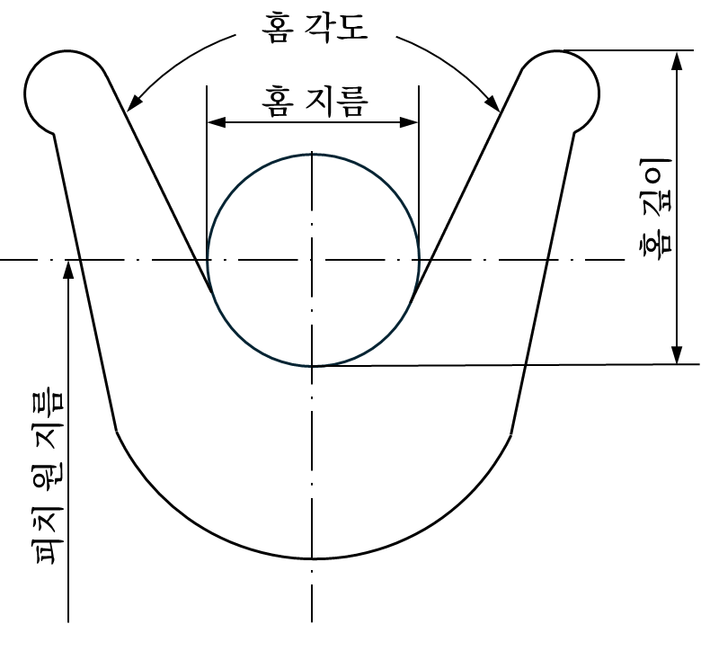

# 제9편 추가설비

> 선급 및 강선규칙/적용지침 / RA-09-K / 2025 / KO / Guidance

## 제 7 장 잠수설비 (2020)

### 제 1 절 일반사항

#### 101. 일반

| 장비명 | 포화잠수 (SAT) | 혼합기체잠수 (BOU) | 표면공급잠수 (SUR) |
| --- | --- | --- | --- |
| 폐쇄형 잠수벨 | ○ | 선택 설치 | X |
| 웻벨 | X | 선택 설치 | 선택 설치 |
| 잠수사 스테이지 | X | X | 선택 설치 |
| 엄빌리컬 케이블 | ○ | ○ | ○ |
| 잠수제어장치 | ○ | ○ | ○ |
| 진회수 장치 | ○ | ○ | ○ |
| 감압챔버 | ○ | ○ | ○ |
| 생명유지제어장치 | ○ |   |   |
| 생명유지장치 - 호흡용기체의 저장 및 분배 - 이산화탄소제거장치 - 잠수사기체회수장치 - 환경조절장치 - 잠수사온수공급장치 - 위생설비 | ○ ○ ○(설치시) ○ ○ ○ | ○ ○ X ○(설치시) ○(설치시) X | ○ ○ X ○(설치시) ○(설치시) X |
| 고압탈출장치 | ○ |   |   |
| 고압탈출장치 진수장치 | ○ |   |   |

**1. 규 칙 101.**의 **1**항 (1)호에서 잠수설비를 구성하는 주요장비라 함은 다음과 같다. **【규칙 참조】**

### 제 2 절 검사 【규칙 참조】

#### 201. 일반사항

- **1.** **적용**
  본 요건은 **규칙 7장 101.**의 **1**항을 적용하는 장치의 정기적 검사에 적용한다.
- **2.** 정기적 검사 시 다음의 사항을 검토하여야 한다.
  - **(1)** 잠수작업 기록
  - **(2)** 밸브차단 점검표
  - **(3)** 운용 절차서
  - **(4)** 비상 절차서
  - **(5)** 잠수 기록
  - **(6)** 양식의 잠수설비 시험 성적서
  - **(7)** 잠수설비 배치도
  - **(8)** 예방정비(PMS) 기록
- **3.** **검사계획서**
  - **(1)** 검사계획서는 잠수설비의 운용수명 동안에 본선에 비치하여야 하고, 우리 선급의 규칙에 따라 설치된 잠수설비에 적합하도록 선주 대리인이 작성하여야 한다. 이동식 잠수설비의 검사계획서에는 장치를 사용할 때와 보관(laid-up) 중일 때의 검사범위를 명시하여야 한다.
  - **(2)** 검사계획서는 검사 실시 전 우리 선급의 승인을 받아야 한다. 점검표를 첨부하여 검사계획서의 표지에는 다음의 사항을 명시하여야 한다.
    - **(가)** “잠수지원선 검사계획서"
    - **(나)** 선급등록 시 주어진 지원선 또는 설비의 이름
    - **(다)** 선급등록 시 주어진 부기부호
    - **(라)** IMO번호(정부검사용도)
    - **(마)** 회사명
    - **(바)** 개정번호와 개정일
  - **(3)** 점검표는 검사원이 각각의 검사 시 기입과 서명이 용이하도록 만들어져야 한다. 점검표는 각 장의 상단에 다음의 정보를 포함하여야 한다.
    - **(가)** 선급등록 시의 지원선 또는 설비의 이름
    - **(나)** 선급등록 시의 선급번호
    - **(다)** 회사명
    - **(라)** 검사범위(연차, 중간, 갱신 또는 그 외)
    - **(마)** 각 열의 항목: 검사품, 상태, 작동, 코멘트
    - **(바)** 장소, 일자, 검사원, 서명, 도장

#### 202. 검사항목

- **1.** **폐쇄형 잠수벨**
  - **(1)** 가스 실린더 시험
  - **(2)** 배관계통 시험
  - **(3)** 있는 경우, 밸러스트 투하 시험
  - **(4)** 비상계통 시험
  - **(5)** 위치 및 통신장치 시험
  - **(6)** 잠수벨 난방 계통 시험
  - **(7)** 전기장치 시험
  - **(8)** 배터리 팩 및 수밀장치 육안검사
  - **(9)** 배관계통 연결구 육안검사
  - **(10)** 일체형 호흡장치(BIBS) 육안검사
  - **(11)** 부식방지장치 육안검사
  - **(12)** 구조물 육안검사
  - **(13)** 결합장치면 육안검사
- **2.** **웻벨/다이빙 스테이지**
  - **(1)** 가스 실린더 시험
  - **(2)** 배관계통 시험
  - **(3)** 있는 경우, 밸러스트 투하 시험
  - **(4)** 비상계통 시험
  - **(5)** 전기장치 시험
  - **(6)** 배터리 팩 및 수밀장치 육안검사 (설치한 경우)
  - **(7)** 배관라인 커넥터(배관계통 연결구) 육안검사
  - **(8)** 일체형 호흡장치(BIBS) 육안검사 (설치한 경우)
  - **(9)** 부식방지장치 육안검사(설치한 경우)
  - **(10)** 구조물 육안검사
- **3.** **감압챔버**
  - **(1)** **4**항에 따른 거주용 압력용기(PVHO) 시험
  - **(2)** 배관계통 시험
  - **(3)** 위생계통 시험
  - **(4)** 화재안전계통 시험
  - **(5)** 가스재생계통 시험
  - **(6)** 환경제어장치 시험
  - **(7)** 잠수사기체회수장치 시험(설치된 경우)
  - **(8)** 계기류 시험
  - **(9)** 통신장치 시험
  - **(10)** 전기장치 시험
- **4.** **거주용 압력용기(PVHO)**
  - **(1)** 거주용 압력용기(PVHO)의 벽면 및 특히 하부측 내외부 부식상태 육안 검사
  - **(2)** 벽면 관통구 육안검사
  - **(3)** 지지 구조물 육안검사
  - **(4)** 표식(명판) 육안검사
  - **(5)** 단열재 육안검사
  - **(6)** 출입문, 해치 및 잠금장치 육안검사
  - **(7)** 메디컬락 육안검사
  - **(8)** 관련 배관 및 부속품 육안검사
  - **(9)** 챔버간 연결 플랜지 육안검사
  - **(10)** 결합장치 결합면 육안검사
  - **(11)** 작동최고압력으로 기밀시험
  - **(12)** 작동최고압력의 1.5배로 수압시험. 단, 우리 선급이 인정하는 경우, 사용중인 거주용 압력용기(PVHO)에 대하여 수압 시험의 대안을 제시할 수 있다.(예: 압력 하 음향 방출시험)
  - **(13)** ASME PVHO에 따른 관망창 시험
- **5.** **전기설비**
  - **(1)** 전기설비에 대한 개조 여부 등 설치 상태를 확인한다.
- **6.** **진회수장치**
  - **(1)** 와이어로프의 윤활제 도포 상태
  - **(2)** 완충장치 기능시험
- **7.** **고압비상탈출설비**
  - **(1)** **IMO Res.692(17)**에 따라 각각의 고압탈출설비는 시험 및 검사하여야 한다.

#### 203. 정기적 검사

| 장비명 | 검사항목 | 연차 검사 | 중간 검사 | 정기 검사 |
| --- | --- | --- | --- | --- |
| 기체분석기 | ∘펌프의 검사 및 기능시험, 튜브 유효기간확인 (일회용 튜브 사용하는 형식의 경우, 핸드펌프 포함) ∘육안검사 및 기능시험 ∘협의된 사양에 맞는 교정시험 | ○ ○ ○ |   |   |
| 잠수벨 (주구조물, 인양점) | ∘인양점과 주구조물의 손상 및 부식에 대한 육안검사 ∘안전하중의 1.5배에 해당하는 하중시험. 하중시험 전후에 인양점 또는 패드아이부에 대한 비파괴검사 | ○ ○ |   |   |
| 일체형호흡마스크 | ∘육안검사 및 기능시험(통신장치 포함, 설치 시) ∘제조사권고에 따른 검사 및 시험 (수중용의 경우) | ○ ○ |   |   |
| 영상 및 통신장치 | ∘검사 및 기능시험 ∘축전지 상태 점검 (가능할 시) | ○ ○ |   |   |
| 압축기, 부스터 및 여과장치 | ∘육안검사 및 기능시험(PRV 제외한 안전장치 포함) ∘토출량 및 토출압력 점검 ∘가능한 기체순도검사 | ○ ○ ○ |   |   |
| 압력용기 | ∘육안검사(외부) | ○ |   |   |
| 압력용기 | ∘내/외부 상세 육안검사 ∘최대사용압력에서의 누기시험 - 검사원이 필요하다고 판단할 시 최대허용사용압력의 1.5배 과압시험. 필요 시 비파괴검사 실시 |   | ○ ○ |   |
| 압력용기 | ∘최대허용압력의 1.5배 압력시험 |   |   | ○ |
| 압력용기 | 비고)압력시험의 주기 및 압력은 각 기국법을 따를 수 있다. |   |   |   |
| 전기설비 | ∘육안검사 ∘장치의 기능시험 (보호장치 포함), 전기적 연속성 및 절연 저항시험 | ○ ○ |   |   |
| 잠수벨 비상위치 장치 | ∘손상 또는 열화에 대한 현상 검사 ∘배터리 상태 점검을 포함한 기능시험 | ○ ○ |   |   |
| 환경조절장치 | ∘육안 검사 및 기능 검사 | ○ |   |   |
| 고정식 소화장치 | ∘노즐, 밸브, 배관 및 부속품의 육안 검사 ∘기능시험 또는 공기나 가스를 사용한 시뮬레이션 시험 ∘자동감지/작동시스템이 장착 된 경우, 그 기능 시험 | ○ ○ ○ |   |   |
| 휴대식 소화장치 | ∘외부 육안 검사 ∘지시 장치가 허용범위 내에 있는지 확인 | ○ ○ |   |   |
| 잠수사기체회수장치 및 기체혼합기 | ∘육안검사 및 기능시험(PRV 외의 모든 안전장치 포함) ∘가스 백(gas bag)의 소독상태 확인 | ○ ○ |   |   |
| 수심계 | ∘최대 눈금 값의 ± 0.25 % 정확도 확인 ∘현장 육안검사 및 기능시험 | ○ ○ |   |   |
| 잠수사 난방장치 | ∘육안검사 및 기능시험 ∘전기가 공급되는 경우 절연저항 시험 | ○ ○ |   |   |
| 잠수사 난방장치 | ∘과압 시험 |   |   | ○ |
| 진회수장치 | ∘손상 / 부식에 대한 육안 검사 ∘각 브레이크 장치에 대해 최대안전하중(SWL)의 1.5 배로 정적 하중시험 ∘히브 보정 장치의 기능시험 (있는 경우) ∘2 차 회수장치의 기능시험 ∘최대안전하중의 1.25 배의 동적하중시험 (필요 시 시험 이후에 비파괴검사(NDT) 수행) | ○ ○ ○ ○ ○ |   |   |
| 유압동력장치 | ∘인장장치의 필수적인 부분 육안 검사 및 기능 시험 ∘인터쿨러 / 히터 (설치된 경우) 기능 및 유량 점검 ∘유압 유체 및 오일 분석 수행(필요시, 유압 유체와 오일 교체) | ○ ○ ○ |   |   |
| 배관장치, 부착품 | ∘육안 검사 ∘내부 청결 확인 검사 | ○ ○ |   |   |
| 배관장치, 부착품 | ∘최대작동압력으로 누기시험 |   | ○ |   |
| 산소관장치 | ∘육안 검사 | ○ |   |   |
| 산소관장치 | ∘최대작동압력으로 누기시험 |   | ○ |   |
| 압력도출장치 | ∘육안검사 | ○ |   |   |
| 압력도출장치 | ∘설정압력 기능시험 및 최대작동압력 누기시험 |   | ○ |   |
| 압력도출장치 | ∘파열디스크의 경우 매10년 마다 교체 |   |   |   |
| 거주용 압력용기 (PVHO) | ∘육안검사 | ○ |   |   |
| 거주용 압력용기 (PVHO) | ∘내/외부 상세 육안검사 ∘작동최고압력 누기시험 |   | ○ ○ |   |
| 거주용 압력용기 (PVHO) | ∘내압시험 |   |   | ○ |
| 관망창 | ∘육안검사 | ○ |   |   |
| 관망창 | ∘관망창 장착부위를 포함함 누기시험 |   | ○ |   |
| 관망창 | ∘압력시험 |   |   | ○ |
| 관망창 | ∘제작일로부터 10년 경과시 교체 |   |   |   |
| 위생설비 | ∘육안검사 및 기능시험 | ○ |   |   |
| 엄빌리컬 케이블 | ∘육안검사 및 기능시험 | ○ |   |   |
| 엄빌리컬 케이블 | ∘최대사용압력으로 누기시험 |   | ○ |   |
| 와이어로프 | ∘육안검사 ∘적절한 길이의 와이어로프를 자르고 파괴시험 실시 - 최초 제작시 최소파단하중(MBL)값보다 낮게 나오면 그 값을 기준값으로 정하고 10%이상 낮을 경우 교체 ∘와이어로프 끝단 처리 후 최대안전하중의 1.5배로 정적 하중시험 | ○ ○ ○ |   |   |
| 잠수벨 벨러스트 | ∘모든 구조 육안검사 ∘밸러스트 중량 1.5배로 정적하중시험 ∘중요 부품 비파괴검사 ∘밸러스트 투하 장치 기능시험 ∘잠수벨 양성 부력시험 | ○ ○ ○ ○ ○ |   |   |
| 잠수벨 벨러스트 | ∘밸러스트 투기 시험 |   |   | ○ |
| 비상탈출장치 진수장치 | ∘육안검사 ∘비상 진수 수단을 포함한 기능시험 | ○ ○ |   |   |
| 비상탈출장치 진수장치 | ∘진수장치 와이어 교체 (스테인리스강 제외) |   |   | ○ |
| 비상탈출장치 | ∘상세 육안검사 및 기능시험 ∘견인줄 육안검사 | ○ ○ |   |   |
| 엄빌리컬 케이블 윈치 | ∘기능시험 | ○ |   |   |
| 엄빌리컬 케이블 윈치 | ∘최대허용압력의 1.25배로 로테이팅조인트 과압시험 |   |   | ○ |
| 잠수벨 | ∘육안검사 및 시험 | ○ |   |   |
| 잠수벨 | ∘대기 및 수중 중략 측정 |   |   | ○ |
| 잠수벨 | ∘거주용 압력용기(PVHO)에 따른 검사 |   |   |   |
| 시운전 | ∘정격 최대수심에서의 잠수시운전 |   |   | ○ |

### 제 3 절 시험

#### 301. 일반사항

- **1.** **1**. **규칙 301.**의 **1**항 (4)호의 규정에서 우리 선급이 별도로 정하는 바라 함은 **제조법 및 형식승인 등에 관한 지침** 또는 우리선급이 인정하는 표준을 말한다. **【규칙 참조】**

#### 302. 공장시험

- **1.** **1**. **규칙 302.**의 **1**항의 전기관통구 시험 절차는 다음을 따른다. **【규칙 참조】**
  - **(1)** 감압 거주 챔버 벽의 관통부 및 수중 플러그 접속은 적어도 다음의 시험에 만족하여야 한다.
    
    **그림 9.7.1 시험압력-시간선도**
    이 시험은 헬륨 압력이나 공기압력으로 할 수 있다. 시험압력은 압축공기로 할 경우 설계압력의 2배로 하고, 헬륨은 1.5배로 한다. 감압거주챔버 벽의 관통부에 대한 모든 압력 및 견고성 시험은 벽 관통부 압력측에서 하여야 한다.
    이 시험은 정격주파수에서 시행하고, 도체간 및 도체와 외함간에 각 1분씩 차단상태에서 시험한다. 감압 거주 챔버 벽 관통부의 접속부에는 고전압시험을 위한 결선이 되어 있어야 한다. 접속부 외관의 실드부는 제조자가 보증하는 경우 허용할 수 있다. 500 V를 넘는 정격전압의 플러그 연결부에 대한 시험전압은 우리 선급의 승인을 받아야 한다.
    도체 상호간 및 도체와 외함간의 절연저항은 최소 5 $\mathrm{M} \Omega$이어야 한다. 절연 저항의 측정은 직류 500 V로 한다. 습식 플러그 접속부의 최소 절연저항은 해수에 한번 담근 후 측정하여야 한다.
    - **(가)** 수압시험, 시험압력은 설계압력의 2배로 한다. 시험은 압력 변경에 가급적 빨리 적용할 수 있도록 하며, **그림 9.7.1**에 따른다.
    - **(나)** 개방된 케이블 끝단의 기밀시험
    - **(다)** 정격전압의 2배에 1000 V를 더한 교류전압의 내전압시험
    - **(라)** 절연저항 측정
    - **(마)** 제조자의 서류 및 육안검사
  - **(2)** 감압거주챔버 벽의 모든 전기적 관통부와 플러그 연결부는 제조자가 개별 검사하는 조건으로 제한적으로 가능하며, 제조자는 개별 검사에 대한 작업시험증서를 발행하여야 한다.
  - **(3)** 중전압 장치에 접속되는 플러그 접속에 적용할 수 있는 필요한 시험조건은 우리 선급의 승인을 받아야 한다.

#### 310. 선내시험 및 시운전

- **1.** **규칙 310.**의 **3**항 (1)호를 적용함에 있어 우리 선급이 인정하는 경우라 함은 **규칙 101.**의 **2**항 동등 효력에 따라 인정하는 것을 말한다. **【규칙 참조】**

### 제 5 절 거주용 압력용기

#### 503. 관장치

- **1.** **규칙 503.**의 **1**항 (2)호에서 역류방지밸브를 설치하는 경우 역류방지밸브는 거주용 압력용기(PVHO) 내부에 설치하고, 차단밸브는 외부에 있어야 한다. **【규칙 참조】**

### 제 6 절 감압챔버(DDC), 잠수벨 및 잠수사 이송장치

#### 603. 폐쇄형 잠수벨

- **1.** **규칙 603.**의 **1**항 (10)호를 적용함에 있어, 비상 상황시 최소 24시간 동안 잠수부의 체온을 유지하고 이상화탄소를 줄이기 위하여 표면 공급 장치 이외의 수단을 제공하여야 한다. 일반적으로 생존가방이나 독립적인 비상 스크러버를 사용한다. 난방에 관한 요구사항은 난방이 필요한 수심을 잠수하는 경우에만 적용된다. 또한, 이산화탄소 감소 요구조건은 모든 상황에 적용한다. **【규칙 참조】**

#### 605. 이동용감압챔버

- **1.** **규칙 605.**의 **4**항 (2)호 적용 시 압력도출밸브의 설정값은 다음을 따른다. **【규칙 참조】**

  |   |   |   |
  | --- | --- | --- |
  |   | 최소압력 | 최대압력 |
  | 응답압력 | 작동최고압력 (MAWP) | 작동최고압력 × 1.1 |
  | 최대열림압력 (최대공급) | - | 작동최고압력 × 1.1 |
  | 닫힘압력 | ≥ 작동압력 (WP) (일반적 MAWP/1.1) |   |

### 제 7 절 생명유지장치

#### 703. 기체저장

- **1.** **규칙 703.**의 **2**항 (1)호를 적용함에 있어 호흡 기체와 순수 산소량은 각 잠수 작업에 따라 확인 및 평가되어야 하며 위험도 분석으로 타당성을 확인하여야 한다. 최소 요건은 IMCA D050에 따른다. **【규칙 참조】**

### 제 10 절 진·회수장치 【규칙 참조】

#### 1002. 설계고려사항

잠수벨의 조작 및 이송장치의 동적하중은 다음에 따른다.

- **1.** **일반사항**
  설정된 해상상태에서 고정된 지원 선박과 파도의 주 방향으로 추진 중인 지원 선박에 연결된 커서(cursor)와 잠수벨이 작동하는 동안 예상되는 동적 하중은 **3**항과 **4**항에 따른다.
  유체역학의 계산에 대한 세부 방법은 매달린 벨을 지지하고 있는 지원 선박의 운동에 대응되는 벨의 수직방향에 대한 움직임으로 한정하며, 그때의 해상상태는 **3**항 (1)호 (나)에 따른다. 우리선급이 인정하는 경우 다른 방법을 사용할 수 있다.
- **2.** **용어 정의**
  - **(1)** 역학의 계산에 적용된 상수들
    $m$ : 물을 포함한 벨의 작동하중에 대응되는 공기 중 벨의 질량
    $\rho$ : 해수 밀도
    $V$ : 치환된 물의 부피
    $A$ : 수평면에 투영된 부가물을 포함하는 벨의 단면적
    $C _{m}$ : 증가된 중량에 대한 상관계수(가스 용기와 완충기 등의 부가물을 포함한 일반적인 잠수벨은 1, 물위에서는 0)
    $C _{d}$ : 항력 계수(부가물을 포함한 잠수벨의 경우 1.5)
    $a$ : 벨의 수직방향 최대 가속도($\mathrm{m}/s ^{ 2}$)
    $a_{ r}$ : 물 입자와 벨간의 최대 상대 가속도($\mathrm{m}/s ^{ 2}$)
    $v$ : 벨의 수직방향 최대 속도(m/s)
    $v_{ r}$ : 물 입자와 벨간의 최대 상대 가속도(m/s)
    $f_w$ : 벨의 가라앉은 깊이 $z$에 의한 파도운동에 대한 감쇄율
    $f _{w} =e ^{\left( -0.32 \frac{z}{h _{s}} \right)}$
    $z$ : 벨의 잠수 깊이($h _{s}$ 보다 높을 때)
    $h _{s}$ : 유의 파고 높이
    유의 파고 높이 : 파고가 높은 순서 순으로 높은 파고값 3분의 1을 택하여 그 값을 평균한 값을 말한다.
    $e$ = 2.72
    $f _{a}$ 및 $f _{v}$ : 추진상태 중 파도에 의한 감쇄율
    $k$ : 조작장치의 강직도
    $C _{B}$ : 선박의 방형 계수
    $R _{P}$ : 벨의 질량 중심으로부터 회전축까지의 수평거리, 이것은 지원 선박 선미축으로부터 0.45 L 거리에서 얻을 수 있다.
    $A _{w}$ : 문풀의 단면적
    $s _{r}$ : 문풀 통로의 해수면과 지지선박의 최대 상대 진폭
    $g$ : 중력 가속도
    $d$ : 문풀 개구의 바닥에서 선박의 흘수
  - **(2)** 실험적 공식의 단위 기술지원을 위한 변수
    h1 = 1 $\mathrm{m} ^{-1}$
    L1 = 1 $\mathrm{m} ^{-1}$
    u1 = 1 m/s
    u2 = 1 m
- **3.** **음성(-) 부력을 갖는 벨의 하중**
  - **(1)** 지지 선박에서 떨어진 벨의 하중
    $F _{n} =± \sqrt {F _{aW} ^{2} +F _{V} ^{2}}$ (N)
    $F _{n} =± \sqrt {F _{a} ^{2} +F _{W} ^{2} +F _{V} ^{2}}$ (N)
    $F _{aW}$ : 벨과 물 입자가 혼합된 가속도에 의한 힘은 다음에 의함.
    $F _{aW} = \left( m- \rho V \right) a+ \rho V \left( 1+C _{m} \right) f _{a} a _{r}$ (N)
    $F _{v}$ : 벨과 물 입자가 사이에 상대속도에 의한 힘은 다음에 의함.
    $F _{v} = 0.5 \rho AC _{d} \left( f _{v} v _{r} \right) ^{2}$ (N)
    $F _{a}$ : 벨의 가속도에 의한 힘
    $F _{a} = \left( m+C _{m} \rho V \right) a$ (N)
    $F _{w}$ : 심해파도의 물 입자의 가속도에 의한 힘
    $F _{w} = 0.4 \left( 1+C _{m} \right) f _{w} \rho Vg$ (N)
    힘의 계산에 적용된 변수와 원리는 (나)에 의한다.
    지원 선박 핸들링시스템의 자연 진동주기가 3초 미만일 때, 벨의 수직운동은 지원 선박의 수직 운동과 같다.
    $2 \pi \sqrt {\frac{m+ \rho VC _{m}}{k}} < 3$
    $a$와 $a _{r}$, $V$와 $V _{r}$에 대한 측정 방법은 지원 선박의 길이 LBP가 다음의 범위에 있을 경우에 있을 경우 사용된다.
    50 < L < 150
    해상 운용중 유의파고 : 2 < $h _{s}$ < 8
    지원선박의 상하동요(heave) 가속도 $a _{z}$는 더 작은 값으로 다음과 같다.
    $a _{z} = \frac{\left( 5h _{1} h _{s} -0.02h _{1} h _{s} L _{1} L+1 \right) \times g}{100}$ ($\mathrm{m}/s ^{2}$)
    우리 선급은 $a _{z}$값을 제시할 수 있다.
    지원선박의 종동요 가속도 $a _{p}$는 다음과 같다.
    $a _{p} = \frac{3.5}{C _{B}} \times \frac{R _{p}}{L} \times a _{z}$ ($\mathrm{m}/s ^{2}$)
    상하동요, 종동요, 횡동요 값이 혼합된 수직 가속도는 다음과 같다.
    $a = \sqrt {\left( ra _{z} \right) ^{2} +a _{p} ^{2}}$ ($\mathrm{m}/s ^{2}$)
    $r$ : 롤 계수
    : 선박의 중심선에서 1.0
    : 선박의 가장자리에서 1.2
    선박과 수면에서의 물입자 간의 상대적인 가속도 값은 다음과 같다.
    $a _{r} = \left( 0.15q \sqrt {h _{1} \times h _{s}} \right) \times g$ ($\mathrm{m}/s ^{2}$)
    $q$ : 벨의 위치에 대한 계수
    : 선미에서 1.3
    : 선체 중앙부에서 1.1
    : 선박의 중심선 중앙부에서 1.0
    선박의 수직 속도는 다음과 같다.
    $v = \left( 14-4.5 \frac{R _{p}}{L} \right) \frac{a \times u _{1}}{g}$ ($\mathrm{m}/s ^{2}$)
    선박과 수면에서의 물 입자 간의 상대적인 수직 속도 값은 다음과 같다.
    $v _{r} = \left( 0.04 \times L _{1} \times L+6 \right) \frac{a _{r} \times u _{1}}{g}$ ($\mathrm{m}/s ^{2}$)
    $f _{a}$ = 파도의 운동으로 인한 벨의 수직 상대 가속도에서의 감소 계수로서 그 값은 다음과 같다.
    $f _{a} = \frac{a+ \left( a _{r} -a \right) f _{w}}{a _{r}}$
    $f _{v}$ = 벨의 수직 상대 속도에서의 감소 계수로서 그 값은 다음과 같다.
    $f _{v} = \frac{v+ \left( v _{r} -v \right) f _{w}}{v _{r}}$
    - **(가)** 자유 유동장 벨에 작용되는 최대 수직 유체역학의 하중 $F_n$은 다음의 두 공식에 의한 값 중에 작은 값으로 계산될 수 있다.
    - **(나)** 일반 형태의 지원 선박의 운동
    - **(가)** 에 주어진 식의 힘의 계산과 관련해서, 진수 또는 회수 속도가 $v$와 $v _{r}$에 합해진다.
  - **(2)** 문풀 내부에 위치하는 벨 위에서의 유체역학 하중
    $f _{m} = 1+1.9 \left( A/A _{w} \right) 2.25$
    $f _{d} = \frac{1-0.5A/A _{w}}{\left( 1-A/A _{w} \right) ^{2}}$
    위에서 얻어진 $f _{m}$, $f _{d}$는 등단면의 문풀에 적합하고 $A/A _{w}$ < 0.8의 비율에 적용한다.
    상대가속도 $a _{r}$과 상대속도 $v _{r}$은 벨 위의 유동장과 관계가 있다.
    $A/A _{w}$ 값이 1에 근접할 때, Bell 위에서의 유체역학 하중은 바닥압력의 동적하중에 근접하며 다음과 같다.
    $F _{m} = ±As _{r} \rho ge ^{\left( -0.32 \frac{d}{h _{s}} \right)}$ (N)
    지원 선박의 중심선에서 문풀에 대한 $s _{r}$ 값은 다음과 같이 구할 수 있다.
    $s _{r} = \left( 0.064L+1.6u _{2} \right) \frac{a _{r}}{g}$
    - **(가)** $C _{m}$와 $C _{d}$ 값이 각각 $f _{m} \cdot C _{m}$과 $f _{d} \cdot C _{d}$ 값으로 대체되어질 때, 문풀(좁은 통로)의 유동장에서 음성(-) 부력을 갖는 벨(bell)에 작용하는 최대 수직 유체역학 하중 $F _{m}$은 (1)호에서와 같이 구할 수 있다.
  - **(3)** 충격 하중
    $F _{i} = v _{i} \sqrt {k \left( m+ \rho VC _{m} \right)}$ (N)
    $v _{i}$ = 충격하중(m/s)은 **3**항 (3호) (나) 또는 (다)를 통하여 구할 수 있다.
    기호는 **2**항을 참조한다.
    시작 및 정지시의 충격하중 $v _{i}$는 최대 정상이동속도로서 얻어질 수 있다.
    처진 호이스팅 로프는 다음과 같이 고려될 수 있다.
    $\left| F _{n} \right| = \left( m- \rho V \right) g$
    $F _{n}$(3.1에서 얻어진)은 주로 파도에 기인하며 스내치 하중은 파랑주기에 비해 짧게 지속된다. 즉 핸들링 시스템의 고유진동주기가 (1)호 (나)와 같이 3초보다 작다면 충돌속도 $v _{i}$은 다음과 같이 구할 수 있다.
    $v _{i} = v _{1} +v _{2} C _{i}$
    $v _{1}$ = 정수중 자유낙하속도 (m/s)
    $v _{1} = \sqrt {\frac{2 \left( m- \rho V \right) g}{\rho AC _{d}}}$
    $v _{2}$ = 3.1 (2)항에서 얻어지는 팽팽한 호이스트 로프의 $v _{r} f _{v}$ 값
    $C _{i}$ = 아래 표에서 얻어지는 확률 계수

    | $\frac{v _{1}}{v _{2}}$ | $C _{i}$ |
    | --- | --- |
    | $\frac{v _{1}}{v _{2}}$ **≤ 0.2** | 1 |
    | 0.2 < $\frac{v _{1}}{v _{2}}$ **< 0.7** | $\cos \left( \pi \frac{v _{1}}{v _{2}} -0.2 \pi \right)$ |
    | $\frac{v _{1}}{v _{2}}$**≥ 0.7** | 0 |
    - **(가)** 충격하중 $F _{i}$은 조작장치 동작중에 호이스팅 로프의 시작, 정지 및 스내치(snatch) 하중에 의한 갑작스런 속도변화로 발생한다.
    - **(나)** 충격속도
    - **(다)** 처짐
- **4.** **양성(+) 부력의 벨(bell)의 하중**
  - **(1)** 충격 하중
    $F _{i} = v _{i} \sqrt {k \left( m+ \rho V _{e} 0.6C _{m} \right)}$ (M)
    $V _{e}$ = 부유 Bell의 치환된 물의 부피
    $v _{i}$ = (나)에서 주어진 충격속도
    $V _{i} = V _{r} +V _{hoist}$
    $V _{r}$ : **3** (1) (나) (m/s)
    $V _{hoist}$ : 정상 이동 속도
    - **(가)** 충격하중 $F _{i}$는 조정시스템의 호이스트 로프의 시작, 정지, 스내치 등 갑작스런 속도 변화에 의하며, 다음과 같다.
    - **(나)** 충격속도는 다음과 같다.
- **5.** **설계 하중**
  - **(1)** 최대 하중
    수중 : $P = \left( m- \rho V \right) g+F$
    $F$ : (1), (2) 및 (3)호에서 $F _{n}$과 $F _{i}$중 큰 값에서
    공기중 : $P = mg+ \sqrt {\left( ma \right) ^{2} +F _{i} ^{2}}$

    | $\frac{P}{mg}$ | 설계 하중 |
    | --- | --- |
    | $\frac{P}{mg}$ ≤ 2 | $P$ |
    | 2 < $\frac{P}{mg}$ < 3 | $\left( 1.5-0.25 \frac{P}{mg} \right) P$ |
    | $\frac{P}{mg}$ ≥ 3 | 0.75 $P$ |
    - **(가)** 수직방향 최대 하중 $P$는 다음과 같이 주어진다.
    - **(나)** 수직방향의 설계 하중은 다음의 표와 같다.

### 제 11 절 비상탈출장치

#### 1103. 설계고려사항

- **1.** **규칙 1103.**의 **2**항 (2)호를 적용함에 있어 표기방법은 다음의 그림9.7.1을 따른다. **【규칙 참조】** 
  
  **그림 9.7.2**
