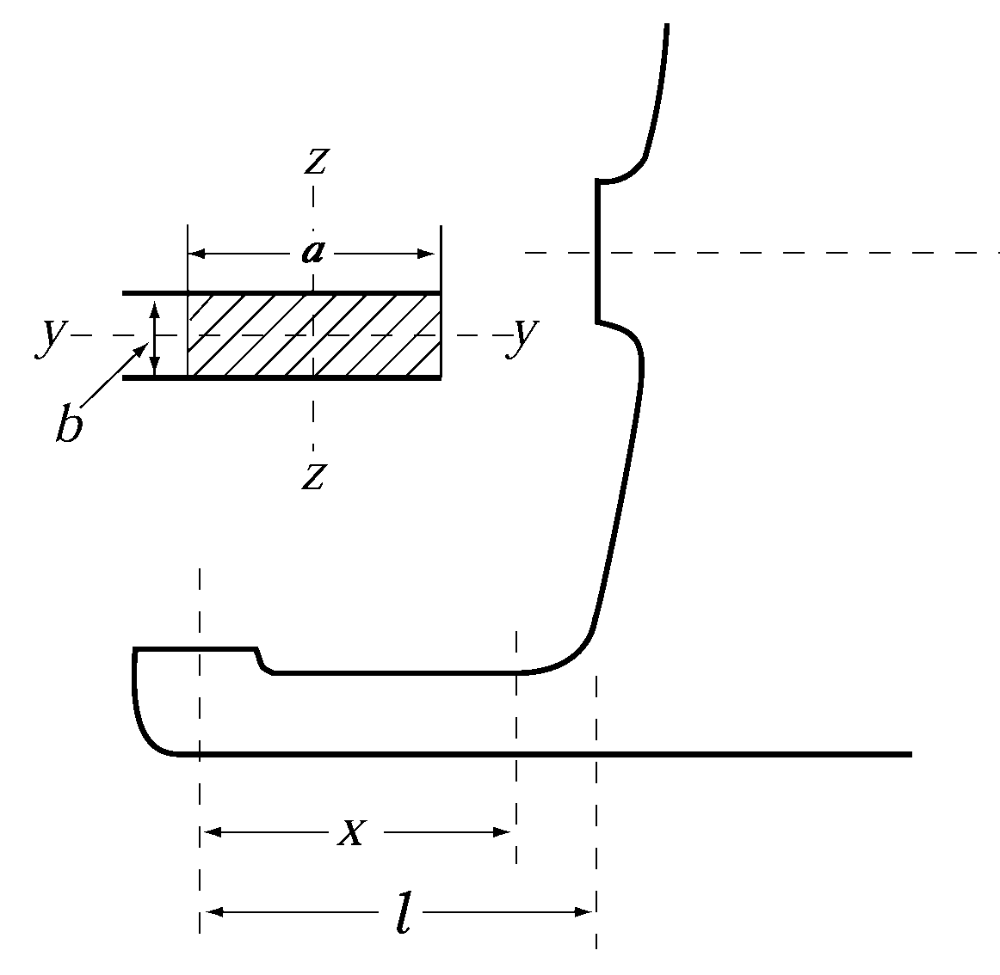

# 제10편 소형강선의 선체구조 및 의장

> 선급 및 강선규칙/적용지침 / RA-10-K / 2025 / KO / Rules

## 제 2 장 선수재 및 선미재

### 제 1 절 선수재

#### 101. 강판선수재 【지침 참조】

- **1.** 만재흘수선 부근의 강판 선수재의 두께 $t$는 다음 식에 의한 것 이상이어야 한다. 또한, 만재흘수선의 상방 및 하방에서는 점차 그 두께를 변화시켜 상단에서는 선수부의 선측외판의 두께와 같게 하고 하단에서는 평판용골의 두께와 같게 한다.
  $t= 0.1L+3.0$(mm)
- **2.** 강판선수재에는 1 m를 넘지 않는 간격으로 리브(rib)를 설치하고, 선단의 곡률 반지름이 큰 부분에는 중심선에 휨보강재를 설치하는 등 적절히 보강하여야 한다.

### 제 2 절 선미재

#### 201. 적용

이 규정은 타주가 없는 선미재에 대하여 적용한다.

#### 202. 프로펠러포스트 【지침 참조】

- **1.** 주강 선미재의 프로펠러포스트 및 강판 선미재의 프로펠러포스트는 선체 선미부의 유선(流線)에 적합한 모양으로 하고, 그 치수는 **표 10.2.1**에 의한 것을 표준으로 한다. 또한, 프로펠러보싱의 하부에서는 프로펠러포스트의 치수를 슈피스의 강도에 적합하도록 적절히 증가시켜야 한다.
- **2.** 프로펠러보싱의 두께 $t$는 다음 식에 의한 것 이상이어야 한다.
  $t=0.23d _{p} +30$(mm)
  $d _{p}$ : **5편 3장 204.**에 의한 프로펠러축의 지름(mm)
- **3.** 주강 선미재 및 강판 선미재의 프로펠러포스트에는 적절한 간격으로 리브를 설치하여야 한다. 또한 곡률반지름이 큰 부분에는 중심선에 휨보강재를 설치하여야 한다.
- **4.** $L$에 비하여 속력이 큰 선박 및 전적으로 예인 작업에 종사하는 선박은 프로펠러포스트 각 부의 치수를 적절하게 증가시켜야 한다.

  **표 10.2.1 프로펠러포스트의 치수**

  | 주강재 | 강판재 |
  | --- | --- |
  | $W=30 \sqrt {L}$ $l=40 \sqrt {L}$ (mm) $T= \frac{3 \sqrt {L}}{\sqrt {K ^{(1)}}}$ (mm) $T _{1} = \frac{3.7 \sqrt {L}}{\sqrt {K ^{(1)}}}$ (mm) $t _{R} =0.6T$ (mm) $R _{\min} =40$ (mm) | $W=37 \sqrt {L}$ $l=53 \sqrt {L}$ (mm) $T= \frac{2.4 \sqrt {L}}{\sqrt {K ^{(2)}}}$ (mm) $t _{R} =0.55T$ (mm) $R _{\min} =40$ (mm)$\) |
  |  |  |
  | (비고) (1) 주강재의 프로펠러포스트를 사용하는 경우에는 **4편 1장 표 4.1.1**의 재료계수 \(K$를 사용한다. (2) 강판재의 프로펠러포스트를 사용하는 경우에는 **4편 1장 표 4.1.2**의 재료계수 $K$를 사용한다. |   |

#### 203. 슈피스 【지침 참조】

- **1.** 슈피스의 각 횡단면의 치수는 **4편 1장 201.**의 타력에 의한 슈피스의 굽힘모멘트 및 전단력을 고려하여 다음 (1)호부터 (4)호에 의한 것 이상이어야 한다.
  - **(1)** 선박의 깊이방향축(Z-축)에 대한 단면계수 $Z _{Z}$는 다음 식에 의한 것 이상이어야 한다.
    $Z _{z} = \frac{MK _{sp}}{80}$(cm^3)
    $M$ : 고려하는 단면에 작용하는 굽힘모멘트 (N-m)
    $M=Bx$ (N-m)
    $M _{\max} = Bl$ (N-m)
    $B$ : 핀틀 베어링이 지지하는 힘(N)으로서 **4편 1장 401.**에 따른다.
    $x$ : 핀틀 베어링의 중앙으로부터 고려하는 부분까지의 거리(m) (**그림 10.2.1** 참조)
    $l$ : 핀틀 베어링의 중앙으로 부터 슈피스의 고착부까지의 거리(m) (**그림 10.2.1** 참조)
    $K _{sp}$ : 슈피스의 재료계수로서 **4편 1장 103.**에 따른다.
    
    **그림 10.2.1 슈피스의 좌표**
  - **(2)** 선박의 너비 방향축(Y-축)에 대한 단면계수 $Z _{y}$는 다음 식에 의한 것 이상이어야 한다.
    $Z _{y} =0.5 Z _{z }$(cm^3)
    $Z _{z}$ : (1)호에 따른다.
  - **(3)** 선박의 너비방향의 합계 단면적 $A _{s}$는 다음 식에 의한 것 이상이어야 한다.
    $A _{s} = \frac{BK _{sp}}{48}$(mm^2)
    $B$ 및 $K _{sp}$ : (1)호에 따른다.
  - **(4)** 슈피스의 전 길이 $l$에 걸쳐서 어느 단면에서도 등가응력 $\sigma _{e}$는 115/$K _{sp}$ (N/mm^2) 이하이어야 하며 이 때 등가응력 $\sigma _{e}$는 다음 식에 의한다.
    $\sigma _{e} = \sqrt {\sigma _{b} ^{2} +3 \tau ^{2}}$(N/mm^2)
    $\sigma _{b}$ : 슈피스에 작용하는 굽힘응력으로 다음 식에 의한다.
    $\sigma _{b} = \frac{M}{Z _{z} (x)}$(N/mm^2)
    $\tau$ : 슈피스에 작용하는 전단응력으로 다음 식에 의한다.
    $\tau = \frac{B}{A _{s} (x)}$(N/mm^2)
    $Z _{z} (x)$ : 고려하는 위치에서의 슈피스의 선박 깊이방향축에 대한 실제 단면계수(cm^3)
    $A _{s} (x)$ : 고려하는 위치에서 슈피스의 선박 너비방향의 실제 단면적 (mm^2)
    $M$ 및 $B$ : (1)호에 따른다.
- **2.** 강판 선미재의 슈피스는 그 중요부를 구성하는 강판의 두께를 프로펠러포스트의 중요부를 구성하는 강판의 두께 이상으로 하고 그 내부에는 프로펠러 포스트의 바로 아래 및 브래킷과 동일 선상 등 적절한 위치에 리브를 설치하여야 한다.

#### 204. 힐피스 【지침 참조】

선미재의 힐피스는 그 길이를 적어도 그 곳의 늑골간격의 3배 이상으로 하고 용골과 견고하게 고착시켜야 한다.

#### 205. 늑판과의 고착부

선미재는 타두재의 직전에서 충분히 상방으로 연장하고 다음 식에 의한 두께 이상의 선미 늑판에 견고하게 고착시켜야 한다. 또한, 선미재 연장부 상단에서는 강성의 급격한 변화를 피하도록 선미늑판을 보강하여야 한다.

#### 206. 거전(Gudgeon) (2019)

- **1.** 거전의 깊이는 핀틀 베어링의 길이 이상이어야 한다.
- **2.** 거전의 두께는 0.25 $d _{po}$이상이어야 하며, **4편 1장 104.**에 규정한 선박에 대하여는 그 두께를 적절하게 증가시켜야 한다.
  $d _{po}$ : 슬리브의 외면에서 측정한 핀틀의 실제 지름 (mm). 
