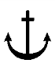

# 제10편 소형강선의 선체구조 및 의장

> 선급 및 강선규칙/적용지침 / RA-10-K / 2025 / KO / Rules

## 제 3 장 종강도

### 제 1 절 일반사항

#### 101. 적용의 특례 【지침 참조】

이 장의 규정을 적용하는 것이 합리적이 아니라고 인정되는 사항에 대하여는 우리 선급이 적절하다고 인정하는 바에 따른다.

#### 102. 강도의 연속성

종강도 부재는 강도의 연속성이 양호하도록 배치하여야 한다.

#### 103. 적하지침서 【지침 참조】

**3편 3장 103.**의 규정에 따른다.

#### 104. 종강도 적하지침기기 【지침 참조】

**3편 3장 104.**의 규정에 따른다.

### 제 2 절 굽힘강도

#### 201. 선박의 중앙부의 굽힘강도

- **1.** 선박의 중앙부에 있어서 선체 횡단면의 단면계수는 **표 10.3.1**의 $Z _{ 1}$의 식에 의한 값 이상이어야 한다. 다만, $L$이 65 m 미만인 선박으로서 우리 선급이 지장이 없다고 인정하는 것에 대하여는 본 항의 규정을 적용하지 않는다.
- **2.** **1** 항의 규정에 관계없이 선박의 중앙부에 있어서 선체 횡단면의 단면계수는 **표 10.3.1**의 $Z _{\min}$의 식에 의한 값 이상이어야 한다.
- **3.** $L$의 중앙에 있어서 선체 횡단면의 단면2차모멘트는 **표 10.3.1**의 $I _{\min}$의 식에 의한 값 이상이어야 하고 선박에 대한 단면2차모멘트의 계산방법은 **203.**에 따른다.
- **4.** **2**항 및 **3**항에 의한 모든 종통부재의 치수는 선박의 중앙부에 있어서 동일하게 유지하여야 한다. 다만, 선박의 종류, 선체형상 및 적하상태를 고려하여 $L$의 중앙에서 선박의 중앙부 양단으로 점차 감소시킬 수 있다.

#### 202. 선박의 중앙부 이외의 굽힘강도

선박 중앙부 이외의 위치에 있어서 선체 굽힘강도는 **5장 2절**의 규정에 적합하여야 한다.

#### 203. 선체 횡단면계수의 계산 【지침 참조】

선체 횡단면계수의 계산은 다음 각 호의 규정에 따른다.

### 제 3 절 좌굴강도

#### 301. 압축좌굴강도

이 절의 규정은 종굽힘에 의한 압축응력이 크게 작용하는 강력갑판 및 선저외판 등에 대하여 적용하며 **3편 3장 4절**의 규정중 압축응력만을 고려한다. 
