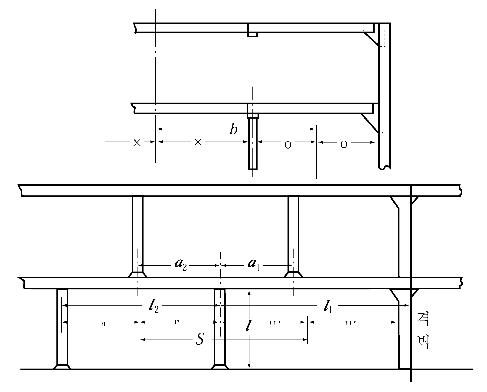

# 제10편 소형강선의 선체구조 및 의장

> 선급 및 강선규칙/적용지침 / RA-10-K / 2025 / KO / Rules

## 제 12 장 필러

### 제 1 절 일반사항

#### 101. 갑판사이의 필러

갑판사이의 필러는 가능한 한 그 상하 필러와 동일 수직선상에 설치하든가 또는 그 하중이 하부의 지지구조에 유효하게 전달될 수 있도록 하여야 한다.

#### 102. 화물창내 필러 【지침 참조】

화물창내 필러는 내용골이나 이중저 거더의 선상 또는 가능한 한 이들의 가까이에 설치하고 그 상하단 고착부는 충분한 강도를 가져야 하며 하중이 유효하게 분산될 수 있는 구조로 하여야 한다.

#### 103. 필러단부의 고착

필러의 상하 양단은 두꺼운 이중판 또는 필요에 따라 브래킷으로써 견고하게 고착시켜야 한다. 또한, 격벽리쎄스, 축로정부 또는 디프탱크 정부 등을 지지하는 필러로서 인장하중을 받는 곳에 대하여는 그 하중에 견딜 수 있도록 견고하게 고착시켜야 한다.

#### 104. 필러가 부착되는 부재의 보강

갑판, 축로 또는 늑골에 필러를 부착할 경우에는 그 부분을 충분히 보강하여야 한다.

### 제 2 절 필러의 치수

#### 201. 필러의 단면적 【지침 참조】

- **1.** 필러의 단면적 $A$는 다음 식에 의한 것 이상이어야 한다.
  $A= \frac{0.223W}{2.72- \frac{l}{k _{0}}}$(cm^2)
  $l$ : 필러의 하단이 부착되는 내저판, 갑판 또는 기타의 구조물 상면에서 그 필러에 의하여 지지되는 갑판보 또는 갑판 거더의 하면까지의 거리(m) (**그림 10.12.1** 참조)
  $k _{0}$ : 필러의 최소 회전반지름(cm)
  $W$ : 필러가 지지하는 갑판하중(kN)으로서 다음 식에 의한 값
  $W=kw _{0} + S b h$(kN)
  $S$ : 해당 필러로부터 전후의 필러 또는 격벽휨보강재 또는 보강거더의 내면에 이르는 각 구간 사이의 중심사이의 거리(m) (**그림 10.12.1** 참조)
  $b$ : 해당 필러로부터 좌우의 필러 또는 늑골의 내면에 이르는 각 구간 사이의 중심 사이의 거리(m) (**그림 10.12.1** 참조)
  $h$ : 그 갑판에 따라 **10장 2절**에 규정하는 갑판하중(kN/m^2)
  $w _{0}$ : 상부갑판사이의 필러가 지지하는 갑판하중(kN)
  $k$ : 해당 필러에서 갑판사이 필러까지의 수평거리 $a _{i}$(m)와 해당 필러에서 필러 또는 격벽까지의 거리 $l _{i }$(m)에 따라 다음 식에 의한 값 (**그림 10.12.1** 참조)
  $k=2 \left( \frac{a _{i}}{l _{j}} \right) ^{3} - 3 \left( \frac{a _{i}}{l _{j}} \right) ^{2} + 1$
  
  **그림 10.12.1** #eqnID-626 **및** #eqnID-627**의 측정방법**
- **2.** 상부 갑판사이 필러가 2개 이상이 있는 경우에는 해당 필러에서 전방의 필러 또는 격벽과의 사이 및 해당 필러에서 후방의 필러 또는 격벽과의 사이에 있는 상부 갑판사이의 각 필러에 대하여 $kw _{0}$를 산정하여 그 합을 1항의 $kw _{0}$로 한다.
- **3.** 해당 필러의 위치와 상부 갑판 필러의 위치가 좌우 서로 다른 경우에 대하여서도 각 항의 규정을 준용한다.
- **4.** 분포하중으로 다룰 수 없는 화물을 적재하는 갑판의 경우, 필러에 의해 지지되는 갑판하중은 각각의 화물에 의한 하중 작용형태를 고려하여 결정하여야 한다. 화물하중이 특정 지점에 집중하중으로 작용하는 경우, 그 집중하중을 상부 갑판사이의 필러가 지지하는 갑판 하중($w _{o }$)으로 간주하여, **1**항과 **2**항의 규정을 적용할 수 있다.

#### 202. 판의 두께

- **1.** 원통형 필러의 판 두께 $t$는 다음 식에 의한 것 이상이어야 한다. 다만, 거주구역에 설치하는 것은 적절히 참작할 수 있다.
  $t=0.022d _{p } +3.6$(mm)
  $d _{p}$ : 필러의 실제 바깥지름(mm)
- **2.** 조립필러의 웨브 및 플랜지의 두께는 국부좌굴에 대하여 충분한 것이어야 한다.

#### 203. 원형 필러의 바깥지름

중실원형 필러 및 원통형 필러의 바깥지름은 50 mm 이상이어야 한다.

#### 204. 디프탱크내에 설치하는 필러

- **1.** 디프탱크내에 설치하는 필러는 원통형 필러를 사용하여서는 아니 된다.
- **2.** 필러의 단면적 $A$는 **201.**에 규정하는 것 또는 다음 식에 의한 것 중 큰 것 이상이어야 한다.
  $a=1.09 S b h$(cm^3)
  $S$ 및 $b$ : **201.**의 규정에 따른다.
  $h$ : 디프탱크 정판에서 넘침관 상단상 2 m까지의 거리에 0.7을 곱한 값(m)

#### 205. 필러 대신에 설치하는 격벽

갑판 거더를 지지하는 격벽은 필러에 대하여 규정하는 것과 동등 이상의 지지력을 갖도록 보강하여야 한다.

#### 206. 필러 대신에 설치하는 위벽

필러 대신에 설치하는 위벽은 갑판하중 및 측압을 충분히 지지할 수 있어야 한다. 
