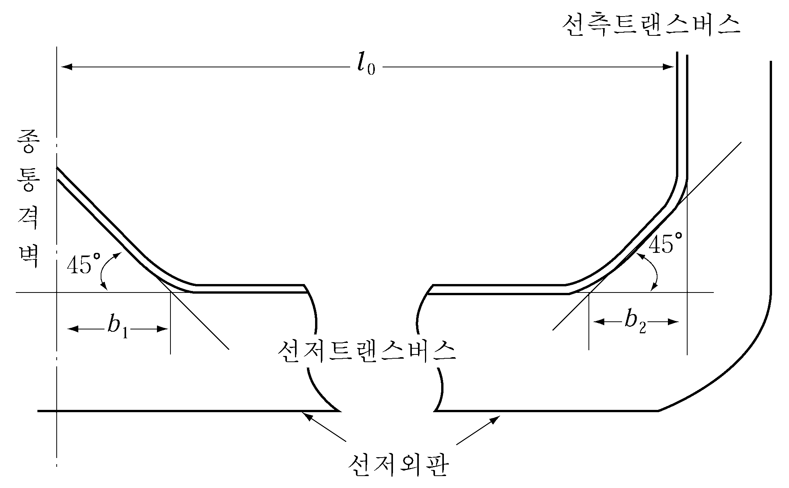
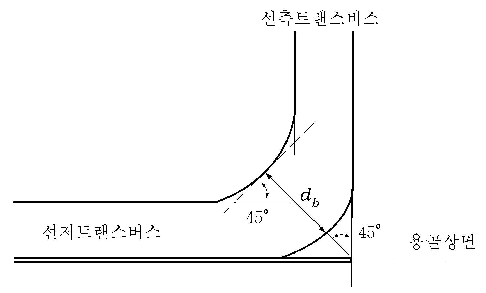

# 제10편 소형강선의 선체구조 및 의장

> 선급 및 강선규칙/적용지침 / RA-10-K / 2025 / KO / Rules

## 제 23 장 유조선

### 제 1 절 일반사항

#### 101. 적용

- **1.** 유조선으로 등록하고자 하는 선박의 구조 및 의장에 대하여는 이 장의 규정에 따른다. 여기에서 유조선이라 함은 원유 또는 37.8°C에 있어서 증기압(절대압력)이 0.28 MPa 미만인 석유정제품 또는 이와 유사한 액상화물을 산적(散積)하여 운송하는 선박을 말한다.
- **2.** 특히 이 장에 규정되어 있지 않은 것에 대하여는 해당 각 장의 관련규정을 유조선에도 적용한다.
- **3.** 이 장의 규정은 선미에 기관을 배치한 1열의 종통격벽을 갖는 1층 갑판선으로서 단저구조이고 종식구조인 선박에 대하여 규정한다.
- **4.** 원유 및 석유정제품 이외에 37.8°C에 있어서 증기압(절대압력)이 0.28 MPa 미만의 액상화물로서 독성, 부식성 등의 위험성이 없거나 원유 및 석유정제품 보다 높은 인화성을 가지지 않는 것을 산적하여 운송하는 선박의 구조, 배치 및 치수에 대하여는 그 화물의 성질에 따라 우리 선급이 적절하다고 인정하는 바에 따른다. **【지침 참조】**
- **5.** 다음의 요건은 각 요건에도 불구하고 해당 선적국의 요건에 따라 적용을 면제할 수 있다.
  - **(1)** **103.**의 **5**항
  - **(2)** **107.**
  - **(3)** **204.**

#### 102. 격벽의 배치 【지침 참조】

화물유를 적재하는 곳에 있어서는 세로 또는 가로방향의 유밀격벽 및 제수격벽을 적절히 배치하여야 한다.

#### 103. 코퍼댐 【지침 참조】

- **1.** 화물유를 적재하는 곳의 전후부 양단 및 화물유를 적재하는 곳과 거주구역과의 사이에는 기밀로 하고 출입하기에 충분한 너비의 코퍼댐(cofferdam)을 설치하여야 한다. 다만, 인화점이 60°C를 넘는 기름을 적재하는 선박에 대하여는 적절히 참작할 수 있다.
- **2.** **1** 항의 코퍼댐은 펌프실로 겸용할 수 있다.
- **3.** 얼리지(ullage)용 개구 및 버터워드(butter worth) 창구는 둘러싸인 구획내에 설치하여서는 아니 된다.
- **4.** 연료유 또는 평형수를 적재하는 장소는 우리 선급의 승인을 받은 경우에는 화물유를 적재하는 장소와의 사이에 설치하여야 할 코퍼댐과 겸용할 수 있다.
- **5.** 총톤수 500톤 이상으로서 인화점이 60°C 이하인 기름을 적재하는 유조선의 구획의 배치 및 격리에 대하여는 **8편 2장 4절**의 규정에도 만족하여야 한다.

#### 104. 기밀격벽 【지침 참조】

모든 화물유 펌프 및 관계통을 설치하는 곳과 난로, 보일러, 추진기관, **6편 1장 9절**의 규정에 의한 것 이외의 전기장치 또는 항상 발화의 원인을 수반하는 기계를 설치하는 곳과의 사이에는 기밀격벽을 설치하여 격리시켜야 한다. 다만, 인화점이 60°C를 넘는 기름을 적재하는 선박에 대하여는 적절히 참작할 수 있다.

#### 105. 통풍장치

- **1.** 화물유탱크에 인접한 장소에는 유효한 통풍장치를 설치하여야 하며 가스가 모일 우려가 있는 각 구조 부재에는 공기구멍을 뚫어야 한다.
- **2.** 화물유탱크 및 펌프실의 위험가스를 제거하기 위하여 기계식통풍 또는 증기에 의한 유효한 환기장치를 설치하여야 한다.
- **3.** **2**항에 규정한 펌프실에는 기계식 통풍장치를 설치하고 통풍기로부터의 배기는 개방갑판상의 안전한 장소로 배출시켜야 하며 그 배기 덕트의 대기측의 개구에는 적절한 철망을 가진 보호스크린을 설치하여야 한다. 이 통풍장치의 용량은 화물증기의 축적 가능성을 최소로 할 수 있도록 충분한 것으로서 적어도 펌프실의 전 용량에 대하여 매시 20회 환기 가능한 것이어야 하며 통풍기는 불꽃을 발생하지 아니하는 구조이어야 한다. 또한, 펌프실에서 빌지가 고이는 장소의 주위에는 배기가 유효하게 행하여질 수 있도록 선저의 늑판 또는 종늑골의 직상 부근에 배기덕트를 설치하여야 한다. 또한, 하부 그레이팅 상방 2 $\mathrm{m}$ 부근의 위치에 비상용 개구를 배기 덕트에 설치하여 그 개구에는 노출갑판 및 하부 그레이팅에서 개폐할 수 있는 댐퍼를 설치하여야 한다.
- **4.** 인화점이 60°C를 초과하는 기름을 적재하는 유조선에서는 **3**항에 정하는 환기회수를 적절히 참작할 수 있다.
- **5.** **1**항에 정한 화물유탱크에 인접하는 장소에 설치하는 통풍기의 구조 및 그 배기덕트의 보호 스크린에 대하여는 **3**항의 규정에 준한다.

#### 106. 통풍용 개구

통풍용의 흡기 및 배기구는 발화원이 있는 둘러싸인 구역에 화물증기가 침입할 가능성 또는 발화의 위험성이 있는 갑판기기의 근처에 화물증기가 집적될 가능성을 최소로 할 수 있는 위치에 설치하여야 한다. 특히, 기관구역의 통풍용 개구는 화물탱크 구역으로부터 가능한 한 후방에 설치하여야 한다.

#### 107. 선루 및 갑판실의 개구

선루 및 갑판실의 개구는 화물증기가 침입할 가능성을 최소로 할 수 있는 위치에 설치하여야 한다. 또한, 선미하역용의 화물관을 배치하는 경우의 선루 및 갑판실의 개구도 이를 충분히 고려하여 배치하여야 한다. 선미루 전단격벽 및 이와 유사한 장소에 설치하는 현창은 고정식으로 하여야 한다. 특히, 총톤수 500톤 이상으로 인화점이 60°C 이하인 기름을 적재하는 유조선의 개구는 **8편 2장 402.**에도 만족하여야 한다.

#### 108. 화물유탱크의 구조부재의 두께 【지침 참조】

화물유를 적재하는 곳의 구조부재의 두께는 다음의 각 호에 따른다.

### 제 2 절 창구 및 상설보행로 및 방수설비

#### 201. 특히 큰 건현을 갖는 선박 【지침 참조】

특히 큰 건현을 갖는 선박에 대하여는 우리 선급이 적절하다고 인정하는 바에 따라 이 규정을 적절히 참작할 수 있다.

#### 202. 화물유탱크에 설치하는 창구 (2018)

- **1.** 창구코밍의 두께는 10 mm 이상으로 하여야 한다. 높이가 760 mm를 넘고 길이가 1.25 m를 넘는 측 코밍 또는 단부 코밍에는 수직 휨보강재를 붙이고 그 코밍의 상단을 적절히 보강하여야 한다.
- **2.** 창구 덮개판은 강 또는 기타의 승인된 재료를 사용하여 제작하고 강재인 경우의 구조는 다음 각 호에 따른다. 강 이외의 재료를 사용하는 경우에는 우리 선급이 적절하다고 인정하는 바에 따른다. **【지침 참조】**
  - **(1)** 덮개판의 두께는 12 mm 이상이어야 한다. 다만, $L$이 60 m 이하인 선박에 대하여는 적절히 참작할 수 있다.
  - **(2)** 창구면적이 1 m^2를 넘고 2.5 m^2 이하인 경우에는 610 mm 이하의 간격으로 배치한 깊이 100 mm의 평강으로 덮개판을 보강하여야 한다. 다만, 덮개판의 두께가 15 mm이상인 경우에는 보강할 필요가 없다.
  - **(3)** 창구면적이 2.5 m^2를 넘는 경우에는 610 mm 이하의 간격으로 배치한 깊이 125 mm의 평강으로 덮개판을 보강하여야 한다.
  - **(4)** 창구코밍에는 원형 창구인 경우에는 457 mm 이하의 간격으로 사각형 창구인 경우에는 각 귀퉁이로부터 230 mm 이내의 곳 및 그 곳으로부터 380 mm 이하의 간격으로 배치한 고정장치를 설치하든가 또는 이와 동등한 효력의 장치를 설치하여 덮개판을 유밀로 잠글 수 있는 구조로 하여야 한다.

#### 203. 기타의 창구 (2021)

화물유 탱크, 평형수 탱크, 연료유 탱크 및 기타의 탱크 이외의 장소의 창구로서 건현갑판, 선수루갑판 및 팽창트렁크 정부의 노출부에 설치하는 것에는 **19장**의 규정에 의한 치수의 강재 풍우밀 덮개를 설치하여야 한다.

#### 204. 상설보행로 및 통로

- **1.** 선교루 또는 중앙갑판실과 선미루 또는 선미갑판실과의 사이에는 선루갑판의 높이에 **4편 4장 503.**의 규정에 의한 상설보행로를 설치하든가 또는 이와 동등 이상 효력의 설비(예 ; 갑판하 통로)를 설치하여야 한다. 상기 이외의 장소 및 선교루 또는 중앙갑판실을 갖지 않는 선박에 있어서 선박의 필요한 작업에 사용되는 모든 장소 상호간에 선원의 왕래를 보호하기 위한 설비는 우리 선급이 적절하다고 인정하는 바에 따른다. **【지침 참조】**
- **2.** 분리된 선원 거주구역의 사이 및 선원 거주구역과 기관구역과의 사이에는 상설보행로로부터 안전하고 충분한 통로를 설치하여야 한다.

#### 205. 방수설비 【지침 참조】

- **1.** 불워크를 갖는 선박은 건현갑판의 노출부 길이의 반 이상에 걸쳐 보호난간을 설치하든가 또는 기타 유효한 방수설비를 갖추어야 한다. 현측후판의 상단은 가능한 한 낮게 하여야 한다.
- **2.** 선루가 트렁크에 의하여 연락되는 경우에는 그 부분의 건현갑판 노출부의 전 길이에 걸쳐 보호난간을 설치하여야 한다.

### 제 3 절 화물구역의 종늑골 및 종갑판보

#### 301. 일반

전용 평형수탱크 또는 보이드스페이스 및 펌프실을 포함하여 화물을 적재하는 곳에 설치하는 종늑골 및 종갑판보에 대하여는 이 규정에 따른다.

#### 302. 치수

- **1.** 선저종늑골 및 만곡부를 포함하는 선측종늑골의 단면계수 $Z$는 **표 10.23.1**의 식에 의한 것 이상이어야 한다.
- **2.** 종갑판보의 단면계수는 **10장 303.**의 규정에 따라 산정한 값의 1.1배 이상으로 하여야 한다.
- **3.** 각 항의 규정에 관계없이 종늑골 및 종갑판보의 단면계수는 창구 정부까지의 거리를 $h$로 하여 디프탱크 격벽의 휨보강재로 간주하여 정한 것 미만으로 하여서는 아니 된다.
- **4.** 종갑판보 및 현측후판에 고착되는 선측 종늑골은 선박의 중앙부에서는 가능한 한 세장비(細長比)가 60을 넘지 않는 치수로 하여야 한다.
- **5.** 종갑판보 및 종늑골에 사용하는 평강은 그 깊이와 두께의 비가 15를 넘지 않는 것이어야 한다.
- **6.** 종갑판보 및 종늑골의 면재의 전 너비 $b$는 다음 식에 의한 것 이상이어야 한다.
  $b=2.2 \sqrt {d _{0} l}$(mm)
  $d _{0}$ : 종갑판보 및 종늑골의 웨브의 깊이(mm)
  $l$ : 트랜스버스의 간격(m)

#### 303. 고착

종늑골 및 종갑판보는 연속구조로 하든가 또는 이들의 끝에서는 유효한 단면적을 갖도록 하고 굽힘에 대한 저항이 충분하도록 고착하여야 한다.

### 제 4 절 화물구역의 종거더 및 트랜스버스

#### 401. 일반

- **1.** 이 절의 규정은 횡격벽 사이 또는 횡격벽에서 제수격벽까지의 사이에 2조에서 5조의 트랜스버스가 대략 같은 간격으로 배치된 구조에 대하여 규정한다.
- **2.** 동일 평면내에 있는 거더는 그 강도 및 강성의 급격한 변화를 피하고, 거더의 단부에는 적절한 크기의 브래킷을 설치하고 충분한 둥금새를 주어야 한다.
- **3.** 거더의 깊이는 늑골, 보 및 휨보강재의 관통부 슬롯 깊이의 2.5배 이상으로 하여야 한다.
- **4.** 거더를 구성하는 면재의 두께 $t$는 웨브의 두께 이상으로 하고 그 너비 $b$는 다음 식에 의한 것 이상이어야 한다.
  $b=2.7 \sqrt {d _{0} l}$(mm)
  $d _{0}$ : 거더의 깊이(mm). 평행한 거더의 경우에는 판면으로부터 면재까지의 깊이(mm)
  $l$ : 거더의 지지점 사이의 거리(m). 다만, 유효한 트리핑 브래킷이 있을 때에는 이것을 지지점으로 간주하여도 좋다.
- **5.** 이 절의 규정은 펌프실 및 중앙부의 전용 평형수탱크 또는 보이드스페이스에도 준용한다.

#### 402. 화물구역의 트랜스버스

- **1.** 선저 트랜스버스의 깊이 $d$ 및 단면계수 $Z$는 각각 다음 식에 의한 것 이상이어야 한다.
  $d=160l _{0 }$ (mm)
  $Z= 9.7 k ^{2} (d+0.026L) S l _{0} ^{2}$ (cm^3)
  $l _{0}$ : 선저 트랜스버스의 전 길이로서, 선측 트랜스버스의 면재 내면으로부터 중심선 격벽까지의 거리(m) (**그림 10.23.1** 참조)
  $S$ : 트랜스버스의 간격(m)
  $k$ : 브래킷에 의한 수정계수로서 다음 식에 의한 것
  $k = 1- \frac{0.65(b _{1} +b _{2} )}{l _{0}}$
  $b _{1}$ 및 $b _{2}$ : 트랜스버스의 각각 양단부에서의 브래킷의 암의 길이(m) (**그림 10.23.1** 참조)
  
  **그림 10.23.1** #eqnID-906 **및** #eqnID-907 **등의 측정법**
- **2.** 선측 트랜스버스의 깊이 $d$ 및 거더의 단면계수 $Z$는 각각 다음 식에 의한 것 이상이어야 한다.
  $d=150 l _{0 }$(mm)
  $Z=8.7 k ^{2} S h l _{0} ^{2}$(cm^3)
  $l _{0}$ : 선측 트랜스버스의 전 길이(m)로서, 선저 트랜스버스 및 갑판 트랜스버스의 면재의 내면 사이의 거리
  $S$ : 트랜스버스의 간격(m)
  $h$ : $l _{0}$의 중앙으로부터 용골상면상 다음 점까지의 거리(m)
  $h=d+0.044L - 0.54$
  $k$ : **1**항에 따른다.
- **3.** 만곡부에 있어서 트랜스버스의 단면계수 $Z$는 다음 식에 의한 것 이상이어야 한다. 다만, 거더의 단면계수를 정함에 있어서 단면 중립축은 거더의 깊이 $d _{b}$ (**그림 10.23.2** 참조)의 중앙에 있는 것으로 한다.
  $Z=7.8S h l _{0} ^{2}$(cm^3)
  $S$, $h$ 및 $l _{0}$ : 각각 **2**항의 규정에 따른다.
  
  **그림 10.23.2** #eqnID-924**의 측정방법**
- **4.** 갑판 트랜스버스의 깊이 $d$ 및 단면계수 $Z$는 각각 다음 식에 의한 것 이상이어야 한다.
  $d=100l _{0}$(mm)
  $Z=1.82k ^{2} \sqrt {L} S l _{0} ^{2}$(cm^3)
  $l _{0}$ : 트랜스버스의 전 거리(m)로서, 선측 트랜스버스의 면재의 내면으로부터 중심선 격벽까지의 거리
  $S$ : 트랜스버스 간격(m)
  $k$ : **1**항에 따른다.
- **5.** 중심선 격벽에 설치하는 트랜스버스는 **2**항의 선측 트랜스버스의 규정을 준용한다. 다만, 각 식의 계수에 0.8을 곱하여 정한 것 이상이어야 한다.

### 제 5 절 트렁크

#### 501. 구조 및 치수

- **1.** 트렁크를 갖는 선박에서는 트렁크내를 가로질러 연속된 갑판 트랜스버스를 설치하는 구조를 표준으로 한다. 이 경우 트렁크에 의해서 지지된다고 간주되는 갑판 트랜스버스는 그 깊이를 0.03 $B$로 할 수 있다.
- **2.** 트랜스버스와 동일 평면내에서의 트렁크에는 보강거더를 설치하여야 한다. 이 보강거더의 단면계수 $Z$는 다음 식에 의한 것 이상이어야 한다.
  $Z = 1.4 \sqrt {L} S l ^{2}$(cm^3)
  $l$ : 트렁크 너비의 반(m)
  $S$ : 보강거더의 간격(m)
- **3.** 트렁크 정판 및 측벽의 두께 $t$는 다음 식에 의한 것 이상이어야 한다.
  $t = 6.5S + 2.0$(mm)
  $S$ : 종 휨보강재의 간격(m)
- **4.** 트렁크 정판 및 측벽에 설치하는 종휨보강재의 단면계수 $Z$는 다음 식에 의한 것 이상이어야 한다.
  $Z = 2 \sqrt {L} S l ^{2 }$(cm^3)
  $l$ : 보강거더의 간격(m)
  $S$ : 종 휨보강재의 간격(m)
- **5.** 트렁크의 양단에서는 강도의 연속성이 이루어지도록 충분히 보강하여야 한다.

### 제 6 절 화물구역의 격벽

#### 601. 격벽판의 두께

- **1.** 격벽판의 두께는 **15장**의 디프탱크 격벽판의 두께에 대한 식에서 $h$를 격벽판의 하단으로부터 창구 정부까지의 거리(m) 및 0.3$\sqrt {L}$ (m) 중에서 큰 것으로 하여 정한 것 이상이어야 한다.
- **2.** 종격벽의 최하부 및 최상부의 판은 그 너비를 0.1 $D$ 이상으로 하고 그 두께 $t$는 각각 다음 식에 의한 것 이상이어야 한다.
  최하부 판 : $t = 1.1S \sqrt {L} +2.5$(mm)
  최상부 판 : $t=0.8S \sqrt {L} +2.5$(mm)
  $S$ : 격벽휨보강재의 간격(m)

#### 602. 격벽휨보강재

- **1.** 격벽휨보강재의 단면계수는 **15장**의 디프탱크 격벽의 격벽휨보강재의 단면계수에 대한 식에서 $h$를 수직 격벽휨보강재일 때에는 $l$의 중앙으로부터, 수평격벽휨보강재일 때에는 상하의 격벽휨보강재 사이의 중앙으로부터 창구 정부까지의 거리(m) 및 0.3$\sqrt {L}$(m) 중 큰 것으로 하여 정한 것 이상이어야 한다.
- **2.** 종격벽의 상부 및 하부에 설치하는 수평 격벽휨보강재는 그 치수를 **1**항에 의한 규정의 치수보다 적절히 증가시켜야 한다.
- **3.** 종격벽의 수평 격벽휨보강재의 면재의 전 너비는 **302.**의 **6**항에 의한 것 이상으로 하여야 한다.

#### 603. 큰 화물유탱크의 격벽 보강 【지침 참조】

큰 화물유탱크의 격벽 보강에 대하여는 우리 선급이 적절하다고 인정하는 바에 따른다.

#### 604. 제수격벽

- **1.** 격벽휨보강재 및 거더는 탱크의 크기 및 개구율을 고려하여 충분한 강도의 것으로 하여야 한다.
- **2.** 격벽판의 두께 $t$는 **108.**의 (4)호에 의한 것 및 다음 식에 의한 것 중 큰 것 이상이어야 한다. 다만, 횡제수격벽의 최하부 판의 두께는 적절히 증가시켜야 한다.
  $t=0.3S \sqrt {L+150} +2.5$(mm)
  $S$ : 격벽휨보강재의 간격(m)
- **3.** 제수격벽의 격벽판의 두께에 대하여는 전단좌굴에 대하여 충분한 고려를 할 것을 권장한다. 
