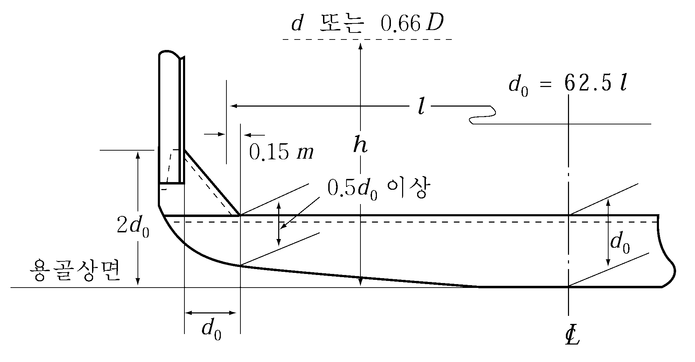

# 제10편 소형강선의 선체구조 및 의장

> 선급 및 강선규칙/적용지침 / RA-10-K / 2025 / KO / Guidance

## 제 11 장 갑판 거더

### 제 1 절 일반사항

#### 103. 구조 【규칙 참조】

**지침 3편 11장 103.**에 따른다.

#### 104. 단부의 고착 【규칙 참조】

**지침 3편 11장 104.**에 따른다.

### 제 2 절 갑판 종거더

#### 201. 단면계수 【규칙 참조】

**규칙 3편 11장 201.**에 따른다. 
