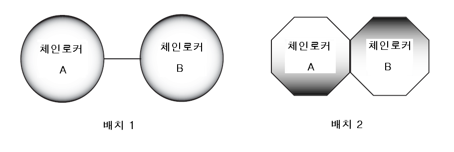

# 제10편 소형강선의 선체구조 및 의장

> 선급 및 강선규칙/적용지침 / RA-10-K / 2025 / KO / Guidance

## 제 14 장 수밀격벽

### 제 1 절 수밀격벽의 배치

#### 101. 선수격벽 【규칙 참조】

**지침 3편 14장 201.**에 따른다.

#### 104. 화물창내 격벽 【규칙 참조】

**지침 3편 14장 204.**에 따른다.

#### 107. 체인로커 【규칙 참조】

- **1.** **규칙 107.**의 **1**항에서의󰡒분리된 체인로커들 사이에 위치한 격벽이나, 체인로커들의 공통 경계를 이루는 격벽󰡓은 **지침 그림 10.14.1**을 참조한다.
  
  **그림 10.14.1 체인로커의 배치**
- **2.** **규칙 107.**의 **4**항에서의󰡒물의 유입을 최소화 할 수 있는 영구적으로 부착된 폐쇄장치󰡓의 허용가능한 배치의 예는 다음과 같다.
  - **(1)** 체인링크를 수용하기 위한 컷아웃(cutout)을 가진 강판
  - **(2)** 잠금위치에서 덮개를 유지하는 라싱 배치를 가진 캔버스 후드

### 제 2 절 수밀격벽의 구조

#### 203. 휨보강재 【규칙 참조】

**지침 3편 14장 303.**에 따른다.

### 제 3 절 수밀문 (2020)}

#### 302. 수밀문의 형식 【규칙 참조】

**지침 3편 14장 402.**에 따른다.

#### 303. 강도와 수밀성 등 【규칙 참조】

**지침 3편 14장 403.**에 따른다.

#### 304. 조작 【규칙 참조】

**지침 3편 14장 404.**에 따른다.

#### 305. 표시장치 【규칙 참조】

**지침 3편 14장 405.**에 따른다.

#### 306. 경보장치 【규칙 참조】

**지침 3편 14장 406.**에 따른다.

#### 307. 전원장치 【규칙 참조】

**지침 3편 14장 407.**에 따른다.

#### 309. 슬라이딩 문 【규칙 참조】

**지침 3편 14장 409.**에 따른다.

#### 311. 시험 【규칙 참조】

**지침 3편 14장 412.**에 따른다. 
