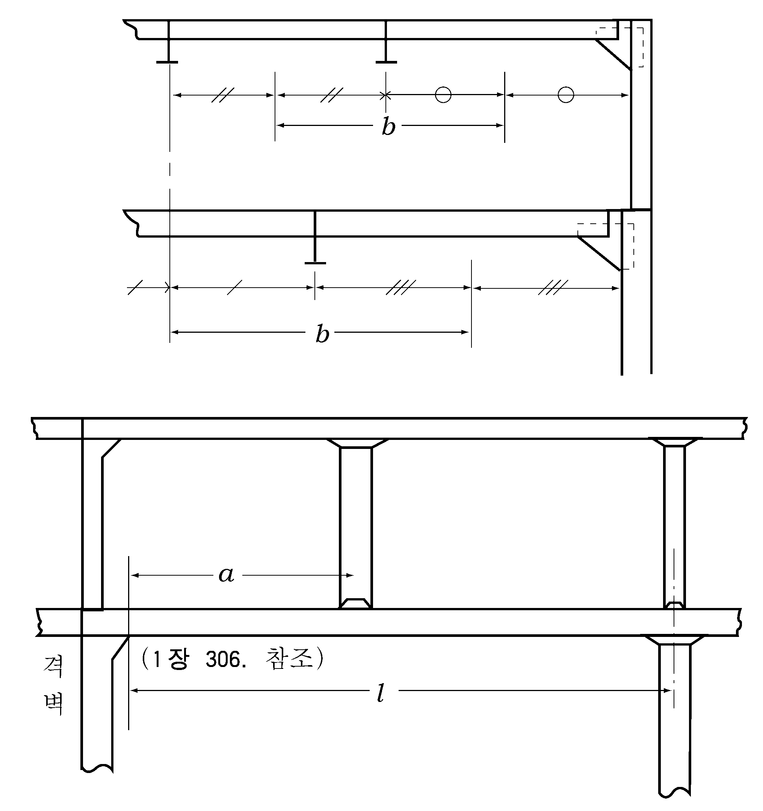

# 제10편 소형강선의 선체구조 및 의장

> 선급 및 강선규칙/적용지침 / RA-10-K / 2025 / KO / Guidance

## 제 21 장 불워크, 방수구, 현창, 통풍통 및 상설보행로

### 제 2 절 방수구 【규칙 참조】

#### 202. 방수구의 면적

**지침 4편 4장 202.**에 따른다.

#### 203. 방수구의 배치

**지침 4편 4장 203.**에 따른다.

### 제 3 절 현창 【규칙 참조】

#### 302. 적용

**지침 4편 4장 303.**에 따른다. 
