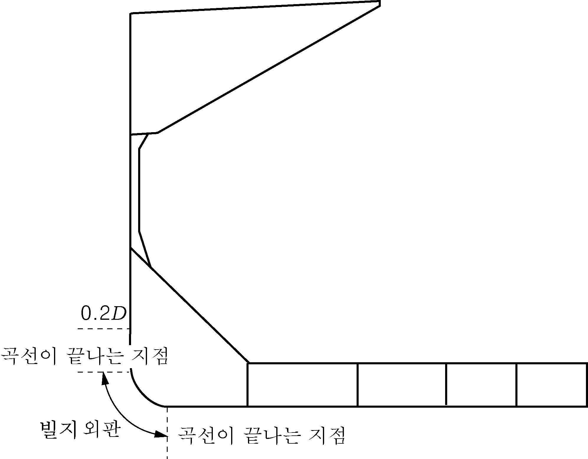
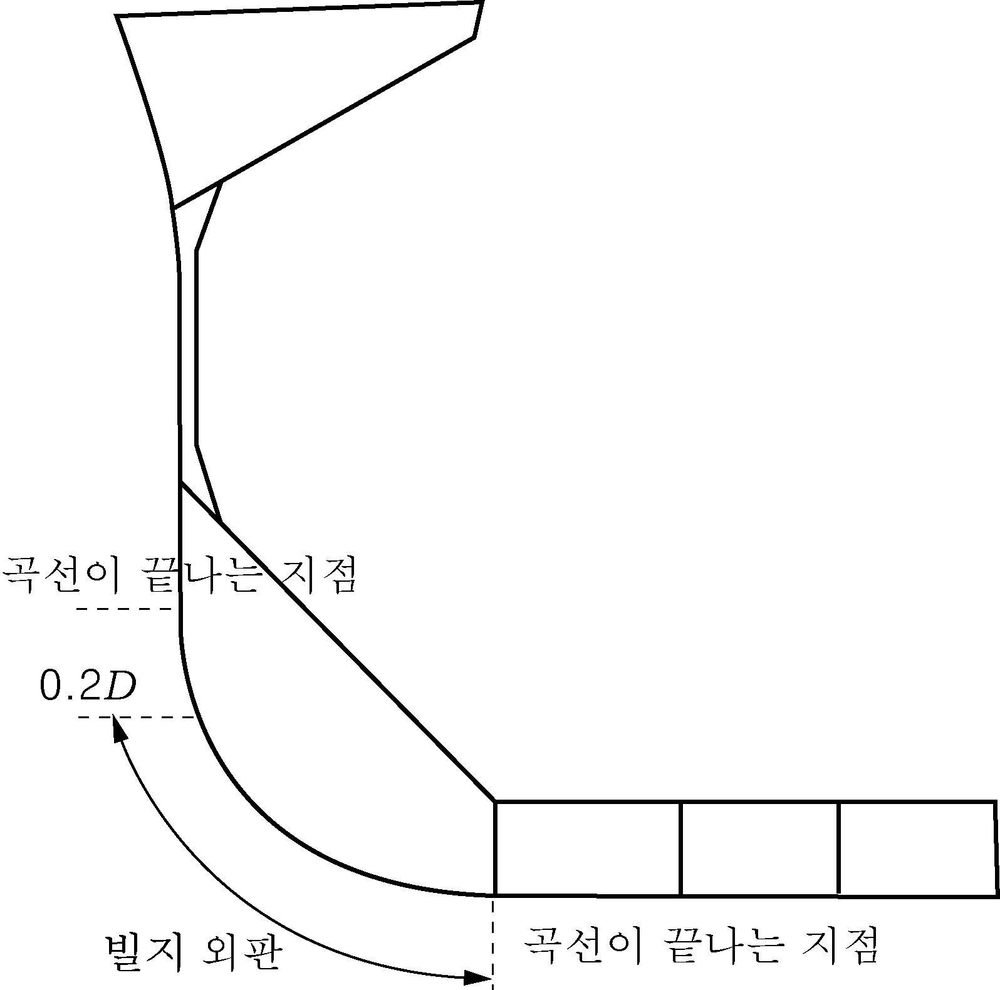

# 제11편 산적화물선 공통구조규칙

> 선급 및 강선규칙/적용지침 / RA-11-K / 2025 / KO / Rules

## 11편 1장 일반원칙

### 제 1 절 적용

#### 1. 일반

- **1.1** 구조 요건
  - **1.1.1** 이 규칙은 우리 선급에 등록하는 선박으로서, 2006년 4월 1일 이후 건조 계약된 선박에 적용한다.
    ㈜ “건조 계약”의 의미는 예정된 선주 및 조선소간의 건조계약 서명일을 의미한다. 이와 관련한 상세한 내용은 IACS PR No.29를 참조.
  - **1.1.2** 이 규칙은 길이(*L*) 90 m이상이고, 항해구역의 제한이 없는 국제항해선으로 단일선측 및 이중선측 산적화물선의 선체구조에 적용한다. 여기서 산적화물선이라 함은 일반적으로 화물구역내에 단일갑판, 이중저, 호퍼탱크, 톱사이드탱크를 가지며, 단일 또는 이중선측으로 건조되어 자항으로 원양항해를 하며, 주로 건화물을 산적의 형태로 운송하는 선박을 의미한다. 단, 광석운반선과 겸용선은 제외한다.
    적어도 한 개 이상의 화물창이 호퍼 탱크 및 톱사이드 탱크를 가지고 있는 하이브리드(hybrid) 산적 화물선도 이 규칙을 적용한다. 이 경우 호퍼탱크 및/혹은 톱사이드 탱크를 가지지 않는 화물창 구조부재의 강도도 이 규칙에 정의된 강도기준을 만족하여야 한다.
  - **1.1.3** 이 규칙에는 아래의 특성을 가지는 모든 형태의 산적화물선에 적용되는 선체구조치수, 배치, 용접, 구조상세, 재료 및 의장품에 대한 IACS의 요건이 포함되어 있다.
    • L < 350 m
    • L / B > 5
    • B / D < 2.5
    • *C_B* ≥ 0.6
  - **1.1.4** 이 규칙 요건은 **3장 1절**의 규정에 적합한 특성을 가지는 강선 선체 용접구조에 적용한다. 또한, 이 규칙은 선루나 소형 창구덮개와 같은 선체구조의 일부를 강 이외의 재료이지만 **3장 1절**에 적합한 재료로 된 용접구조 선박에도 적용한다.
  - **1.1.5** 선체 재료가 **[1.1.4]**에 규정하는 것과 다른 선박 및 새로운 형태 또는 특이한 선체 설계의 선박에 대해서는 이 규칙에 규정된 원칙과 기준을 근거로 개별적으로 고려하여야 한다.
  - **1.1.6** 이 규칙의 적용에 있어서 고려하는 강도 계산용 흘수는 지정된 건현에 상응하는 흘수보다 작아서는 안 된다.
  - **1.1.7** 부재치수를 **7장**에 규정하는 직접강도해석 절차와는 다른 계산절차에 의해 결정하는 경우는 **2절**에 규정하는 적절한 보완문서를 우리 선급에 제출하여야 한다.
- **1.2** 하역장치에 대한 적용
  - **1.2.1** 선체구조와 일체형으로 고려되는 하역장치의 고정부에 있어 선체구조에 직접 영향을 미치는 부분은 선체구조와 용접에 의하여 영구적으로 고착된 구조이어야 한다. (예로서 크레인 페데스탈(pedestal), 마스트, 킹 포스트, 데릭받침대 등이며 크레인, 데릭붐, 로프, 부속품 및 일반적으로 분해 가능한 부분은 제외) 선체에 설치된 마스트의 슈로우드(shroud)는 고정부로서 고려한다.
  - **1.2.2** 하역장치의 고정부 및 선체구조에 고착되는 부분은 해당 설비의 등록여부와는 관계없이 하역장치 규칙의 관련 규정에 따라야 한다.
  - **1.2.3** 고정식 하역장치를 지지하는 구조물 및 이동식 장치를 지지하기 위해 부착되는 구조물은 해당 장치의 작동으로 인해 발생하는 부가하중을 고려하여 설계하여야 한다.
- **1.3** 용접 시공방법에 대한 적용
  - **1.3.1** 이 규칙 요건은 선체구조의 용접부의 준비, 용접 및 검사에도 적용한다. 이 규칙에 규정하지 않는 용접에 관련된 일반적인 요건과 용접시공 및 자격에 관한 인증은 우리 선급의 적절한 요건에 따른다.

#### 2. 규칙 적용

- **2.1** 선박 부분
  - **2.1.1** **일반**
    이 규칙의 적용에 있어서 선박은 다음의 3부분으로 구분한다.
    • 선수부
    • 중앙부
    • 선미부
  - **2.1.2** **선수부**
    선수부는 선수격벽 전방에 위치한 구조를 말한다.
    • 선수창구조
    • 선수재
    또한, 상기에 추가하여 다음을 포함한다.
    • 선수 선저부의 보강부
    • 선수 플레어(flare)의 보강부
  - **2.1.3** **중앙부**
    중앙부는 선수격벽 및 선미격벽 사이의 구조를 말한다.
    선수 선저부 또는 선수 플레어부가 선수격벽 후부까지 연장된 경우에는 선수부로서 취급한다.
  - **2.1.4** **선미부**
    선미부는 선미격벽 후부에 위치하는 구조를 말한다.
- **2.2** 선체구조 각 부분에 적용되는 규칙
  - **2.2.1** 선체구조 각 부분의 치수계산은 **표 1**에 따라 해당 각 장 및 절을 적용한다.

    | 선박 각 부분 | 적용되는 장, 절 |   |
    | --- | --- | --- |
    | 선박 각 부분 | 일반 | 상세 |
    | 선수부 | 1장 2장 3장 4장 5장 9장(1) (9장 1절, 9장 2절 제외) 11장 | 9장 1절 |
    | 중앙부 | 1장 2장 3장 4장 5장 9장(1) (9장 1절, 9장 2절 제외) 11장 | 6장 7장 8장 |
    | 선미부 | 1장 2장 3장 4장 5장 9장(1) (9장 1절, 9장 2절 제외) 11장 | 9장 2절 |
    | (1) **[2.3]** 참조 |   |   |
- **2.3** 선박의 기타 부분에 대한 규칙 적용
  - **2.3.1** 선박의 기타 부분의 치수계산은 **표 2**에 따라 해당 각 장 및 절을 적용한다.

    | 항목 | 적용되는 장, 절 |
    | --- | --- |
    | 기관실 | 9장 3절 |
    | 선루 및 갑판실 | 9장 4절 |
    | 창구덮개 | 9장 5절 |
    | 선체 및 선루의 개구 | 9장 6절 |
    | 타 | 10장 1절 |
    | 불워크 및 보호난간 | 10장 2절 |
    | 의장 | 10장 3절 |

#### 3. 선급 부호

- **3.1** 부기부호 BC-A, BC-B 및 BC-C
  - **3.1.1** 다음 요건은 **[1.1.2]**에 정의하는 선박에 있어서, 길이(*L*) 150 m 이상의 선박에 적용한다.
  - **3.1.2** 이 규정을 적용받는 산적운반선은 다음 부호 중 하나를 지정한다.
    - **a)** BC-A : BC-B의 조건에 추가하여 최대흘수에서 화물밀도가 1.0 $\mathrm{t}/m ^{3}$ 이상인 건화물을 지정된 화물창을 공창으로 하여 화물을 운송하도록 설계된 산적화물선에 부여하는 부호
    - **b)** BC-B : BC-C의 조건에 추가하여 화물밀도가 1.0 $\mathrm{t}/m ^{3}$ 이상의 건화물을 모든 화물창에 균일적재 하여 운송하도록 설계된 산적화물선에 부여하는 부호
    - **c)** BC-C : 화물밀도가 1.0 $\mathrm{t}/m ^{3}$ 미만의 건화물을 운송하도록 설계된 산적화물선에 부여하는 부호
  - **3.1.3** 설계시에 적용된 설계하중조건의 결과에 의하여 운항중에 관찰되는 제한사항들에 대한 보다 상세한 설명을 위하여 추가적인 부호 및 특기사항을 다음과 같이 부여할 수 있다.
    • (최대 화물밀도 ($\mathrm{t}/m ^{3}$)) : 최대 화물밀도가 3.0 $\mathrm{t}/m ^{3}$ 미만인 경우 BC-A 및 BC-B에 대한 부호. (**4장 7절 [2.1]** 참조)
    • (no MP) : **4장 7절 [3.3]**에 규정하는 조건에 따라 여러 항구에서의 적하 및 양하에 대한 설계를 하지 않은 선박에 대한 부호
    • (규정된 공창의 허용조합) : BC-A 부호에 관한 사항 (**4장 7절 [2.1]** 참조)
- **3.2** 부기 부호 GRAB [X]
  - **3.2.1** **적용**
    **[3.1.2]**에 따라 부기 부호 BC-A 또는 BC-B를 갖는 선박은 의무적으로 부기 부호 GRAB[X]를 갖는다. 이러한 선박들의 **12장 1절**에 규정하는 GRAB[X] 요건은 화물이 없는 상태에서 그랩 중량 X가 20톤 이상이어야 한다. 다른 모든 선박에 대한 부기 부호 GRAB[X]는 선택사항이다.
- **3.3** 부기 부호CSR
  - **3.3.1** **적용**
    해당 선급의 선급 부호 및 위에 정의된 부기 부호에 추가하여, 이 규칙에 적합한 선박은 CSR 부호를 부기한다.

### 제 2 절 적합성 검증

#### 1. 일반

- **1.1** 신조선
  - **1.1.1** 신조선에 관한 **[2]**의 승인용 제출도면 및 문서는 선박에 부여되는 선급부호 및 특기사항 혹은 선박의 길이에 대한 관련 기준을 고려하여 이 규칙의 **1장** 내지 **12장**에 규정된 적용 요건에 만족하여야 한다.
  - **1.1.2** 제조중 등록검사를 받는 선박에 대하여 우리 선급은 다음의 사항을 행한다.
    • 규칙에 의해 제출되는 도면 및 문서를 승인
    • 선박 건조에 사용되는 재료 및 의장품의 설계승인 및 조선소에서의 검사
    • 승인도면에 관하여 검사를 실시 또는 부재치수 및 구조가 규칙요건에 적합한지를 확인하는 적절한 증거를 수집
    • 규칙에 따른 시험 및 시운전에 입회
    • 선급 부호를 부여
  - **1.1.3** 제조중 등록검사를 받는 선박의 건조에 사용되는 재료 및 의장품에 대해서는 특별히 규정된 규칙을 적용한다. 이 재료 및 의장품에 대해서는 원칙적으로 해당 규칙의 조항에 따른 설계의 승인 및 제품 검사를 받아야 한다.
  - **1.1.4** 선박 건조 중에 검사원은 다음의 사항을 행한다.
    • 규칙에서 규정하는 선박의 부분에 대한 전반적인 검사를 실시
    • 규칙에서 요구하는 경우 건조 방법 및 절차에 대한 검사
    • 규칙에서 규정하는 항목에 대한 검사
    • 적용되는 경우 또는 필요하다고 판단되는 경우, 시험 및 시운전에 입회
- **1.2** 현존선
  - **1.2.1** 현존선에 대해서는 이 규칙 **13장**의 요건을 만족하여야 한다.

#### 2. 제출 문서

- **2.1** 제조중 등록검사 선박
  - **2.1.1** **승인용 제출 도면 및 문서**
    우리 선급에 제출되어야 할 승인용 도면 및 문서는 **표 1**과 같다. 이것에 추가하여 승인용 또는 정보로서 설계 검토에 필요하다고 판단되는 그 외 다른 도면 및 문서를 요구할 수 있다. 구조도면은 각 부분의 연결 상세를 보여주어야 하며, 일반적인 제조방법, 용접방법 및 열처리를 포함한 설계자료를 명시하여야 한다. (**11장 2절 [1.4]** 참조)

    | 도면 및 문서 | 포함되어야 할 사항 |
    | --- | --- |
    | 중앙단면도, 횡단면도, 외판전개도, 갑판 구조도 및 측면도, 이중저 구조도, 필러 배치도, 늑골 배치도, 디프탱크 및 평형수탱크의 격벽/제수격벽도 | 선급부호, 주요요목, 최소 평형수흘수, 늑골간격, 계약상의 운항속도, 화물밀도, 갑판 및 이중저의 설계하중, 사용재료의 등급, 방식장치, 갑판 및 외판의 개구/개구 보강, 선저 및 외판에 있어서 평행부의 경계, 구조적 보강부 및 불연속부의 상세, 빌지키일 및 선체와의 연결부 상세 |
    | 수밀격벽, 수밀터널 | 개구 및 폐쇄장치를 포함(설치한 경우) |
    | 선수부 구조 |   |
    | 선미부 구조 |   |
    | 기관실 구조, 주기 및 보일러의 기초 | 주기관의 형식, 출력 및 회전수, 기관 및 보일러의 질량 및 무게중심 |
    | 선루 및 갑판실, 기관실 케이싱 | 알루미늄합금의 범위 및 기계적 성질(적용한 경우) |
    | 창구덮개 | 창구덮개에 걸리는 설계하중, 밀폐 및 고정장치, 고정볼트의 형식 및 위치, 하기만재흘수선 및 선수단으로부터의 창구덮개까지의 거리 |
    | 횡추진기 일반배치, 터널구조, 터널 및 선체구조와 횡추진기와의 결합부 (설치된 경우) |   |
    | 불워크 및 방수구 | 건현갑판 및 선루갑판상에서 불워크/방수구의 배치 및 치수 |
    | 창/현창의 배치도 및 구조상세 |   |
    | 배수장치 및 위생장치 |   |
    | 타 및 러더혼 (1) | 최대 전진속도 |
    | 선미재, 선미관, 프로펠러축 및 브래킷 (1) |   |
    | 수밀문 도면 및 제어장치도 | 제어장치, 동력조작 및 폐쇄지시 회로에 관한 전기계통도 |
    | 폭로부의 문 및 해치 |   |
    | 데릭 및 하역설비, 하역설비구조 | 설계하중(힘 및 모우먼트), 선체구조와의 결합부 |
    | 씨 체스트, 스테빌라이저실 |   |
    | 호오스 파이프 |   |
    | 맨홀 배치도 |   |
    | 구획에의 교통 및 탈출 설비도 |   |
    | 통풍 장치도 | 각 구획의 용도, 각 구획의 통풍관 위치 및 높이 |
    | 탱크시험 요목 | 각 구획의 시험방법, 시험파이프의 높이 |
    | 적하지침서, 적하지침기기 | **4장 7절**에 정의된 적하상태 (**4장 8절** 참조) |
    | 의장수계산서 | 계산에 필요한 기하형상, 의장품 목록, 와이어로프의 제조 및 절단강도, 합성섬유로프의 재료, 구조, 절단강도 및 연신율 |
    | (1) 다른 조타 또는 추진장치가 설치된 경우(예로서 노즐식 조타장치 혹은 선회식 추진장치), 관련장치의 배치 및 구조치수를 나타내는 승인용 도면이 제출되어야 한다. 선회식 추진장치에 대해서는 **10장 1절 [11]**을 참조한다. |   |
  - **2.1.2** **참고용 도면 및 문서**
    **[2.1.1]**에 추가하여, 다음의 도면 및 문서가 참고용으로 우리 선급에 제출되어야 한다.
    • 일반 배치도
    • 모든 구획 및 탱크의 용적과 무게중심이 표시된 용적도
    • 선도
    • 배수량 등곡선도
    • 경하중량 분포도
    • 입거 배치도
    또한, 이 규칙의 요건에 따라 설계자가 직접 강도계산을 실시한 경우, 이와 관련한 문서 등도 우리 선급에 제출되어야 한다. (**[3]** 참조)
- **2.2** 선급이 해당 주관청을 대신하는 선박
  - **2.2.1** **승인용 제출 도면 및 문서**
    **[2.1]**의 도면에 추가하여 우리 선급이 별도로 정하는 규칙에 따라 관련 기국요건에서 요구하는 도면이 승인용으로 우리 선급에 제출되어야 한다.

#### 3. 컴퓨터 프로그램

- **3.1** 일반
  - **3.1.1** 구조설계의 자유도를 높이기 위해 컴퓨터 프로그램을 사용한 직접 강도계산을 사용하는 것도 가능하다. (**7장** 참조) 이러한 해석의 목적은 선체구조가 이 규칙 요건에 적합하다는 것을 평가하는데 있다.
- **3.2** 범용 프로그램
  - **3.2.1** 현재 이용 가능한 기술요건에 따라 컴퓨터 프로그램의 선택은 제한이 없으나 **7장** 및/또는 **8장**에서 요구하는 구조 모델과 하중조건에 적합하여야 한다. 프로그램은 이전에 행한 시험용 예제에 의한 비교계산을 통하여 확인할 수 있다. 그러나, 컴퓨터 프로그램에 대하여 일반적인 유효성 승인은 하지 아니한다.
  - **3.2.2** 직접 강도계산은 다음 분야에서 사용하는 것이 가능하다.
    • 전선 구조강도
    • 종강도
    • 보 및 격자구조 해석
    • 상세 구조강도
  - **3.2.3** 이러한 계산을 위한 컴퓨터 모델, 경계조건 및 하중조건은 우리 선급이 승인한 것이어야 하며, 입력 및 출력을 포함한 계산 자료를 제출 하여야 한다. 검토 시 필요에 따라 선급이 자체적인 비교 계산을 수행할 수도 있다.

### 제 3 절 기능적 요건

#### 1. 일반

- **1.1** 적용
  - **1.1.1** 이 절은 다음의 목적에 적합하기 위하여 선박의 설계 및 건조 중에 준수되어야 할 기능에 관한 요건을 규정한다.
- **1.2** 설계 수명
  - **1.2.1** 선박은 정상적으로 운항되고 보수된다면 예상 설계수명 동안 안전하고 환경 친화적인 상태로 있어야 한다. 이때 달리 규정하지 않는 한 그 수명은 25년을 예상한다. 실제의 선박 수명은 선박의 실제 상태 및 보수여하에 따라 또한, 선령의 영향, 특히 피로, 도장 노화, 부식, 쇠모 등에 의해 설계 수명보다 길거나 짧을 수도 있다.
- **1.3** 환경 조건
  - **1.3.1** 선박의 구조설계는 설계수명 동안 북대서양에서 예상되는 환경으로 항해하는 가정을 기본으로 한다. 따라서 구조강도 설계에 관한 기본 원칙에 있어서 통계적 파랑 빈도분포와 같은 대표적인 파랑조건을 고려한다.
- **1.4** 구조 안정성
  - **1.4.1** 선박은 구조붕괴, 침수, 수밀성의 상실에 따른 선박의 전손의 결과로서 발생하는 해상에 있어서 인명 안전 및 해양환경 오염 등의 위험을 최소화하기 위하여 설계 및 건조되고, 또한 운항 및 보수되어야 한다.
- **1.5** 구조 접근성
  - **1.5.1** 선박은 현상검사, 정밀검사 및 두께계측이 가능하도록 모든 내부구조에 대한 적절한 접근설비가 제공되도록 설계 및 건조되어야 한다.
- **1.6** 건조 품질
  - **1.6.1** 목적으로서 선박은 필요에 맞는 승인된 자료를 사용하는 통제된 품질 생산기준에 따라서 건조되어야 한다.

#### 2. 기능적 요건

- **2.1** 일반사항
  - **2.1.1** 선체 구조에 관한 기능적 요건은 **[2.2]** 내지 **[2.6]**에 따른다.
- **2.2** 구조강도
  - **2.2.1** 선박은 비 손상시에 있어서 적절한 적하상태에서 설계수명동안의 환경조건을 견디도록 설계되어야한다. 구조 강도는 좌굴 및 항복에 대하여 충분하다는 것이 검증되어야 한다. 최종강도 계산은 최종 선체거더 굽힘 능력 및 판부재 및 보강재의 최종강도를 포함하는 것 이어야 한다.
  - **2.2.2** 선박은 합리적으로 예상되는 손상 상태, 즉 충돌, 좌초 또는 침수로 인한 파랑 및 내부하중에 견딜 수 있는 충분한 예비강도를 갖도록 설계되어야 한다. 잔존강도 계산에는 영구변형 및 좌굴 후의 거동을 고려한 선체거더에 대한 최종강도까지의 예비치를 고려하여야 한다.
  - **2.2.3** 선박은 대표적인 구조상세가 충분한 피로수명을 갖도록 설계되어야 한다.
- **2.3** 도장
  - **2.3.1** 도장이 요구되는 경우, 도장은 화물창, 탱크, 코퍼댐 등 선박구획의 사용 목적, 재질 및 기타 부식방지시스템 즉, 전기방식 또는 기타 대체방식의 적용과 관련하여 선택되어야 한다. 보호도장은 강재의 선 처리, 도료 선택, 적용 장소 및 유지 방법을 고려한 제조자의 사양에 따라 적용 및 유지되는 것으로, SOLAS 요건, 기국 정부의 규정 및 선주 사양에 만족하여야 한다.
- **2.4** 부식추가
  - **2.4.1** 구조강도 계산에서 규정하는 순 부재치수에 추가되는 부식추가는 운항수명에 대하여 적절한 것 이어야 한다. 부식추가는 부식 방지시스템 즉, 도장, 전기방식 또는 대체방식에 추가하여 내부 및 외부구조의 사용목적 및 폭로된 부식환경 즉 해수, 화물 또는 부식성 환경에 근거하여 지정 되어야 한다.
- **2.5** 접근설비
  - **2.5.1** 현상검사, 정밀검사 및 두께계측을 해야 하는 선박구조는 해당 구조물에 안전하게 접근할 수 있는 설비가 제공되어야 한다. 총톤수가 20,000톤 이상인 산적화물선의 경우 이 접근 설비는 선박구조 접근지침서에 기술되어야 한다. (**SOLAS II-1장 3-6규칙** 참조)
- **2.6** 건조 품질 절차서
  - **2.6.1** 재료의 제조, 조립, 결합 및 용접절차, 강재 표면처리 및 도장에 관한 사양은 선박건조 품질 절차서에 포함되어야 한다.

#### 3. 기타 규정

- **3.1** 국제 법규
  - **3.1.1** 이 규칙의 적용을 받는 설계자, 조선소 및 선주들은 다음의 사항에 주의하여야 한다.
    선박은 IMO에서 국제적으로 규정하고, 이행하는 복잡한 규제의 틀에서 설계, 건조 및 운항되어야 한다. 법 규정은 구명설비, 구획, 복원성, 방화 및 소화설비 등과 같은 선박의 법 규제의 기준으로부터 만들어진다. 이러한 규정은 선박의 운항 및 화물적재에 관한 배치에 영향을 미치고, 따라서 선체 구조설계에도 영향을 줄 수 있다.
    산적 화물선의 강도에 대한 통상적으로 적용되는 주요 국제규정은 다음과 같다.
    • 해상인명안전 협약 (SOLAS)
    • 국제 만재흘수선 협약 (ILLC)
- **3.2** 기국 규정
  - **3.2.1** 적용되는 기국의 규정을 준수하여야 한다.

#### 4. 공사

- **4.1** 제조자가 준수해야 할 요건
  - **4.1.1** 제조공장은 재료, 제조공정, 구조요소 등을 적절히 처리할 수 있는 장비 및 시설을 갖추어야 한다. 제조공장은 충분히 숙련된 인원이 배치되어야 하며, 모든 감독자 및 프로젝트 관리자의 명단과 책임 범위를 우리 선급에 알려야 한다.
- **4.2** 품질관리
  - **4.2.1** 요구되는 또한 적절한 범위까지 제조자는 제조 중 및 제조 완료 후에 모든 선각구조의 구성부분을 검사하여, 그것들의 완성도, 치수의 정확성, 제작기술의 만족도 및 양호한 조선기술의 기준에 적합한지를 확인하여야 한다. 선각구조의 구성부분은 제조공장에 의한 검사 및 수정이 끝나면 구조물은 통상 도장이 안된 상태로, 또한 검사를 위한 적절한 접근설비가 설치된 상태에서 우리 선급 검사원에게 검사를 받아야 한다.
    검사원은 공장에서 적절히 검사하지 않은 구조물에 대해서는 불합격 처리 할 수 있으며, 점검 및 수정 완료 후에 재신청을 하도록 요구할 수 있다.

#### 5. 구조상세

- **5.1** 제조 문서의 상세
  - **5.1.1** 구조물의 품질 및 기능에 관한 모든 주요한 상세는 공작도 등의 제조문서에 기재되어야 한다. 여기에는 부재치수뿐만 아니라 관련되는 경우 표면상태(예: 절단선 및 용접선의 마무리)와 같은 항목도 포함된다. 그리고 검사 및 허용에 관한 요건 및 허용오차와 같은 제조자의 특별한 제작법도 포함된다. 이러한 목적으로 기준(작업표준 혹은 국제표준 등)이 사용되는 경우 우리 선급에 제출하여야 하며, 용접상세는 **11장 2절**을 참조하여야 한다.
    제조문서에 누락되거나 불충분한 상세로 인하여 구조물의 품질이나 기능이 의심스러운 경우 우리선급은 제작자에게 적절한 개선을 요구할 수 있다. 여기에는 도면승인시 요구되지 않았을 경우에도 보충적 또는 추가적인 부분(예를 들면 보강재)이 포함된다.

### 제 4 절 기호 및 정의

#### 1. 주요기호 및 단위

- **1.1**
  - **1.1.1** 달리 규정되지 않는 한, 이 규칙에서 사용된 일반적인 기호 및 단위는 **표 1**과 같다.

    | 기호 | 의미 | 단위 |
    | --- | --- | --- |
    | *A* | 면적 | $\mathrm{m}^{ 2}$ |
    | *A* | 일반 보강재와 1차 지지부재의 단면적 | $\mathrm{cm} ^{2}$ |
    | *B* | 선박의 형너비 (**[2]** 참조) | m |
    | *C* | 계수 | - |
    | *D* | 선박의 깊이 (**[2]** 참조) | m |
    | *E* | 영탄성계수(young's modulus) | $\mathrm{N}/mm ^{2}$ |
    | *F* | 힘 및 집중하중 | kN |
    | *I* | 선체거더 단면 2차 모멘트 | $\mathrm{m} ^{4}$ |
    | *I* | 일반 보강재와 1차 지지부재의 단면 2차모멘트 | $\mathrm{cm} ^{4}$ |
    | *L* | 선박의 길이 (**[2]** 참조) | m |
    | *M* | 굽힘모멘트 | kN.m |
    | *Q* | 전단력 | kN |
    | *S* | 1차 지지부재의 간격 | m |
    | *T* | 선박의 흘수 (**[2]** 참조) | m |
    | *V* | 선박의 속도 | knot |
    | *Z* | 선체거더 단면계수 | $\mathrm{m} ^{3}$ |
    | *a* | 가속도 | $\mathrm{m}/s ^{2}$ |
    | *b* | 부착판의 너비 | m |
    | *b* | 일반 보강재와 1차지지부재 면재의 너비 | mm |
    | *g* | 중력가속도 (**[2]** 참조) | $\mathrm{m}/s ^{2}$ |
    | *h* | 높이 | m |
    | *h* | 일반 보강재와 1차 지지부재 웨브의 높이 | mm |
    | *k* | 재료계수 (**[2]** 참조) | - |
    | l | 일반 보강재와 1차 지지부재의 길이/폭 | m |
    | *m* | 질량 | t |
    | *n* | 항목의 수 | - |
    | *p* | 압력 | $\mathrm{kN}/m ^{ 2}$ |
    | *r* | 반경 | mm |
    | *r* | 판부재의 곡률 또는 빌지반경 | m |
    | *s* | 일반 보강재의 간격 | m |
    | *t* | 두께 | mm |
    | *w* | 일반 보강재와 1차 지지부재의 단면계수 | $\mathrm{cm} ^{3}$ |
    | *x* | 배 길이 방향축의 좌표 (**[4]** 참조) | m |
    | *y* | 배 폭 방향축의 좌표 (**[4]** 참조) | m |
    | *z* | 수직방향축의 좌표 (**[4]** 참조) | m |
    | $\gamma$ | 안전계수 | - |
    | $\delta$ | 처짐/변위 | mm |
    | $\theta$ | 각도 | deg |
    | $\xi$ | 웨이블(Weibull) 형상계수 | - |
    | $\rho$ | 밀도 | $\mathrm{t}/m ^{3}$ |
    | $\sigma$ | 굽힘응력 | $\mathrm{N}/mm ^{2}$ |
    | $\tau$ | 전단응력 | $\mathrm{N}/mm ^{2}$ |

#### 2. 기호

- **2.1** 선박 주요 자료
  - **2.1.1** *L* : **[3.1]**에 따른 규칙길이(m)
    *L_LL* : **[3.2]**에 따른 건현용 길이(m)
    *L_BP* : 가장 깊은 구획 만재흘수선 즉, 적용되는 구획규정에서 허용되는 최대 흘수에 대응하는 흘수선에 있어서 양 수선에서 측정된 수선간의 길이(m)
    *FP_LL* : 건현용 선수수선. 선수수선은 *LLL*의 전부 끝단에서 취하며, 이는 *LLL*이 측정된 수선상의 선수재 전면과 일치한다.
    *AP_LL* : 건현용 선미수선. 선미수선은 *LLL*의 후부 끝단에서 취한다.
    *B* : **[3.4]**에 따른 형 너비(m)
    *D* : **[3.5]**에 따른 형 깊이(m)
    *T* : **[3.6]**에 따른 형 흘수(m)
    *T_S* : 강도계산용 흘수(m)로 최대흘수와 같다. (**1장 1절 [1.1.6]** 참조)
    *T_B* : **4장 7절 [2.2.1]**에 따른 통상 평형수상태에서 선체중앙부의 최소 평형수 흘수(m)
    *T_LC* : 고려하는 적하상태에서 선체중앙부의 흘수(m)
    *∆* : 흘수 T에서의 형배수량 (tonnes, 밀도 $\rho$ = 1.025 $\mathrm{t}/m ^{3}$)
    *C_B* : 방형계수
    $C _{B} = \frac{\Delta }{1.025LBT}$
    *V* : 최대 전진속도(knots)라 함은 최대 운항흘수에서 최대 프로펠러회전수(RPM)와 이에 상응하는 최대 연속정격출력(MCR)으로 운항할 수 있도록 설계된 선박의 최대 속력을 말한다.
    *x, y, z* : 참조 좌표계에 관한 계산점의 X, Y 및 Z 좌표(m)
- **2.2** 재료
  - **2.2.1** *E* : 영탄성계수($\mathrm{N}/mm ^{2}$) 로 다음과 따른다.
    $E =2.06 \times 10 ^{5} \mathrm{N}/mm ^{2}$ : 일반강
    $E =1.95 \times 10 ^{5} \mathrm{N}/mm ^{2}$ : 스테인레스강
    $E =7.0 \times 10 ^{4} \mathrm{N}/mm ^{2}$ : 알루미늄합금강
    *R_eH* : 최소 항복응력($\mathrm{N}/mm ^{2}$)
    *k* : **3장 1절 [2.2]**에서 정의하는 재료계수
    *v* : 포아송 비(poisson’s ratio)로 특별히 규정하지 않는 한 0.3으로 한다.
    *R_m* : 재료의 최종 최소 인장강도($\mathrm{N}/mm ^{2}$)
    *R_Y* : 재료의 공칭 항복응력($\mathrm{N}/mm ^{2}$)으로 특별히 규정하지 않는 한 $\frac{235}{k it} \mathrm{N}/mm ^{2}$으로 한다.
- **2.3** 하중
  - **2.3.1** *g* : 중력 가속도(9.81 $\mathrm{m}/s ^{2}$)
    $\rho$ : 해수 밀도(1.025 $\mathrm{t}/m ^{3}$)
    $\rho _{L}$ : 적재되는 액체의 밀도($\mathrm{t}/m ^{3}$)
    $\rho _{C}$ : 적재되는 건화물의 화물밀도($\mathrm{t}/m ^{3}$)
    *C* : 파에 관한 매개변수로서, 다음에 따른다.
    $C = 10.75- \left( \frac{300-L}{100} \right) ^{1.5}$ : 90 ≤ *L* < 300 m
    $C = 10.75$ : 300 ≤ *L* < 350 m
    *h* : 탱크의 바닥에서 상부까지의(작은 창구는 제외) 수직거리(m)
    *z_TOP* : 기선으로부터 탱크의 최상부까지 수직거리(m)
    평형수 화물창의 경우에는 기준선에서부터 창구코밍 상부까지의 수직거리
    *l_C* : 구획의 길이(m)
    *M_SW* : 고려하는 선체횡단면에 있어서 설계 정수중 굽힘모멘트(kN.m)
    M_SW = M_SW,H : 호깅상태
    M_SW = M_SW,S : 새깅상태
    *M_WV* : 고려하는 선체횡단면에 있어서 파랑중 종 굽힘모멘트(kN.m)
    M_WV = M_WV,H : 호깅상태
    M_WV = M_WV,S : 새깅상태
    *M_WH* : 고려하는 선체횡단면에 있어서 파랑중 횡 굽힘모멘트(kN.m)
    *Q_SW* : 고려하는 선체횡단면에 있어서 설계 정수중 전단력(kN)
    *Q_WV* : 고려하는 선체횡단면에 있어서 수직 파랑 전단력(kN)
    *P_S* : 정수압($\mathrm{kN}/m ^{ 2}$)
    *p_W* : 파랑 변동압($\mathrm{kN}/m ^{ 2}$)
    *p_SF, p_WF* : 침수상태에서의 정수압 및 파랑변동압($\mathrm{kN}/m ^{ 2}$)
    $\sigma _{X}$ : 선체거더 법선응력($\mathrm{N}/mm ^{2}$)
    *a_X, a_Y, a_Z* : X, Y 및 Z축 방향의 가속도($\mathrm{m}/s ^{2}$)
    *T_R* : 횡동요 주기(s)
    $\theta$ : 횡동요 각(deg)
    *T_p* : 종동요 주기(s)
    $\Phi$ : 종동요 각(deg)
    *k_r* : 횡동요 회전반경(m)
    *GM* : 메타센터 높이(m)
    $\lambda$ : 파장(m)
- **2.4** 치수
  - **2.4.1** **선체 거더 치수**
    *I_Y* : 선체 횡단면의 수평중립축에 대한 단면 2차모멘트($\mathrm{m} ^{4}$)
    *I_Z* : 선체 횡단면의 수직중립축에 대한 단면 2차모멘트($\mathrm{m} ^{4}$)
    *Z_AB, Z_AD* : 선저 및 갑판에서의 단면계수($\mathrm{m} ^{3}$)
    *N* : 기선에서 선체 횡단면의 수평 중립축까지의 수직거리(m)
  - **2.4.2** **국부 치수**
    *s* : 스팬의 중앙에서 현(chord)을 따라 측정한 일반 보강재의 간격(m)
    *S* : 스팬의 중앙에서 현(chord)을 따라 측정한 1차 지지부재의 간격(m)
    *l* : 일반 보강재 또는 1차 지지부재의 스팬(m)으로, 현(chord)을 따라 측정한다.
    *l_b* : 브래킷의 길이(m)
    *t_C* : 부식 추가(mm)
    *h_w* : 일반 보강재 또는 1차 지지부재의 웨브 높이(mm)
    *t_w* : 일반 보강재 또는 1차 지지부재의 웨브 순두께(mm)
    *b_f* : 일반 보강재 또는 1차 지지부재의 면재 너비(mm)
    *t_f* : 일반 보강재 또는 1차 지지부재의 면재 순두께(mm)
    *t_p* : 일반 보강재 또는 1차 지지부재 부착판의 순두께(mm)
    *b_P* : 항복강도 평가에 있어서 일반 보강재 또는 1차 지지부재 부착판의 너비(m)
    *A_S* : 폭 s의 부착판을 가진 일반 보강재 또는 1차 지지부재의 순 단면적($\mathrm{cm} ^{2}$)
    *A_Sh* : 일반 보강재 또는 1차 지지부재의 순 전단면적($\mathrm{cm} ^{2}$)
    *I* : 일반 보강재 또는 1차 지지부재의 판에 수평한 중립축에 대한 순 단면 2차모멘트로서 부착판은 제외한 값($\mathrm{cm} ^{4}$)
    *I_p* : 일반 보강재 또는 1차 지지부재의 판부재와의 연결부에 대한 순 단면 극 2차모멘트($\mathrm{cm} ^{4}$)
    *I_w* : 일반 보강재 또는 1차 지지부재의 판부재와의 연결부에 대한 순 관성면적 모멘트($\mathrm{cm} ^{6}$)
    *I_S* : 폭 *s*의 부착판을 가진 일반 보강재 또는 1차 지지부재의 판에 수평한 중립축에 대한 순 단면 2차모멘트($\mathrm{cm} ^{4}$)
    *Z* : 폭 *b_P*의 부착판을 가진 일반 보강재 또는 1차 지지부재의 순 단면계수($\mathrm{cm} ^{3}$)

#### 3. 정의

- **3.1** 길이
  - **3.1.1** 길이 *L*은 하기 만재흘수선에 있어서 선수재 전단으로부터 타주가 있는 선박은 타주의 후단까지, 타주가 없는 선박에서는 타두재의 중심까지의 거리이다. 단, *L*은 하기 만재흘수선상 최대 길이의 96 % 미만이어서는 아니되며, 97 %를 넘을 필요는 없다.
  - **3.1.2** 타두재가 없는 선박(예: 선회식 추진장치 탑재선박)의 길이 *L*은 하기만재흘수선에서 최대 길이의 97 %로 한다.
  - **3.1.3** 일반적이지 않은 선수 또는 선미구조의 선박에서 길이 *L*은 경우에 따라 특별히 고려한다.
- **3.2** 건현용 길이
  - **3.2.1** *Ref. ILLC, as amended (Resolution MSC.143(77) Reg. 3(1,a))*
    건현용 길이 *LLL*은 용골의 상면으로부터 측정한 최소 형깊이 85 % 위치의 흘수선상에서 선수재의 전단으로부터 타두재 중심까지 거리(m)이다. 단, *LLL*은 같은 수선의 전 길이의 96 % 이상이어야 한다.
  - **3.2.2** *Ref. ILLC, as amended (Resolution MSC.143(77) Reg. 3(1,c))*
    선수재의 윤곽선이 최소 형깊이의 85 %에 있는 수선상부에서 오목한 경우, 전 길이의 최전단부와 선수재의 전면은 각각 선수재 윤곽선의(그 흘수선 상부의) 최후부 지점에서 그 흘수선에 수직으로 내린 곳으로 하여야 한다.
    
    그림 1 오목한 선수재 윤곽
- **3.3** 길이 L의 끝단 및 선체 중앙
  - **3.3.1** **선수단**
    길이 *L*의 선수단(FE)은 선수재 전면에서 하기만재흘수선에 대한 수직선이다. (**그림 2** 참조)
    
    그림 2 선수미단 및 중앙부
    길이 *L*의 선미단(AE)은 선수단에서 선미방향으로 *L* 거리에 있는 수선에 대한 수직선이다. (**그림 2** 참조)
  - **3.3.2** **선체 중앙**
    중앙은 선수단에서 선미방향으로 0.5 *L* 거리에 있는 수선에 대한 수직선이다.
  - **3.3.3** **중앙부**
    선박의 중앙부는 달리 규정되지 않는 한 중앙에서 0.4 *L* 범위이다.
- **3.4** 형폭
  - **3.4.1** 형폭 *B*는 폭로갑판하의 중앙에서 측정한 최대 형폭(m)이다.
- **3.5** 깊이 (최소 형깊이)
  - **3.5.1** 깊이 *D*는 중앙 횡단면에서 수직으로 측정한 기선으로부터 최상층 전통갑판의 선측에서 갑판보의 상부까지 거리(m)이다.
- **3.6** 형 흘수
  - **3.6.1** 형 흘수 *T*는 중앙 횡단면에서 수직으로 측정한 기선으로부터 하기 만재흘수선까지 거리(m)이다.
- **3.7** 경하중량
  - **3.7.1** 경하중량은 화물, 연료, 윤활유, 평형수, 청수 및 용수, 소모품 및 승객과 선원 및 그들의 소지품을 제외한 배수량(ton)이다.
- **3.8** 재화중량
  - **3.8.1** 재화중량은 비중 $\rho = 1.025 \mathrm{t}/m ^{3}$의 해수 중 하기 만재배수량과 경하중량과의 차이(ton)이다.
- **3.9** 건현갑판
  - **3.9.1** *Ref. ILLC, as amended (Resolution MSC. 143(77) Reg. 3(9))*
    건현갑판은 1966 국제만재흘수선협약의 제3규칙의 규정에 따른다.
- **3.10** 격벽갑판

#### 3.10.1

*Ref. SOLAS Reg.II-1/2.5*
격벽갑판은 선수미격벽을 제외한 수밀 횡격벽이 도달하는 유효한 구조의 최상층 갑판이다**.**

- **3.11** 강력갑판

#### 3.11.1

강력갑판은 선박 길이에 걸쳐 외판에 달하는 최상층 연속갑판이다.

- **3.12** 선루

#### 3.12.1

**일반**
*Ref. ILLC. As amended (Resolution MSC.143(77) Reg. 3(10,a))*
선루라 함은 건현갑판상에 설치된 상부에 갑판을 가지고 있는 구조물로서 선측에서 선측까지 달하거나 선측외판에서 너비(*B*)의 4 %를 넘지 아니하는 위치에 그 측판을 가지고 있는 것을 말한다.

#### 3.12.2

**폐위 및 개방 선루**
선루는 다음과 같이 분류한다.
• 폐위로 인정되는 경우는
(1) **9장 4절**의 요건에 적합한 선수격벽, 선측격벽 및 선미격벽에 의해 폐위되거나,
(2) 전단, 측면 및 후단의 모든 개구에 효율적인 풍우 및 폐쇄장치가 부착된 경우이다.
• 폐위되지 않은 경우, 개방으로 간주한다.

- **3.13** 선수루

#### 3.13.1

*Ref. ILLC, as amended (Resolution MSC.143(77) Reg. 3(10,g))*
선수루라 함은 선수수선으로부터 선미수선의 전방의 위치까지 연장되는 선루를 말한다. 선수루는 선수수선의 전방에 있는 지점으로부터 시작될 수도 있다.

- **3.14** 저 선미루

#### 3.14.1

*Ref. ILLC, as amended (Resolution MSC.143(77) Reg. 3(10,i))*
저 선미루라 함은 선미수선으로부터 앞쪽으로 연장되어 있으며, 일반적으로 정상적인 선루보다 낮은 높이의 선루로서 수밀이 완벽한 전부격벽(유효한 안덮개가 설치된 비개방형 현창 및 볼트로 폐쇄되는 맨홀커버)을 갖는다.(**그림 3** 참조) 전부격벽이 문 또는 출입구의 설치로 인하여 수밀이 완벽하지 않는 경우, 이는 선미루로 간주된다.

그림 3 저 선미루

- **3.15** 갑판실

#### 3.15.1

갑판실은 건현갑판 또는 그 상부에 위치한 선루를 제외한 갑판을 갖는 구조를 말한다.

- **3.16** 트렁크

#### 3.16.1

트렁크는 갑판실과 비슷한 갑판을 갖는 구조이나 하부갑판이 없는 구조를 말한다.

- **3.17** 제수격벽
  제수격벽이라 함은 탱크안에 설치된 구멍이 뚫리거나 혹은 부분적인 격벽을 말한다.
- **3.18** 선루의 표준 높이

#### 3.18.1

*Ref. ILLC, as amended (Resolution MSC.143(77) Reg. 33)*
선루의 표준 높이는 **표 2**와 같다.

| 건현길이 $L_{ LL}$ (m) | 표준높이 $h_{ S}$ (m) |   |
| --- | --- | --- |
| 건현길이 $L_{ LL}$ (m) | 저선미루 | 기타 모든 선루 |
| 90 < $L_{ LL}$ < 125 | 0.3 + 0.012 $L_{ LL}$ | 1.05 + 0.01 $L_{ LL}$ |
| $L_{ LL}$ ≥ 125 | 1.80 | 2.30 |

- **3.19** A형 및 B형 선박

#### 3.19.1

**A형 선박**
*Ref. ILLC, as amended (Resolution MSC.143(77) Reg. 27.1)*
A형 선박이란 다음과 같은 선박을 말한다.
• 산적 액체 화물만을 운송하도록 설계된 것 ;
• 수밀 개스킷이 붙은 강 또는 동등 재료로 된 덮개에 의하여 폐쇄되고 갑판에서 화물구획으로 통하는 작은 출입구만이 존재하여 노출된 갑판이 고도의 완전성을 가진 것;
• 적재된 화물구획의 낮은 침수율을 가진 것.
A형 선박은 1966 국제 만재흘수선 협약의 요건에 따라 건현이 지정되어야 한다.

#### 3.19.2

**B형 선박**
*Ref. ILLC, as amended (Resolution MSC.143(77) Reg. 27.5)*
**[3.19.1]**에 규정된 A형 선박에 관한 규정에 해당하지 아니하는 모든 선박은 B형 선박으로 간주하여야 한다. B형 선박은 1966 국제 만재흘수선 협약의 요건에 따라 건현이 지정되어야 한다.

#### 3.19.3

**B-60형 선박**
*Ref. ILLC, as amended (Resolution MSC.143(77) Reg. 27.9)*
B-60형 선박은 1966 국제 만재흘수선협약의 적용 요건에 따라 해당 선박 길이에 대한 “B” 및 “A” 표 값과의 차의 60 %까지 감소시켜 건현이 지정된 길이 100 m 이상의 B형 선박이다.

#### 3.19.4

**B-100형 선박**
*Ref. ILLC, as amended (Resolution MSC.143(77) Reg. 27.10)*
B-100형 선박은 1966 국제 만재흘수선협약의 적용 요건에 따라 해당 선박 길이에 대한 “B” 및 “A” 표 값과의 차의 100 %까지 감소시켜 건현이 지정된 길이 100 m이상의 B형 선박이다.

- **3.20** 위치 1 및 위치 2

#### 3.20.1

**위치 1**
*Ref. ILLC, as amended (Resolution MSC.143(77) Reg. 13)*
위치 1은 다음을 포함한다.
• 노출 건현갑판 및 저선미루 갑판상
• 용골상면에서 측정된 최소 형깊이의 85 %인 수선 상의 선수수선으로 부터 0.25 $L_{ LL}$지점의 전방에 위치하는 노출된 선루갑판상

#### 3.20.2

**위치 2**
*Ref. ILLC, as amended (Resolution MSC.143(77) Reg. 13)*
위치 2는 다음을 포함한다.
• 용골상면에서 측정한 최소 형깊이의 85 %인 수선 상의 선수수선으로부터 0.25 $L_{ LL}$의 후방에 위치하고, 건현갑판 상방으로 최소한 표준 선루높이에 있는 노출된 선루갑판상
• 용골상면에서 측정한 최소 형깊이의 85 %인 수선 상의 선수수선으로부터 0.25 $L_{ LL}$의 전방에 위치하고, 건현갑판 상방으로 최소한 2배의 표준 선루높이에 있는 노출된 선루갑판상

- **3.21** 단일선측 및 이중선측구조

#### 3.21.1

**단일선측구조**
단일선측구조의 화물창은 내저판(또는 설치되어 있는 경우 호퍼탱크판)과 갑판(또는 설치되어 있는 경우 톱사이드탱크판) 사이의 선측외판으로 경계를 이룬다.

#### 3.21.2

**이중선측구조**
이중선측구조의 화물창은 이중선측(설치되어 있는 경우, 호퍼탱크와 톱사이드탱크를 포함하는)으로 경계를 이룬다.

- **3.22** 빌지

#### 3.22.1

**빌지외판**
빌지외판은 선저외판에서 선측외판 사이의 곡판으로 다음과 같이 취한다:
• 선박의 원통형 부분 범위 이내(**그림 4** 참조):
빌지 저부의 곡선이 시작되는 부위에서부터 빌지 상부의 곡선이 끝나는 지점까지
• 선박의 원통형 부분 범위 이외(**그림 5** 참조):
빌지 저부의 곡선이 시작되는 부위에서부터 다음 중 낮은 지점까지
- 기선/국부 중심선 상부 0.2 *D에 위치한* 선측외판의 한 지점
- 빌지 상부의 곡선이 끝나는 지점

그림 4 선체의 원통형 부분 범위 이내 만곡부 외판의 수직범위

그림 5 선체의 원통형 부분 범위 이외 만곡부 외판의 수직범위

#### 4. 기준 좌표계

- **4.1**
  - **4.1.1** 선박의 형상, 운동, 가속도 및 하중은 다음의 우수계 좌표계에 따른다. (**그림 6** 참조)
    • 원점 : 선박의 종방향 대칭면, *L*의 선미단 및 기준선의 교차점
    • X 축 : 선수방향이 양의 값인 종축
    • Y 축 : 좌현방향이 양의 값인 횡축
    • Z 축 : 상방이 양의 값인 수직축
    
    그림 6 기준 좌표계
  - **4.1.2** 회전은 X, Y 및 Z축에 대해서 반시계 방향을 양의 값으로 한다. 
