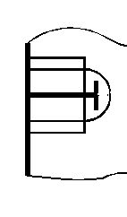

# 제11편 산적화물선 공통구조규칙

> 선급 및 강선규칙/적용지침 / RA-11-K / 2025 / KO / Rules

## 11편 3장 구조설계 원칙

### 제 1 절 재료

#### 1. 일반

- **1.1** 재료의 규격
  - **1.1.1** 이 절의 규정은 **규칙 2편 1장**의 요건에 적합한 강재를 사용하여 용접으로 건조하는 선박에 대하여 적용한다.
  - **1.1.2** **규칙 2편 1장**에 규정한 규격과 다른 재료에 대하여는 그 재료의 제조, 화학성분, 기계적 성질 및 용접 등에 관한 상세를 우리 선급에 제출하여 승인을 받아서 사용할 수 있다.
- **1.2** 재료시험
  - **1.2.1** 재료는 특별히 규정한 것을 제외하고는 **규칙 2편 1장**의 관련 규정에 따라 시험되어야 한다.
- **1.3** 제조법
  - **1.3.1** 이 절의 요건은 용접, 냉간 및 열간 제조과정이 IACS UR W에 정의된 현행 건전한 작업관행 및 재료에 대한 우리선급 요건에 적합하게 수행됨을 전제로 한다. 특히,
    • 모재 및 용접방법은 재료의 사용 용도에 따라 규정된 제한 조건을 따라야 한다.
    • 용접 전에 예열이 요구될 수 있다.
    • 용접, 냉간가공 또는 열간가공 후에 적절한 열처리 과정이 요구될 수 있다.

#### 2. 선체 구조용 강재

- **2.1** 일반
  - **2.1.1** 선박의 건조에 현재 사용되는 강재의 기계적 성질은 **표 1**에 따른다.

    | 재료기호 ($t$ ≤ 100 mm) | 최소 항복응력 $R_{ eH}$($\mathrm{N}/mm ^{ 2}$) | 인장강도 $R _{m}$($\mathrm{N}/mm ^{ 2}$) |
    | --- | --- | --- |
    | A, B, D, E | 235 | 400-520 |
    | AH32, DH32, EH32, FH32 | 315 | 440-570 |
    | AH36, DH36, EH36, FH36 | 355 | 490-630 |
    | AH40, DH40, EH40, FH40 | 390 | 510-660 |
  - **2.1.2** 선체구조에 고장력 강재를 사용하고자 할 때에는 사용범위, 위치, 재질 및 치수를 명기한 도면을 제출하여 우리 선급의 승인을 받아야 한다.
  - **2.1.3** **표 1**에 규정한 것 이외의 고장력 강재를 사용하고자 할 때에는 건별로 우리 선급의 승인을 받아야 한다.
  - **2.1.4** 선체구조에 최소 항복응력($R_{ eH}$) 235 $\mathrm{N}/mm ^{2}$이외의 강재를 사용하는 경우, 구조부재의 치수는 **[2.2]**에서 정의되는 재료계수 $k$를 고려해서 결정하여야 한다.
  - **2.1.5** 선박에는 선체구조에 사용된 강재의 종류와 재료기호를 나타내는 도면이 비치되어야 한다. **표 1**에 규정한 것 이외의 강재가 사용된 경우, 당해 강재의 화학적 및 기계적 성질과 작업기준 또는 권고사항이 앞에 언급한 도면과 함께 비치되어야 한다.
- **2.2** 재료계수 $k$
  - **2.2.1** 별도로 규정되지 않는 한, 선체 구조부재의 치수를 결정하기 위한 연강 및 고장력강의 재료계수 $k$는 최소 항복응력($R_{ eH}$)에 의한 **표 2**에 따른다.
    최소 항복응력($R_{ eH}$)이 **표 2**의 중간에 해당하는 경우, 재료계수 $k$는 선형보간법에 의한다. 항복응력이 390 $\mathrm{N}/mm ^{2}$보다 큰 강재를 사용하는 경우, 사안별로 우리 선급이 고려한다.

    | 최소 항복응력 $R_{ eH}$ ($\mathrm{N}/mm ^{2}$) | $k$ |
    | --- | --- |
    | 235 | 1.0 |
    | 315 | 0.78 |
    | 355 | 0.72 |
    | 390 | 0.68 |
- **2.3** 강재의 사용구분
  - **2.3.1** 여러 가지 구조부재에 사용되는 강재는 **표 4-1**(선박의 길이가 150 m 및 250 m 이상, BC-A 및 BC-B 선박의 추가요건은 **표 4-2** 내지 **표 4-4**에 규정되어 있음.)에 규정한 재료의 사용등급(class and grades)에 대하여 **표 3**에 규정한 I, II 및 III등급에 해당하는 강재보다 낮은 등급의 것이어서는 아니된다.
    **표 4-1** 내지 **표 4-4**에 언급되지 않은 강도부재에 대하여는 A급 또는 AH급 강을 사용할 수 있다.

    | 급별 | I |   | II |   | III |   |
    | --- | --- | --- | --- | --- | --- | --- |
    | 건조두께 (mm) | NSS | HSS | NSS | HSS | NSS | HSS |
    | $t$ ≤ 15 | A | AH | A | AH | A | AH |
    | 15 < $t$ ≤ 20 | A | AH | A | AH | B | AH |
    | 20 < $t$ ≤ 25 | A | AH | B | AH | D | DH |
    | 25 < $t$ ≤ 30 | A | AH | D | DH | D | DH |
    | 30 < $t$ ≤ 35 | B | AH | D | DH | E | EH |
    | 35 < $t$ ≤ 40 | B | AH | D | DH | E | EH |
    | 40 < $t$ ≤ 50 | D | DH | E | EH | E | EH |
    | (비고) NSS : 연강, HSS : 고장력강 |   |   |   |   |   |   |

    **표 4 : (void)**

    | 구조부재 구분 | 강재의 급별 |
    | --- | --- |
    | ○ 2차 (secondary): A1 종통격벽의 강판(1차 강도부재 제외) A2 강력갑판이 아닌 노출갑판(1차 강도부재 및 특수부재 제외) A3 선측외판 | - 중앙부 0.4 $L$ 이내 : I - 중앙부 0.4 $L$ 이외 : A/AH |
    | ○ 1차 (primary): B1 선저외판(평판용골 포함) B2 강력갑판(특수부재 제외) B3 강력갑판 상부의 종통부재(해치코밍 제외) B4 강력갑판에 접합되는 종통격벽판 B5 강력갑판에 접합되는 톱 사이드 탱크판 (해치사이드 거더) 및 경사판의 최상부판 | - 중앙부 0.4 $L$ 이내 : II - 중앙부 0.4 $L$ 이외 : A/AH |
    | ○ 특수(special): C1 강력갑판의 현측후판(1) C2 강력갑판의 스트링거판(1) C3 이중 선측 구조를 구성하는 종통격벽에 접합되는 갑판의 강판은 제외 한 종통격벽에 접합되는 갑판의 강판(1) | - 중앙부 0.4 $L$ 이내 : III - 중앙부 0.4 $L$ 이외 : II - 중앙부 0.6 $L$ 이외 : I |
    | C5 화물 창구 모서리부의 강판 (산적화물선, 광석운반선, 겸용선 및 이와 유사한 화물창구 형상을 갖는 선박) | - 중앙부 0.6 $L$ 이내 : III - 기타구역 : II |
    | C6 만곡부외판 (이중저를 가진 $L$ 이 150 m 미만인 선박)(1) | - 중앙부 0.6 $L$ 이내 : II - 중앙부 0.6 $L$ 이외 : I |
    | C7 만곡부외판(그 외 선박)(1) | - 중앙부 0.4 $L$ 이내 : III - 중앙부 0.4 $L$ 이외 : II - 중앙부 0.6 $L$ 이외 : I |
    | C8 길이가 0.15 $L$ 이상인 종방향 해치코밍 C9 종방향 해치코밍의 끝단 브래킷 및 갑판실 연결부분(2) | - 중앙부 0.4 $L$ 이내 : III - 중앙부 0.4 $L$ 이외 : II - 중앙부 0.6 $L$ 이외 : I - D/DH 이상 |
    | (비고) (1) 선박의 중앙부 0.4 $L$ 사이에 Ⅲ급의 강판 사용이 요구되는 경우, 1조의 강판(single strake)의 너비는 “$5L+800$(mm)”이상이어야 하며 1800 mm를 넘을 필요는 없다. (2) 0.15 $L$ 보다 긴 종방향 해치코밍을 가지는 산적화물선에 적용한다. |   |

    | 구조부재 구분 | 강재의 등급 |
    | --- | --- |
    | 강력갑판의 종강도 부재 | 중앙부 0.4 $L$ 이내 : B/AH급 |
    | 강력갑판 상부의 종통부재 | 중앙부 0.4 $L$ 이내 : B/AH급 |
    | 선저와 강력갑판 사이에 내부 종통격벽이 없는 선박의 단일 선측 외판 강판(single side strake) | 화물구역 내 : B/AH급 |

    | 구조부재 구분 | 강재의 등급 |
    | --- | --- |
    | 강력갑판의 현측후판(1) | 중앙부 0.4 $L$ 이내 : E/EH급 |
    | 강력갑판의 스트링거판(1) | 중앙부 0.4 $L$ 이내 : E/EH급 |
    | 만곡부외판(1) | 중앙부 0.4 $L$ 이내 : D/DH급 |
    | (비고) (1) 선박의 중앙부 0.4$L$ 사이에 E/EH급의 강판 사용이 요구되는 경우, 1조의 강판(single strake)의 너비는 “$5L+800$(mm)”이상이어야 하며 1800 mm 를 넘을 필요는 없다. |   |

    | 구조부재 구분 | 강재의 등급 |
    | --- | --- |
    | 선측 늑골의 하부 브래킷(1), (2) | D/DH급 |
    | 빌지호퍼 경사판 또는 내저판과 외판과의 교차점의 상·하방 0.125 $l$ 위치의 두 점 사이를 전체 또는 일부 포함하는 선체외판(1) | D/DH급 |
    | (비고) (1) 여기서 ‘하부 브래킷’이란 빌지호퍼 경사판 또는 내저판과 외판과의 교차점의 상방 0.125 $l$ 위치까지의 선측 늑골의 하부의 웨브 및 하부 브래킷의 웨브를 의미한다. (2) 늑골의 스팬 $l$은 지지구조간의 거리로 정의한다. (**3장 6절 그림 19** 참조) |   |
  - **2.3.2** 일반적으로 선미재, 타, 러더혼 및 샤프트 브래킷의 강판은 II등급 이상의 재료를 사용하여야 한다. 다만, 반 스페이드 타(**규칙 4편 1장 그림 4.1.1**의 D 및 E형 타)의 하부 지지대 부분 또는 스페이드 타(**규칙 4편 1장 그림 4.1.1**의 C형 타)의 상부와 같이 응력집중을 받는 타와 타판에 대하여는 III등급을 적용하여야 한다.
  - **2.3.3** 중앙부 0.6 $L$ 이내 내저판에 삽입되는 추진기 및 보조기관 거치대를 위한 시트의 베드판은 I등급이어야 한다. 이외의 경우, 강재는 적어도 A/AH급 이상이어야 한다.
  - **2.3.4** **(void)**
  - **2.3.5** 건조 두께(As-built thickness)에 해당하는 강재의 사용등급이 적용되어야 한다.
  - **2.3.6** 강판이나 형강의 건조두께가 재료의 기호별로 **표 3**에 규정된 두께제한 치수보다 두꺼운 경우에는 우리 선급의 승인을 받아야 한다.
  - **2.3.7** **[2.3.8]**과 같은 특별한 경우, 선체거더의 응력분포를 고려하여 중앙부 0.4 *L* 범위 안에 요구되는 사용등급의 강재를 그 범위를 초과해서 요구할 수 있다.
  - **2.3.8** 중앙부 0.4 *L* 범위 내의 강력갑판, 현측후판 그리고 종격벽의 상부판재에 요구되는 재료의 사용등급은 선교 끝단과 선미루 전단에 걸쳐 적절한 길이만큼 유지되어야 한다.
  - **2.3.9** 거터바(gutter bars)와 같이 선체 외판 상의 바깥쪽에 0.15 *L* 보다 긴 용접 부착물에 사용되는 압연재(rolled product)는 부근의 선체외판에 사용된 것과 같은 등급의 재질이어야 한다.

#### 2.3.10

연속부재에 수직하게 높은 국부응력이 발생하는 장소에 위치하는 완전용입 용접이음의 경우, 우리 선급은 라멜라 균열의 위험을 방지하기 위한 것과 같이 두께방향으로 적절한 연성을 갖는 두께방향특성강재(Z 타입 강재)의 사용을 요구할 수 있다.

#### 2.3.11

**(void)**

- **2.4** 저온에 노출되는 구조
  - **2.4.1** 저온해역에서 운항하도록 설계된 선박에 적용되는 강재는 **[2.4.2]** 내지 **[2.4.6]**의 규정에 따른다.
  - **2.4.2** 저온해역(영하 20°C이하)에서 운항하도록 설계된 선박, 예를들면 정기적으로 동절기에 북극해나 남극해를 운항하는 선박의 경우 노출부재의 재료는 다음 **[2.4.3]**에 정의된 설계온도 *t_D*에 따라 선택하여야 한다.
  - **2.4.3** 설계온도 *t_D*는 선박의 항해구역에 대한 일일 평균온도의 최저온도를 말한다.
    • 평균(Mean) : 관찰기간 동안의 통계학적 평균치(20년 이상)
    • 1일 평균(Average) : 일일동안의 평균
    • 최저(Lowest) : 1년중 최고로 낮은 값
    **그림 1**은 북극해에서의 온도의 정의를 나타낸다.
    계절 제한을 받는 운항의 경우, 그 기간 중 가장 낮은 기온을 적용한다.
    
    그림 1 공통적으로 사용되는 온도의 정의
  - **2.4.4** 최소 평형수 수선(ballast water line: BWL) 상부에 위치하고 대기중에 노출된 강도부재의 재료는 구조부재의 종류(2차, 1차 및 특수)에 따라서 **표 5**에 표기된 등급이상의 강재를 사용하여야 한다. 대기중에 노출되지 않은 부재와 최소 평형수 수선 하부에 위치한 부재는 **[2.3]**에 따른다.

    | 구조부재명 | 강재의 급별 |   |
    | --- | --- | --- |
    | 구조부재명 | 중앙부 0.4 *L* 이내 | 중앙부 0.4 *L* 이외 |
    | о 2차 (secondary) : - 노출갑판 - 최소 평형수 수선 상부의 선측외판 - 최소 평형수 수선 상부의 횡격벽판 | I | I |
    | о 1차 (primary) : - 강력갑판(1) - 강력갑판 상부의 연속된 종통부재(종방향 해치코밍제외) - 최소 평형수 수선 상부의 종통격벽판 - 최소 평형수 수선 상부 톱사이드탱크의 격벽판 | II | I |
    | о 특수 (special) : - 강력갑판의 현측후판(2) - 강력갑판의 스트링거판(2) - 종통격벽에 접합되는 갑판의 강판(3) - 연속된 종방향 해치코밍(4) | III | II |
    | (비고) (1) 큰 창구 모서리부의 강판은 특별히 고려하여야 한다. 높은 국부응력이 발생되는 장소는 III급 또는 E/EH급의 강재를 사용하여야 한다. (2) *L*이 250 m를 넘는 선박의 중앙부 0.4 *L*간은 E/EH급 이상을 사용하여야 한다. (3) *B*가 70 m를 넘는 선박에 있어서 적어도 3조의 갑판의 강판은 III급 이상이어야 한다. (4) D/DH급 이상을 사용하여야 한다. |   |   |
  - **2.4.5** 두께와 설계온도에 따른 선체구조부재의 사용강재는 **표 6, 표 7** 및 **표 8**에 따른다. 설계온도가 -55°C 미만인 경우, 우리 선급이 적절하다고 인정하는 바에 따른다.
  - **2.4.6** Ⅲ급 또는 등급 E/EH 및 FH의 강판이 요구되는 1조의 강판(single strakes)의 너비 *b*는 다음 식에 의한 값(m) 이상이어야 하며 1.8 m를 넘을 필요는 없다.
    *b* = 0.005 *L* + 0.8

    | 건조두께 (mm) | -20 / -25°C |   | -26 / -35°C |   | -36 / -45°C |   | -46 / -55°C |   |
    | --- | --- | --- | --- | --- | --- | --- | --- | --- |
    | 건조두께 (mm) | NSS | HSS | NSS | HSS | NSS | HSS | NSS | HSS |
    | $t$ ≤ 10 | A | AH | B | AH | D | DH | D | DH |
    | 10 < $t$ ≤ 15 | B | AH | D | DH | D | DH | D | DH |
    | 15 < $t$ ≤ 20 | B | AH | D | DH | D | DH | E | EH |
    | 20 < $t$ ≤ 25 | D | DH | D | DH | D | DH | E | EH |
    | 25 < $t$ ≤ 30 | D | DH | D | DH | E | EH | E | EH |
    | 30 < $t$ ≤ 35 | D | DH | D | DH | E | EH | E | EH |
    | 35 <$t$ ≤ 45 | D | DH | E | EH | E | EH | - | FH |
    | 45 < $t$ ≤ 50 | E | EH | E | EH | - | FH | - | FH |
    | (비고) NSS : 연강, HSS : 고장력강 |   |   |   |   |   |   |   |   |

    | 건조두께(mm) | -20 / -25°C |   | -26 / -35°C |   | -36 / -45°C |   | -46 / -55°C |   |
    | --- | --- | --- | --- | --- | --- | --- | --- | --- |
    | 건조두께(mm) | NSS | HSS | NSS | HSS | NSS | HSS | NSS | HSS |
    | $t$ ≤ 10 | B | AH | D | DH | D | DH | E | EH |
    | 10 < $t$ ≤ 20 | D | DH | D | DH | E | EH | E | EH |
    | 20 < $t$ ≤ 30 | D | DH | E | EH | E | EH | - | FH |
    | 30 < $t$ ≤ 40 | E | EH | E | EH | - | FH | - | FH |
    | 40 < $t$ ≤ 45 | E | EH | - | FH | - | FH | - | - |
    | 45 < $t$ ≤ 50 | E | EH | - | FH | - | FH | - | - |
    | (비고) NSS : 연강, HSS : 고장력강 |   |   |   |   |   |   |   |   |

    | 건조두께 (mm) | -20 / -25°C |   | -26 / -35°C |   | -36 / -45°C |   | -46 / -55°C |   |
    | --- | --- | --- | --- | --- | --- | --- | --- | --- |
    | 건조두께 (mm) | NSS | HSS | NSS | HSS | NSS | HSS | NSS | HSS |
    | $t$ ≤ 10 | D | DH | D | DH | E | EH | E | EH |
    | 10 < $t$ ≤ 20 | D | DH | E | EH | E | EH | - | FH |
    | 20 < $t$ ≤ 25 | E | EH | E | EH | - | FH | - | FH |
    | 25 < $t$ ≤ 30 | E | EH | E | EH | - | FH | - | FH |
    | 30 < $t$ ≤ 40 | E | EH | - | FH | - | FH | - | - |
    | 40 < $t$ ≤ 45 | E | EH | - | FH | - | FH | - | - |
    | 45 < $t$ ≤ 50 | - | FH | - | FH | - | - | - | - |
    | (비고) NSS : 연강, HSS : 고장력강 |   |   |   |   |   |   |   |   |

#### 3. 단강품 및 주강품

- **3.1** 일반
  - **3.1.1** 구조부재로 사용되는 단강품 및 주강품 (이하 주단강품이라 한다)의 화학성분 및 기계적 성질은 **규칙 2편 1장**의 요건에 적합한 것이어야 한다.
  - **3.1.2** 용접구조로 사용되는 주단강품은 용접성과 관련하여 우리 선급이 적절하다고 인정하는 화학성분 및 기계적 성질을 가진 것이어야 한다.
  - **3.1.3** 사용되는 주단강품은 **규칙 2편 1장**의 관련 규정에 따라 시험되어야 한다.
- **3.2** 단강품
  - **3.2.1** 우리 선급의 승인을 받은 경우, 단강품 대신에 압연봉강(rolled bar)을 사용할 수 있다. 이 경우 재질이나 시험과 관련하여 단강품에 대한 규정 대신에 사용이 허용된 압연봉강에 대한 규칙의 요건에 따르도록 요구할 수 있다.
- **3.3** 주강품
  - **3.3.1** 선수재, 선미재, 타, 조타장치의 부품 그리고 갑판 기기로 사용되는 주강품은 일반적으로 **규칙 2편 1장 5절**의 규정에 따라 규격최소인장강도 ($R_m$) 400 $\mathrm{N}/mm ^{2}$ 또는 440 $\mathrm{N}/mm ^{2}$를 갖는 C 또는 C-Mn계의 용접구조용 주강재이어야 한다.
  - **3.3.2** 선체 강도에 기여하는 주판(main plating)에 주강품을 용접하는 경우에는 그 용접시공절차에 대하여 우리 선급의 승인을 받아야 하며, 주판의 충격특성에 적합한 충격특성을 가져야 한다. 또한 우리 선급은 이러한 주강품에 대하여는 비파괴시험 등을 추가로 요구할 수 있다.
  - **3.3.3** 큰 응력을 받는 조타장치의 주강품, 특히 키 없이 설치되는 용접 조립품과 틸러 또는 로터에 대하여는 그것들의 내부구조를 확인하기 위하여 비파괴 검사를 하여야 한다.

#### 4. 알루미늄 합금 구조

- **4.1** 일반
  - **4.1.1** 알루미늄 합금은 **규칙 2편 1장 8절**의 규정에 적합하여야 한다. Al-Mn계의 5000계열 알루미늄 합금과 Al-Mn-Si계의 6000계열 알루미늄 합금을 사용하여야 한다.
  - **4.1.2** 저온구역을 항해하는 선박이나 또는 기타 특별한 용도에 사용되는 알루미늄 합금에 대하여는 우리 선급의 승인을 받아야 한다.
  - **4.1.3** 특별히 규정하는 것을 제외하고, 알루미늄 합금의 영탄성계수(young's modulus)는 70,000 $\mathrm{N}/mm ^{2}$ 그리고 포와송 비는 0.33과 같다.
- **4.2** 압출 판재 (extruded plating)
  - **4.2.1** 판과 보강재로 구성되는 압출판재(extruded plating)라 불리는 압출형재(extrusions)의 사용을 사용할 수 있다.
  - **4.2.2** 압출판재의 사용은 일반적으로 갑판, 격벽, 선루 및 갑판실로 제한된다. 압출판재를 다른 곳에 사용하기 위해서는 우리 선급의 승인을 받아야 한다.
  - **4.2.3** 압출판재는 보강재가 주요한 응력 방향과 평행하게 향하도록 하여야 한다.
  - **4.2.4** 압출판재를 주요부재에 연결하는 경우에는 특별히 주의하여야 한다.
- **4.3** 용접이음부의 기계적 특성
  - **4.3.1** 용접입열은 가공경화에 의해 경화된 알루미늄 (5000계열 다만, 열처리가 O 또는 H111인 경우는 제외) 또는 열처리에 의해 경화된 알루미늄 합금 (6000계열)의 기계적 강도를 국부적으로 저하시킨다.
  - **4.3.2** 5000계열 알루미늄 합금에서 용접한 그대로(as welded)의 상태는 일반적으로 열처리가 O 또는 H111 인 상태와 그 특성이 같다. 충분히 증명을 할 경우 더 큰 기계적특성도 고려할 수 있다.
  - **4.3.3** 6000계열 알루미늄 합금에서 용접한 그대로(as welded) 상태의 특성에 대하여는 우리 선급의 승인을 받아야 한다.
- **4.4** 재료계수 $k$
  - **4.4.1** 알루미늄 합금의 재료계수 $k$는 다음 식에 따라 구한다.
    $k= \frac{235}{R _{\lim} ^{' }}$
    여기서,
    $R _{\lim} ^{'}$ : 용접상태에서의 모재의 최소항복강도 $R _{p0.2} ^{'}$($\mathrm{N}/mm ^{2}$), 그러나 용접상태에서의 모재의 최소인장강도 $R _{m} ^{'}$($\mathrm{N}/mm ^{2}$)의 70 %보다 크게 취하여서는 아니 된다.
    $R _{p0.2} ^{' } = \eta _{1} R _{p0.2}$
    $R _{m} ^{' } = \eta _{2} R _{m}$
    $R _{p0.2}$ : 출하상태에서의 모재의 최소항복강도 ($\mathrm{N}/mm ^{2}$)
    $R _{m}$ : 출하상태에서의 모재의 최소인장강도 ($\mathrm{N}/mm ^{2}$)
    $\eta _{1} , \eta _{2}$ : **표 9**에 따른다.
  - **4.4.2** 2 종류의 서로 다른 알루미늄 합금을 용접하는 경우, 부재치수의 결정을 위해 사용되는 재료 계수 $k$는 서로 조립되는 2 종류의 알루미늄합금의 $k$값 중에서 큰 값으로 한다.

    | 알루미늄 합금 | $\eta _{1}$ | $\eta _{2}$ |
    | --- | --- | --- |
    | 가공경화 처리를 하지 아니한 알루미늄 합금 (열처리가 O 또는 H111 인 5000계열) | 1 | 1 |
    | 가공경화에 의해 경화된 알루미늄 합금 (열처리가 O 또는 H111 이외의 5000계열) | $R _{p0.2} ^{'}$/$R _{p0.2}$ | $R _{m} ^{'}$/$R _{m}$ |
    | 열처리에 의해 경화된 알루미늄 합금 (6000계열)(1) | $R _{p0.2} ^{'}$/$R _{p0.2}$ | 0.6 |
    | (비고) (1) 열처리에 대한 자료가 없는 경우, 계수 $\eta _{1}$은 **표 10**에 정의한 야금학적 이음효율 계수 $\beta$와 동일하게 한다. $R _{p0.2} ^{'}$: 용접상태에서의 모재의 최소 보증 항복응력 ($\mathrm{N}/mm ^{2}$) $R _{m} ^{'}$ : 용접상태에서의 모재의 최소 보증 인장강도 ($\mathrm{N}/mm ^{2}$) |   |   |

    | 알루미늄 합금 | 열처리 | 총 두께(mm) | $\beta$ |
    | --- | --- | --- | --- |
    | 6005A(개 단면 형강) | T5 또는 T6 | $t$ ≤ 6 | 0.45 |
    | 6005A(개 단면 형강) | T5 또는 T6 | $t$ > 6 | 0.40 |
    | 6005A(폐 단면 형강) | T5 또는 T6 | 전체 | 0.50 |
    | 6001(형강) | T6 | 전체 | 0.53 |
    | 6002(형강) | T6 | 전체 | 0.45 |

#### 5. 기타 재료 및 제품

- **5.1** 일반
  - **5.1.1** 주철제 부품 (허용된 경우), 동 및 동합금으로 만든 제품, 리벳, 앵커, 체인 케이블, 크레인, 마스트, 데릭포스트, 데릭, 부속품과 와이어 로프는 우리 선급 규칙의 관련 규정에 적합하여야 한다.
  - **5.1.2** 우리 선급의 규칙에 규정되지 아니한 플라스틱 또는 기타 특수한 재료를 사용하는 경우에는 당해 재료에 대한 시험 및 허용기준을 포함하여 우리 선급의 승인을 받아야 한다.
  - **5.1.3** 용접용 재료는 **규칙 2편 2장**의 요건에 적합하여야 한다.
- **5.2** 주철제 부품 (Iron cast parts)
  - **5.2.1** 회주철, 가단주철 및 구상흑연주철로 만든 부품은 일반적으로 응력이 낮은 2차 부재 요소의 제작에만 허용된다.
  - **5.2.2** 보통주철은 창과 현창(Side scuttles)에 사용되어서는 아니된다. 우리 선급의 승인을 득한 경우에는 적합한 종류의 고급주철을 사용할 수 있다.

### 제 2 절 순 치수 방법

**기호**
*t_as_built* : 건조 두께. 신조선 단계에서 주어지는 실제 두께(mm)로서 *t_voluntary_addition*이 있는 경우, 이를 포함한다.
*t_C* : 총 부식추가 두께(mm)로서 **3장 3절**의 정의에 따른다.
*t_gross_offered* : 제공 총 두께. 신조선 단계에서 주어지는 실제 총 두께(mm)로서, 부식 쇠모를 위한 선주 여분 여유가 있는 경우 이를 제외한다.
*t_gross_required* : 요구 총 두께. 요구 순 두께에 *t_C*을 더하여 얻어지는 총 두께(mm)
*t_net_offered* : 제공 순 두께. 제공 총 두께로부터 *t_C*을 빼서 얻어지는 순 두께(mm)
*t_net_required* : 요구 순 두께. 모든 구조강도 요건을 만족시키도록 규칙에서 요구하는 순 두께(mm)로서, 가장 가까운 반 밀리미터(closest half millimetre)로 올림 또는 내림 한다.
*t_voluntary_addition* : 자발적 추가 두께. *t_C*에 추가하여 부식 쇠모를 위하여 선주가 자발적으로 추가하는 여유 두께(mm)

#### 1. 일반 원리

순 치수 방법은 신조선 단계 직후부터 선박 설계수명을 통하여 구조강도요건을 만족시키기 위하여 유지되어야 하는 “순 치수”를 확실히 규정하여야 한다. 이 방법은 선박 운항 중 발생할 수 있는 부식을 위한 부가두께를 순 두께와 명확히 분리한다.

#### 2. 적용 기준

- **2.1** 일반
  - **2.1.1** 이 규칙에서 규정한 기준을 적용하여 얻어지는 치수는 **[3.1]** 내지 **[3.3]**에서 규정하는 순 치수 이다. 즉 하중을 견디기 위하여 요구되는 강도 특성을 제공하는 치수로서, 어떠한 부식 추가 혹은 선주의 여분과 같은 자발적 추가두께가 있는 경우 이를 제외한다. 다음의 제공 총 치수는 예외로 한다. 즉 다음의 치수는 부식 추가두께를 이미 포함하고 있으나, 선주의 여분 여유와 같은 자발적 추가 두께는 없다.
    • **9장 4절**에 따른 선루 및 갑판실의 치수
    • **10장 1절**에 따른 타 구조의 치수
    • 단강, 주강으로 제작하는 살이 많은 부분의 치수
  - **2.1.2** 요구 강도 특성은 다음과 같다.
    • 1차 지지부재를 구성하는 판을 포함하는 판 두께
    • 일반 보강재 및 해당되는 경우 1차 지지부재에 대한 단면계수, 전단면적, 단면 2차 모멘트 및 국부 두께
    • 선체거더에 대한 단면계수, 단면 2차 모멘트 및 1차 모멘트
  - **2.1.3** 선박은 최소한 순 치수에 **3장 3절**의 부식 추가를 더하여 얻어지는 총 치수로 건조하여야 한다. 자발적 추가 두께는 여분으로 더하여야 한다.

#### 3. 순 치수 방법

- **3.1** 순 치수의 정의
  - **3.1.1** **요구 두께**
    요구 총 두께 *t_gross_required*는 요구 순 두께에 **3장 3절**의 부식추가를 더하여 얻어지는 총 두께보다 작아서는 아니 되며, 다음 식으로 구한다.
    
  - **3.1.2** **제공 두께**
    제공 총 두께 *t_gross_offered*는 신조선 단계에서 주어지는 총 두께로서, 다음과 같이 건조 두께로부터 자발적 추가 두께를 빼서 구한다.
    
  - **3.1.3** **판의 순 두께**
    제공 순 두께 *t_net_offered* 는 다음과 같이 제공 총 두께로부터 *t_C*을 빼서 구한다.
    
  - **3.1.4** **보강재의 순 단면계수**
    순 횡단면 치수는 **그림 1**에서 보인 바와 같은 보강재를 구성하는 요소의 제공 총 두께로부터 *t_C*을 빼서 구한다.
    구평강(bulb profile)에 대하여는 **3장 6절 [4.1.1]**에 규정한 등가 L형강으로 고려할 수 있다.
    순 강도 특성은 순 횡단면에 대하여 계산한다.
    선체 거더 응력 및 이중저와 같은 국부구조의 국부굽힘으로 인한 응력을 반영하는 보강재의 순 강도 특성을 평가함에 있어서는, 선체 거더의 단면계수 또는 구조의 강성은 관련된 요소의 제공 총 두께로부터 0.5 *t_C*을 빼서 구한다.
    그림자 영역은 부식추가이다.
    부착판의 경우, **3.2**에서 명시한 부식추가의 절반을 부착판 양측에서 뺀다.
    
    그림 1 보강재의 순치수
- **3.2** 고려하는 순 치수
  - **3.2.1** **선체거더의 항복 검토**
    **5장 1절**에 따라 선체거더의 항복 검토를 위하여 고려하는 구조부재의 순 두께는 제공 총 두께로부터 0.5 *t_C*을 빼서 구한다.
  - **3.2.2** **선체거더 굽힘모멘트 및 전단력으로 인한 응력과 같은 선체거더(global) 응력**
    **5장 1절**에 따라 선체거더 굽힘 모멘트 및 전단력으로 인한 응력을 위하여 고려되는 구조부재의 순 두께는 제공 총 두께로부터 0.5 *t_C*을 빼서 구한다.
  - **3.2.3** **선체거더 좌굴 검토**
    **6장 3절**에 따라 좌굴 검토를 위하여 고려하는 구조부재의 순 두께는 제공 총 두께로부터 *t_C*을 빼서 구한다.
  - **3.2.4** **선체거더 최종 강도 검토**
    **5장 2절**에 따라 선체거더의 최종강도 검토를 위하여 고려되는 구조부재의 순 두께는 제공 총 두께로부터 0.5 *t_C*을 빼서 구한다.
  - **3.2.5** **직접강도 해석**
    **7장**에 따라 검토하는 1차 지지부재를 구성하는 판의 순 두께는 제공 총 두께로부터 0.5 *t_C*을 빼서 구한다. 직접강도해석으로부터 얻은 응력을 사용하여, **6장 3절**에 따른 좌굴 검토를 위하여 고려하는 판 부재의 순 두께는 제공 총 두께로부터 *t_C*을 빼서 구한다
  - **3.2.6** **피로 검토**
    **8장**에 따라 피로 검토를 하는 구조부재의 순 두께는 제공 총 두께로부터 0.5 *t_C*을 빼서 구한다.
  - **3.2.7** **길이 150 m 이하의 선박에 대한 1차지지부재의 검토**
    **6장 4절**에 따라 검토되는 길이 150 m 이하의 선박에 대한 1차지지부재를 구성하는 판의 순두께는 총두께에서 *t_C*를 빼서 구한다.
- **3.3** 구조 도면상의 정보
  - **3.3.1** 구조 도면은 각 구조요소에 대하여, **13장 2절**에 규정되어 있는 총 두께 및 신환 두께를 나타내야 한다.
    건조 두께에 자발적인 추가 두께가 포함되어 있다면, 이를 도면상에 명확히 기술하여 식별되도록 하여야 한다.

### 제 3 절 부식 추가

**기호**
$t _{c}$ : **[1.2]**에 정의한 총 부식 추가(mm)
$t_c1$*_,* $t_{ c2}$ : **표 1**에 정의한 고려하는 구조 부재의 한 면의 부식 추가(mm)
*t_reserve* : **13장 2절**에서 정의한 예비 두께(mm)로서 다음과 같다.

#### 1. 부식 추가

- **1.1** 일반
  - **1.1.1** 이 절에서 규정하는 부식 추가 값은 **5절**에서 요구하는 적절한 보호도장과 연관시켜 적용한다.
    탄소강과 다른 재료에 대하여는 부식추가에 대하여 특별한 고려하여야 한다.
- **1.2** 부식 추가의 결정
  - **1.2.1** **강의 부식추가**
    구조부재 두 면의 각 면에 대한 부식 추가 $t_c1$ 혹은 $t_{ c2}$는 **표 1**에 따른다.
    구조부재의 두 면에 대한 총 부식 추가 t_C(mm)는 다음 식에 의하여 구한다.
    
    주어진 구획의 내부 부재에 대하여는, 다음 식에 의하여 총 부식추가 $t _{c}$을 구한다.
    
    여기서 $t_{ c1}$은 **표 1**에 규정한 값으로 그 구획에 노출된 한 면에 대한 것이다.
    한 값 이상의 부식추가 값의 영향을 받는 구조부재의 경우(예를 들어 하부 구역보다 상방으로 연장되어 있는 건 산적 화물창 내의 판), 일반적으로 그 부재에 적용 가능한 부식추가 값 중 가장 가혹한 것으로 치수 기준을 적용한다.
    종방향 보강재의 부식추가는 보강재가 부착되는 면의 구획에 따른다.
    또한 총 부식추가 $t _{c}$은 일반 보강재의 웨브나 면재를 제외하고는 2 mm보다 작게 취하여서는 아니 된다.
  - **1.2.2** **알루미늄 합금에 대한 부식추가**
    알루미늄 합금으로 제작한 구조부재에 대하여, 부식추가 *t_C*은 0(zero)으로 취한다.

    | 구획 종류 | 구조부재 |   | 부식추가 *t_C*_1 또는 *t_C2* (mm) |   |
    | --- | --- | --- | --- | --- |
    | 구획 종류 | 구조부재 |   | L ≥ 150 m인 BC-A 또는 BC-B 선박 | 그 외 선박 |
    | 평형수 탱크(2) | 1차부재의 면재 | 탱크 정부 하부 3 m 이내(3) | 2.0 |   |
    | 평형수 탱크(2) | 1차부재의 면재 | 상기 외 | 1.5 |   |
    | 평형수 탱크(2) | 그외 부재 | 탱크 정부 하부 3 m 이내(3) | 1.7 |   |
    | 평형수 탱크(2) | 그외 부재 | 상기 외 | 1.2 |   |
    | 건 산적화물창(1) | 횡격벽 | 상부(4) | 2.4 | 1.0 |
    | 건 산적화물창(1) | 횡격벽 | 하부스툴 : 경사판, 수직판 및 정판 | 5.2 | 2.6 |
    | 건 산적화물창(1) | 횡격벽 | 상기 외 | 3.0 | 1.5 |
    | 건 산적화물창(1) | 그외 부재 | 상부(4) | 1.8 | 1.0 |
    | 건 산적화물창(1) | 그외 부재 | 단일선측 산적화물선 선측늑골의 상단부 브래킷의 웨브 및 면재 | 1.8 | 1.0 |
    | 건 산적화물창(1) | 그외 부재 | 단일선측 산적화물선 선측늑골의 하단부 브래킷의 웨브 및 면재 | 2.2 | 1.2 |
    | 건 산적화물창(1) | 그외 부재 | 상기 외 | 2.0 | 1.2 |
    | 건 산적화물창(1) | 호퍼탱크 경사판, 내저판 | 연속 목재 내장판 있음 | 2.0 | 1.2 |
    | 건 산적화물창(1) | 호퍼탱크 경사판, 내저판 | 연속 목재 내장판 없음 | 3.7 | 2.4 |
    | 대기 노출 | 수평부재 및 노천갑판(5) |   | 1.7 |   |
    | 대기 노출 | 비 수평부재 |   | 1.0 |   |
    | 해수 노출(7) |   |   | 1.0 |   |
    | 연료 탱크 및 윤활유 탱크(2) |   |   | 0.7 |   |
    | 청수 탱크 |   |   | 0.7 |   |
    | 보이드스페이스(6) | 예를 들어 볼트붙이 맨홀만을 통한 접근과 같이 통상 접근하지 않는 구역 및 파이프 터널 등 |   | 0.7 |   |
    | 건 구역 | 갑판실, 기관실, 창고, 펌프실, 조타기실 등의 내부재 |   | 0.5 |   |
    | 상기 이외의 구획 |   |   | 0.5 |   |
    | (비고) (1) 건 산적 화물 운송을 계획하는 건화물창으로서 평형수를 나르는 선창을 포함한다. (2) 평형수와 가열하는 연료유 탱크 사이의 판에 대한 부식추가는 0.7 mm 만큼 증가시킨다. (3) 이 사항은 탱크정부가 노천갑판인 평형수 탱크에만 적용된다. (4) 화물창의 상부라 함은 톱 사이드와 내측 외판 또는 외판과의 연결부 보다 상부에 있는 구역에 해당한다. 톱 사이드 탱크가 없는 경우, 화물창 상부는 화물창 높이의 상부 1/3에 해당한다. (5) 수평부재라 함은 수평선에 대하여 20° 이하의 각을 이루는 부재를 뜻한다 (6) 파이프 터널 위치의 선측 외판에 대한 부식 추가는 평형수 탱크로서 간주하여야 한다. (7) 통상(normal) 평형수 흘수와 강도계산용 흘수사이의 선측외판은 0.5 mm 만큼 증가시킨다. |   |   |   |   |

### 제 4 절 한계 상태

#### 1. 일반

- **1.1** 일반 원리
  - **1.1.1** **표 1**에 보인 구조강도 평가는 현행 규칙 요건에서 다루어 지는 것이다.

    |   |   | 항복 검토 | 좌굴 검토 | 최종강도 검토 | 피로 검토 |
    | --- | --- | --- | --- | --- | --- |
    | 국부부조 | 일반 보강재 | √ | √ | √(1) | √(2) |
    | 국부부조 | 면외 압력을 받는 판 | √ | √ | √(3) | - |
    | 1차 지지부재 |   | √ | √ | √ | √(2) |
    | 선체 거더 |   | √ | √(4) | √ | - |
    | (비고) √는 구조평가가 수행되어야 함을 나타낸다. (1) 보강재의 최종강도 검토는 보강재의 좌굴검토에 포함된다. (2) 보강재 및 1차 지지부재의 피로검토라 함은 이들 부재의 연결상세에 대한 것을 말한다. (3) 판의 최종강도 검토는 판의 항복검토 식에 포함된다. (4) 선체거더 강도에 기여하는 보강재 및 판의 좌굴검토는 선체거더 굽힘모멘트 및 전단력으로 인한 응력에 대하여 수행한다. |   |   |   |   |   |
  - **1.1.2** 침수조건에서의 선체구조 강도를 평가하여야 한다.
- **1.2** 한계 상태
  - **1.2.1** **사용성 한계 상태**
    통상 사용에 관련한 사용성 한계상태는 다음을 포함한다.
    • 구조의 사용 수명을 단축시키거나 구조부재의 효율 혹은 외관에 나쁜 영향을 주는 국부 손상
    • 구조부재의 효율적인 사용 및 외관 또는 의장품의 기능발휘에 악영향을 주는 허용할 수 없는 변형
  - **1.2.2** **최종 한계상태**
    최대 하중부담 능력 또는 어떤 경우에는 최대 적용 가능한 변형률 혹은 변형에 대응하는 최종 한계상태는 다음을 포함한다.
    • 파단이나 과도한 변형으로 인한 단면, 부재 혹은 연결부의 최대 저항 능력의 한계 도달
    • 전체 혹은 일부 구조의 구조불안정성(좌굴)
  - **1.2.3** **피로 한계상태**
    피로한계상태는 주기적인 하중으로 인한 파손 가능성에 관련이 있다.
  - **1.2.4** **사고 한계상태**
    사고한계상태는 다른 구획으로의 침수 진전 없는 임의의 한 화물창 침수를 고려하며, 다음을 포함한다.
    • 선체거더의 최대 하중 부담 능력
    • 이중저 구조의 최대 하중부담 능력
    • 격벽 구조의 최대 하중부담 능력
    전체(entire) 보강 패널의 최종강도 평가에 있어서, 임의의 한 화물창의 한 구조 부재의 우발적인 단일 파손을 고려하여야 한다.

#### 2. 강도 기준

- **2.1** 사용성 한계상태
  - **2.1.1** **선체거더**
    선체거더의 항복 검토에 대하여, 응력은 확률 수준 $10 ^{-8}$의 하중에 대응한다.
  - **2.1.2** **판**
    1차 지지부재를 구성하는 판의 항복 및 좌굴 검토에 대하여, 응력은 확률 수준 $10 ^{-8}$의 하중에 대응한다.
  - **2.1.3** **일반 보강재**
    일반 보강재의 항복 검토에 대하여, 응력은 확률 수준 $10 ^{-8}$의 하중에 대응한다.
- **2.2** 최종 한계상태
  - **2.2.1** **선체거더**
    선체거더의 최종강도는 확률 수준 $10 ^{-8}$의 수직굽힘모멘트와 부분 안전계수를 곱하여 얻는 최대 수직굽힘 모멘트에 견디는 것이어야 한다.
  - **2.2.2** **판**
    일반 보강재 및 1차 지지부재 사이의 판의 최종강도는 확률 수준 $10 ^{-8}$의 하중에 견디는 것이어야 한다.
  - **2.2.3** **일반 보강재**
    일반 보강재의 최종강도는 확률 수준 $10 ^{-8}$의 하중에 견디는 것이어야 한다.
- **2.3** 피로 한계상태
  - **2.3.1** **구조 상세**
    일반 보강재와 1차 지지부재의 연결부와 같은 대표적인 구조상세의 피로수명은 확률 수준 $10 ^{-4}$의 참조 압력으로부터 구한다.
- **2.4** 사고 한계상태
  - **2.4.1** **선체거더**
    화물창 침수 조건에서의 선체거더 종강도는 **5장 2절**에 따라 평가하여야 한다.
  - **2.4.2** **이중저 구조**
    화물창 침수 조건에서의 이중저 구조는 **6장 4절**에 따라 평가하여야 한다.
  - **2.4.3** **격벽구조**
    화물창 침수 조건에서의 격벽구조는 **6장 1절, 2절** 및 **3절**에 따라 평가하여야 한다.

#### 3. 충격하중에 대한 강도 검토

- **3.1** 일반
  - **3.1.1** 선수선저 슬래밍, 선수 플래어 슬래밍 및 그랩 낙하와 같은 충격하중에 대한 구조응답은 하중면적, 하중크기 및 격자 구조에 의존한다.
  - **3.1.2** 격자를 구성하는 구조부재, 즉 일반 보강재와 1차 지지부재 사이의 판 및 부착판을 고려한 일반 보강재의 최종강도는 가해지는 최대 충격하중에 견디는 것이어야 한다.

### 제 5 절 부식 방지

#### 1. 일반

- **1.1** 보호해야 할 구조
  - **1.1.1** 모든 해수 평형수탱크, 화물창 및 평형수 선창은, 각각 **[1.2], [1.3]** 및 **[1.4]**에 따라 설치된 부식 방지 시스템을 가져야 한다.
  - **1.1.2** 길이($L _{LL}$)가 150 m 미만인 선박의 화물구역 내의 보이드스페이스인 이중선측 공간은 **[1.2]**에 따라 도장하여야 한다.
  - **1.1.3** 연료유 수송을 목적으로 하는 공간의 내부 면에 대하여는 부식방지 도장이 요구되지 않는다.
  - **1.1.4** 특히 비접근성 때문에 검사 및 보수유지가 실용적으로 쉽지 않은 선박의 양단에서, 일반적으로 좁은 공간은 효율적인 보호 물질로 채워야 한다.
- **1.2** 보이드스페이스인 이중선측 공간 및 해수 평형수 탱크의 보호
  - **1.2.1** 길이(*L*)가 90 m 이상인 선박의 모든 전용 해수 평형수 탱크(평형수 창은 제외) 및 길이($L _{LL}$)가 150 m 이상인 선박의 화물구역 내의 보이드스페이스인 이중선측 공간은, 제조자의 권고에 따라 적용되는 경화 보호도장 또는 이와 동등한 효율적인 부식 방지 시스템을 가져야 한다.
    도장은 밝은 색, 즉 녹과 쉽게 구분되어 검사를 촉진하도록 하는 색깔이어야 한다.
    적절한 경우, **[2]**에 따라 설치되는 전기 방식용 양극을 또한 사용할 수 있다.
  - **1.2.2** IMO “평형수 탱크 및 보이드 스페이스의 보호 도장에 대한 성능 기준”을 강제화하는 SOLAS 규칙 II-1/3-2의 규칙의 개정이 IMO에 의해 채택된 2006년 12월 8일 이후에 건조계약되는 선박에 대해서는 개정된 SOALS 규칙에 의해 요구되는 내부 구획의 도장은 IMO 도장성능 기준을 만족하여야 한다.
    2012년 7월 1일 이후 건조 계약되는 선박의 IMO 성능기준은 **IACS UI SC223** 및 **UI SC227**에 의한 해석을 적용하여야 한다. **IACS UI SC223**을 적용함에 있어서, “주관청”은 “선급”으로 해석 한다.
    IMO 결의 A.798(19) 및 IACS UI SC 122에 따라, 도장의 선택, 사양 및 검사 계획을 포함하는 도장 시스템의 선택은, 건조 시작 전에 우리 선급과 협의하여, 조선소, 도장 시스템 공급자 및 선주 간에 합의되어야 한다. 이러한 구획의 도장 시스템 사양은 문서화되어야 하며, 이 문서는 우리 선급에 의하여 검증되어야 하고, 도장 성능 기준에 완전히 만족하여야 한다
    조선소는 관련한 표면 처리 및 적용 방법을 갖는 선택된 도장 시스템이 제조 과정 및 방법과 합치하는가를 입증하여야 한다.
    조선소는 도장 검사원이 IMO 기준에서 요구하는 적절한 자질을 갖고 있음을 입증하여야 한다.
    우리 선급의 입회 검사원은 도장 작업을 검증하지 않으며, 규정된 조선소 도장 절차가 준수되는가를 검증하기 위하여 도장 검사원의 보고서를 검토한다.
- **1.3** 화물창 공간의 보호
  - **1.3.1** **도장**
    계획된 화물, 특히 그 화물과 융화성을 위하여 적절한 도장을 선택하는 것은 건조자 및 선주의 책임이다.
  - **1.3.2** **적용**
    내저판, 호퍼 탱크 경사판 및 하부 스툴 경사판을 제외한 해치 코밍 및 창구 덮개의 모든 내부 및 외부 면과 화물창(선측 및 격벽)의 모든 내부 면은 제조자의 권고에 따라 적용되는 에폭시 종류 또는 이와 동등한 효율적인 보호 도장을 가져야 한다.
    선측 및 횡격벽 구역은 각각 **[1.3.3]** 및 **[1.3.4]**에 따라 도장하여야 한다.
  - **1.3.3** **도장해야 하는 선측 구역**
    도장하여야 하는 면적은 다음의 내부 면이다.
    • 내측 판
    • 톱사이드 탱크 경사판의 내부 면
    • 단일선측구조 화물창의 선측 늑골 단부 브래킷 하방 또는 이중선측구조 화물창의 호퍼 탱크 상단 하방 300 mm 거리에 있는 호퍼탱크 경사판의 내부 면
    이들 구역은 **그림 1**에 보인 바와 같다.
    
    그림 1 도장해야 하는 선측 구역
  - **1.3.4** **도장해야 하는 횡격벽 구역**
    도장해야 하는 횡격벽 구역은 단일선측구조 화물창의 늑골 단부 브래킷 하방 또는 이중선측구조 화물창의 호퍼 탱크 상단 하방 300 mm 거리에 위치하는 수평선 위의 모든 구역이다.
- **1.4** 평형수 화물창 공간의 보호
  - **1.4.1** **적용**
    해치 코밍 및 창구덮개의 모든 내부 및 외부 면, 그리고 평형수 화물창의 모든 내부 면은, 제조자의 권고에 따라 적용하는 에폭시 종류 또는 이와 동등한 유효한 보호 도장을 하여야 한다.

#### 2. 전기 방식용 양극

- **2.1** 일반
  - **2.1.1** 양극은 강제 심(steel core)을 가져야 하고, 양극 지지대에 의하여 충분히 튼튼하게 부착되어야 한다. 양극지지대는 쇠모된 후에도 양극을 지지하도록 설계되어야 한다.
    삽입 강은 연속 용접에 의하여 구조에 부착하여야 한다. 대안으로서 잠금 너트를 갖는 최소 두개의 볼트를 사용한다면 삽입 강은 볼트에 의하여 별도의 지지에 부착할 수 있다. 그러나 부착을 위한 다른 기계적 수단도 허용할 수 있다.
  - **2.1.2** 양극의 각 단에서의 지지는 독립적인 이동 가능성이 있는 별도의 구조에 부착하지 않도록 한다.
  - **2.1.3** 양극 삽입물 또는 지지대가 구조에 용접되는 경우, 용접은 매끄럽게 하여야 한다.

#### 3. 내장판에 의한 내저판 보호

- **3.1** 일반
  - **3.1.1** 내저판 상의 내장판은, 설치되는 경우, **[3.2]** 및 **[3.3]**에 따른다
- **3.2** 배치
  - **3.2.1** 빌지 상부 및 내저판 상의 내장판을 형성하는 판자는 보수유지를 위한 접근을 허용할 수 있도록 쉽게 제거할 수 있어야 한다.
  - **3.2.2** 이중저에 연료유 수송을 계획하고 있는 경우, 누설된 연료유의 빌지로의 배수가 촉진되도록 내저판상 내장판은 배튼에 의하여 판보다 30 mm 높게 분리하여야 한다.
  - **3.2.3** 이중저에 물 수송을 계획하고 있는 경우, 미리 적절한 보호 배치구성이 적용된다면 내저판상 내장판은 판에 접하여 깔 수 있다.
  - **3.2.4** 조선소는 내장판 부착이 이중저의 밀폐성을 손상시키지 않도록 주의하여야 한다.
- **3.3** 치수
  - **3.3.1** 소나무인 경우, 내장 판자의 두께 60 mm 이상이어야 한다. 화물창구 아래에서는 내장판 두께를 15 mm 증가시킨다.
    늑판 간격이 큰 경우, 내장판 두께는 각 경우에 따라 우리 선급이 고려할 수 있다.

### 제 6 절 구조배치 원칙

**기호**
이 절에서 정의하지 않은 기호에 대하여는 **4장 1절**을 참조한다.
*b_h* : 화물 창구의 폭(m)
*_b* : 단부 브래킷 자유변의 길이(m)

#### 1. 적용

다른 규정이 없는 한, 이 절의 요건은 선루 및 갑판실을 제외한 선체구조에 적용한다. 화물창 구역 이외의 구역에 대한 추가요건은 **9장 1절** 내지 **9장 3절**을 참조한다.

#### 2. 일반 원칙

- **2.1** 정의
  - **2.1.1** **1차 프레임 간격**
    1차 프레임 간격(m)이라 함은 1차 지지부재 사이의 거리를 말한다.
  - **2.1.2** **2차 프레임 간격**
    2차 프레임 간격(mm)이라 함은 일반 보강재 사이의 거리를 말한다.
- **2.2** 구조적 연속성
  - **2.2.1** **일반**
    선박 중앙부로부터 선수미 양단으로의 치수 감소는 실행 가능한 한 점진적으로 이루어져야 한다.
    늑골 방식이 변화하는 부근, 1차 지지부재 또는 일반 보강재의 연결부, 그리고 선수, 선미 및 기관실 구역의 양단부 위치 및 선루의 양단부 위치에서 구조적 연속성에 주의하여야 한다.
  - **2.2.2** **종강도 부재**
    종강도 부재는 강도의 연속성을 유지하도록 배치되어야 한다.
    선체거더 종강도에 기여하는 강도 부재는 선박의 양단 쪽으로 충분한 거리에 걸쳐 연속적으로 연장시켜야 한다.
    특히 화물창 구역에 걸쳐 연장되어 있는 수직 및 수평 1차 지지부재를 포함하는 종격벽의 연속성은 화물구역을 넘어서도 확보되어야 한다. 스카핑 브래킷이 가능한 수단이 된다.
  - **2.2.3** **1차 지지부재**
    1차 지지부재는 적절한 강도 연속성을 확보할 수 있도록 배치하여야 한다. 높이 또는 단면의 급격한 변화는 피하여야 한다.
  - **2.2.4** **일반 보강재**
    선체 거더 종강도에 기여하는 일반 보강재는 일반적으로, 1차 지지부재를 관통할 때 연속시켜야 한다.
  - **2.2.5** **판**
    건조시 판 두께 변화는 하중부담 방향으로 두꺼운 판 두께의 50 %를 초과하여서는 아니 된다. 버트 용접의 개선은 **11장 2절 [2.2]**의 요건에 따라야 한다.
  - **2.2.6** **응력 집중**
    구조 불연속부에서 응력집중이 일어나는 경우, 응력집중을 감소시키도록 충분히 고려하고, 적절한 보상 및 보강을 하여야 한다.
    실행 가능한 한 고응력 구역 부근에서는 개구를 회피하여야 한다.
    개구가 배치되는 경우, 개구 형상은 응력집중이 허용 한계 내에 있도록 하여야 한다.
    개구는 매끈한 가장자리를 갖고 충분한 곡을 갖도록 하여야 한다.
    용접 연결부는 응력집중이 일어날 수 있는 곳으로부터 적절히 떨어져야 한다.
- **2.3** 고장력 강과의 연결
  - **2.3.1** **고장력 강과의 연결**
    선체구조에서 다른 강도의 강이 섞여있는 경우, 고장력 강과 인접한 저장력 강에서의 응력에 적절한 고려를 하여야 한다.
    저장력 강인 보강재가 고장력 강인 1차 지지부재의 지지를 받는 경우, 1차 지지부재의 변형으로 인한 보강재의 과도응력이 발생하지 않도록 1차 지지부재의 강성과 치수에 적절한 고려를 하여야 한다.
    갑판 및 선저 구조에 고장력 강을 사용하는 경우, 해치코밍, 거터바, 갑판개구의 보강, 빌지킬 등과 같은 종강도에 기여하지 않으면서 강력 갑판, 선저 판 또는 빌지 판에 용접하는 부재들은 같은 고장력 강으로 제작하여야 한다. 해치코밍, 스트링거 및 거더와 같은 선체거더 종강도에 기여하는 1차부재의 웨브에 용접하는 불연속 종통 보강재에 대하여도 일반적으로 같이 적용한다.

#### 3. 판

- **3.1** 판의 구조적인 연속
  - **3.1.1** **삽입 판**
    삽입판에 의하여 판 두께의 국부적인 증가가 일반적으로 달성되는 경우, 삽입 판은 용접되는 판과 최소한 동급인 품질(항복 및 강재 등급)의 강으로 제작하여야 한다.

#### 4. 일반 보강재

- **4.1** 보강재의 형상
  - **4.1.1** **구평강 단면을 갖는 보강재 형상**
    구평강의 단면특성치는 정확한 계산에 의해 결정되어야 한다. 정확한 계산이 불가능한 경우, 구평강은 조립단면과 등가단면으로 취할 수 있다. 등가 L형 단면의 치수(mm)는 다음 식으로부터 구한다.
    
    
    
    여기서,
     및  : **그림 1**에 보인 구평강의 높이 및 순 두께(mm)
    *a* : 다음 식으로 주어지는 계수
    , 인 경우
    , 인 경우
    
    그림 1 보강재의 치수
- **4.2** 일반 보강재의 스팬
  - **4.2.1** **일반 보강재**
    일반 보강재의 스팬 은 **그림 2**와 같이 잰다. 곡이 있는 보강재에 대하여는 스팬은 현(chord)을 따라 잰다.
    
    그림 2 일반 보강재의 스팬
  - **4.2.2** **이중 선각 내의 일반 보강재**
    이중 선각 내에 설치하는 일반 보강재의 스팬 은, 즉 1차 지지부재의 웨브가 면재로서 작용하는 내측 선각 및 외판과 연결되어 있는 경우, **그림 3**과 같이 잰다.
    
    그림 3 이중 선각 내의 일반 보강재의 스팬
  - **4.2.3** **스트럿으로 지지되는 일반 보강재**
    길이가 120 m를 넘는 선박에서는 스트럿으로 지지되는 일반 보강재의 배치는 피해야 한다.
    1차 지지부재 사이의 중간에 설치하는 한 개의 스트럿으로 지지하는 일반 보강재의 스팬 은 0.7 _2로 잡는다.
    1차 지지부재 사이에 두개의 스트럿이 설치되는 경우, 일반 보강재의 스팬 은1.4 _1 및 0.7 _2중 큰 값으로 한다.
    _1 및 _2은 **그림 4** 및 **5**에 정의한 스팬이다.
    
    그림 4 한개의 스트럿을 갖는 일반 보강재의 스팬
    
    그림 5 두개의 스트럿을 갖는 일반 보강재의 스팬
- **4.3** 부착 판
  - **4.3.1** **항복 검토를 위한 유효 폭**
    일반 보강재의 항복 검토를 위하여 실제 순 단면계수에서 고려하는 부착 판의 유효 폭 *b_p*(m)은 다음 식으로부터 구한다.
    • 판이 일반 보강재의 양측으로 연장된 경우
    
    
    두 값중 작은 값으로 한다.
    • 판이 일반 보강재의 한 측으로만 연장되어 있는 경우(즉 개구의 경계를 이루는 일반 보강재)
    
    
    두 값중 작은 값으로 한다.
  - **4.3.2** **좌굴 검토를 위한 유효 폭**
    일반 보강재의 좌굴 검토를 위한 부착 판의 유효 폭은 **6장 3절 [4.1]**에 따른다.
- **4.4** 일반 보강재의 기하학적 특성
  - **4.4.1** **일반**
    단면 2차 모멘트, 단면계수, 전단 면적, 웨브 판의 세장비 등과 같은 보강재의 기하학적 특성은 **3장 2절**에 따른 순 두께에 기초하여 계산한다.
  - **4.4.2** **부착 판에 직각이 아닌 보강재**
    보강재의 실제 단면계수는 부착 판에 평행한 축에 관하여 계산하여야 한다.
    보강재가 부착 판에 직각이 아닌 경우, 실제 순 단면계수($\mathrm{cm} ^{3}$)는 다음 식으로부터 구한다.
    
    여기서,
    *w_0* : 부착 판에 수직이라고 가정한 보강재의 실제 순 단면계수($\mathrm{cm} ^{3}$)
    ** : 그림과 같이 보강재 웨브와 부착판 사이의 각도degrees)로서, 50도 보다 작게 취하여서는 아니 된다.
    수정은 **가 50도 와 75도 사이인 경우에 적용한다.
    
    그림 6 보강재와 부착 판 사이의 각도
    보강재의 웨브와 부착 판 사이의 각도가 50도 미만인 경우, 트리핑 브래킷을 적당한 간격으로 설치하여야 한다. 만일 비대칭 보강재와 부착 판 사이의 각도가 50도 미만인 경우, **그림 7**과 같이 보강재의 면재는 큰 각(open bevel) 측에 설치하여야 한다.
    
    그림 7 각도가 50도 미만일 경우의 보강재 방향 결정
- **4.5** 일반 보강재의 단부 연결부
  - **4.5.1** **일반**
    일반 보강재가 1차 지지부재를 관통하여 연속하는 경우, 적절한 하중 전달을 확보하기 위하여 보강재를 웨브 판에 연결하여야 한다. **그림 8** 내지 **그림 11**에 연결부를 예시한다.
    
    **그림 8 (a) 컬러 판이 없는 연결 (b) 종통재의 한측에서 보강재와의 연결**
      
    **그림 9 컬러 판을 가진 연결 그림 10 큰 컬러 판을 가진 연결 그림 11 두 개의 큰 컬러 판을 가진 연결**
  - **4.5.2** **보강재의 구조적 연속성**
    1차 지지부재 위치에서 일반 보강재가 잘리는 경우, 구조적 연속성을 확보하기 위하여 브래킷을 설치한다. 이 경우, 브래킷의 순 단면계수 및 순 단면적은 일반 보강재의 그것 이상이어야 한다.
    브래킷의 최소 순 두께는 일반 보강재의 웨브 판에 대하여 요구되는 두께 이상이어야 한다.
    다음의 한 경우에 해당하는 경우, 브래킷은 굽힘면재 또는 용접 면재를 가져야 한다.
    • 브래킷의 순 두께(mm)가 15 $\ell _{b}$ 미만인 경우, 여기서 $\ell _{b}$은 단부 브래킷 또는 브래킷의 자유 변의 길이(m)
    • 브래킷의 긴 팔 길이가 800 mm를 초과하는 경우
    굽힘 변 또는 면재의 순 단면적($\mathrm{cm} ^{2}$)은 10 $\ell _{b}$ 이상이어야 한다.
  - **4.5.3** **단부 연결부**
    보강재의 단부 연결부는 1차 지지부재에 의하여 충분히 지지하여야 한다. 일반적으로 일반 보강재를 지지하기 위한 보강재나 브래킷을 설치하여야 한다.
    보강재 관통용 슬롯이 컬러로 보강되어 있는 경우, 컬러는 1차 지지부재와 같은 재료이어야 한다.
    일반 보강재를 지지하는 브래킷 또는 보강재는 구조적 연속성과 관련하여 충분한 단면적 및 단면 2차 모멘트를 가져야 하며, 피로강도와 관련하여 적절한 형상을 가져야 한다. 만일 일반 보강재를 지지하는 브래킷 또는 보강재를 설치하는 경우 혹은 피로강도를 고려한 특별한 슬롯 형상을 설치하는 경우, 우리 선급은 슬롯에 대한 피로강도 평가를 요구한다.

#### 5. 1차 지지부재

- **5.1** 일반
  - **5.1.1** 1차 지지부재는 적절한 강도 연속성이 확보되도록 배치하여야 한다. 높이 혹은 단면의 급격한 변화는 피하여야 한다.
  - **5.1.2** 1차 지지부재의 배치가 유한요소 해석, 피로평가 및 최종강도 평가의 결과에 기초하여 적절하다고 입증되는 경우, 1차 지지부재는 그러한 평가 결과에 따라 배치할 수 있다.
- **5.2** 보강재 배치
  - **5.2.1** 1차 지지부재의 웨브 순 두께를 t(mm)라 할 때, 1차 지지부재의 웨브 높이가 100 t 보다 큰 경우에는 웨브를 보강하여야 한다.
    일반적으로 1차 지지부재의 웨브 보강재는 110 t 이하의 간격으로 배치하여야 한다.
    웨브 보강재 및 브래킷의 순 두께는 다음의 식에서 얻어지는 값(mm) 이상이어야 한다.
    $t=3+0.015L _{2}$
    여기서, $L _{2}$ : 규칙상의 길이(*L*), 300 m보다 클 필요는 없다.
    전단응력이나 압축응력이 높다고 기대되는 트랜스버스 1차 지지부재의 크로스 타이 등과의 연결부에서, 단부 브래킷 부근에는 추가 보강재를 설치하여야 한다. 이 부분은 개구를 가져서는 아니 된다. 이 부분에서의 일반 보강재 관통을 위한 슬롯은 컬러 판으로 보강하여야 한다.
    일반적으로 평강 타입 보강재의 깊이는 보강재 길이의 1/12 보다 커야한다. 보강재의 깊이가 규정보다 작은 경우에는 **6장 2절 [2.3.1], 6장 2절 [4]** 및 **6장 3절 [4]**의 규정을 만족하여야 한다.
  - **5.2.2** 면재에 용접되는 트리핑 브래킷(**그림 12** 참조)은 일반적으로 다음과 같이 설치한다.
    • 일반 보강재의 매 4 간격마다, 다만 4 m를 초과하여서는 아니 된다.
    • 단부 브래킷의 끝단부에
    • 곡률을 가진 면재에
    • 크로스 타이 위치에
    • 집중하중을 받는 위치에
    • 단면이 변화하는 위치에
    대칭 면재의 폭이 400 mm 보다 큰 경우, 트리핑 브래킷 위치에 이면브래킷을 설치하여야 한다. 1차 지지부재의 면재가 웨브의 어느 한 측으로 180 mm를 초과하는 경우, 트리핑 브래킷은 면재도 또한 지지하여야 한다.
    
    그림 12 1차 지지부재: 일반 보강재 위치의 웨브 보강재
  - **5.2.3** 빌지 호퍼 탱크 및 톱사이드 탱크 내의 트랜스버스 링과 같은 링 형사상을 제외하고, 1차 지지부재의 면재 폭은 트리핑 브래킷이 **[5.2.2]**에 따라 배치되는 경우, 웨브 깊이의 1/10 이상이어야 한다.
  - **5.2.4** 트리핑 브래킷의 팔 길이(m)는 다음 중 큰 값 이상이어야 한다.
    
    $d = 0.85 \sqrt {\frac{s _{t}}{t}}$
    여기서,
    *b* : **그림 12**에 보인 트리핑 브래킷의 높이(m)
    *s_t* : 트리핑 브래킷의 간격(m)
    *t* : 트리핑 브래킷의 순 두께(mm)
  - **5.2.5** 10 $\ell _{b}$ 보다 작은 순 두께를 갖는 트리핑 브래킷은 굽힘면재 또는 용접면재를 가져야 한다. 굽힘 변 또는 면재의 순 단면적($\mathrm{cm} ^{2}$)은 7 $\ell _{b}$ 이상이어야 한다. 여기서 $\ell _{b}$은 브래킷의 자유변의 길이(m)이다.
    트리핑 브래킷의 높이나 폭이 3 m 보다 큰 경우에는 브래킷 자유변과 평행하게 추가 보강재를 설치하여야 한다.
- **5.3** 1차 지지부재의 스팬
  - **5.3.1** **정의**
    단부 브래킷이 없는 1차 지지부재의 스팬 $\ell$(m)은 지지점 사이의 부재길이로 취한다. 단부 브래킷을 갖는 1차 지지부재의 스팬 $\ell$(m)은 **그림 13(a)**에 보인 바와 같이 브래킷 깊이가 1차 지지부재 깊이의 반(1/2)과 같은 점 사이의 거리로 취한다.
    그러나 **그림 13(b)**와 같이 1차 지지부재의 면재가 브래킷의 면재를 따라 연속인 곡선형 브래킷의 경우에는 스팬은 브래킷 깊이가 1차 지지부재 깊이의 1/4 과 같은 점 사이의 거리로 취한다.
    
    그림 13 1차 지지부재의 스팬
- **5.4** 1차 지지부재의 유효 폭
  - **5.4.1** **일반**
    항복 강도검토를 위하여 실제 순 단면계수에서 고려하는 1차 지지부재의 부착 판의 유효 폭 $b _{p}$는 **[4.3.1]**에 따라 결정되어야 한다.
- **5.5** 기하학적 특성
  - **5.5.1** **일반**
    단면 2차모멘트, 단면계수, 전단 면적, 웨브 판의 세장비 등과 같은 1차 지지부재의 기하학적 특성은 **3장 2절**에서 규정한 순 두께에 기초하여 계산하여야 한다.
- **5.6** 브래킷 단부 연결
  - **5.6.1** **일반**
    1차 지지부재의 단부가 격벽, 내저판 등에 연결되는 경우, 모든 1차 지지부재의 단부 연결은 격벽, 내저판의 이면에 있는 유효한 지지부재에 의하여 균형을 이루어야 한다.
    단부 브래킷의 안쪽 변 및 다른 1차 지지부재의 연결부에서는 1차 지지부재의 웨브 판 상에 트리핑 브래킷을 설치하여야 하며, 또한 이 트리핑 브래킷은 1차 지지부재를 유효하게 지지하도록 적당한 간격으로 설치한다.
  - **5.6.2** **브래킷의 치수**
    다른 규정이 없는 한, 일반적으로 브래킷의 팔 길이는 1차 지지부재의 스팬 길이의 1/8 이상이어야 한다. 양단에서 브래킷의 팔 길이는 실행 가능한 한 같아야 한다.
    단부 브래킷의 높이는 1차 지지부재의 높이 이상이어야 한다. 단부 브래킷 웨브 순 두께는 1차 지지부재 웨브 판 두께 이상이어야 한다.
    단부 브래킷의 치수는 단부 브래킷을 포함한 1차 지지부재의 단면계수가 스팬 중앙점에서의 1차 지지부재의 단면계수 이상이 되도록 하여야 한다.
    단부 브래킷 면재의 폭(mm)은 50($\ell _{b}$+1) 이상이어야 한다.
    또한 면재의 순 두께는 브래킷 웨브 두께 이상이어야 한다.
    단부 브래킷의 보강은 적절한 웨브 좌굴강도가 제공되도록 설계하여야 한다.
    참고로서 다음을 적용할 수 있다.
    • 길이 $\ell _{b}$가 1.5 m 보다 크면, 브래킷의 웨브를 보강하여야 한다.
    • 웨브 보강재의 순 단면적($\mathrm{cm} ^{2}$)은 16.5 $\ell$ 이상이어야 한다. 여기서 $\ell$은 보강재의 스팬(m)이다.
    • 웨브 보강재의 횡 좌굴을 방지하기 위하여 트리핑 평강을 설치하여야 한다. 대칭 면재 폭이 400 mm 보다 큰 경우, 추가 이면브래킷을 설치하여야 한다.
    
    그림 14 브래킷 치수
- **5.7** 슬롯 및 개구
  - **5.7.1** 일반 보강재의 관통을 위한 슬롯은 가능한 한 작게 하여야 하며, 가장자리를 매끄럽게 하고 충분한 곡률을 주어야 한다. 슬롯 깊이는 1차 지지부재 깊이의 50 % 이하로 하여야 한다.
  - **5.7.2** 1차 지지부재에 경감구멍과 같은 개구를 뚫는 경우, 면재 및 슬롯 코너로부터 등거리에 있게 배치하며, 일반적으로 그 높이는 웨브 높이의 20 % 이하여야 한다.
    자유 변을 갖는 경감 구멍이 있는 경우, 경감 구멍의 치수 및 위치는 일반적으로 **그림 15**에 보인 것과 같이 하여야 한다.
    
    그림 15 경감 구멍의 위치 및 치수
    경감구멍을 브래킷 내에 뚫는 경우, 그 개구 주변으로부터 브래킷의 자유 변 면재까지의 거리는 경감구멍 직경 이상이어야 한다.
  - **5.7.3** 개구는 단부 브래킷의 끝 부근에 설치하여서는 아니 된다.
  - **5.7.4** 1차 지지부재 스팬의 0.5배내의 중앙 부분에서, 개구 길이는 인접 개구들 사이의 거리 이하이어야 한다.
    스팬의 양단부에서 개구 길이는 인접 개구들 사이 거리의 25 % 이하이어야 한다.
  - **5.7.5** 1차 지지부재의 웨브에 큰 개구가 있는 경우(예를 들어, 이중저 내에 파이프 터널이 설치되는 경우), 개구보강을 위하여 1차 지지부재의 부가(2차) 응력을 고려하여야 한다.
    다음 식에 따라 구한 등가 순 전단면적을 1차 지지부재에 부여함으로써, 이러한 고려를 할 수 있다.
    
    여기서(**그림 16** 참조),
    *I_1, I_2* : 판에 평행한 중립축에 관한 각각 깊은 웨브 (1) 및 (2)의 순 관성 모멘트($\mathrm{cm} ^{4}$)로서, 부착판을 포함한다.
    *A_sh1, A_sh2* : 각각 깊은 웨브 (1) 및 (2)의 순 전단면적($\mathrm{cm} ^{2}$)으로서, 해당되는 경우 일반 보강재의 통과를 위한 슬롯 깊이만큼의 웨브 높이 감소를 고려한다.
    l : 깊은 웨브 (1) 및 (2)의 스팬(cm)
    
    **그림 16 1차 지지부재의 웨브 내의 큰 개구**

#### 6. 이중저

- **6.1** 일반
  - **6.1.1** **이중저 범위**
    *Ref. SOLAS II-1, Part B-2, Reg. 9*
    이중저는 선수격벽으로부터 선미격벽까지 설치하여야 한다.
  - **6.1.2** **늑골 방식**
    길이 120 m를 넘는 선박에 대하여 최소한 화물창 구역 내에서는 선저, 이중저 및 호퍼탱크의 경사판은 종늑골 방식으로 하여야 한다. 늑판 및 이중저 거더의 간격은 늑골 간격에 의하여 지배될 뿐 아니라 절대 값 요건도 또한 **[6.3.3]** 및 **[6.4.1]**에 규정되어 있다.
  - **6.1.3** **이중저 높이**
    이중저 설치가 요구될 경우, 내저는 선저에서 만곡부까지 보호할 수 있도록 선측까지 도달하여야 한다. 그러한 보호는 내저판이 용골선과 평행인 면보다 어느 부분에서도 낮지 아니하고 다음 식에 의하여 계산된 것처럼 용골선으로부터 측정한 수직거리 $h$보다 낮지 않은 곳에 위치하면 충분하다고 인정된다:
    $h=B/20$
    그러나, 어떤 경우에도 $h$값은 760mm보다 작아서는 아니 되지만 2,000mm 보다 클 필요는 없다.
    이중저 높이가 변화하는 경우, 일반적으로 그 변화는 적절한 길이에 걸쳐 점진적으로 이루어져야 하며, 내저판의 너클은 실체 늑판 부근에 위치하여야 한다.
    이것이 불가능할 경우, 부분 거더, 종방향 브래킷 등과 같은 너클에 걸친 적절한 종방향 구조를 설치하여야 한다.
  - **6.1.4** **이중저 치수**
    이중저 폭은 **그림 17**과 같이 취한다.
    
    그림 17 이중저 폭
  - **6.1.5** **도킹**
    선저는 선박 입거로 인한 하중을 견딜 수 있는 충분한 강도를 가져야 한다.
    도킹 브래킷이 실체 늑판 사이에 설치되고 중심선 거더와 선저판을 연결하는 경우, 도킹 브래킷은 인접한 선저 종통 보강재에 연결시켜야 한다.
  - **6.1.6** **강도의 연속**
    늑골 방식이 종식에서 횡식으로 변화하는 경우, 추가 거더 혹은 늑판에 의하여 강도 연속성을 특별히 유의하여야 한다. 이러한 늑골 방식 변화가 중앙부 0.6 *L* 내에서 일어나는 경우, 일반적으로 내저판은 경사판에 의하여 연속성을 유지시켜야 한다.
    일반적으로 선저 및 내저 종통 일반 보강재는 늑판을 관통하여 연속되어야 한다.
    호퍼탱크가 설치되어 있는 경우, 경사판의 하부 판의 실제 순 두께 및 항복응력은 연결되어 있는 내저판의 값들 이상이어야 한다.
  - **6.1.7** **보강**
    주기관 및 추진기 시트 하부와 같이 집중하중이 예상되는 경우, 선저는 국부적으로 보강하여야 한다.
    매 필러, 격벽 보강재의 단부 브래킷 끝 및 격벽 하부스툴의 경사판 하부에는 거더 및 늑판을 설치하여야 한다. 거더 및 늑판이 설치되지 않는 경우, 추가적인 1차 지지부재 또는 지지 브래킷에 의하여 적절한 보강이 제공되어야 한다.
    고체평형물이 설치되는 경우, 확실히 위치시켜야 한다. 필요하다면, 이러한 목적으로 중간 늑판을 요구할 수 있다.
  - **6.1.8** **맨홀 및 경감구멍**
    원칙적으로 접근성 및 통풍 확보를 위하여 늑판 및 거더에는 맨홀 및 경감구멍을 설치한다.
    이중저의 모든 부분의 용이한 접근 및 방해 받지 않는 통풍을 확보하도록 하면서, 내저판의 맨홀 수는 최소한으로 하여야 한다.
    필러 힐(heel) 하부의 거더 및 늑판에서, 맨홀을 시공하지 않는다.
  - **6.1.9** **공기구멍 및 배수구멍**
    늑판 및 거더에는 공기 및 배수 구멍을 설치하여야 한다.
    실행 가능한 한 공기 구멍은 내저판 가까이 뚫고, 배수구멍은 선저판 가까이 뚫어야 한다.
    유효한 평형수 교환이 이루어지고 평형수를 완전히 채우고 비울 수 있도록, 공기 및 배수 구멍을 설계하여야 한다.

#### 6.1.10

**내저판의 배수**
내저판으로부터의 배수를 위하여 유효한 배치가 제공되어야 한다. 배수를 위한 웰이 설치되어 있는 경우, 그러한 웰의 연장은 이중저 높이의 1/2 이하이어야 한다.

#### 6.1.11

**타격 판**
측심 봉으로 인한 바닥 판의 손상을 방지하기 위하여 측심관 하부에는, 적절한 두께의 타격판 또는 동등한 배치를 제공하여야 한다.

#### 6.1.12

**덕트 킬**
덕트 킬이 배치되는 경우, 중심선 거더는 일반적으로 3 m 이하의 간격으로 배치되는 두개의 거더로 대치할 수 있다.
덕트 킬 거더의 충분한 연속성이 확보되도록 늑판 부근의 구조를 배치한다.

- **6.2** 용골
  - **6.2.1** 용골의 폭(m)은 다음 식으로 구한 값 이상이어야 한다.
    
- **6.3** 거더
  - **6.3.1** **중심선거더**
    중심선거더는 화물창 지역 내에 걸쳐 있어야 하고, 선수 및 선미 쪽으로 실행 가능한 한 멀리 연장하여야 하며, 선박 전 길이 내에서 구조 연속성을 가져야 한다.
    이중저 구획이 연료유, 청수 또는 평형수의 수송에 사용되는 경우, 중심선 거더는 수밀이어야 한다. 다만 양단의 좁은 폭 탱크의 경우나 중심선으로부터 0.25 *B* 내에 다른 수밀 거더가 설치되어 있는 경우에는 예외로 한다.
  - **6.3.2** **측거더**
    측 거더는 화물창 지역의 평행부 내에 걸쳐있어야 하고, 실행 가능한 한 화물창 지역의 전후로 멀리 연장하여야 한다.
  - **6.3.3** **간격**
    인접한 거더 간의 간격은 일반적으로 4.6 m 또는 선저 혹은 내저 종통 일반 보강재 간격의 5배중 작은 값 이하이어야 한다. **7장**에 따른 해석결과에 따라 더 큰 간격을 허용할 수 있다.
- **6.4** 늑판
  - **6.4.1** **간격**
    늑판의 간격(m)은 일반적으로 3.5 m 또는 설계자가 정한 늑골 간격의 4배 중 작은 값 이하 이어야 한다. **7장**에 따른 해석결과에 따라 더 큰 간격을 허용할 수 있다.
  - **6.4.2** **횡격벽 부근의 늑판**
    하부 스툴을 갖는 횡격벽이 설치되는 경우, 하부 스툴의 양측과 일치시켜 실체 늑판을 설치하여야 한다. 하부 스툴을 갖지 않는 횡격벽이 설치되는 경우, 실체 늑판은 수직 파형 횡격벽의 양 플랜지와 일치시키거나 평면 횡격벽과 일치시켜야 한다.
  - **6.4.3** **웨브 보강재**
    종통 일반 보강재 위치에서 웨브 보강재를 갖는 늑판을 설치하여야 한다. 웨브 보강재를 설치하지 않는 경우, 슬롯 및 종통 보강재의 연결부에 대한 피로강도 평가를 수행하여야 한다.
- **6.5** 만곡부 외판(빌지 판) 및 빌지 킬
  - **6.5.1** **만곡부 외판(빌지 판)**
    빌지 부분에서 종통 보강재의 일부를 생략하는 경우, 실행 가능한 한 빌지 곡선부 가까이에 종통 보강재를 설치하여야 한다.
  - **6.5.2** **빌지 킬**
    빌지 킬은 외판에 직접 용접하여서는 아니 된다. 매개 평강(이중판)이 외판 위에 요구된다. 빌지 킬의 양단은 **그림 18**에 보인 바와 같이 스닙 혹은 큰 반경을 갖도록 한다. 매개 이중판의 양단은 블록 연결선에 위치하여서는 아니 된다.
    빌지 킬 및 매개 이중판은 만곡부 외판과 같은 항복응력을 갖는 강으로 하여야 한다. 길이가 0.15 *L*을 넘는 빌지 킬은 만곡부 외판과 같은 등급의 강으로 하여야 한다.
    매개 이중판의 순 두께는 만곡부 외판과 같게 하여야 한다. 그러나 일반적으로 이 두께는 15 mm 보다 클 필요는 없다. 빌지 킬 내에 스캘롭을 시공하여서는 아니 된다.
    
    그림 18 빌지 킬 배치 예

#### 7. 화물창 구역 내 이중 선측구조

- **7.1** 적용
  - **7.1.1** 이 규정은 종 혹은 횡식으로 보강된 선측구조에 적용한다.
    횡식 선측 구조는 가능하면 수평 선측거더가 지지하는 횡 늑골식 구조로 한다.
    종식 선측구조는 수직 1차 지지부재가 지지하는 종통 일반 보강재 구조로 한다.
    일반적으로 호퍼 및 톱사이드 탱크 내의 선측은 종 늑골식으로 한다. **[6.1.2]** 및 **[9.1.1]**에 따라 각각 이중저 및 갑판에 대하여 횡 늑골식이 허용되는 경우, 횡 늑골식으로 할 수 있다.
- **7.2** 설계 원칙
  - **7.2.1** 이중선측 구역이 보이드스페이스인 경우, 이 구역의 경계를 이루는 구조 부재는 **6장**에 따라 해수 평형수탱크로서 구조설계가 되어야 한다. 이 경우 대응하는 공기관은 선측에서 건현갑판 상 0.76 m 연장된 것으로 고려하여야 한다.
    부식 추가에 대하여는 이 구역은 여전히 보이드스페이스로서 고려한다.
- **7.3** 구조 배치
  - **7.3.1** **일반**
    이중 선측 구조는 이중 선측 내에 웨브 프레임 및 선측 스트링거를 설치하여 완전히 보강하여야 한다.
    화물구역을 넘어서도 스트링거를 포함한 내측 구조의 연속성이 확보되어야 한다. 스카핑 브래킷의 설치가 가능한 수단이 된다.
  - **7.3.2** **1차 지지부재의 간격**
    횡식 구조의 경우, 횡 선측 1차 지지부재의 간격은, 일반적으로 늑골 간격의 3배 이하이어야 한다.
    **7장**에 따른 화물창의 1차 지지부재의 해석결과에 따라, 더 큰 간격을 허용할 수 있다.
    안전 접근을 위한 요건을 만족하는 적합한 구조 부재가 제공되지 않는 경우, 이중 선측의 수평 1차 부재 사이의 수직거리는 6 m를 초과하여서는 아니 된다.
  - **7.3.3** **1차 지지부재 설치**
    톱사이드 및 호퍼 탱크 내의 웨브 프레임과 일치시켜 횡 선측 1차 지지부재를 설치하여야 한다. 그러나 톱사이드 웨브 프레임에 대하여 이러한 것이 실제적이지 못한 경우, 톱 사이드 구역에 이중선측 웨브 프레임과 일치시켜 큰 브래킷을 설치하여야 한다.
    선측 공간의 횡격벽은 화물창 횡격벽과 일치시켜 배치하여야 한다.
    해치 단부 보 근처에 수직 1차 지지부재를 설치하여야 한다.
    다른 규정이 없다면, 선수격벽의 후방 선수 단으로부터 0.2 *L* 후방까지 선수탱크 거더와 일치시켜 수평 선측거더를 설치하여야 한다.
  - **7.3.4** **횡 일반 보강재**
    이중 선측의 높이 범위 내에서 외판 및 내측 판의 횡 일반 보강재는 연속이어야 하며, 단부 브래킷 연결로 설치하여야 한다. 횡 일반 보강재는 유효하게 스트링거에 연결하여야 한다. 횡 일반 보강재의 상하 단에서, 마주보는 외판 및 내측 판의 횡 일반 보강재 및 지지 스트링거 판은 브래킷으로 연결하여야 한다.
  - **7.3.5** **종 일반 보강재**
    외판 및 내측 판의 종통 일반 보강재가 설치되어 있는 경우, 이 보강재는 화물창 지역의 평행부 길이 내에서 연속이어야 하며, 화물창 격벽과 일치시켜 횡격벽 부근에서 이중선측 브래킷을 갖고 설치되어야 한다. 이러한 종통 보강재는 이중선측 구조의 횡 웨브 프레임에 유효하게 연결시켜야 한다. 화물창 지역의 평행부 밖에 있는 외판 및 내측 판의 종통 일반 보강재에 대하여는 구조 연속성에 특히 주의하여야 한다.
  - **7.3.6** **현측 후판**
    현측 후판의 폭(m)은 다음 식으로부터 구한 값 이상이어야 한다.
    
    현측 후판은 강력갑판의 스트링거 판에 용접하든지 굽힘 형식으로 할 수 있다.
    현측 후판이 굽힘 형식인 경우, 그 반경(mm)은 17 $t _{s}$ 이상이어야 하며, $t _{s}$는 현측 후판의 순 두께(mm)이다.
    현측 후판과 갑판의 연결이 용접 형식인 경우 필릿 용접은 완전 용입 혹은 깊은 용입 용접으로 할 수 있다.
    용접 형식인 현측 후판의 상판은 둥글게 가공하여 노치가 없어야 한다. 불워크, 아이 플레이트와 같은 부착물은 선수미 부분을 제외하고는, 현측 후판의 상단부에 직접 용접하여서는 아니 된다.
    굽힘 형식 현측 후판의 종방향 이음용접(seam welds)은, 현측 후판의 최대 순 두께의 5배 이상의 거리를 두고 굽힘 구역 밖에 위치시켜야 한다.
    선박의 양단에서 선루 배치와 관련하여, 굽힘 형식 현측 후판으로부터 각진 현측 후판으로의 변환부는 설계에 주의하여 어떠한 불연속도 없어야 한다.
  - **7.3.7** **판 연결**
    내측 판 및 내저 판이 연결되는 위치에서는, 응력집중이 일어나지 않도록 구조 배치를 하여야 한다.
    내측 판의 너클은, 너클과 일치시켜 설치된 일반 보강재 혹은 동등 수단에 의하여 적절히 보강하여야 한다.
    호퍼 탱크 판와 내측 판 및 내저 판과의 연결은 1차 지지부재에 의하여 지지되어야 한다.
- **7.4** 종식 늑골 형식의 이중선측
  - **7.4.1** **일반**
    이중 선측의 폭이 단절되거나 변하는 곳에서는 적절한 강도 연속성을 확보하여야 한다.
- **7.5** 횡식 늑골 형식의 이중선측
  - **7.5.1** **일반**
    선측 및 내측 횡 늑골은 스트럿에 의하여 연결할 수 있다. 스트럿은 일반적으로 수직 브래킷으로 횡 늑골에 연결한다.

#### 8. 화물창 구역 내 단일 선측구조

- **8.1** 적용
  - **8.1.1** 이 규정은 횡 늑골 형식의 단일 선측구조에 적용한다.
    단일 선측구조가 횡 및 종 1차 지지부재에 의하여 지지되는 경우, 이중선측의 1차 지지부재로 간주하여 상기 **[7]**의 규정을 적용한다.
- **8.2** 일반 배치
  - **8.2.1** 선측 늑골은 매 늑골 간격마다 배치하여야 한다.
    공기관이 화물창을 통과하는 경우, 이 공기관은 기게적인 손상을 피할 수 있도록 적절한 수단으로 보호되어야 한다.
- **8.3** 선측 늑골
  - **8.3.1** **일반**
    늑골은 상단 및 하단에 일체형 브래킷을 갖는 대칭 단면으로 제작하며 소프트 토우를 배치한다.
    단부 브래킷과의 연결부에서 선측 늑골의 면재는 너클이 아닌 곡선으로 하여야 한다. 곡률은 다음 식으로 주어지는 *r*(mm)이상이어야 한다.
    
    여기서,
    *t_C* : **3장 3절**에 따르는 부식 추가(mm)
    *b_f* 및 *t_f* : 곡선 면재의 폭 및 순 두께(mm). 면재의 단부는 스닙한다.
    190 m 미만의 선박에서는, 연강 늑골은 분리 브래킷을 갖는 비대칭 단면으로 할 수 있다. 양단에서 브래킷의 면재는 스닙하여야 한다. 브래킷은 소프트 토우를 갖도록 배치한다.
    선측 늑골의 치수는 **그림 19**에 따른다.
    
    그림 19 선측 늑골 치수
- **8.4** 상부 및 하부 브래킷
  - **8.4.1** 양단에서 브래킷의 면재는 스닙시켜야 한다.
    브래킷은 소프트 토우를 갖도록 배치하여야 한다.
    브래킷의 건조 두께는 연결되는 선측늑골의 웨브의 건조 두께 이상이어야 한다.
  - **8.4.2** 하부 및 상부 브래킷의 치수(특히 높이 및 길이)는 **그림 20**에 보인 값 이상이어야 한다.
    
    그림 20 하부 및 상부 브래킷의 치수
- **8.5** 트리핑 브래킷
  - **8.5.1** 최전방 화물창 및 BC-A 선박의 화물창에서는, 비대칭 단면을 갖는 선측 늑골은 **그림 21**과 같이 한 늑골 걸러 마다 트리핑 브래킷을 설치하여야 한다.
    트리핑 브래킷의 건조 두께는 연결되어 있는 선측늑골 웨브의 건조 두께 이상이어야 한다.
    트리핑 브래킷과 선측늑골 웨브 및 외판과의 연결은 양면 연속용접을 하여야 한다.
    
    그림 21 최전방 화물창에 설치하는 트리핑 브래킷
- **8.6** 지지구조
  - **8.6.1** 호퍼 및 톱사이드 탱크 내에서 선측 늑골의 하단 및 상단 연결부와의 구조적 연속성은 **그림 22**와 같이 연결 브래킷에 의하여 확보하여야 한다. **[5.6.2]**에 따라 브래킷은 좌굴에 대하여 보강하여야 한다.
    
    그림 22 하단부 지지구조의 예

#### 9. 갑판 구조

- **9.1** 적용
  - **9.1.1** 해치 선(line) 밖의 갑판 및 톱사이드 탱크 경사판은 종식구조로 하여야 한다. 적절한 구조 연속성이 확보된다면, 해치 선 내에는 종식 보강 방식 이외의 다른 배치를 고려할 수 있다.
- **9.2** 일반 배치
  - **9.2.1** 톱사이드 탱크 내의 웨브 프레임 간격은 일반적으로 늑골 간격의 6배 이하이어야 한다. **7장**에 따라 수행된 해석결과에 따라 경우에 따라, 우리 선급은 더 큰 간격을 허용할 수 있다.
  - **9.2.2** 갑판 지지구조는 1차 지지부재에 의하여 지지되는 종방향 또는 횡방향으로 배치된 일반 보강재로 제작한다.
  - **9.2.3** **크로스 갑판(deck between hatches)**
    개구 선 안쪽의 크로스 갑판에 대하여는 일반적으로 횡늑골 구조를 채용하여야 한다. 해치 단부 보와 크로스 갑판 보는 거더에 의하여 적절히 지지되어야 하며, 해치 측 거더로부터 갑판 측면을 향하여 두 번째 종통 늑골까지 바깥쪽으로 연장하여야 한다. 실행 불가능한 경우, 해치 측 거더와 두 번째 종통 늑골 사이에 단속 보강재(intercostal stiffener)를 설치하여야 한다.
    두 번째 종통 늑골까지 바깥쪽으로 연장되지 못할 경우, 해당 구조의 구조적인 점검을 **7장**의 요건에 따라서 또는 우리 선급이 적절하다고 인정하는 방법에 따라 수행하여야 한다.
    선측에서 크로스 갑판과 강력갑판의 부드러운 연결을 중간 두께 판에 의하여 확보하여야 한다.
  - **9.2.4** **톱사이드 탱크 구조**
    톱사이드 탱크 구조는 기관 구역 내로 가능한 한 멀리 연장시켜야 하며 적절히 점차 감소시켜야 한다.
    톱 사이드 탱크 웨브 프레임의 면 밖에 이중선측 1차 지지부재가 설치되는 경우, 이에 일치시켜서 큰 브래킷을 설치하여야 한다.
  - **9.2.5** **스트링거 판**
    스트링거 판의 폭은 다음 식으로 구한 값(m) 이상이어야 한다.
    
    굽힘 형식 스트링거 판을 채용하는 경우, **[7.3.6]**의 요건에 맞는 반경을 가져야 한다.
  - **9.2.6** 다음 구조 부근에서는, 구조의 적절한 겹침이나 적절한 스카핑 부재를 설치하여 구조의 적절한 연속성을 확보하여야 한다.
    • 단이 진 강력 갑판
    • 보강 형식의 변화
  - **9.2.7** 갑판 기기, 크레인, 킹 포스트 및 예인설비, 계류설비 등 의장 하부의 갑판지지구조는 적절히 보강하여야 한다.
  - **9.2.8** 일반적으로 무거운 집중하중 하부에는 필러 혹은 다른 지지구조를 설치하여야 한다.
  - **9.2.9** 갑판실 및 부분 선루의 단부 및 모서리 위치에는 적절한 보강 배치를 고려하여야 한다.

#### 9.2.10

**갑판구조와 해치 단부 보의 연결**
톱사이드 탱크 내에 웨브 프레임이나 브래킷을 설치하여 갑판구조와 해치 단부 보의 연결을 적절히 확보하여야 한다.

#### 9.2.11

**갑판 구조**
창구 또는 갑판상의 다른 개구는 둥그스름한 모서리를 가져야 하며, 적절한 보상을 하여야 한다.

- **9.3** 종식 구조의 갑판
  - **9.3.1** **일반**
    해치 개구의 선(line) 내를 제외하고 화물창 지역의 평행부 내의 갑판 종통 늑골은 갑판 트랜스 및 횡격벽 위치에서 연속되어야 한다. 종강도의 적절한 연속성이 확보된다면, 화물창 지역의 평행부 밖의 갑판 종통재에 대하여는 다른 배치도 고려할 수 있다.
    종통 보강재 양단에서의 연결부는 굽힘 및 전단에 대하여 충분한 강도를 확보하여야 한다.
- **9.4** 횡식 보강 갑판
  - **9.4.1** **일반**
    갑판 구조가 횡식 보강구조인 경우, 갑판 보 또는 갑판 횡보강재는 매 프레임마다 설치하여야 한다.
    횡식 보 또는 갑판 횡보강재는 선측 구조 혹은 늑골에 브래킷으로 연결시켜야 한다.
- **9.5** 해치 지지 구조
  - **9.5.1** 화물창 개구 주위에는 보강된 치수를 갖는 해치 측 거더 및 해치 단부 보를 설치하여야 한다.
  - **9.5.2** 해치 단부 보는 웨브 프레임과의 연결을 확보하여야 한다. 해치 단부 보는 톱사이드 탱크내의 트랜스버스 웨브 프레임과 일치 시켜야 한다.
  - **9.5.3** 개구로부터 떨어져서, 종통 해치코밍의 적절한 강도 연속성을 갑판하부 거더에 의하여 확보하여야 한다.
    창구 모서리에서, 갑판거더 또는 해치코밍과 일치하는 연장부 및 양측의 해치 단부 보는 유효하게 연결되어 강도 연속성을 유지하여야 한다.
  - **9.5.4** 그랩에 의하여 적하/양하하도록 설계된 화물창 및 추가선급부호 GRAB[X]를 가지는 선박의 경우, 해치 측 거더(즉, 톱사이드 탱크 판의 상부) / 화물창 및 해치코밍 상부의 해치 단부 보에 반환 봉과 같은 적절한 보호장치를 부착하여, 화물창 개구 주위의 와이어 로프 홈을 방지하여야 한다.
- **9.6** 강력 갑판 개구
  - **9.6.1** **일반**
    강력갑판에 있는 개구는 최소로 유지하여야 하며, 서로 가능한 한 멀리 간격을 두어야 하고, 또한 유효한 선루가 중단 된 곳으로부터 멀리 떨어져야 한다. 개구는 창구 모서리, 해치 측(side) 코밍 및 선측 외판으로부터 가능한 한 멀리 뚫어야 한다.
  - **9.6.2** **작은 개구 위치**
    개구는 일반적으로 다음과 같이 정의되는 **그림 23**의 빗금친 면적에서 보인 범위 밖에 뚫어야 한다.
    • 굽힘 형식 현측 후판이 설치된 경우, 현측 후판 또는 선측 외판 의 굽은 면적
    • 창구 모서리 상부로부터 0.25(*B-b*)
    • 0.07 + 0.1 *b*와 0.25 *b*중 큰 값
    여기서,
    *b* : 폭 방향으로 잰 고려하는 창구의 폭(m)(**그림 23** 참조)
     : 종 방향으로 잰 고려하는 모서리 부근의 두 개의 인접한 창구 사이의 크로스 갑판의 폭(m)(**그림 23** 참조)
    
    그림 23 강력 갑판 내의 개구 위치
    또한 이러한 범위와 개구 사이의 횡방향 거리 또는 개구 사이의 횡방향 거리는 다음 값 이상이어야 한다.
    • 상기 범위와 개구 사이 또는 창구와 개구 사이의 횡방향 거리(**그림 23** 참조)
    $\mathrm{g} _{2} it = 2a _{2}$ 원형 개구에 대하여
    $\mathrm{g} _{1} it = a _{1}$ 타원형 개구에 대하여
    • 개구 사이의 횡방향 거리(**그림 24** 참조)
    $2(a _{1} +a _{2} )$ 원형 개구에 대하여
    $1.5(a _{1} +a _{2} )$ 타원형 개구에 대하여
    여기서,
    $a_1$ : 타원형 개구의 횡방향 치수 또는 원형 개구의 직경
    $a _{2}$ : 타원형 개구의 횡방향 치수 또는 원형 개구의 직경
    $a _{3}$ : 타원형 개구의 종방향 치수 또는 원형 개구의 직경
    • 개구 사이의 종방향 거리는 다음 값 이상이어야 한다.
    $(a _{1} +a _{3} )$ 원형 개구에 대하여
    $0.75(a _{1} +a _{3} )$ 타원형 개구 및 원형 개구와 일직선상의 타원형 개구
    개구 배치가 이러한 요건에 맞지 않는 경우, **5장**에 따른 종강도 평가는 그러한 개구 면적을 제외하고 수행하여야 한다.
    
    그림 24 강력 갑판 상의 타원 및 원형 개구
  - **9.6.3** **창구 모서리**
    화물구역 내에 위치한 창구에 대하여, 다음 식으로 결정되는 두께를 갖는 삽입 판을 일반적으로 개구가 원형인 모서리에 배치하여야 한다.
    원형 모서리의 반경은 창구 폭의 5 % 이상이어야 하며, 창구 코밍 하부에는 연속 종통 갑판 거더를 설치하여야 한다.
    폭 방향으로 두 개 이상의 창구를 배치하는 경우, 개별 사례에 따라 우리 선급은 모서리 반경을 고려한다.
    화물구역 내에 위치하는 창구에 대하여 개구가 타원형 또는 포물선 및 타원형 또는 포물선 아치형을 갖고 다음 값 이상인 경우에는, 일반적으로 모서리에 삽입 판을 요구하지 않는다.
    • 폭 방향으로 창구 폭의 1/20 와 600 mm중 작은 값
    • 선수미 방향으로 폭 치수의 두배
    삽입 판이 요구되는 경우, 순 두께(mm)는 다음 식으로부터 구한다.
    $t_INS = (0.8 + 0.4 b/l) \cdot t$
    다만, *t* 이상이고, 1.6 *t* 이하이어야 한다.
    여기서,
     : 고려하는 모서리에서, 종 방향으로 잰 두 개의 연속하는 창구사이 크로스 갑판의 폭(m)(**그림 23** 참조)
    *b* : 고려하는 창구에서, 횡 방향으로 측정한 폭(m) (**그림 23** 참조)
    *t* : 창구 측면에서 갑판의 실제 순 두께(mm)
    단부 창구의 맨 끝 모서리에 대하여, 삽입 판의 두께는 인접 갑판의 건조 두께보다 60 % 커야 한다. 계산 결과 창구 모서리에서의 응력이 허용 값보다 작은 경우 우리 선급은 더 작은 두께를 허용할 수 있다.
    삽입 판이 요구되는 경우, 그 배치는 **그림 25**와 같이 하고, *d*_1, *d*_2, *d*_3 및 *d*_4는 일반 보강재 간격보다 커야 한다.
    화물창구 바깥에 위치하는 창구에 대하여, 우리 선급은 개별 사례에 따라 모서리에서 삽입 판 두께 감소를 고려할 수 있다.
    길이 150 m 이상의 선박에 있어서, 모서리 반경, 삽입 판 두께 및 범위는 **7장 2절** 및 **3절**의 직접강도 평가의 결과 및 **8장 5절**의 창구 모서리의 좌굴 및 피로강도 평가에 의해 결정될 수 있다.
    
    그림 25 창구 모서리 삽입 판

#### 10. 격벽 구조

- **10.1** 적용

#### 10.1.1

이 규정은 평면 또는 파형인 종 및 횡 격벽에 적용한다.

#### 10.1.2

**평면 격벽**
평면 격벽은 수평 또는 수직으로 보강할 수 있다.
수평 보강된 격벽은 수직 1차 지지부재가 지지하는 수평 일반 보강재로 제작한다.
수직 보강된 격벽은 수평 거더가 지지하는 수직 일반 보강재로 제작한다.

- **10.2** 일반

#### 10.2.1

격벽의 수직 1차 지지부재의 웨브 높이는 저부에서 갑판까지 점차로 줄일 수 있다.

#### 10.2.2

선미관 근처의 선미 격벽 판의 순 두께는, 선미격벽 판 다른 부분의 최소 60 % 만큼 증가시켜야 한다.

- **10.3** 평면 격벽

#### 10.3.1

**일반**
격벽이 최상층 연속 갑판까지 연장되지 않는 경우, 그러한 격벽의 연장부는 적절히 보강이 이루어져야 한다.
갑판 거더 위치에서 격벽을 보강하여야 한다.
호퍼 및 톱사이드 탱크 수밀격벽의 수직 보강재 웨브는 내측 선각 경사판의 종통 보강재의 웨브와 일치시켜야 한다.
종 격벽의 모든 수직 너클부에는 1차 지지부재를 설치하여야 한다. 너클과 1차 지지부재 사이의 거리는 70 mm 이하이어야 한다. 너클이 수직이 아닌 경우, 너클과 일치시켜 일반 보강재나 동등한 수단으로 적절히 보강하여야 한다.
횡격벽과 일치시켜 이중저에는 실체 늑판을 설치하여야 한다.

#### 10.3.2

**일반 보강재의 단부 연결**
수밀격벽을 관통하는 일반 보강재의 교차는 수밀이어야 한다.
일반적으로, 일반 보강재의 단부 연결은 브래킷으로 하여야 한다. 선형 등으로 인하여 브래킷 단부연결이 불가능한 경우, 단부는 인접 종통재 사이에 횡 보강재에 의하여 끝내야 한다. 이것이 가능하지 않은 경우, 일반 보강재의 치수를 대응시켜 증가시킨다면 스닙 단을 허용할 수 있다.

#### 10.3.3

**일반 보강재의 스닙 단**
정수압을 받는 격벽에는 스닙 단을 허용하지 않는다. 스닙된 일반 보강재를 설치하는 경우, 스닙 각은 30도 이하이어야 하며, 단부는 격벽의 경계에 까지 실행 가능한 한 멀리 연장시켜야 한다.

#### 10.3.4

**브래킷을 부착한 일반 보강재**
브래킷을 부착한 일반 보강재를 설치하는 경우, **그림 26** 및 **그림 27**에 보인 단부 브래킷의 팔 길이(mm)는 다음 값 이상이어야 한다.
• 팔 길이 *a*
• 수평 보강재의 브래킷 및 수직 브래킷의 하부 브래킷
$a = 100 \ell$
• 수직 브래킷의 상부 브래킷
$a = 80 \ell$
• 팔 길이 *b*는 다음 중 큰 값
$b = 80 \left\{ \left( w+20 \right) /t \right\} ^{0.5}$
$b = \alpha ps \ell /t$
여기서,
 : 지지점 사이의 보강재 스팬(m)
*w* : 보강재의 순 단면계수($\mathrm{cm} ^{3}$)
*t* : 브래킷의 순 두께(mm)
*p* : 스팬 중앙점에서 계산한 설계압력($\mathrm{kN}/m ^{ 2}$)
$\alpha$ : 다음과 같은 계수$\alpha$ = 4.9 탱크 격벽에 대하여$\alpha$ = 3.6 수밀 격벽에 대하여
보강재와 브래킷 사이의 연결은 연결부의 순 단면계수가 보강재 단면계수 이상이어야 한다.

그림 26 평면격벽 일반 보강재의 상단 브래킷 
그림 27 평면격벽 일반 보강재 하단 브래킷

- **10.4** 파형 격벽

#### 10.4.1

**일반**
길이 190 m 이상의 선박에서 수직 파형을 갖는 횡 수밀격벽은 하부 스툴을 설치하고, 일반적으로 갑판 하부에 상부 스툴을 설치하여야 한다. 길이 190 m미만의 선박에서 파형은 **7장**에서 규정하는 직접강도 해석에 따라 150 m 이상 선박의 선체구조의 강도가 만족한다는 가정하에 선박의 내저판부터 갑판까지 연장할 수 있다.

#### 10.4.2

**구조**
**그림 28**에 파형격벽의 주요치수 *a*, *R*, *c*, *d*, *t*, **및 $s _{C}$을 정의한다.
굽힘 반경은 다음 값(mm) 이상이어야 한다.

여기서,
*t* : 파형격벽의 건조 두께(mm)
**그림 28**의 파형 각도 **은 55도 이상이어야 한다.
용접이 굽힘 축과 평행한 방향으로 굽힘구역 내에 있는 경우, 용접절차는 우리 선급의 승인을 받아야 한다.

그림 28 파형격벽의 치수

#### 10.4.3

**파형의 실제 단면계수**
파형의 순 단면계수($\mathrm{cm} ^{3}$)는 다음 식으로부터 구한다.

여기서,
*t_f*, *t_w* : **그림 28**에 보인 파형 판의 순 두께(mm)
*d*, *a*, *c* : **그림 28**에 보인 파형의 치수 (mm)
격벽의 단부에서 웨브의 연속성이 보장되지 않는 경우, 파형의 순 단면계수($\mathrm{cm} ^{3}$)는 다음 식으로부터 구하여야 한다.

#### 10.4.4

**파형의 스팬**
파형의 스팬 *_C*은 **그림 29**에 보인 거리로 취한다.
*_C*의 정의에 대하여, 상부스툴의 내부 끝단은 중심선의 갑판으로부터 다음에 이르는 거리보다 크게 취해서는 아니 된다.
• 일반적인 경우, 파형 깊이의 3배
• 직사각 스툴의 경우, 파형 깊이의 2배

그림 29 파형의 스팬

#### 10.4.5

**구조배치**
파형 단부에서 파형격벽의 강도 연속성을 확보하여야 한다.
1차 지지부재 위치에서 파형격벽이 잘리는 경우, 1차 지지부재의 각 측에서 파형의 정확한 일치를 확보하도록 주의하여야 한다.
내저판에 수직파형 횡격벽 또는 종격벽이 용접되는 경우, 파형 면재 위치에는 각각 늑판 또는 거더를 설치하여야 한다.
일반적으로, 주변경계 구조에 연결되는 첫번째 수직 파형은, 전형적인 파형 면재 폭 이상의 폭을 가져야 한다.

#### 10.4.6

**격벽 스툴**
이중저 종거더 또는 실체늑판 위치에서 하부 스툴 내에는, 해당되는 경우 판 다이어프램 또는 웨브 프레임을 설치하여야 한다.
상부 스툴과 갑판 구조 또는 해치 단부 보에 연결시키는 브래킷 또는 깊은 웨브를, 해당되는 경우 설치하여야 한다.

#### 10.4.7

**하부 스툴**
하부 스툴이 설치되어 있는 경우, 일반적으로 그 높이는 파형 깊이의 3배 이상이어야 한다.
수직 평면에 스툴 측 보강재가 설치되어 있는 경우, 그 단부는 스툴의 상단 및 하단에서 브래킷으로 연결하여야 한다.
스툴정판의 가장자리로부터 파형 면재 표면까지의 거리 *d*은 **그림 30**에 따라야 한다.
스툴 저부는 해당되는 경우 이중저 늑판 또는 거더와 일치시켜 설치하여야 하며, 파형 평균 깊이의 2.5배 이상인 폭을 가져야 한다.
파형격벽의 유효한 지지를 위하여, 해당되는 경우 이중저 거더나 늑판에 일치시킨 다이어프램을 스툴에 설치하여야 한다. 스툴 정판과의 연결부에는, 브래킷이나 다이어프램에 스캘롭을 시공하여서는 아니 된다.
파형이 하부스툴에서 잘리는 경우, 파형격벽 판은 완전 용입용접에 의해 스툴상판과 연결되어야 한다. 스툴의 측판은 스툴상판과 내저판에 완전 용입용접 또는 깊은 용입용접에 의해 연결되어야 한다. 지지 늑판은 내저판에 완전 용입용접 또는 깊은 용입용접에 의해 연결되어야 한다.

그림 30 스툴 정판 끝단으로부터 파형 면재 표면까지의 허용거리 *d*

#### 10.4.8

**상부 스툴**
상부 스툴이 설치되어 있는 경우, 그 높이는 일반적으로 파형 깊이의 2배와 3배 사이의 값을 가져야 한다. 직사각형 스툴은, 해치 측 거더 위치에서 갑판으로부터 일반적으로 파형 깊이의 2배의 높이를 가져야 한다.
인접한 해치 단부 보 사이에서 갑판거더 또는 깊은 브래킷에 의하여, 횡격벽의 상부 스툴을 적절히 지지하여야 한다.
상부 스툴 저판의 폭은 일반적으로 하부 스툴 정판의 폭과 같아야 한다. 직사각형이 아닌 스툴 정판은 파형 깊이의 2배 이상의 폭을 가져야 한다.
수직 평면에 스툴 측 보강재를 설치하는 경우, 그 단부는 스툴의 상단 및 하단에서 브래킷에 연결하여야 한다.
파형격벽의 유효한 지지를 위하여, 해당되는 경우 해치 단부 코밍 거더 또는 횡방향 갑판 1차 지지부재까지 연장된 종 갑판 거더에 일치시켜 유효하게 연결한 다이어프램을 스툴에 설치하여야 한다. 스툴 저판과의 연결부에는, 브래킷이나 다이어프램에 스캘롭을 시공하여서는 아니 된다.

#### 10.4.9

**구조 일치**
상부 스툴이 설치되지 않는 경우, 갑판에서 해당되는 경우 두 개의 횡 또는 종 보강 보를 파형 면재와 일치시켜 설치하여야 한다.
하부 스툴이 설치되지 않는 경우, 파형 면재는 지지 늑판 또는 거더와 일치시켜야 한다.
내저 판에 접합하는 파형 및 늑판 또는 거더의 용접은 완전용입 용접이어야 한다. 이중저 늑판으로의 내저 종늑골의 연결을 위한 슬롯은 컬러 판으로 메공하여야 한다. 지지 늑판 또는 거더는 적절히 설계된 전단 판에 의하여 서로 연결시켜야 한다.
스툴 측 판은 파형 면재와 일치시켜야 한다. 하부 스툴 내의 측 수직보강재 및 그 브래킷은 종통재 등과 같은 내저 구조와 일치시켜 이들 보강구조 사이에 적절한 하중전달이 되도록 하여야 한다.
하부 스툴 측판은, 내저판과 스툴 정판 사이 어느 곳에서도 너클되어서는 아니 된다.

#### 10.4.10

**압축 면재의 유효 폭**
격벽강도 검토를 위하여 고려하는 압축 파형 면재의 유효 폭(m)은 다음 식으로부터 구한다.

여기서,
*C_E* : 계수로서 다음과 같다. , ** > 1.25 인 경우 , **  1.25 인 경우
*β* : 계수로서 다음과 같다.
*a* : 파형 면재의 폭(m)(**그림 28** 참조)
*t_f* : 면재의 순 두께(mm)

#### 10.4.11

**유효한 쉐더 판**
유효한 쉐더 판은 다음을 만족하는 것을 말한다.
• 너클이 되지 않아야 한다.
• **11장**에 따라 파형을 하부스툴 정판에 용접하여야 한다.
• 경사각 45도 이상으로 부착되어야 하고, 그 하단은 하부스툴 측판과 일치시켜야 한다.
• 그 두께는 파형면재에 요구되는 두께의 75 % 이상이어야 한다.
• 파형 면재에 요구되는 재료 특성 이상이어야 한다.

#### 10.4.12

**유효한 거싯판**
유효한 거싯 판은 다음을 만족하는 것을 말한다.
• **[10.4.11]**에서 요구되는 두께, 재료특성 및 용접구조를 가진 쉐더판과 결합되어야 한다.
• 거싯판 높이가 파형면재 폭의 1/2 이상이어야 한다.
• 스툴 측판과 일치시켜 부착되어야 한다.
• **11장**에 따라 하부 스툴 정판, 파형 및 쉐더판에 용접되어야 한다.
• 파형 면재에 요구되는 두께 및 재료특성 이상이어야 한다.

#### 10.4.13

**(void)**
그림 31: (void)
그림 32: (void)
그림 33: (void)
그림 34: (void)
그림 35: (void)

#### 10.4.14

**(void)**

#### 10.4.15

**(void)**

- **10.5** 비수밀 격벽

#### 10.5.1

**필러로서 작용하지 않는 비수밀 격벽**
필러로서 작용하지 않는 비수밀 격벽에는 다음과 같은 최대 간격을 갖는 수직 보강재를 설치하여야 한다.
• 횡격벽에 대하여 0.9 m
• 종 격벽에 대하여 2 늑골 간격, 다만 최대 1.5 m
격벽 보강재는 다음의 식에서 얻어지는 순 두께 값(mm) 이상이어야 한다:
$t=3+0.015L _{2}$
여기서, $L _{2}$ : 규칙상의 길이(*L*), 300 m보다 클 필요는 없다.
일반적으로 평강 타입 보강재의 깊이는 보강재 길이의 1/12 보다 커야한다. 보강재의 깊이가 규정보다 작은 경우에는 **6장 2절 [2.3.1], 6장 2절 [4]** 및 **6장 3절 [4]**의 규정을 만족하여야 한다.

#### 10.5.2

**필러로서 작용하는 비수밀 격벽**
필러로서 작용하는 비수밀 격벽에는 다음과 같은 최대 간격을 갖는 수직 보강재를 설치하여야 한다.
• 늑골 간격이 0.75 m를 넘지 않는 경우, 2 늑골 간격
• 늑골 간격이 0.75 m를 넘는 경우, 1 늑골 간격
판 순 두께의 35배 또는 보강재 길이의 1/12중 작은 값과 같은 부착 판 폭을 고려하여, 각 수직 보강재는 지지하여야 할 하중에 대하여 **6장 2절**의 해당되는 요건을 충족시켜야 한다.
종식으로 보강된 갑판을 지지하는 비수밀 격벽의 경우, 갑판 트랜스버스 위치에는 수직 거더를 배치하여야 한다.

- **10.6** 트렁크 및 터널의 수밀 격벽

#### 10.6.1

*Ref. SOLAS Ch. II‐1, Part B-2, Reg. 16-1*
수밀 트렁크, 터널, 덕트 킬 및 통풍통은 해당되는 위치에서의 수밀격벽과 같은 강도를 가져야 한다. 수밀로 하기 위한 수단 및 메공을 위한 배치는 우리 선급이 만족하는 것이어야 한다.

#### 11. 필러

- **11.1** 일반

#### 11.1.1

실행 가능한 한 필러는 동일한 수직선에 설치하여야 한다.
불가능한, 하부 지지구조에 하중전달을 할 수 있도록 유효한 수단이 제공되어야 한다.

#### 11.1.2

이중저 거더와 일치시켜서 혹은 실행 가능한 한 가까이에 필러를 설치하여야 하며, 필러의 상하부 구조는 하중이 유효하게 분산을되도록 충분한 강도를 가져야 한다.
내저 판에 연결되는 필러가 늑판 및 거더의 교차점에 위치하지 않는 경우, 부분 늑판 혹은 거더 또는 적절히 필러를 지지하는 동등 구조를 배치하여야 한다.

#### 11.1.3

탱크에 설치된 필러는 안이 찬 단면이거나 개 단면이어야 한다. 폭발성 가스를 발생할 수 있는 제품을 운송하려하는 공간에 위치한 필러는 개 단면이어야 한다.

#### 11.1.4

**연결**
필요한 경우 두꺼운 이중판 및 브래킷으로 필러의 상부 및 하부를 튼튼하게 하여야 한다. 탱크 내와 같이
필러가 인장력을 받을 수 있는 경우, 필러의 상부 및 하부는 인장력을 견디도록 유효한 구조로 하고 이중판이 아닌 삽입 판으로 한다.
일반적으로 이중판의 두께는 필러 순 두께의 1.5배 이상이어야 한다.
필러는 상부 및 하부에서 연속 용접으로 부착시킨다. 
