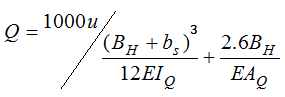

# 제11편 산적화물선 공통구조규칙

> 선급 및 강선규칙/적용지침 / RA-11-K / 2025 / KO / Rules

## 11편 8장 구조상세의 피로검토

### 제 1 절 일반사항

#### 1. 일반사항

- **1.1** 적용
  - **1.1.1** 이 장의 규정은 북대서양 해역에서 25년의 운항 수명을 갖는 길이 *L*이 150 m 이상의 선박에 대하여 적용한다.
  - **1.1.2** 이 장의 규정은 파랑하중에 의한 피로 사이클에 적용한다. 진동, 저 사이클 하중 또는 슬래밍과 같은 충격하중에 의한 피로는 이 장의 범위에서 다루지 않는다.
  - **1.1.3** 이 장의 규정은 최소항복응력이 400 $\mathrm{N}/mm ^{2}$ 미만인 강재에 적용한다.
- **1.2** 순 치수
  - **1.2.1** 이 장에서 규정하는 모든 치수 및 응력은 **3장 2절**에 따라 구한 순 치수에 대한 것이다.
- **1.3** 대상부재
  - **1.3.1** 화물창 구역 내에서 **표 1**의 위치에 연결된 모든 부재의 피로강도를 평가 한다.

    | 부재 | 구조상세 |
    | --- | --- |
    | 내저판 | 하부스툴의 경사판/수직판과의 교차부 |
    | 내저판 | 호퍼탱크 경사판과의 교차부 |
    | 내측판 | 호퍼탱크 경사판과의 교차부 |
    | 횡격벽 | 하부스툴 경사판과의 교차부 |
    | 횡격벽 | 상부스툴 경사판과의 교차부 |
    | 단일선측 산적화물선의 선창내 늑골 | 상부 및 하부 윙 탱크와의 교차부 |
    | 이중선측 내의 일반 보강재 | 웨브프레임 및 횡격벽과 종 보강재의 교차부 |
    | 이중선측 내의 일반 보강재 | 스트링거 등과 횡 보강재의 교차부 |
    | 상부 및 하부 윙탱크 내의 일반 보강재 | 웨브프레임 및 횡격벽과 종 보강재의 교차부 |
    | 이중저 내의 일반 보강재 | - 늑판 및 종보강재의 교차부<br>- 하부스툴 직하부의 늑판과 종보강재의 교차부<br>- 하부스툴이 없는 경우, 횡격벽 근처의 늑판과 종보강재의 교차부 |
    | 해치 코너 | 해치코너의 자유단 |

#### 2. 정의

- **2.1** 핫스폿(hot spot)
  - **2.1.1** 피로균열이 발생할 수 있는 위치를 핫스폿(hot spot)이라 한다.
- **2.2** 공칭응력
  - **2.2.1** 공칭응력은 구조 불연속 및 용접에 의한 응력집중은 고려하지 않고 광의의 구조형상 효과를 고려한 구조부재의 응력이다. 공칭응력은 **7장 4절**에 규정한 성긴 분할요소(coarse mesh)를 사용한 유한요소해석 또는 **4절**에 명시된 간이 절차에 따라 구한다.
- **2.3** 핫스폿 응력
  - **2.3.1** 핫스폿 응력은 균열발생점에서의 국부응력으로 정의한다. 핫스폿 응력은 용접비드 형상의 영향은 고려하지 않고 연결부의 형상에 기인한 구조적 불연속의 영향을 고려한다. 핫스폿 응력은 **7장 4절**에 규정한 상세요소를 사용한 유한요소해석 또는 **4절**에 정의한 공칭응력에 응력집중계수를 곱하여 구한다.
- **2.4** 노치응력
  - **2.4.1** 노치 응력은 용접비드 형상뿐만 아니라 구조형상의 영향에 의한 응력집중을 고려한 용접 토우에서의 피크응력으로 정의한다. 노치응력은 핫스폿 응력에 **2절 [2.3.1]**의 **표 1**에서 정의한 피로 노치계수를 곱하여 구한다.

#### 3. 하중

- **3.1** 적재 조건
  - **3.1.1** 선종에 따라서 **표 2**에 규정하는 적재조건을 고려한다. **4장 부록 3**에 나타낸 표준적재조건이 고려되어야 한다.

    | 선종 | 만재하중조건 |   | 평형수 적재조건 |   |
    | --- | --- | --- | --- | --- |
    | 선종 | 균일적재조건 | 격창적재조건 | 통상 평형수 적재조건 | 황천 평형수 적재조건 |
    | BC-A | √ | √ | √ | √ |
    | BC-B | √ | --- | √ | √ |
    | BC-C | √ | --- | √ | √ |
- **3.2** 하중 상태
  - **3.2.1** **하중 상태**
    각 적재상태에 대하여 **4장 4절 [2]**에서 규정하는 다음의 하중 상태를 고려하여야 한다.
    - **(a)** 등가 설계파 “H”에 해당하는 “H1” 및 “H2” (맞파)
    - **(b)** 등가 설계파 “F”에 해당하는 “F1” 및 “F2” (추파)
    - **(c)** 등가 설계파 “R”에 해당하는 “R1” 및 “R2” (횡파)
    - **(d)** 등가 설계파 “P”에 해당하는 “P1” 및 “P2” (횡파)
  - **3.2.2** 해치 코너의 피로평가에 있어서는 **4장 3절 [3.4]**에 규정한 파랑 비틀림모멘트를 고려하는 사파 상태만을 고려한다.
  - **3.2.3** **지배적인 하중 상태**
    각 적재상태 및 상기의 하중상태로부터 조합응력범위가 최대가 되는 하중 상태가 지배적인 하중 상태가 된다.


### 제 2 절 피로강도 평가

**기호**
이 절에서 정의되지 않은 기호는 **1장 4절**을 참조한다.
*i* : **4장 4절**에서 규정한 하중상태 “H”, “F”, “R” 또는 “P”를 표시하는 아래 첨자
“*i*1”은 “H1”, “F1”, “R1” 또는 “P1”의 하중상태를, “*i*2”은 “H2”, “F2”, “R2” 또는 “P2”의 하중상태를 나타낸다.
D*s_W*_,*_i*_(*_k*_) : 적재상태 “(*k*)”의 하중상태 “*i*”에서의 핫스폿 응력범위, $\mathrm{N}/mm ^{2}$
*s_mean*_,*_i*_(*_k*_) : 적재상태 “(*k*)”의 하중상태 “*i*”에서의 구조적 평균 핫스폿 응력, $\mathrm{N}/mm ^{2}$

#### 1. 일반

- **1.1** 적용
  - **1.1.1** 이 절은 본 장의 피로강도평가를 위한 선형 누적손상 평가 절차를 규정한다.
  - **1.1.2** 등가핫스폿 응력범위에 피로노치계수를 곱하여 얻은 등가노치응력범위에 기초하여 피로강도평가를 한다.
  - **1.1.3** 1차 부재, 종통 보강재 연결부 및 해치 코너의 핫스폿 응력범위 및 핫스폿 평균응력은 각각 **3절, 4절** 및 **5절**에 따라 계산한다.
  - **1.1.4** **1차 지지부재 및 종통 보강재 연결부**
    지배적인 하중 상태 및 ‘상태 1’은 각각 **[2.1]** 및 **[2.2]**에서 구하여야 한다. **3절** 및 **4절**에서 계산된 각 적재상태에 대한 지배적인 하중 상태에 대응하는 핫스폿 응력범위는 등가 핫스폿 응력범위를 계산하기 위하여 **[2.3.2]**에서 사용하여야 한다.
  - **1.1.5** **해치 코너**
    **5절**에서 계산된 핫스폿 응력범위는 등가 핫스폿 응력범위를 계산하기 위하여 **[2.3.2]**에서 사용하여야 한다.

#### 2. 등가 노치응력범위

- **2.1** 지배적 하중상태
  - **2.1.1** 각 적재상태에 대한 피로평가에 있어서 지배적 하중상태 “*I*”는 **1절 [3.2.1]**에 규정한 하중상태 “H”, “F”, “R” 및 “P”중에서 대상 부재에 대하여 조합 응력범위가 최대로 되는 하중상태를 뜻한다. 즉
    
    여기서,
    D*s_W*_,*_i*_(*_k*_) : **3절 [2.1.1], [2.2.1]** 또는 **4절 [2.3.1]**에서 정의한 조합 핫스폿 응력범위 ($\mathrm{N}/mm ^{2}$)
    *i* : 적재상태 “(*k*)”에서 선택된 지배적 하중상태를 표시하는 첨자
- **2.2** 적재 ‘상태 1’
  - **2.2.1** ‘상태 1’이란 아래 식에 의하여 계산된 최대응력이 **1절 표 2**에서 규정한 “균일”, “격창”, “통상 평형수적재” 및 “황천 평형수적재” 적재상태 중에서 인장측에서 최대가 되는 적재상태를 말한다.
    
    여기서,
    *s_mean*_,*_I*_(*_k*_) : **[2.1.1]**에서 정의한 적재상태 “(*k*)”의 지배적 하중상태에 있어서의 구조적 평균 핫스폿 응력($\mathrm{N}/mm ^{2}$)
    D*s_W*_,*_I*_(*_k*_) : **[2.1.1]**에서 정의한 적재상태 “(*k*)”의 지배적 하중상태에 있어서의 핫스폿 응력범위($\mathrm{N}/mm ^{2}$)
  - **2.2.2** **[2.2.1]**에 따른 ‘상태 1’의 결정에 더하여, 대응하는 적재 상태는 아래 첨자 “*j*”을 1로 하여 색인을 붙인다.
- **2.3** 등가 노치응력범위
  - **2.3.1** **등가 노치응력범위**
    각 적재상태에 대하여 등가 노치응력범위($\mathrm{N}/mm ^{2}$)는 다음 식에 따라 계산한다.
    
    여기서,
    D*s_equiv*_,*_j* : **[2.3.2]**에 의하여 구한 적재상태 “*j*”에서의 등가 핫스폿 응력범위($\mathrm{N}/mm ^{2}$)
    *K_f* : **표 1**의 피로노치계수

    | 대상 | 용접 연마 없음 | 용접 연마 있음<br>(일반보강재와 박스형 필릿 용접 제외^*1) |
    | --- | --- | --- |
    | 맞대기 용접부 | 1.25 | 1.10 |
    | 필릿 용접부 | 1.30 | 1.15^*2 |
    | 비 용접부 | 1.00 | - |

    비고)
    *1. 박스형 필릿용접은 주용접의 연장으로서, 부재 코너 주위의 필릿용접으로 정의된다.
    *2. 깊은용입용접 또는 완전용입용접에만 적용된다.
    연마가 수행되는 경우 연마범위, 매끄러운 정도, 최종 용접형상, 작업자 기량 및 품질허용기준을 포함하는 연마기준에 관한 모든 상세가 선급승인을 위하여 제출되어야 한다.
    모든 연마는 회전숫돌(rotary burrs)에 의해 수행되어야 하며, 모든 토우 결함을 제거하기 위해 판 표면 아래까지 연장 시행되어야 하며, 연마 영역은 부식에 대해 충분히 보호되어야 한다.
    그런 처리들은 용접토우에서 모든 가시 언더컷 바닥 아래 최소 0.5mm까지 판 표면 안으로 침하관통하는 깊이를 가지는 매끄러운 곡면형상을 얻어야 한다.
    모든 결함의 깊이는 최소로 유지되어야 하고, 일반적으로 최대 1mm를 유지하여야 한다.
    어떠한 환경에서도 연마 깊이는 2 mm 또는 총 판 두께의 7 %중 작은 것을 초과하여서는 아니된다. 핫스팟 위치의 각 측면에서의 연마 범위는 종통재 간격의 0.5배 또는 늑골 간격의 0.5배 이상이어야 한다.
  - **2.3.2** **등가 핫스폿 응력범위**
    각 적재상태에 대하여 등가 핫스폿 응력범위($\mathrm{N}/mm ^{2}$)는 다음 식에 따라 계산한다.
    
    여기서,
    *f_mean*_,*_j* : 평균응력 수정계수
    • 해치 코너에 대하여 *f_mean*_,*_j* = 0.77
    • 1차 지지부재 및 종통 보강재에 대하여, 상태 “*j*”에 대응하는 *f_mean*_,*_j*로서 다음과 같다.
    
    *s_m*_,1 : 상태 “1” 에서의 국부 평균 핫스폿 응력($\mathrm{N}/mm ^{2}$)
    • $0.6 \Delta \sigma _{W,1} \geq 2.5R _{eH}$ :
    
    • $0.6 \Delta \sigma _{W,1} <2.5R _{eH}$ :
    , 인 경우
    , 인 경우
    *s_m*_,*_j* : 상태 “*j*”에서의 국부 평균 핫스폿 응력($\mathrm{N}/mm ^{2}$)
    • 
    
    • 
    , 인 경우
    , 인 경우
    *s_mean*_,*_j* : 상태 “*j*”에 대응하는 구조적 평균 핫스폿 응력
    *s_res* : 잔류응력($\mathrm{N}/mm ^{2}$)으로서 다음과 같다.
    $sigma _{res,0`} = {cases{0.25&R _{eH`} `````````보강재``끝단``연결부#0&``````````````````````비용접`부분과```1차지지부재}}$

#### 3. 피로손상 계산

- **3.1** 등가 노치응력범위의 수정
  - **3.1.1** 등가 노치응력범위는 다음 식에 따라 수정한다.
    
    여기서,
    *f_coat* : 부식환경에 대한 수정계수
    *f_coat* = 1.05(황천평형수 및 연료유 탱크)
    *f_coat* = 1.03(건화물창 및 보이드스페이스)
    *f_material* : 재료 수정계수
    
    *f_thick* : 판두께 수정계수로서 평강이나 벌브 보강재에 대하여는 1.0, 그 외의 경우에는 다음 식에 의한다.
      mm인 경우
      mm인 경우
    *t* : 대상부재의 순 두께(mm). 보강재의 경우에는 면재
    D*s_eq*_,*_j* : **[2.3.1]**에서 정의한 등가 노치응력범위($\mathrm{N}/mm ^{2}$)
- **3.2** 응력범위의 장기분포
  - **3.2.1** 조합 노치응력범위 장기분포의 누적확률밀도함수는 2 계수 웨이블(Weibull) 분포에 따르는 것으로 한다.
    
    여기서,
    *x* : 웨이블(Weibull) 형상계수로서 1.0으로 한다.
    *N_R* : 사이클 수로서 $10 ^{4}$으로 한다.
- **3.3** 성분 피로손상
  - **3.3.1** 각 적재상태에 대한 성분 피로손상은 다음 식에 따라 계산한다.
    
    여기서,
    *K* : S-N 선도 계수로서, $1.014 \times 10 ^{15}$으로 한다.
    *a_j* : 해치 코너의 평가에 대하여는 1.0으로 한다. 1차 지지부재 및 종통 보강재 연결부에 대하여는 **표 2**의 적재상태에 따른 계수.
    *N_L* : 선박설계수명에 대한 총 사이클 수
    
    *T_L* : 선박수명 25년에 해당하는 설계수명(초)으로서, $7.884 \times 10 ^{8}$으로 한다.
    
    $\Gamma$ : 형식 2 불완전 감마함수
    $\gamma$ : 형식 1 불완전 감마함수

    |   | 적재 상태 | BC-A | BC-B, BC-C |
    | --- | --- | --- | --- |
    | *L* < 200 m | 균일 적재 | 0.6 | 0.7 |
    | *L* < 200 m | 격창적재 | 0.1 | --- |
    | *L* < 200 m | 통상 평형수적재 | 0.15 | 0.15 |
    | *L* < 200 m | 황천 평형수적재 | 0.15 | 0.15 |
    | *L* ≥ 200 m | 균일 적재 | 0.25 | 0.5 |
    | *L* ≥ 200 m | 격창적재 | 0.25 | --- |
    | *L* ≥ 200 m | 통상 평형수적재 | 0.2 | 0.2 |
    | *L* ≥ 200 m | 황천 평형수적재 | 0.3 | 0.3 |

#### 4. 피로강도 기준

- **4.1** 누적 피로 손상
  - **4.1.1** 조합등가응력에 대하여 계산한 누적피로손상은 다음 기준을 만족하여야 한다.
    
    여기서,
    *D_j* : 각 적재상태에 대한 성분 피로손상


### 제 3 절 1차 부재의 응력평가

**기호**
이 절에서 정의하지 않은 기호는 **1장 4절**을 참조한다.
*i* : **4장 4절**에 규정한 하중상태 “H”, “F”, “R” 또는 “P”를 표시하는 첨자
“*i*1”은 “H1”, “F1”, “R1” 또는 “P1”의 하중상태를, “*i*2”은 “H2”, “F2”, “R2” 또는 “P2”의 하중상태를 나타낸다.
D*s_W*_,*_i*_(*_k*_) : 적재상태 “(*k*)”의 하중상태 “*i*”에서의 핫스폿응력범위($\mathrm{N}/mm ^{2}$)
*s_mean*_,*_i*_(*_k*_) : 적재상태 “(*k*)”의 하중상태 “*i*”에서의 구조적 평균 핫스폿응력

#### 1. 일반

- **1.1** 적용
  - **1.1.1** **7장 4절**의 규정 및 이 절의 규정에 따라, 1차 부재의 핫스폿 응력범위 및 구조적 평균 핫스폿응력을 산정하여야 한다.

#### 2. 핫스폿 응력범위

- **2.1** 직접 방법에 따른 응력범위
  - **2.1.1** 적재상태 “(*k*)”의 하중상태 “*i*”에서의 핫스폿 응력범위($\mathrm{N}/mm ^{2}$)는 다음 식으로부터 구한다.
    
    여기서,
    *s_W*_,*_i*_1(*_k*_),*s_W*_,*_i*_2(*_k*_) : **7장 4절**에 규정한 상세 분할요소를 사용한 직접 유한요소해석에 의하여 구한, 적재상태 “(*k*)”의 하중상태 “*i*1”및 “*i*2”에서의 핫스폿응력($\mathrm{N}/mm ^{2}$)
- **2.2** 중첩법에 따른 응력범위
  - **2.2.1** **핫스폿 응력범위**
    적재상태 “(*k*)”의 하중상태 “*i*”에서의 핫스폿 응력범위($\mathrm{N}/mm ^{2}$)
    
    여기서,
    *s_LW*_,*_i*_1(*_k*_),*s_LW*_,*_i*_2(*_k*_) : **7장 4절**에 규정한 상세요소 유한요소 모델을 사용한 직접계산에 의하여 각각 구한, 적재상태“(*k*)”의 하중상태 “*i*1”및 “*i*2”에서의 국부하중으로 인한 핫스폿응력($\mathrm{N}/mm ^{2}$)
    *s_GW*_,*_i*_1(*_k*_),*s_GW*_,*_i*_2(*_k*_) : **[2.2.2]**에 따라 얻어진 적재상태“(*k*)”의 하중상태 “*i*1”및 “*i*2”에서의 선체 거더 모멘트에 의한 핫스폿응력($\mathrm{N}/mm ^{2}$)
  - **2.2.2** **선체 거더 모멘트에 의한 응력**
    적재상태 “(*k*)”의 하중상태 “*i*1”및 “*i*2”에서의 선체 거더 핫스폿응력($\mathrm{N}/mm ^{2}$)은 다음 식으로부터 구한다.
    
    여기서,
    *C_WV*_,*_i*_1,*C_WV*_,*_i*_2,*C_WH*_,*_i*_1,*C_WH*_,*_i*_2 : **4장 4절 [2.2]**에서 정의한 각 하중상태에 대한 하중조합계수
    *sWV,i1* : 수직파랑굽힘 모멘트에 의한 새깅상태에서의 공칭 선체 거더 응력($\mathrm{N}/mm ^{2}$)
    
    *sWV,i2* : 수직파랑굽힘 모멘트에 의한 호깅상태에서의 공칭 선체 거더 응력($\mathrm{N}/mm ^{2}$)
    
    *MWV,H,MWV,S* : *fp*=0.5로 하여, **4장 3절 [3.1.1]**에서 정의한 호깅 및 새깅 상태에서의 수직 파랑굽힘 모멘트(kN.m)
    *N* : **5장 1절**에서 정의한, 중립축의 *Z* 좌표
    *z* : 고려하는 점의 *Z* 좌표
    *s_WH*_,(*_k*_) : 수평 파랑굽힘 모멘트에 의한 공칭 선체 거더 응력
    
    *M_WH*_,(*_k*_) : *f_p*=0.5로 하여, **4장 3절 [3.3.1]**에서 정의한 적재상태 “(*k*)”에서의 수평파랑굽힘 모멘트(kN-m)
    *y* : 고려하는 점의 *Y* 좌표로서, 좌현 쪽을 양(+)으로 우현 쪽을 음(-)으로 잡는다.
    *I_Y*, *I_Z* : **5장 1절**에서 정의한 각각 수평 및 수직 축에 관한 선체 횡단면의 순 관성 모멘트($\mathrm{m} ^{4}$)

#### 3. 평균 핫스폿응력

- **3.1** 직접법에 따른 평균응력
  - **3.1.1** 적재상태 “(*k*)”의 하중상태 “*i*”에서의 구조적 평균 핫스폿응력($\mathrm{N}/mm ^{2}$)으로서, 다음 식에 따라 구한다.
    
- **3.2** 중첩법에 따른 평균응력
  - **3.2.1** **평균 핫스폿응력**
    적재상태 “(*k*)”의 하중상태 “*i*”에서의 구조적 평균 핫스폿 응력($\mathrm{N}/mm ^{2}$)으로서 다음 식에 따라 구한다.
    
    여기서,
    *s_GS*_,(*_k*_) : **[3.2.2]**에서 정의한 적재상태 “(*k*)”에서 정수중 선체 거더 모멘트에 의한 평균 핫스폿 응력($\mathrm{N}/mm ^{2}$)
    *s_LW*_,*_i*_1(*_k*_),*s_LW*_,*_i*_2(*_k*_) : **[2.2.1]**에 따른다.
  - **3.2.2** **정수중 선체 거더 모멘트에 의한 응력**
    적재상태 “(*k*)”에서 정수중 굽힘 모멘트에 의한 핫스폿 응력($\mathrm{N}/mm ^{2}$)으로서 다음 식에 따라 구한다.
    
    여기서,
    *M_S*_,(*_k*_) : **4장 3절 [2.2]**에 정의한 적재상태에 따른 정수중 수직 굽힘 모멘트(kN.m). 설계 초기 단계에서 설계 정수중 굽힘 모멘트가 정의되어 있지 않은 경우, 각 적재 상태에서의 정수중 굽힘 모멘트는 다음 식으로부터 구할 수 있다.
    균일 적재상태; 
    격창 적재상태; 
    통상 평형수적재상태 ; 
    황천 평형수적재상태 ; 
    *M_SW*_,*_H*,*M_SW*_,*_S* : 호깅 및 새깅 상태에서의 허용 정수중 굽힘 모멘트(kN.m)
    *F_MS* : **4장 3절 그림 2**에 따른 분포계수


### 제 4 절 보강재의 응력평가

**기호**
이 절에 정의되지 않은 기호는 **1장 4절**에 따른다.
*i* : **4장 4절**에 규정한 하중상태 “H”, “F”, “R” 또는 “P”를 표시하는 첨자
“*i*1”은 하중상태 “H1”, “F1”, “R1” 또는 “P1”을 표시하며, “*i*2”는 하중상태 “H2”, “F2”, “R2” 또는 “P2”을 표시한다.
*s_W*_,*_i*_(*_k*_) : 적재상태 “(*k*)”의 하중상태 “*i*”에서의 핫스폿 응력범위($\mathrm{N}/mm ^{2}$)
*s_mean*_,*_i*_(*_k*_) : 적재상태 “(*k*)”의 하중상태 “*i*”에서의 구조적 평균 핫스폿 응력

#### 1. 일반사항

- **1.1** 적용
  - **1.1.1** 종통 보강재의 집중(hot spot) 응력범위 및 구조적 평균 집중응력은 이 절의 규정에 따라서 평가한다.
  - **1.1.2** 종통 보강재의 집중응력범위와 구조적 집중평균응력은 종방향 단부 결합형태와 다음의 위치를 고려하여 종통부재의 면재에서 평가되어야 한다.
    (1) 화물창의 횡격벽 또는 스툴 부근이 아닌 곳의 횡방향 웨브 또는 늑판에 대해서는 상대변위로 인한 추가적인 집중응력은 고려하지 않아도 된다. 이 종방향 단부 결합부는 **표 1**에 정의되어 있다. 횡방향 웨브 또는 늑판이 수밀일 경우, **표 1**에 정의된 *Kgl* 및 *Kgh* 대신에 **표 2**에 정의된 것이 고려되어야 한다.
    (2) 스툴부근 화물창의 횡격벽에 있는 횡방향 웨브 또는 늑판에 대해서는 상대변위에 의한 추가적인 집중응력을 고려하여야 한다. 이 종방향 단부 결합부는 **표 2**에 정의되어 있다. 화물창의 횡격벽 또는 스툴부근의 횡방향 웨브 또는 늑판이 수밀이 아닌 경우, **표 2**에 정의된 *Kgl* 및 *Kgh* 대신에 **표 1**에 정의된 것이 고려되어야 한다.

#### 2. 핫스폿 응력범위

- **2.1** 직접 방법에 따른 응력범위
  - **2.1.1** 각 적재상태의 각 하중상태 “H”, “F”, “R” 및 “P”에 대하여 직접계산에 의하여 계산한 핫스폿응력범위($\mathrm{N}/mm ^{2}$)는 **3절 [2.1]**의 규정에 따라 구한다.
- **2.2** 중첩법에 따른 응력범위
  - **2.2.1** 각 적재상태의 각 하중상태 “H”, “F”, “R” 및 “P”에 대하여 중첩법에 따른 핫스폿응력범위($\mathrm{N}/mm ^{2}$)는 **3절 [2.2]**의 규정에 따라 구한다.
- **2.3** 간이절차에 따른 응력범위
  - **2.3.1** **집중응력범위**
    적재상태 “(*k*)”의 하중상태 “*i*”에서 동하중으로 인한 집중응력범위($\mathrm{N}/mm ^{2}$)는 다음 식으로부터 구한다.
    
    여기서,
    *s_GW*_,*_i*_1(*_k*_),*s_GW*_,*_i*_2(*_k*_) : **[2.3.2]**에서 정의한 선체 거더 모멘트로 인한 응력
    *s_W*_1,*_i*_1(*_k*_),*s_W*_1,*_i*_2(*_k*_) : 고려하는 경우에 따라, 해당 압력이 보강재와 같은 측에 작용할 때, 압력으로 인한 응력 *s_LW,ij*_(*_k*_),*s_CW,ij*_(*_k*_) 및 *s_LCW*_,*_ij*_(*_k*_)
    *s_W*_2,*_i*_1(*_k*_),*s_W*_2,*_i*_2(*_k*_) : 고려하는 경우에 따라, 해당 압력이 보강재와 반대 측에 작용할 때, 압력으로 인한 응력 *s_LW,ij*_(*_k*_),*s_CW,ij*_(*_k*_) 및 *s_LCW*_,*_ij*_(*_k*_)
    *s_LW*_,*_i*_1(*_k*_),*s_LW*_,*_i*_2(*_k*_) : **[2.3.3]**에서 정의한 파랑압력으로 인한 응력
    *s_CW*_,*_i*_1(*_k*_),*s_CW*_,*_i*_2(*_k*_) : **[2.3.4]**에서 정의한 유체압력으로 인한 응력
    *s_LCW*_,*_i*_1(*_k*_),*s_LCW*_,*_i*_2(*_k*_) : **[2.3.5]**에서 정의한 벌크 건화물로 인한 응력
    *s_d*_,*_i*_1(*_k*_),*s_d*_,*_i*_2(*_k*_) : **[2.3.6]**에서 정의한 횡격벽 또는 스툴부근의 늑판의 상대변위로 인한 응력
  - **2.3.2** **선체거더 모멘트로 인한 응력**
    적재상태 “(*k*)”의 하중상태 “*i*1”및 “*i*2”에서 선체거더 집중응력($\mathrm{N}/mm ^{2}$)은 다음 식으로부터 구한다.
    
    여기서,
    *K_gh* : 공칭 선체거더응력에 대한 기하학적 응력집중계수. *K_gh*는 **[1.1.2 ]**(1) 및 **[1.1.2]**(2)에서 명시된 종방향 단부 결합부에 대해 각각 **표 1**과 **표 2**에서 주어진다.
    응력집중계수는 유한요소해석에 의하여 산정할 수 있다.
    *C_WV*_,*_i*_1,*C_WV*_,*_i*_2,*C_WH*_,*_i*_1,*C_WH*_,*_i*_2 : **4장 4절 [2.2]**에서 정의한 각 하중상태에 대한 하중조합계수
    *s_WV*_,*_i*_1,*s_WV*_,*_i*_2,*s_WH*_,(*_k*_) : **3절 [2.2.2]**에서 정의한 공칭 선체거더 응력($\mathrm{N}/mm ^{2}$)
  - **2.3.3** **파랑압력으로 인한 응력**
    적재상태 “(*k*)”의 하중상태 “*i*1”및 “*i*2”에서 파랑압력으로 인한 집중응력($\mathrm{N}/mm ^{2}$)은 다음 식으로부터 구한다.
    
    
    
    여기서,
    *p_W*_,*_ij*_(*_k*_) : 적재상태 “(*k*)”의 하중상태 “*i*1”및 “*i*2”에서, *f_p*=0.5로 하여 **4장 5절 [1.3], [1.4]** 및 **[1.5]**에서 규정한 유체동압력($\mathrm{kN}/m ^{ 2}$). 고려대상 부재의 위치가 수선 상부에 있는 경우에는, 유체동압력은 수선에서의 압력으로 취한다.
    *K_gl* : 면외 압력으로 인한 응력에 대한 기하학적 응력집중계수. *K_gl*는 **[1.1.2]**(1) 및 **[1.1.2]**(2)에 명시된 종방향 단부 결합부에 대해 각각 **표 1**과 **표 2**에서 주어진다. 응력집중계수는 유한요소 해석에 의하여 산정할 수 있다.
    *K_s* : 보강재 형상으로 인한 기하학적 응력집중계수
    
    *a*,*b* : **그림 1**에서 정의한 면재의 편심(mm). 앵글재에 대하여는 “*b”*는 웨브 원 두께의 반으로 잡는다.
    *t_f,b_f* : **그림 1**에서 정의된 면재의 두께와 폭(mm)
    *w_a*,*w_b* : 부착 판을 제외한 *Z* 축에 평행한 중립축 부근의 보강재의 각각 A 및 B(**그림 1** 참조)에서의 순 단면계수.
    *C_NE*_,*_ij*_(*_k*_) : 적재상태 “(*k*)”의 하중상태 “*i*1”및 “*i*2”에서 파랑압력범위의 비선형성에 대한 수정계수
    
    *T_LC*_(*_k*_) : 고려하는 적재상태 “(*k*)”의 흘수(m)
    *p_W*_,*_ij*_(*_k*_),*_WL* : 적재상태 “(*k*)”의 하중상태 “*i*1”및 “*i*2”에서, 수선에서의 유체동압력($\mathrm{kN}/m ^{ 2}$)
    *z* : 고려하는 점의 *Z* 좌표
    *s* : 보강재 간격(m)
    l : **그림 2**와 같이 계측된 스팬 (m). 보강재 면재로부터 잰 단부 브래킷의 깊이가 보강재 깊이의 1/2이 되는 점을 스팬 단부로 한다.
    *x_f* : “$\ell$”의 가까운 단부로부터 균열발생점까지의 거리(m) (**그림 2** 참조)
    *w* : 고려하는 보강재의 순 단면계수($\mathrm{cm} ^{3}$). 다음 식에 따라 계산한 부착 판의 유효폭 $s _{e}$(m)을 고려하여 단면계수 *w*를 계산한다.
    
    
    그림 1 보강재의 단면 치수
    
    그림 2 종통 보강재의 스팬 및 집중(hot spot)응력 부위
  - **2.3.4** **유체압력으로 인한 응력**
    적재상태 “(*k*)”의 하중상태 “*i*1”및 “*i*2”에서 유체압력으로 인한 집중응력($\mathrm{N}/mm ^{2}$)
    
    여기서,
    *p_BW*_,*_ij*_(*_k*_) : 적재상태 “(*k*)”의 하중상태 “*i*1”및 “*i*2”에서 *f_p* = 0.5로 하여, **4장 6절 [2.2]**에서 규정한 평형수로 인한 관성압($\mathrm{kN}/m ^{ 2}$).고려하는 위치가 연료유, 기타 유류 또는 청수탱크 내에 위치하는 경우, 탱크 정부 종통재에 대한 관성압(inertial pressure)은 고려하지 않으며, 고려하는 부재의 위치가 정적 직립상태의 유체 표면의 상부에 있는 경우, 관성압은 유체표면라인에서의 관성압(inertial pressure)으로 취해야 한다.
    *C_NI*_,*_ij*_(*_k*_) : 적재상태 “(*k*)”의 하중상태 “*i*1”및 “*i*2”에서, 관성압 범위의 비선형성에 대한 수정계수
    *z_SF* : 유체 표면의 *Z* 좌표. 일반적으로 **4장 6절**에 정의된 “z_top”와 같은 값을 취한다. 고려하는 위치가 연료유, 기타 유류 또는 청수탱크 내에 위치하는 경우, 탱크의 절반 높이까지의 거리를 취할 수 있다.
    *z* : 고려하는 점의 *Z* 좌표.
    *p_BW*_,*_ij*_(*_k*_),*_SF*: 적재상태 “(*k*)”의 하중 상태 “*i*1”및 “*i*2”에 있어서, 유체 표면에서 취한 관성압($\mathrm{kN}/m ^{ 2}$). **4장 6절 [2.2.1]**에 따른 관성압 계산시, 참조점의 x와 y좌표는 탱크 정부 대신 유체 표면의 값으로 취해야 한다.
    *K_gl,K_s* : **[2.3.3]**에 정의된 응력집중계수
  - **2.3.5** **산적 건화물 압력으로 인한 응력**
    적재상태 “(k)”의 하중 상태 “i1”및 “i2”에 있어서, 산적 건화물 압력으로 인한 핫스폿응력($\mathrm{N}/mm ^{2}$)은 다음 식으로부터 구한다.
    $\sigma_{LCW, ij(k)} = \frac{K_gl K_s p_{CW, ij(k)} sl^2 \left( 1-{6x_f overl} +{6x_f^\frac{2}{l^2}}\right)}{12w}\times 10^3$ ($j = 1, 2$)
    여기서,
    *p_CW*_, *_ij*_(*_k*_) : 적재상태 “(*k*)”의 하중 상태 “*i*1”및 “*i*2”에 있어서, **4장 부록 3**에서 규정하는 화물 밀도($\rho_c$)와 *f_p* =0.5로 하여 **4장 6절 [1.3]**에서 규정한 산적 건화물로 인한 관성압력($\mathrm{kN}/m ^{ 2}$)
  - **2.3.6** **횡격벽 또는 횡격벽이나 스툴 부근늑판의 상대변형으로 인한 응력**
    **[1.1.2]**(2)에 명시된 종방향 단부 결합부의 경우, 적재상태 “(*k*)”의 하중 상태 “*i*1”및 “*i*2”에 있어서, 횡격벽 또는 스툴 부근 늑판과 인접한 트랜스버스 웨브 또는 늑판 사이의 부착판에 대해 수직 방향의 상대변위로 인한 부가 집중응력($\mathrm{N}/mm ^{2}$)
    
    여기서,
    *a*, *f* : **표 1**에서 나타낸 고려 위치를 표시하는 첨자
    *A*, *F* : **표 1**에서 나타낸, 상대변위가 발생하는 트랜스버스 웨브 또는 늑판의 전(*F*) 및 후(*A*) 방향을 표시하는 첨자(**그림 3** 참조)
    *sdF-a,ij(k)*,*sdA-a,ij(k)*,*sdF-f,ij(k)*,*sdA-f,ij(k)* : 적재상태 “(k)”의 하중상태 “i1”및 “i2”에 있어서, 횡격벽 또는스툴 부근 늑판과 각각 전(“*F*”) 및 후(“*A*”)의 트랜스버스 웨브 또는 늑판 사이의 상대변위로 인한 점 “$a$” 및 “$f$”에서의 부가응력
    
    
    
    
    *dF,ij(k)*,*dA,ij(k)* : 적재상태 “(*k*)”의 하중상태 “*i*1”및 “*i*2”에서 횡격벽 또는 스툴 부근 늑판과 전(*F*) 및 후(*A*) 트랜스버스 웨브 또는 늑판 사이의 부착판에 대해 수직 방향의 상대 변위(mm) (**그림 3** 참조)
    상대 변위는 스툴의 전(*F*) 또는 후(*A*) 첫번째 늑판에서 계측한 스툴의 바닥에서 보강재의 단부 결합부를 관통하는 라인과 비교한 종통재의 변위로 정의된다.
    상대변위는 횡격벽의 전(*F*) 또는 후(*A*) 첫번째 종통재에서 계측한 원래 위치와 비교한 종통재의 변위로 정의된다.
    상대변위로 인한 평가 지점에서의 종통재의 면재의 응력이 인장인 경우, 상대변위의 부호는 양(+)이다.
    
    그림 3 상대변위의 정의(선측 종통재의 예)
    *IF, IA* : 전(*F*) 및 후(*A*) 종통재의 순 관성모멘트($\mathrm{cm} ^{4}$)
    *KdF-a,KdA-a,KdF-f,KdA-f* : **표 2**에 각각 정의한, 횡격벽과 전(*F*) 및 후(*A*) 또는 스툴부근의 늑판 트랜스버스 웨브 사이의 상대변위를 받는 점 “*a*”및 “*f*“에서 보강재 단부 연결부에 대한 응력집중계수. 고려하는 구조 형상이 **표 2**에 보인 어느 것과도 대응하지 않는 경우, 유한요소해석에 의하여 응력집중을 직접 구할 수 있다.
    l*F*, l*A* : **그림 2**과 같이 계측한 전(*F*) 및 후(*A*) 종통재의 스팬(m)
    *xfF, xfA* : 각각 l*F* 및 l*A*의 가까운 단부로부터 균열발생점까지의 거리(m) (**그림 2** 참조)
    - **(a)** 스툴 부근 종방향 관통 늑판의 경우:
    - **(b)** (a)가 아닌 종통재

#### 3. 평균 집중(Hot Spot)응력

- **3.1** 직접법에 따른 평균응력
  - **3.1.1** 직접법에 따른 각 적재상태에서의 구조적 평균 핫스폿응력($\mathrm{N}/mm ^{2}$)은 **3절 [3.1]**에 따라 구한다.
- **3.2** 중첩법에 따른 평균응력
  - **3.2.1** 중첩법에 따른 각 적재상태에서의 구조적 평균 핫스폿응력은 **3절 [3.2]**에 따라 구한다.
- **3.3** 간이 절차에 따른 평균응력
  - **3.3.1** **평균 집중응력**
    하중상태 “*i*”에 관계없이, 적재상태 “(*k*)”에서의 구조적 평균 집중응력은 다음 식으로부터 구한다.
    
    여기서,
    *s_GS*_,(*_k*_) : **[3.3.2]**에서 정의한 정수중 선체거더 모멘트로 인한 응력
    *s_S*_1,(*_k*_) : 고려하는 경우에 따라 일반 보강재와 같은 측에 압력이 작용할 때 정수압으로 인한 응력
    *s_S*_2,(*_k*_) : 고려하는 경우에 따라 보강재와 반대 측에 압력이 작용할 때 정수압으로 인한 응력
    *s_LS*_,(*_k*_) : **[3.3.3]**에서 정의한 정수압으로 인한 응력
    *s_CS*_,(*_k*_) : **[3.3.4]**에서 정의한 유체 정압으로 인한 응력
    *s_LCS*_,(*_k*_) : **[3.3.5]**에서 정의한 정수중 산적 건화물 압력으로 인한 응력
    *s_dS*_,(*_k*_) : **[3.3.6]**에서 정의한 정수중 횡격벽의 상대변위로 인한 응력
  - **3.3.2** **정수중 선체거더 모멘트로 인한 응력**
    적재상태 “(*k*)”에서 정수중 굽힘 모멘트로 인한 집중응력은 다음 식으로부터 구한다.
    
    여기서,
    *M_S*_,(*_k*_) : **3절 [3.2.2]**에서 정의한 정수중 수직굽힘 모멘트(kN-m)
  - **3.3.3** **정수압 및 동수압으로 인한 응력**
    적재상태 “(*k*)”에서 정수압 및 동수압으로 인한 집중응력($\mathrm{N}/mm ^{2}$)은 다음 식으로부터 구한다.
    
    여기서,
    *p_S*_,(*_k*_) : **4장 5절 [1.2]**에서 규정한 적재상태 “(*k*)”에서의 정수압($\mathrm{kN}/m ^{ 2}$)
    *p_CW,ij(k)* : 적하상태 “(k)”의 하중조건 “i1” 및 “i2”에서 *f_p*=0.5를 가지고 **[2.3.3]**에 따른 수정된 동수압($\mathrm{kN}/m ^{ 2}$)
    *I* : **2장 [2.1.1]**에 명시된 하중조건을 나타내는 접미사, 평균응력 계산시는 “*I*”가 사용된다.
  - **3.3.4** **정수중 유체 압력으로 인한 응력**
    적재상태 “(*k*)”에서 유체 정수압으로 인한 구조적 평균 집중응력($\mathrm{N}/mm ^{2}$)은 다음 식으로부터 구한다.
    
    여기서,
    *p_CS*_,(*_k*_) : **4장 6절 [2.1]**에서 규정한 적재상태 “(*k*)”에서 정수중 유체 압력($\mathrm{kN}/m ^{ 2}$). 고려하는 위치가 연료유, 기타 유류 또는 청수탱크 내에 위치하는 경우, **4장 6절**에 정의된 *dAP*와 *PPV*는 0으로 취해야 하고, **4장 6절 [2.1]**에 명시된 *zTOP*는 **[2.3.4]**에 명시된 *zSF*와 같은 값을 취해야 한다.
  - **3.3.5** **정수중 산적 건화물 압력으로 인한 응력**
    적재상태 “(*k*)”에서 산적 건화물 정압으로 인한 구조적 평균 핫스폿응력($\mathrm{N}/mm ^{2}$)은 다음 식으로부터 구한다.
    
    여기서,
    *p_CS*_,(*_k*_) : **4장 6절 [1.2]**에서 규정한 적재상태 “(*k*)”에서 정수중 산적 건화물 압력($\mathrm{kN}/m ^{ 2}$)
  - **3.3.6** **정수 중 횡격벽의 상대변위로 인한 응력**
    적재상태 “(*k*)”에서 횡격벽과 인접하는 트랜스버스 웨브 또는 늑판 사이의 횡방향 상대변위로 인한 부가적인 평균 핫스폿응력($\mathrm{N}/mm ^{2}$)은 다음 식으로부터 구한다.
    
    여기서,
    *s_dSF-a*_,(*_k*_),*s_dSA-a*_,(*_k*_),*s_dSF-f*_,(*_k*_),*s_dSA-f* _,(*_k*_) : 적재상태“(*k*)”에서 각각 횡격벽과 전방(*F*) 및 후방(*A*) 트랜스버스 웨브 또는 늑판 사이의 상대변위로 인한 점 “*a*”및 “*f*“에서의 부가응력($\mathrm{N}/mm ^{2}$)
    
    
    
    
    *dSF,(k)*,*dSA,(k)* : 적재상태 (k)에서 각각 횡격벽과 전방(F) 및 후방(A) 트랜스버스 웨브 및 늑판 사이의 횡방향 정수중 상대변위(mm)

    | 브래킷 형식 | 평가점 | 브래킷 크기 | 응력집중계수 |   |
    | --- | --- | --- | --- | --- |
    | 브래킷 형식 | 평가점 | 브래킷 크기 | $K _{gl}$ | $K _{gh}$ |
    | 1<br> | $a$ | ----- | 1.65 | 1.1 |
    | 2<br> | $a$ | $dw \leq d<1.5 dw$ | 1.55 | 1.1 |
    |   | $a$ | $1.5 dw \leq d$ | 1.5 | 1.05 |
    | 3<br> | $a$ | $dw \leq d<1.5 dw$ | 1.5 | 1.1 |
    |   | $a$ | $1.5 dw \leq d$ | 1.45 | 1.05 |
    | 4<br> | $f$ | $dw \leq d<1.5 dw$ | 1.4 | 1.1 |
    |   | $f$ | $1.5 dw \leq d$ | 1.4 | 1.05 |
    | 5<br> | $f$ | $dw \leq d<1.5 dw$ | 1.35 | 1.1 |
    |   | $f$ | $1.5 dw \leq d$ | 1.35 | 1.05 |

    | 브래킷 형식 | 평가점 | 브래킷 크기 | 응력집중계수 |   |
    | --- | --- | --- | --- | --- |
    | 브래킷 형식 | 평가점 | 브래킷 크기 | $K _{gl}$ | $K _{gh}$ |
    | 6<br> | $a$ | $dw \leq d<1.5 dw$ | 1.15 | 1.05 |
    |   | $a$ | $1.5 dw \leq d$ | 1.1 | 1.05 |
    | 7<br> | $a$ | $dw \leq d<1.5 dw$ | 1.15 | 1.05 |
    |   | $a$ | $1.5 dw \leq d$ | 1.1 | 1.05 |
    | 8<br> | $a$ | $dw \leq d<1.5 dw$ | 1.1 | 1.1 |
    |   | $a$ | $1.5 dw \leq d$ | 1.05 | 1.05 |
    | 9<br> | $a$ | $d \leq 2 h$ | 1.45 | 1.1 |
    | 10<br> | $a$ | $d \leq 2.5 h$ | 1.35 | 1.1 |

    | 브래킷 형식 | 평가점 | 브래킷 크기 | 응력집중계수 |   |
    | --- | --- | --- | --- | --- |
    | 브래킷 형식 | 평가점 | 브래킷 크기 | $K _{gl}$ | $K _{gh}$ |
    | 11<br> | $a$ | $d _{1} \leq 2 h$<br>및<br>$h \leq d _{2}$ | 1.15 | 1.1 |
    |   | $f$ | $d _{1} \leq 2 h$<br>및<br>$h \leq d _{2}$ | 1.85 | 1.1 |
    | 12<br> | $a$ | $d _{1} \leq 2.5 h$<br>및<br>$h \leq d _{2}$ | 1.15 | 1.1 |
    |   | $f$ | $d _{1} \leq 2.5 h$<br>및<br>$h \leq d _{2}$ | 1.35 | 1.1 |
    | 13<br> | $a$ | $d _{1} \leq 2 h$<br>및<br>$h \leq d _{2}$ | 1.1 | 1.1 |
    |   | $f$ | $d _{1} \leq 2 h$<br>및<br>$h \leq d _{2}$ | 2.05 | 1.1 |
    | 14<br> | $a$ | $d _{1} \leq 2.5 h$<br>및<br>$h \leq d _{2}$ | 1.1 | 1.1 |
    |   | $f$ | $d _{1} \leq 2.5 h$<br>및<br>$h \leq d _{2}$ | 1.8 | 1.1 |

    | 브래킷 형식 | 평가점 | 브래킷 크기 | 응력집중계수 |   |   |   |
    | --- | --- | --- | --- | --- | --- | --- |
    | 브래킷 형식 | 평가점 | 브래킷 크기 | $K _{gl}$ | $K _{gh}$ | $K _{dF}$ | $K _{dA}$ |
    | 1<br> | $a$ | ----- | 1.5 | 1.1 | 1.15 | 1.5 |
    |   | $f$ | ----- | 1.1 | 1.05 | 1.55 | 1.05 |
    | 2<br> | $a$ | $dw \leq d<1.5 dw$ | 1.45 | 1.1 | 1.15 | 1.4 |
    |   | $a$ | $1.5 dw \leq d$ | 1.4 | 1.05 | 1.15 | 1.35 |
    |   | $f$ | $dw \leq d<1.5 dw$ | 1.1 | 1.05 | 1.15 | 1.1 |
    |   | $f$ | $1.5 dw \leq d$ | 1.05 | 1.05 | 1.1 | 1.05 |
    | 3<br> | $a$ | $dw \leq d<1.5 dw$ | 1.4 | 1.1 | 1.1 | 1.35 |
    |   | $a$ | $1.5 dw \leq d$ | 1.35 | 1.05 | 1.05 | 1.3 |
    |   | $f$ | $dw \leq d<1.5 dw$ | 1.05 | 1.05 | 1.1 | 1.05 |
    |   | $f$ | $1.5 dw \leq d$ | 1.05 | 1.05 | 1.05 | 1.05 |
    | 4<br> | $a$ | $dw \leq d<1.5 dw$ | 1.1 | 1.05 | 1.05 | 1.25 |
    |   | $a$ | $1.5 dw \leq d$ | 1.05 | 1.05 | 1.05 | 1.2 |
    |   | $f$ | $dw \leq d<1.5 dw$ | 1.3 | 1.1 | 1.35 | 1.05 |
    |   | $f$ | $1.5 dw \leq d$ | 1.3 | 1.05 | 1.3 | 1.05 |
    | 5<br> | $a$ | $dw \leq d<1.5 dw$ | 1.1 | 1.05 | 1.05 | 1.2 |
    |   | $a$ | $1.5 dw \leq d$ | 1.05 | 1.05 | 1.05 | 1.15 |
    |   | $f$ | $dw \leq d<1.5 dw$ | 1.3 | 1.1 | 1.55 | 1.1 |
    |   | $f$ | $1.5 dw \leq d$ | 1.3 | 1.05 | 1.5 | 1.05 |

    | 브래킷 형식 | 평가점 | 브래킷 크기 | 응력집중계수 |   |   |   |
    | --- | --- | --- | --- | --- | --- | --- |
    | 브래킷 형식 | 평가점 | 브래킷 크기 | $K _{gl}$ | $K _{gh}$ | $K _{dF}$ | $K _{dA}$ |
    | 6<br> | $a$ | $dw \leq d<1.5 dw$ | 1.1 | 1.05 | 1.05 | 1.1 |
    |   | $a$ | $1.5 dw \leq d$ | 1.05 | 1.05 | 1.05 | 1.05 |
    |   | $f$ | $dw \leq d<1.5 dw$ | 1.05 | 1.05 | 1.1 | 1.05 |
    |   | $f$ | $1.5 dw \leq d$ | 1.05 | 1.05 | 1.05 | 1.05 |
    | 7<br> | $a$ | $dw \leq d<1.5 dw$ | 1.1 | 1.05 | 1.05 | 1.2 |
    |   | $a$ | $1.5 dw \leq d$ | 1.05 | 1.05 | 1.05 | 1.15 |
    |   | $f$ | $dw \leq d<1.5 dw$ | 1.05 | 1.05 | 1.05 | 1.05 |
    |   | $f$ | $1.5 dw \leq d$ | 1.05 | 1.05 | 1.05 | 1.05 |
    | 8<br> | $a$ | $dw \leq d<1.5 dw$ | 1.1 | 1.1 | 1.05 | 1.15 |
    |   | $a$ | $1.5 dw \leq d$ | 1.05 | 1.05 | 1.05 | 1.1 |
    |   | $f$ | $dw \leq d<1.5 dw$ | 1.05 | 1.05 | 1.1 | 1.05 |
    |   | $f$ | $1.5 dw \leq d$ | 1.05 | 1.05 | 1.05 | 1.05 |
    | 9<br> | $a$ | $d \leq 2 h$ | 1.4 | 1.05 | 1.05 | 1.75 |
    |   | $f$ | $d \leq 2 h$ | 1.6 | 1.05 | 1.7 | 1.05 |
    | 10<br> | $a$ | $d \leq 2.5 h$ | 1.3 | 1.05 | 1.05 | 1.75 |
    |   | $f$ | $d \leq 2.5 h$ | 1.55 | 1.05 | 1.3 | 1.05 |

    | 브래킷 형식 | 평가점 | 브래킷 크기 | 응력집중계수 |   |   |   |
    | --- | --- | --- | --- | --- | --- | --- |
    | 브래킷 형식 | 평가점 | 브래킷 크기 | $K _{gl}$ | $K _{gh}$ | $K _{dF}$ | $K _{dA}$ |
    | 11<br> | $a$ | $d _{1} \leq 2 h$<br>및<br>$h \leq d _{2}$ | 1.1 | 1.05 | 1.05 | 1.2 |
    |   | $f$ | $d _{1} \leq 2 h$<br>및<br>$h \leq d _{2}$ | 1.75 | 1.05 | 1.4 | 1.05 |
    | 12<br> | $a$ | $d _{1} \leq 2.5 h$<br>및<br>$h \leq d _{2}$ | 1.1 | 1.05 | 1.05 | 1.2 |
    |   | $f$ | $d _{1} \leq 2.5 h$<br>및<br>$h \leq d _{2}$ | 1.3 | 1.05 | 1.05 | 1.05 |
    | 13<br> | $a$ | $d _{1} \leq 2 h$<br>및<br>$h \leq d _{2}$ | 1.05 | 1.05 | 1.05 | 1.15 |
    |   | $f$ | $d _{1} \leq 2 h$<br>및<br>$h \leq d _{2}$ | 1.95 | 1.05 | 1.55 | 1.05 |
    | 14<br> | $a$ | $d _{1} \leq 2.5 h$<br>및<br>$h \leq d _{2}$ | 1.05 | 1.05 | 1.05 | 1.15 |
    |   | $f$ | $d _{1} \leq 2.5 h$<br>및<br>$h \leq d _{2}$ | 1.7 | 1.05 | 1.15 | 1.05 |


### 제 5 절 해치 코너의 응력 평가

#### 1. 일반

- **1.1** 적용
  - **1.1.1** 간이 절차에 기초한 해치 코너의 핫스폿 응력범위 및 구조적 평균 핫스폿 응력은 이 절의 규정에 따라 평가한다.

#### 2. 공칭응력 범위

- **2.1** 파랑 비틀림모멘트로 인한 공칭응력범위
  - **2.1.1** 파랑 비틀림모멘트에 의한 크로스 갑판 굽힘으로 인한 공칭 응력범위($\mathrm{N}/mm ^{2}$)는 다음 식으로부터 구한다.
    
    여기서,
    
    *u* : 해치코너의 종방향 변위(m)로서 다음과 같다.
    
    *DOC* : 갑판 개구 계수로서, 다음과 같다.
    
    *M_WT* : *f_p* = 0.5로 하여 **4장 3절 [3.4.1]**에 정의한 최대 파랑 비틀림 모멘트(kN.m)
    *F_S* : 응력 수정계수로서, 다음과 같다.
    $F _{s} = 5$
    *F_L* : 해치 코너의 종방향 위치에 대한 수정계수로서, 다음과 같다.
    $F _{L} = 1.75 \frac{x}{L}$, $0.57 \leq x/L \leq 0.85$인 경우
    $F _{L} = 1.0$, $x/L<0.57 and x/L>0.85$인 경우
    *B_H* : 해치 개구의 폭(m)
    *W_Q* : 해치 코너 부근의 상부 스툴을 포함한, z-축에 대한 크로스 갑판의 단면계수($\mathrm{m} ^{3}$)(**그림 2** 참조)
    *I_Q* : 해치 코너 부근의 상부 스툴을 포함한, z-축에 대한 크로스 갑판의 관성 모멘트($\mathrm{m} ^{4}$)(**그림 2** 참조)
    *A_Q* : 해치 코너 부근의 상부 스툴을 포함한 크로스 갑판의 전체 단면의 유효전단면적($\mathrm{m}^{ 2}$)(**그림 2** 참조). 유효전단면적의 결정에 있어 판 요소만의 고려가 충분하면, 보강재는 생략할 수 있다.
    *b_S* : 해치 개구 옆의 한쪽 측면에 대한 남은 갑판 스트립의 폭(m)
    *I_T* : 격벽의 상부 및 하부 스툴을 무시하고 크로스 갑판 면적 내에서 계산된, 선체 횡단면의 비틀림 관성 모멘트($\mathrm{m} ^{4}$)(**그림 1** 참조)로서, **부록 1**에 따라 계산할 수 있다.
    *ω* : *I_T*와 같은 횡단면 및 해치 코너의 *Y* 및 *Z* 위치에서 계산된 섹터 좌표($\mathrm{m}^{ 2}$)로서, **부록 1**에 따라 계산할 수 있다.
    *L_C* : 화물 구역의 길이(m)로서, 기관실 격벽과 선수격벽 사이의 거리로 한다.
    *B_H,i* : 해치 *i*의 해치개구의 폭(m)
    *L_H,i* : 해치 *i*의 해치개구의 길이(m)
    *n* : 해치의 수
    
    그림 1 IT 및 ω의 결정을 위한 횡단면
    
    그림 2 AQ, WQ 및 IQ의 결정을 위하여 고려하는 요소
- **2.2** 공칭 평균응력
  - **2.2.1** 크로스 갑판 내의 정수중 굽힘 모멘트로 인한 평균 응력은 0(zero)으로 설정한다.

#### 3. 핫스폿 응력

- **3.1** 핫스폿 응력범위
  - **3.1.1** 핫스폿 응력범위($\mathrm{N}/mm ^{2}$)는 다음과 같이 구한다.
    
    여기서,
    *K_gh* : 해치 코너에 대한 응력집중계수로서, 다음과 같다. 다만 1보다 작게 취하여서는 아니 된다.
    
    $r _{a}$ : 장축 반경(m)
    $r _{b}$ : 단축 반경(m) (코너 형상이 원형인 경우, $r _{b}$ 및 $r _{a}$는 같다.)
    $\ell _{CD}$ : 크로스 갑판의 선체 종방향 길이(m)
    $b$ : 개구단으로부터 선측까지의 거리(m)


### 부록 1 - 비틀림에 대한 단면 특성

#### 1. 계산 식

- **1.1** 비틀림 함수 $\Phi$
  - **1.1.1** 폐 단면 셀(cell)의 임의의 부분 면적에 대하여, 다음의 기하학적 그림 및 비를 계산하여야 한다.
    
    
    
    
    그림 1
    단면 유형에 따라 다음 세 가지의 계산 방식을 적용할 수 있다.
    **방식 A : 그림 2**에 보인 비대칭 개 단면
    **방식 B : 그림 3**에 보인 바와 같은 개별 폐 단면 셀(공유 벽이 없는 폐 단면 셀)을 갖는 대칭 단면. 이 경우 비틀림 함수는 개별적으로 각 셀에 대하여 계산할 수 있다.
     ; 
    **방식 C : 그림 4**에 보인 바와 같은 다중 폐 단면 셀(공유 벽을 갖는 폐 단면 셀). 이 경우 각 셀 *i*에 대한 비틀림 함수는, 공유 벽을 고려한 선형 연립 방정식을 풀어 계산할 수 있다.
    
    
    이러한 연립 방정식으로부터 비틀림 함수  및 을 유도할 수 있다.
- **1.2** 좌표계, 움직이는 좌표 *s*
  - **1.2.1** 2차원 직교(카테시안) 좌표계를 사용한다. 참조 점 O(좌표계의 원점)의 선택은 자유이지만, 대칭 단면에 대하여는 원점을 단면의 대칭선에 정의하는 것이 유리하다. 대칭선과 단면 형상의 교점에서, 움직이는 좌표 *s*은 대칭 면 내에서 시작한다. 즉 **그림 2** 내지 **그림 4**에서 ‘0’로 나타낸 선체중심선과 선저판 또는 내저판의 교점에서의 선체 횡 단면 내에서 움직이는 좌표 *s*은 시작한다. 대수 부호 및 비틀림 함수에 대한 연립 방정식 조립에 관하여, *s*의 방향은 폐 단면 내의 적분 방향은 물론 *s*의 방향도 고려하여야 한다.
- **1.3** 단면의 각 부분에 대한 여러 가지 특성의 계산
  - **1.3.1**  = 선행 부분 면적 또는 선행 분기점의  (계산 시작 시에 영(zero)로 놓는다.)
     = , 폐 단면 내의 을 가지고 계산한다.
     = 
    합산
     =  
     =  
     =  
     =  
     =  
     =  
     =  
     =  
     =  
     =  
     =  
- **1.4** 전체 단면에 대한 단면 특성의 계산

  | 비 대칭 단면 | 대칭 단면<br>(단면의 절반만 모델링) |
  | --- | --- |
  |  =  |  =  |
  |  =  |  =  |
  |  =  |  =  |
  |  =  |  = $2( \sum _{} ^{} I _{y} - \sum _{} ^{} Az _{s} ^{2} )$ |
  |  =  |  = $2( \sum _{} ^{} I _{z} - \sum _{} ^{} Ay _{s} ^{2} )$ |
  |  =  |   |
  |  =  |  =  |
  |  =  |   |
  |  =  |  =  |
  |  =  |   |
  |  =  |   |
  |  =  |  =  |
  |  =  |  =  |

  $I _{y}$, $I _{z}$, $I _{yz}$ : 중심에 관하여 계산되어야 한다.
  $S _{x}$, $S _{y}$, $S _{\omega }$, $I _{\omega }$, $I _{\omega y}$ and $I _{\omega z}$ : 전단 중심 *M*에 관하여 계산되어야 한다.
  섹터(sector)-좌표 $\omega$는 전단 중심 *M*에 관하여 변환되어야 한다. 유형 A의 단면에 대하여, **[1.3]**에 정의한 대로$\omega _{0}$는 각 $\omega _{i}$ 및 $\omega _{k}$에 더하여야 한다.
  유형 B 및 C의 단면에 대하여는, $\Delta \omega$는 다음과 같이 계산될 수 있다.
  $\Delta \omega _{i} = z _{M} y _{i}$
  여기서,
  $\omega _{0}$ : **[1.3]**에 주어진 $\omega _{k}$에 대한 식에 따라 계산을 위하여 선택된 좌표계의 중심(O)에 관하여 계산된 섹터 좌표
  $\omega$ : 전단 중심 *M*에 관하여 변환된 섹터 좌표
  $y _{M}$, $z _{M}$ : 전단 중심 *M*과 좌표계 B의 중심 사이의 거리
  $\omega$의 변환된 값은 $\Delta \omega$을 **[1.3]**에 따라 구한 $\omega _{0}$값에 더하여 구할 수 있다.
  $\omega$의 변환된 값은 단면과 대칭선(선박 단면의 중심선)의 교점에서 영(zero)이 되어야 한다.
  
  그림 2 유형 A 단면
  
  그림 3 유형 B 단면
  
  그림 4 유형 C 단면
  선 유형의 지정(단면의 특정 부분에서의 번호)은 계산을 위한 특정 부분의 순서를 제공하며, 따라서 움직이는 좌표 *s*의 방향을 제공한다.

#### 2. 단일선각 선체단면의 계산 예

- **2.1** 단면 자료
  - **2.1.1** 단면은 **그림 5**에 보인다. **그림 5**의 꽉 찬 검은 점으로 표시된 절점의 좌표는 **표 1**에 주어지며, 단면의 판 두께 및 선분(**그림 5**에 원으로 표시된)은 **표 2**에 주어진다.

    | 절점 번호 | *Y* 좌표 | *Z* 좌표 |
    | --- | --- | --- |
    | 0 | 0.00 | 0.00 |
    | 1 | 14.42 | 0.00 |
    | 2 | 16.13 | 1.72 |
    | 3 | 16.13 | 6.11 |
    | 4 | 11.70 | 1.68 |
    | 5 | 0.00 | 1.68 |
    | 6 | 16.13 | 14.15 |
    | 7 | 16.13 | 19.6 |
    | 8 | 7.50 | 20.25 |
    | 9 | 7.50 | 19.63 |
    | 10 | 0.00 | 20.25 |
- **2.2** 비틀림 함수 $\Phi$의 결정
  - **2.2.1** 첫 단계는 각 폐 단면 셀의 비틀림 함수 $\Phi$의 결정을 위한 선형 연립 방정식을 세우는 것이다. 단면 및 셀은 **그림 5**에 보인다.
    
    그림 5 단일 선측 선체 단면

    | 선-번호 | 절점 *i* | 절점 *k* | *yi* | *zi* | *yk* | *zk* | 길이 | 두께 |
    | --- | --- | --- | --- | --- | --- | --- | --- | --- |
    | 1 | 0 | 1 | 0.00 | 0.00 | 14.42 | 0.00 | 14.42 | 0.017 |
    | 2 | 1 | 2 | 14.42 | 0.00 | 16.13 | 1.72 | 2.43 | 0.017 |
    | 3 | 2 | 3 | 16.13 | 1.72 | 16.13 | 6.11 | 4.39 | 0.018 |
    | 4 | 3 | 4 | 16.13 | 6.11 | 11.70 | 1.68 | 6.26 | 0.019 |
    | 5 | 4 | 5 | 11.70 | 1.68 | 0.00 | 1.68 | 11.70 | 0.021 |
    | 6 | 3 | 6 | 16.13 | 6.11 | 16.13 | 14.15 | 8.04 | 0.018 |
    | 7 | 6 | 7 | 16.13 | 14.15 | 16.13 | 19.6 | 5.45 | 0.021 |
    | 8 | 7 | 8 | 16.13 | 19.60 | 7.50 | 20.25 | 8.65 | 0.024 |
    | 9 | 8 | 9 | 7.50 | 20.25 | 7.50 | 19.63 | 0.62 | 0.024 |
    | 10 | 9 | 6 | 7.50 | 19.63 | 16.13 | 14.15 | 10.22 | 0.015 |
    | 11 | 8 | 10 | 7.50 | 20.25 | 0.00 | 20.25 | 7.50 | 0.012 |

    단면의 셀 4(**그림 5**에 직사각형으로 표시된)를 고려하여, 비틀림 함수 $\Phi$의 결정을 위한 다음 연립 방정식을 세울 수 있다. 회전 방향을 고려해야 함에 주의하여야 한다.(비틀림 함수 $\Phi _{i}$를 위한 회전 방향은 연립 방정식을 세우기 위한 모든 $\Phi _{i}$에 대하여 같은 방향으로 되어야 한다)
    
    행열의 계수는 다음과 같이 계산될 수 있다.
    
    
    셀 면적은 다음과 같이 계산될 수 있다.
    
    이러한 결과들을 갖고 계수 행열은 다음과 같이 된다.
    
    이 계의 해는 다음이 된다.
    
- **2.3** 선분 특성의 결정
  - **2.3.1** 다음 단계는 **[1.3]**에 주어진 식에 따라 $\omega _{k}$을 결정하는 것이다. ‘*s*’는 점 0(**그림 5**)에서 $\omega _{i}$ = 0를 갖고 시작하며, 점 0로부터 점 1, 2, 3, 4 및 5까지의 경로를 따른다. 선분 1에서 3까지에 대하여는 항 $\Phi \left( \ell _{i} /t _{i} \right)$은 $\Phi _{4} \left( \ell _{1...3} /t _{1...3} \right)$으로 계산되고, 반면에 선분 4 및 5가 셀 4 및 셀 1의 공유벽이므로 선분 4 및 5에 대하여는 이 항은 $(\Phi _{4} - \Phi _{1} ) \left( \ell _{4...5} /t _{4...5} \right)$이 됨을 유의하여야 한다. 적분 방향(계산을 위하여 따라야 하는 경로의 방향)과 함께 비틀림 함수에 대한 회전 방향은 이 항 내의 대수 부호를 결정한다.
    선분 6에 대하여 ωi 은 점 3에서의 값으로 설정하여야 하며, $\Phi \left( \ell _{i} /t _{i} \right) = \Phi _{1} \left( \ell _{6} /t _{6} \right)$이다. 이제 ‘*s*’는 점 6으로부터 점 7, 8, 9까지 그 경로를 따른 후 점 6으로 되돌아 온다. 셀 2 와 셀 1 사이의 공유 벽은 비틀림 함수 $\Phi$을 포함하는 항에 대하여 고려하여야 한다. 점 8 및 10 사이의 선분 11에 대하여 $\omega _{i}$은 점 8에서의 값으로 설정하여야 한다.
    선분의 다른 특성은 **[1.3]**에 주어진 식에 의하여 계산할 수 있다.
- **2.4** 단면 특성의 결정
  - **2.4.1** 선분 특성을 합한 후, 단면 특성은 **[1.4]**에 기술한 대로 계산할 수 있다.
    **[1.4]**에 기술한 대로 섹터 좌표는 전단 중심에 관하여 변환되어야 한다.
    **표 3**과 같이 계산 결과는 섹터 좌표를 준다.

    | 점 *i* | $\omega _{O,i}$ | $\Delta \omega _{i}$ | $\omega _{i}$ |
    | --- | --- | --- | --- |
    | 0 | 0.00 | 0.00 | 0.00 |
    | 1 | -135.97 | 84.99 | -50.98 |
    | 2 | -134.04 | 95.07 | -38.97 |
    | 3 | -102.32 | 95.07 | -7.25 |
    | 4 | -99.49 | 68.96 | -30.53 |
    | 5 | -0.06 | 0.00 | -0.06 |
    | 6 | -108.20 | 95.07 | -13.13 |
    | 7 | -72.30 | 95.07 | 22.77 |
    | 8 | 35.07 | 44.21 | 79.27 |
    | 9 | 33.08 | 44.21 | 77.28 |
    | 10 | -2.75 | 0.00 | -2.75 |
- **2.5** 유의 사항
  - **2.5.1** 단일선측구조 화물창에 대하여, 통상 선체 횡단면은 4개의 상자(계산 예에서 보인 바와 같이 셀 1은 화물창, 셀 2 및 3은 윙 탱크, 셀 4는 호퍼탱크 및 이중저)를 갖는 단면으로 단순화될 수 있고, 반면에 이중선측구조 화물창은 두 개의 폐 단면 셀만(셀 1은 화물창, 셀 2는 이중선체)을 갖는 횡단면으로 단순화될 수 있다. 변화하는 두께를 갖는 선분의 판 두께에 대하여는, 다음 식에 의하여 계산된 등가 판 두께를 사용할 수 있다.
    
    단순화 때문에, 횡단면과 선체 중심선의 교점에서 섹터 좌표 값 $\omega$은 0과 다를 수 있다. 단순화된 횡단면에 대하여 섹터 좌표 $\omega$의 값 및 비틀림 관성 모멘트 *I_T*의 값 사이의 차이는 통상적인 경우 원래의 횡단면 값과 비교하여 3 % 미만이다. 
