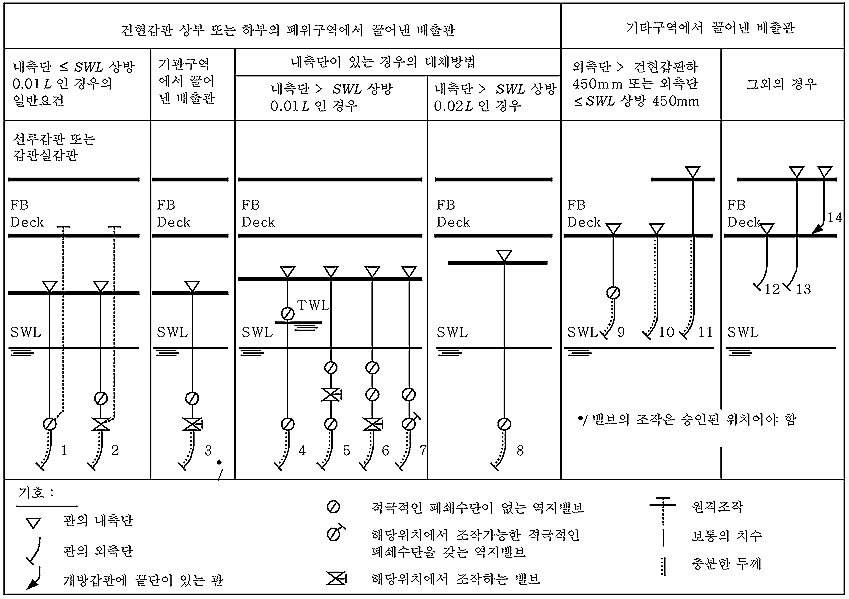

# 제12편 이중선체 유조선 공통구조규칙

> 선급 및 강선규칙/적용지침 / RA-12-K / 2025 / KO / Rules

## 12편 11장 일반요건

### 1 선체개구 및 폐쇄장치

#### 1.1 외판 및 갑판의 개구

- **1.1.1** 일반

#### 1.1.1.1

선루, 갑판실의 측면 및 단부 내의 개구에 대한 폐쇄장치에 대하여는 **1.4**를 참조한다. 넘침관 및 통풍관, 그리고 배출 및 흡입관에 대하여는 **1.5**를 참조한다.

#### 1.1.1.2

시험요건에 대하여는 **5절**을 참조한다.

- **1.1.2** 화물탱크 창구 – 재료

#### 1.1.2.1

화물탱크 및 인접구역을 위한 접근창구, 청소 및 기타개구의 덮개는 아래의 재료로 제작되어야 한다.

- **(a)** **6.1**에 따른 보통 강도의 강(연강)
- **(b)** 황동이나 청동과 같은 비철금속재료를 고려할 수 있다. 그러나 화물탱크 및 이에 인접한 구역으로의 모든 개구의 덮개에 알루미늄합금을 사용하여서는 아니 된다.
- **(c)** 의도하는 작업조건과 관련된 내화성 및 물리화학적 특성을 고려하여, 합성재료도 고려할 수 있다. 재료특성, 덮개의 설계, 제조방법의 상세를 제출하여 승인을 받아야한다.

#### 1.1.2.2

창구덮개의 패킹재료는 운송할 화물에 적합한 재료이어야 하며, 기능이 유효하게 유지되어야 한다.

- **1.1.3** 화물탱크 접근코밍

#### 1.1.3.1

건현갑판 상면상의 창구코밍높이는 600 mm 이상이어야 한다. 이보다 낮은 높이는 기국 정부에 의하여 허용될 수 있다. 또한 이러한 창구코밍의 정부는 그 것이 설치된 탱크의 가장 높은 점 보다 낮아서는 아니 되며, 손상복원성의 목적을 위하여 충분한 높이를 가져야 한다.

#### 1.1.3.2

코밍판의 총 두께는 10 mm 이상이어야 한다. 설치된 코밍의 높이가 600 mm를 초과하는 경우, 그 두께의 증가 또는 단부보강이 요구될 수 있다. 1.2 $\mathrm{m}^{ 2}$ 이상의 면적을 갖는, 그리고/또는 충분히 둥근형태를 갖는 형상이 아닌 탱크 접근용 코밍판의 치수는 추가요건의 적용을 받을 수 있다.

- **1.1.4** 화물탱크 접근창구덮개

#### 1.1.4.1

1.2 $\mathrm{m}^{ 2}$ 이하인 면적을 갖는 보강되지 않은 판 덮개의 총 두께는 12.5 mm 이상이어야 한다. 이 보다 더 넓은 면적을 가진 덮개의 총 두께는 증가시키거나 보강이 요구된다.

#### 1.1.4.2

원형창구 상의 편평하고 보강되지 않은 덮개는 600 mm 이하의 간격을 갖는 잠금장치로 고정하여야 한다.

#### 1.1.4.3

사각형창구인 경우, 잠금장치의 간격은 일반적으로 450 mm 이하로 하여야 하며, 창구모서리와 인접한 잠금장치의 거리는 230 mm 이하이어야 한다.

#### 1.1.4.4

**1.1.4.1** 내지 **1.1.4.3**의 요건은 접시형 덮개나 기타 특별히 승인된 설계에 대하여는 적용하지 않는다.

#### 1.1.4.5

덮개가 힌지를 갖는 경우, 힌지위치에 있는 코밍 및 덮개는 적절한 보강을 하여야 한다. 일반적으로 힌지는 덮개를 위한 고정장치로 볼 수 없으며, 개스킷을 과도하게 조이지 않도록 설계되어야 한다.

- **1.1.5** 기관구역 접근개구 - 보호

#### 1.1.5.1

일반적으로 기관실 위벽은 폐위된 선미루 또는 선교루에 의하여 보호되거나, **1.4**의 강도 요건을 만족하는 갑판실 구조에 의하여 보호되어야 한다.

#### 1.1.5.2

선박이 A형 건현선박을 위한 국제만재흘수선협약에 의하여 허용되는 건현으로 운항하고자 하는 경우, 폐위된 선미루, 선미루 또는 갑판실의 높이는 2.3 m 이상이어야 한다. 이들 구조의 전단격벽은 선교루 전단격벽에 대하여 요구되는 것과 동등 이상의 치수를 가져야한다.(**1.4.9** 및 **1.4.13** 참조)

- **1.1.6** 노출 선수갑판상의 소형 창구

#### 1.1.6.1

**1.1.6.2**에서 규정한 전방구역으로의 개구는 아래 **1.1.6.3** 내지 **1.1.6.14**의 규정을 만족하여야 한다.

#### 1.1.6.2

선수수선으로부터 0.25 *L* 내의 노출갑판 위에 있고, 창구위치에서 하기만재흘수선으로 부터 0.1 *L* 또는 22 m중 작은 높이에 있는 소형 창구(일반적으로 개구면적이 2.5 $\mathrm{m}^{ 2}$ 이하인)에 대하여 이 규정을 적용한다.

#### 1.1.6.3

비상탈출용으로 설계한 창구는 **1.1.6.9(a)**, **1.1.6.9(b)**, **1.1.6.13** 및 **1.1.6.14**를 만족할 필요는 없다.

#### 1.1.6.4

소형 사각형 강재창구덮개에 대하여 판두께, 보강재의 배치 및 치수는 **표 11.1.1** 및 **그림 11.1.1**을 따라야 한다.

#### 1.1.6.5

보강재는 설치되어 있는 경우, **1.1.6.10** 및 **1.1.6.11**에서 요구하는 금속 대 금속 접촉점과 일치되어야 한다.(**그림 11.1.1** 참조) 1차 보강재는 연속되어야한다. 모든 보강재는 내부모서리 보강재에 용접되어야 한다.(**그림 11.1.2** 참조)

#### 1.1.6.6

창구코밍의 상부모서리는 통상 코밍의 상부모서리로부터 190 mm를 넘지 아니하는 수평부재에 의하여 적절하게 보강되어야 한다.

#### 1.1.6.7

원형 또는 이와 유사한 형상의 소형 창구덮개인 경우, 덮개 판두께 및 보강은 소형 사각형창구에 대한 요건과 동등한 강도 및 강성을 제공하여야 한다.

#### 1.1.6.8

보통 강도의 강 이외의 재료로 제작된 소형 창구덮개인 경우, 요구되는 치수는 동등한 강도 및 강성을 제공하여야 한다.

#### 1.1.6.9

1차 잠금장치는 다음 중 한 방법을 채택한 잠금장치에 의하여 창구덮개를 정 위치에 고정시킬 수 있어야 하고 풍우밀이 되어야 한다.
쐐기를 갖는 조임핸들(dogs)는 인정되지 아니한다.

- **(a)** 포크(클램프) 위에서 조여 주는 나비너트
- **(b)** 순간작동클리트
- **(c)** 중앙식 잠금장치

#### 1.1.6.10

창구덮개에는 탄성재료의 개스킷이 설치되어야 한다. 이것은 설계된 압축력에서 금속 대 금속 접촉이 허용되어야 하며, 잠금장치가 느슨해지거나 벗겨지는 원인이 되는 그린파랑하중에 의한 개스킷의 과도한 압축을 방지하여야 한다.

#### 1.1.6.11

금속 대 금속 접촉은 **그림 11.1.1**에 보인 바와 같이 각각의 잠금장치에 가깝게 설치하여야 하며, 지지력(bearing force)을 견디기에 충분하여야 한다.

#### 1.1.6.12

1차 잠금장치는 도구를 사용하지 않고 한 사람에 의하여 설계압축압력을 얻을 수 있도록 설계 및 제작되어야 한다.

#### 1.1.6.13

나비너트를 사용한 1차 잠금장치에 있어서 포크(클램프)는 견고하게 설계되어야 한다. 포크는 끝부분을 올려서 포크를 상방으로 구부리거나 혹은 유사한 방법으로 사용 중에 나비너트 이탈 위험성을 최소화하도록 설계되어야 한다. 보강하지 아니한 강재포크의 총판두께는 16 mm 이상이어야 한다. 장치의 한 예를 **그림 11.1.2**에 나타내었다.

#### 1.1.6.14

노출된 선수갑판 상의 소형 창구는 예를 들어 1차 잠금장치가 느슨해지거나 이탈되는 경우에도 창구덮개를 제자리에 고정시킬 수 있는 슬라이딩볼트, 걸쇠(hasp) 또는 이완부착품의 고리와 같은 독립된 2차 잠금장치를 설치하여야 한다. 이들은 창구덮개 힌지와 반대 방향으로 설치하여야 한다.

#### 1.1.6.15

F.P.로부터 전방 0.25 *L*내의 노출갑판 상에 위치한 소형 창구덮개의 경우, 그린파랑의 주 방향이 덮개를 닫을 수 있도록 힌지가 설치되어야 한다. 이는 힌지가 통상 선수 테두리에 위치해야 함을 의미한다.

**표 11.1.1** **선수갑판상 소형 강재 창구덮개의 치수**

| 공칭치수 (mm × mm) | 덮개판 총 두께 (mm) | 1차 보강재 | 2차 보강재 |
| --- | --- | --- | --- |
| 공칭치수 (mm × mm) | 덮개판 총 두께 (mm) | 평강 총 치수(mm × mm) 수 |   |
| 630 × 630 | 8 | - | - |
| 630 × 830 | 8 | 100 × 8 ; 1 | - |
| 830 × 630 | 8 | 100 × 8 ; 1 | - |
| 830 × 830 | 8 | 100 × 10 ; 1 | - |
| 1030 × 1030 | 8 | 120 × 12 ; 1 | 80 × 8 ; 2 |
| 1330 × 1330 | 8 | 150 × 12 ; 2 | 100 × 10 ; 2 |

| **그림 11.1.1** **보강재의 배치** |
| --- |
|  |
| (비고) 1. 크기 단위는 mm. |

| **그림 11.1.2** **1차 잠금장치의 예** |
| --- |
|  |

- **1.1.7** 맨홀 및 평갑판구

#### 1.1.7.1

**4장/1.2**에 정의된 제1위치 또는 제2위치 또는 폐위선루 외의 선루 내에 있는 맨홀 및 평갑판구는 수밀이 가능한 견고한 덮개에 의하여 폐쇄되어야 한다.

#### 1.1.7.2

수밀 맨홀의 강도는 갑판의 강도와 동등하여야 한다.

#### 1.1.7.3

조밀한 간격의 볼트로 고정되지 아니하는 한, 덮개는 영구적으로 부착되어야 한다.

- **1.1.8** 기타 개구

#### 1.1.8.1

창구를 제외한 건현갑판 내의 개구, 기관구역 개구, 맨홀 및 평갑판구는 폐위선루, 갑판실 또는 동등한 강도 및 풍우밀성을 갖는 승강구실에 의하여 보호되어야 한다. 건현갑판 아래 구역 또는 폐위선루 내의 구역으로의 접근통로가 되는, 노출된 선루갑판 또는 건현 갑판 상 갑판실 정판 상의 모든 개구는 **1.4**에 정의된 유효한 갑판실 또는 승강구실에 의하여 보호되어야 한다.

- **1.1.9** 탈출구

#### 1.1.9.1

탈출구의 폐쇄장치는 양측에서 쉽게 조작할 수 있어야 한다.

#### 1.1.10

로프창구

#### 1.1.10.1

로프창구는 충분히 고정되어 있고 선장의 판단에 의해서만 개방되는 조건으로, 감소된 코밍을 허용할 수 있으나 일반적으로 380 mm 이상으로 하여야 한다. 총 코밍두께는 그 위치에서 선체외부판에 대한 규칙상의 최소 총 두께 또는 11 mm 중 작은 값 이상이어야 한다.

#### 1.1.11

이동식 판

#### 1.1.11.1

하역장치 또는 유사한 이유로 이동식 판이 케이싱 또는 갑판 내에 요구되는 경우, 관통되지 않은 격벽 또는 갑판과 동등한 강도를 갖는 조건으로 조립식 판이 허용할 수 있다. 조립식 판에는 평덮개를 설치할 수 있으며, 볼트지름의 5배를 넘지 않는 거리의 조밀한간격의 볼트 및 개스킷에 의하여 고정되어야 한다.

#### 1.1.11.2

항해 중 영구적으로 닫혀있는 덮개에 의하여 폐쇄되는 접근개구의 문턱높이 및 갑판개구의 코밍높이는 특별히 고려한다.

#### 1.1.12

탱크청소 및 얼리지용 개구

#### 1.1.12.1

탱크청소 및 얼리지용 개구에는 수밀덮개 또는 이와 동등한 것을 설치하여야 한다. **1.1.11**의 해당 요건을 만족하는 경우, 탱크청소 및 얼리지용 개구에 평덮개를 허용할 수 있다.

**표 11.1.2** **900 mm 높이 통풍통의 두께 및 브래킷 표준**

| 파이프 공칭지름 | 최소 총 두께(mm) | 헤드의 최대 투영면적($\mathrm{cm} ^{2}$) | 브래킷 높이(mm) |
| --- | --- | --- | --- |
| 80A | 6.3 | - | 460 |
| 100A | 7.0 | - | 380 |
| 150A | 8.5 | - | 300 |
| 200A | 8.5 | 550 | - |
| 250A | 8.5 | 880 | - |
| 300A | 8.5 | 1200 | - |
| 350A | 8.5 | 2000 | - |
| 400A | 8.5 | 2700 | - |
| 450A | 8.5 | 3300 | - |
| 500A | 8.5 | 4000 | - |

#### 1.2 통풍통

- **1.2.1** 일반

#### 1.2.1.1

통풍통은 **1.2.2** 내지 **1.2.6** 요건에 적합하여야 하며, 기관장치에 대한 우리 선급의 모든 관련요건에도 적합하여야 한다.

- **1.2.2** 통풍통에 대한 상세, 배치 및 치수

#### 1.2.2.1

표에 나타난 투영면적 이하의 헤드로 폐쇄되는 높이 900 mm의 표준 통풍통인 경우, 최소 관두께 및 브래킷 높이는 **표 11.1.2**에 따라야 한다.

#### 1.2.2.2

900 mm를 초과하는 높이의 통풍통인 경우, 브래킷 또는 대체 지지수단을 가져야 한다. 브래킷이 설치되는 경우, 그 높이에 따라 적절한 두께와 길이를 가져야 한다.

#### 1.2.2.3

통풍통은 강 또는 기타 동등한 재료로 제작된 코밍을 가져야 하고, **표 11.1.3**에 명시된 요건을 만족하여야 한다.

#### 1.2.2.4

통풍통의 모든 구성요소와 연결부위는 **1.2.3**에 정의된 하중에 견딜 수 있어야 한다.

#### 1.2.2.5

회전식 버섯형 통풍통헤드는 **1.2.3.1**에 규정한 면적에 적용하지 않는다.

#### 1.2.2.6

폐위선루 외의 선루를 통하여 지나가는 통풍통은 건현갑판에 강재 또는 기타 동등한 재료로 견고하게 제작된 코밍을 가져야 한다. 디프탱크의 통풍통 또는 이중갑판을 통하여 지나가는 터널은 수밀이어야 하며, 예상되는 압력에 견디는 치수를 가져야 한다.

**표 11.1.3** **통풍통의 코밍**

| 특징 | 요건 |
| --- | --- |
| 높이(4) | *h_coam* = 900 제1위치에서 *hc_oam* = 760 제2위치(1)에서 |
| 두께(2), (3) | *d_coam*  130 *t_coam-grs* = 7.5 165 < *d_coam* < 320 *t_coam-grs* = 8.5 *d_coam*  470 *t_coam-grs* = 10.0 중간값은 선형보간법에 의하여 구하여야 한다. |
| 지지(3) | *h_coam*이 900을 넘는 경우, 코밍은 특별히 지지되어야 한다. |
| 여기서, *h_coam* : 코밍의 높이(mm) *d_coam* : 코밍의 외경(mm) *t_coam-grs* : 코밍의 총 두께(mm) |   |
| (비고) 1. 코밍의 높이는 해당 구획 및 손상복원성 요건을 만족하기 위하여 증가될 수 있다. 2. 통풍통의 높이가 위에 주어진 것보다 큰 경우, 위에 주어진 총 두께는 그 높이 상방에서 최소 6.5 mm까지 점차 경감될 수 있다. 3. 선박의 전방에 설치된 통풍통에 대하여는 **1.2.3** 및 **1.2.4**를 참조. 4. 높이는 설치된 경우, 피복상방에서 측정되어야 한다. |   |

- **1.2.3** 통풍구에 적용하는 하중

#### 1.2.3.1

선수 0.25 *L* 내의 노출갑판 상에 있는 통풍구는, 해당 통풍구에서 하기만재흘수선으로부터 노출갑판의 높이가 0.1 *L* 또는 22 m중 작은 값 미만일 경우, **1.2.3.2, 1.2.3.3** 및 **1.2.4.1**의 규정을 만족하여야 한다.

#### 1.2.3.2

통풍통 및 폐쇄장치에 작용하는 압력 *P_vent*은 다음으로 주어진다.
 ($\mathrm{kN}/m ^{ 2}$)
여기서,
*ρ_sw* : 해수밀도, 1.025 tonnes/$\mathrm{m} ^{3}$
*v_sea* : 선수갑판에 대한 해수속도, 13.5 m/sec
*C_1* : 형상계수:
0.5 관인 경우
1.3 관 또는 일반적인 통풍통헤드
0.8 관 또는 수직방향 축을 가지는 원통형 통풍통헤드
*C_2* : 슬래밍계수, 3.2
*C_3* : 보호계수:
0.7 쇄파기 또는 선수루 바로 뒤에 위치한 관 및 통풍통헤드인 경우1.0 불워크의 바로 뒤를 포함한 그 외의 경우

#### 1.2.3.3

통풍통 및 폐쇄장치에 수평방향으로 작용하는 힘은 각 요소의 가장 큰 투영면적을 사용하여 상기 식으로부터 계산할 수 있다.

- **1.2.4** 통풍통 및 폐쇄장치에 대한 강도요건

#### 1.2.4.1

통풍통의 굽힘모멘트와 응력은 다음의 주요위치에 대하여 계산되어야 한다.
순 단면의 굽힘응력은 0.8 *σ_yd*을 초과하여서는 아니 되며, 여기서 *σ_yd*는 규정된 최소항복응력 또는 실온에서 강재의 0.2 % 내력(proof stress)이다. 부식방지와 관계없이 순 단면에 2 mm의 부식추가를 적용하여야 한다.

- **(a)** 관통 부품
- **(b)** 용접 또는 플랜지 연결부위
- **(c)** 지지 브래킷의 토 부분
- **1.2.5** 폐쇄장치

#### 1.2.5.1

이 절에서 별도로 규정하지 아니하는 한, 통풍통의 개구는 영구적으로 부착된 유효한 폐쇄장치를 가져야 한다. 갑판 상 4.5m를 초과하는 코밍을 갖는 제1위치에서의 통풍통 및 갑판 상 2.3 m를 초과하는 코밍을 갖는 제2위치에서의 통풍통은, 특이한 설계특성 때문에 필요하지 않다면, 폐쇄장치를 가질 필요가 없다. 제1위치 및 제2위치의 정의는 **4장/1.2**에 따른다.

- **1.2.6** 방화댐퍼

#### 1.2.6.1

방화댐퍼가 통풍코밍 내에 위치하는 경우, 코밍이나 통풍통을 해체하지 않고 댐퍼의 검사가 용이하도록 최소한 150 mm의 지름을 가진 검사구멍 또는 개구를 코밍 내에 설치하여야 한다. 검사구멍 또는 개구에 설치된 폐쇄장치는 코밍의 수밀보전성 및 해당되는 경우 방화보전성을 유지하여야 한다.

#### 1.3 공기관

- **1.3.1** 일 반

#### 1.3.1.1

공기관은 **1.3.2** 내지 **1.3.6**의 요건에 적합하여야 하며 기관장치에 대한 우리 선급의 모든 관련요건에도 적합하여야한다.

- **1.3.2** 높 이

#### 1.3.2.1

노천에 노출된 갑판 상 공기관의 최소높이는 다음으로 주어진다.
설치되어 있는 경우, 높이는 피복상단으로부터 물이 하방으로 침입하는 점까지 측정한다.

- **(a)** 건현갑판 상의 공기관 : 760 mm
- **(b)** 선루갑판 상의 공기관 : 450 mm

#### 1.3.2.2

공기관의 높이가 선상에서의 작업을 방해할 수 있는 경우, 그 통풍구의 개구 끝단에 승인된 폐쇄장치를 설치하는 조건으로 낮은 높이를 허용할 수 있다.

#### 1.3.2.3

모든 해당 구획 및 손상복원성 요건을 만족시키기 위하여 그 높이가 증가될 수 있다.

#### 1.3.2.4

공기관이 선루의 측면을 통하여 나오는 경우, 해당 공기관 개구의 높이는 최소한 하기만재흘수선 상부 2.3 m 이상이어야 한다. 승인된 설계의 자동벤트헤드가 설치되어야 한다.

- **1.3.3** 공기관의 상세, 배치 및 치수

#### 1.3.3.1

노천에 노출되는 경우, 공기관의 위벽두께는 **표 11.1.4**에 주어진 값 이상이어야 한다.

**표 11.1.4** **공기관의 최소 위벽두께**

| 외경(mm) | 최소 총 위벽두께(mm) |
| --- | --- |
| *d_air*  80 | 6.0 |
| *d_air*  165 | 8.5 |
| 여기서, *d_air* : 관의 외경(mm) |   |
| (비고) 1. 중간값은 선형보간법에 의하여 구하여야 한다. 2. 선박의 전방에 설치된 통풍통에 대하여는 **1.3.4** 및 **1.3.5**를 참조. |   |

#### 1.3.3.2

표에 나타난 평면투영면적 이하인 헤드로 폐쇄되는 높이 760 mm의 표준공기관인 경우, 최소 관두께 및 브랫킷 높이는 **표 11.1.5**에 규정된 바에 따른다. 브래킷이 요구되는 경우, 세 개 이상의 방사형 브래킷을 설치하여야 한다. 이에 추가하여 1.3.4의 관련요건도 만족하여야 한다.

#### 1.3.3.3

브래킷은 8 mm 이상의 총 두께, 최소 100 mm 이상의 길이 및 **표 11.1.5**에 따르는 높이를 가져야 한다. 그러나 헤드에 대하여는 연결 플랜지 위로 연장할 필요는 없다. 갑판에서 브래킷 토는 적절하게 지지되어야 한다. 이에 추가하여 **1.3.4**를 따른 하중을 작용시켜야 한다. 설치되어 있는 경우, 브래킷은 높이에 따라 적절한 두께 및 길이를 가져야 한다.

#### 1.3.3.4

총 관두께는 기관장치에 대한 우리 선급의 관련요건에 따라야 한다.

- **1.3.4** 공기관에 작용하는 하중

#### 1.3.4.1

공기관의 위치에서 측정한 하기만재흘수선으로부터 노출갑판까지의 높이가 0.1 *L* 또는 22 m중 작은 값 미만인 경우, 선수 0.25 *L* 내의 노출갑판 상의 공기관은 **1.3.4.2, 1.3.4.3** 및 **1.3.5.1**의 규정에 적합하여야 한다.

**표 11.1.5** **760 mm 높이 공기관의 두께 및 브래킷 표준**

| 파이프 공칭지름 | 최소 총 두께(mm) | 헤드의 최대투영면적($\mathrm{cm} ^{2}$) | 브래킷 높이(1) (mm) |
| --- | --- | --- | --- |
| 65A | 6.0 | - | 480 |
| 80A | 6.3 | - | 460 |
| 100A | 7.0 | - | 380 |
| 125A | 7.8 | - | 300 |
| 150A | 8.5 | - | 300 |
| 175A | 8.5 | - | 300 |
| 200A | 8.5(2) | 1900 | 300(2) |
| 250A | 8.5(2) | 2500 | 300(2) |
| 300A | 8.5(2) | 3200 | 300(2) |
| 350A | 8.5(2) | 3800 | 300(2) |
| 400A | 8.5(2) | 4500 | 300(2) |
| (비고) 1. 브래킷(**1.3.3.2** 참조)가 헤드의 연결플랜지까지 연장될 필요는 없다. 2. 관단면의 총 두께가 10.5 mm 보다 작은 경우, 또는 표에 나타난 투영헤드면적을 초과하는 경우, 브래킷이 요구된다. |   |   |   |

#### 1.3.4.2

공기관 및 폐쇄장치에 작용하는 압력 *P_pipe*은 다음으로 주어진다.
 ($\mathrm{kN}/m ^{ 2}$)
여기서,
*ρ_sw* : 해수밀도 1.025 tonnes/$\mathrm{m} ^{3}$
*v_sea* : 선수갑판에 대한 해수속도, 13.5 m/sec
*C_1* : 형상계수:
0.5 관인 경우
1.3 관 또는 일반적인 통풍통헤드
0.8 관 또는 수직방향 축을 가지는 원통형 통풍통헤드
*C_2* : 슬래밍계수, 3.2
*C_3* : 보호계수:
0.7 쇄파기(breakwater) 또는 선수루 바로 뒤에 위치한 관 및 통풍통헤드인 경우
1.0 불워크의 바로 뒤를 포함한 그 외의 경우

#### 1.3.4.3

관 및 폐쇄장치에 수평방향으로 작용하는 힘은 각 요소의 가장 큰 투영면적을 사용하여 상기 압력으로부터 계산할 수 있다.

- **1.3.5** 공기관 및 폐쇄장치에 대한 강도요건

#### 1.3.5.1

공기관의 굽힘모멘트와 응력은 다음의 주요위치에서 계산되어야 한다.
순 단면의 굽힘응력은 0.8 *σ_yd*을 초과하여서는 아니 되며, 여기서 *σ_yd*는 규정된 최소 항복응력 또는 실온에서 강재의 0.2 % 내력(proof stress)이다. 부식방지와 상관없이 순 단면에 2 mm의 부식추가를 적용하여야 한다.

- **(a)** 관통부품
- **(b)** 용접 또는 플랜지 연결부위
- **(c)** 지지브래킷의 토부분
- **1.3.6** 공기관의 폐쇄장치

#### 1.3.6.1

노천갑판 상에서 끝나는 모든 공기관은 안으로 물이 침입하는 것을 방지하기 위하여 리턴밴드(구스넥) 또는 기타 동등한 장치를 설치하여야 한다.

#### 1.3.6.2

방출구쪽에는 풍우밀 영구 폐쇄장치가 설치되어야 한다. 폐쇄장치는 자동식이어야 한다. 즉, 다음 중 어느 한 경우로 물속에 잠기는 즉시(볼 플로트 또는 동등물) 자동적으로 폐쇄되어야 한다.

- **(a)** 선박이 하기만재흘수선에서 40도로 경사하여 또는 해수유입각이 40도 미만인 경우 해수유입각으로 경사하여 방출구가 잠기는 경우
- **(b)** 손상복원성 요건을 만족시키기 위하여

#### 1.3.6.3

통풍기능을 저해시킬 수 있는 밸브를 가지는 공기관을 설치하여서는 아니 된다.

#### 1.4 갑판실 및 승강구

- **1.4.1** 적용

#### 1.4.1.1

이 절의 요건은 **1.4.3.1** 및 **1.4.3.2**에 규정된 강재 갑판실 및 승강구에 적용한다.

#### 1.4.1.2

치수요건은 항목의 흘수에 대한 상대적 수직위치에 따라 결정된다. 이 위치는 층(tier)이라는 용어로 분류한다.

- **1.4.2** 재료

#### 1.4.2.1

**1.4**의 치수요건은 **6장/1**의 요건에 따라 선체구조용 강으로 제작된 구조물에 적용한다. 알루미늄 합금인 갑판실의 치수는 우리 선급에 의하여 고려되며, 제안된 합금의 사양을 제출하여 입증하여야 한다.

- **1.4.3** 정의

#### 1.4.3.1

갑판실은 강력갑판 상에 선박 폭 B의 4 % 이상 안쪽으로 들어간 측판을 가지는 갑판구조로 정의된다.

#### 1.4.3.2

승강구는 건현갑판 하부 또는 폐위선루 내의 구역으로 통하는 접근개구를 보호하는 풍우밀 갑판구조로 정의된다.

#### 1.4.3.3

층은 갑판실 범위의 척도로서 정의된다. 갑판실 층은 한 개의 갑판과 외부격벽으로 구성된다. 일반적으로 첫 번째 층은 건현갑판 상에 위치하는 층이다.

- **1.4.4** 구조연속성

#### 1.4.4.1

선미갑판실에서, 전단격벽은 하부선체 내의 횡격벽과 일치시키거나 부분 횡격벽, 거더 및 필러의 조합에 의하여 지지되어야 한다.

#### 1.4.4.2

후단격벽은 유효하게 지지되어야 한다.

#### 1.4.4.3

강력갑판 상 갑판실부착의 모서리에서 하중이 하부의 갑판지지구조로 잘 전달되도록 갑판실과 갑판의 연결 및 배치에 주의하여야 한다.

#### 1.4.4.4

실행 가능한 한, 노출된 측벽 및 종/횡방향의 주격벽은 선체구조 내의 격벽 및/또는 깊은 거더프레임 위에 위치시켜야 하고 거주구의 여러 층과 일치시켜야 한다. 이러한 구조적 배치가 불가능한 경우, 기타 유효한 구조로 지지되어야 한다.

#### 1.4.4.5

배치는 조립단계에서의 불연속으로 인한 영향을 최소화하기 위한 것이어야 한다. 측면에서의 모든 개구는 견고히 보강되고 충분히 둥근 모서리를 가져야 한다. 문 및 유사한 개구의 상부 및 하부에는 연속된 코밍 또는 거더를 설치하여야 한다.

- **1.4.5** 갑판

#### 1.4.5.1

판의 총 두께는 다음 값 이상이어야 한다.
 (mm), 제1층 갑판실
 (mm), 제2층 갑판실
 (mm), 제3층 및 상부갑판실
여기서,
*s* : 보강재의 간격(mm)
*k* : **6장/ 1.1.4**에 정의된 고장력강계수
*σ_yd* : 재료의 규정된 최소 항복응력($\mathrm{N}/mm ^{2}$)
*s_std* : 종통재 또는 보의 표준 참조간격(m)

*L_1* : **4장/1.1.1.1**에 정의된 규칙상의 길이. 그러나 250 m 보다 커서는 아니 된다.

#### 1.4.5.2

갑판실 내의 판두께는 감소된 총 두께가 다음 값 이상일 것을 조건으로, 10 % 만큼 경감할 수 있다.
 (mm), 그러나 5.5 mm 보다 작아서는 아니 된다.
여기서,
*s* : 보강재의 간격(m)
*k* : **6장/1.1.4**에 정의된 고장력강계수
*σ_yd* : 재료의 규정된 최소 항복응력($\mathrm{N}/mm ^{2}$)

- **1.4.6** 갑판종통재 및 보

#### 1.4.6.1

각 종통재 및 보에 대하여, 부착된 판을 포함하여 총 단면계수는 다음 값 이상이어야 한다.
 ($\mathrm{cm} ^{3}$)
여기서,
*s* : 보강재의 간격(m)
*l_bdg* : **4장/2.1.1**에 정의된 유효 굽힘스팬(m)
*B* : **4장/1.1.3.1**에 따른다.
*h_tier* : 갑판실 층에 따른 수두(m):
1.68 선미루 및 건현갑판 상방 제1층
1.30 건현갑판 상방 제2층
0.91 건현갑판 상방 제3층 및 그 이상의 층
일반적으로 풍우밀만으로 사용되는 건현갑판 상방 제2층 또는 그 이상의 층의 갑판인 경우, *h_tier*의 값은 경감될 수 있으나, 0.46보다 작아서는 아니 된다.
*k* : **6장/1.1.4**에 정의된 고장력강계수
*σ_yd* : 재료의 규정된 최소 항복응력($\mathrm{N}/mm ^{2}$)

- **1.4.7** 갑판거더 및 트랜스버스

#### 1.4.7.1

갑판거더와 트랜스버스는 갑판보 또는 갑판종통재를 지지하도록 배치하여야 한다. 격자구조로서 작용하는 갑판거더 및 트랜스버스의 배치인 경우, 격자효과를 고려하고 치수가 **1.4.7.2** 및 **1.4.7.3**에 의하여 요구되는 것과 동등함을 입증하기 위하여, 추가의 해석이 수행될 수 있다. 이러한 해석에서는 총 치수가 사용되며 기본적인 기하학적 변수는 **1.4.7.2**에 나타낸 것이어야 한다. 하중은 **1.4.7.2**에 의하여 요구되는 단위밀도 0.715 tonnes/$\mathrm{m} ^{3}$을 갖는 수두로서 취한다. 허용 굽힘응력은 0.67 *s_yd*로 취한다. **1.4.7.3**에 의하여 요구되는 것과 동등한 치수를 결정하는 경우, 동등성은 거더/트랜스버스의 교차점 및 이들 부재의 중앙 스팬에서의 변위에 기초하여야 한다. 허용변위는 **1.4.7.2**의 요건을 충족하며 **1.4.7.3**에서 요구하는 깊이 *d_grd*을 갖는 단순보에 대하여 계산된 변위로서 취한다.

#### 1.4.7.2

각 갑판거더 또는 트랜스버스에 대하여, 총 단면계수 *Z_t-grs*은 다음 값 이상이어야 한다.
 ($\mathrm{cm} ^{3}$)
여기서,
*b_dk* : 갑판지지면적의 평균폭(m)
*l_bdg* : 지지필러의 중심사이, 또는 필러, 횡부재, 거더 및/또는 이들을 지지하는 격벽 사이의 거리로 취하여야 하는 유효 굽힘스팬(m). 격벽에 유효한 브래킷이 설치된 경우, 길이 *l_bdg*는 수정될 수 있다.(**4장/2.1.4** 참조)
*h_tier* : 갑판실층에 따른 수두(m):
1.68 선미루 및 건현갑판 상방 제1층
1.30 건현갑판 상방 제2층
0.91 건현갑판 상방 제3층 및 그 이상의 층
일반적으로 풍우밀만으로 사용되는 건현갑판 상방 제2층 또는 그 이상인 층의 갑판인 경우, *h_tier*의 값은 경감될 수 있으나, 0.46보다 작아서는 아니 된다.
*k* : **6장/1.1.4**에 정의된 고장력강계수
*σ_yd* : 재료의 규정된 최소항복응력($\mathrm{N}/mm ^{2}$)

#### 1.4.7.3

거더 및 트랜스버스웨브의 깊이 *d_grd* 는 다음 값 이상이어야 한다.
 (m)
여기서,
*l_bdg* : 지지필러의 중심사이, 또는 필러, 횡부재, 거더 그리고/또는 이들을 지지하는 격벽 사이의 거리로 취하여야 하는 유효 굽힘스팬(m). 격벽에 유효한 브래킷이 설치된 경우, 길이 *l_bdg*는 수정될 수 있다.(**4장/2.1.4** 참조)
거더 및 트랜스버스웨브가 교차할 때, 짧은 부재가 긴 부재의 완전한 지지를 제공하는 경우, 긴 부재에 대하여 작은 깊이를 허용하기 위한 고려를 할 수 있다.

#### 1.4.7.4

거더 및 트랜스버스웨브의 총 두께는 깊이 100 mm당 1 mm에 추가 4 mm를 더한 값 이상이어야 한다. 웨브 전단강도 및 좌굴능력이 만족하다는 것이 입증되는 경우, 더 작은 두께를 허용할 수 있다. 전단강도해석을 위하여 총 두께를 사용한다. 기본적인 기하학적 변수는 **1.4.7.2**에 나타낸 것이어야 한다. 허용전단응력은 0.39 *σ_yd*로 취한다. 좌굴능력은 웨브의 총 두께 비에 대한 깊이가 75 미만인 경우, 만족하는 것으로 한다.

- **1.4.8** 필러

#### 1.4.8.1

필러의 총 치수는 **1.4.8.4**의 요건을 고려하여 **1.4.8.2**에 따라 결정되는 허용하중이 **1.4.8.3**에 따라 결정되는 설계하중보다 크게 하여야 한다.

#### 1.4.8.2

필러의 허용하중 *W_perm*은 다음으로 주어진다.
 (kN)
여기서,
*f_s1* : 강재계수:
12.09 연강
13.59 HT27 고장력강
16.11 HT32 고장력강
17.12 HT34 고장력강
18.12 HT36 고장력강
20.14 HT40 고장력강
*h_pill* : 갑판 또는 기타구조를 지지하는 필러의 상단과 지지되는 보 또는 거더의 하부까지의 거리(m)
*f_s2* : 강재계수:
4.44 연강
5.57 HT27 고장력강
7.47 HT32 고장력강
8.24 HT34 고장력강
9.00 HT36 고장력강
10.52 HT40 고장력강
*r_gyr-grs* : 총 필러단면에 대한 회전반지름(cm)
*A_pill-grs* : 필러의 총 횡단면적($\mathrm{cm} ^{2}$)

#### 1.4.8.3

특정 필러의 설계하중 *W_des* 은 다음과 같다.
 (kN)
여기서,
*b_dk* : 갑판지지면적의 평균폭(m)
*h_tier* : 갑판실층에 따른 수두(m):
1.68 선미루 및 건현갑판 상방 제1층
1.30 건현갑판 상방 제2층
0.91 건현갑판 상방 제3층 및 그 이상의 층
일반적으로 풍우밀만으로 사용되는 건현갑판 상방 제2층 또는 그 이상인 층의 갑판인 경우, *h_tier*의 값은 경감될 수 있으나, 0.46보다 작아서는 아니 된다.
*l_dk* : 갑판지지면적의 평균길이(m)

#### 1.4.8.4

필러가 수직선으로 배치되는 경우, 각 수직높이에서 필러에 작용하는 설계하중은 필러의 직상부에 있는 갑판에 직접 작용하는 설계하중과 상부의 각 필러에 대한 설계하중의 절반을 더하여 계산되어야 한다.

- **1.4.9** 노출격벽

#### 1.4.9.1

갑판실 및 승강구의 노출격벽의 치수는 **1.4.10** 내지 **1.4.13**에 따라야 한다. 그 구조가 갑판설비, 의장, 등으로부터의 하중을 지지해야 하는 경우, 증가된 치수가 요구될 수 있다.

#### 1.4.9.2

건현갑판, 선루갑판 또는 가장 낮은 층의 갑판실 내의 개구를 보호하지 않는 갑판실의 격벽치수에 대하여 특별히 고려할 수 있다. 해당격벽이 거주실을 포함하지 않거나 선박의 운항에 필수적인 장비를 보호하지 않는 경우, 기관실 위벽을 보호하지 않는 갑판실의격벽치수도 특별히 고려할 수 있다.

#### 1.4.9.3

길이가 긴 갑판실은 래킹에 대한 저항을 제공하기 위하여 추가적인 지지가 필요할 수 있다. **1.4.13**을 참조.

#### 1.4.10

노출격벽판

#### 1.4.10.1

판의 총 두께 *t_blk-grs*은 **1.4.10.2**로부터 계산된 값 및 다음으로 주어지는 값보다 작아서는 아니 된다.
 (mm)
여기서,
*s* : 보강재의 간격(m)
*k* : **6장/1.1.4**에 정의된 고장력강계수
*σ_yd* : 재료의 규정된 최소항복응력($\mathrm{N}/mm ^{2}$)
*h_des* : 설계수두(m):

그러나 특정위치에 대하여 다음에 주어진 값보다 작아서는 아니 된다.
 최하층 상의 보호되지 아니한 전단격벽
 그 외
*L_1* : **4장/1.1.1.1**에 정의된 규칙상의 길이 *L*. 다만, 250 m보다 크게 취하지는 않는다.
*L_2* : **4장/1.1.1.1**에 정의된 규칙상의 길이 *L*. 다만, 300 m보다 크게 취하지는 않는다.
*C_4* : **표 11.1.6**에 주어진 계수
*C_5* : 계수:
 *x/L ≤* 0.45 일 때
 *x/L* > 0.45 일 때
*C_b1* : **4장/1.1.9.1**에 정의된 방형계수. 다만, 0.60보다 작거나 0.80보다 크게 취하지 않는다. 중앙부 전방의 후단격벽인 경우, *C_b1*은 0.80으로 취할 수 있다.
*x* : A.P.와 고려하는 격벽사이의 거리(m). 갑판실 선측격벽은 길이 0.15 *L*을 넘지 아니하는 등분으로 나누어져야 하고, *x*는 A.P.로부터 고려하는 각 부분의 중심까지 측정되어야 한다.
*L* : **4장/ 1.1.1.1**에 정의된 규칙상의 길이
*f* : **표 11.1.7**에 따른다.
*z* : 하기만재흘수선으로부터 판의 중간까지 측정된 수직거리(m)
*c* : 
그러나 노출된 기관케이싱 격벽인 경우 1.0보다 작아서는 아니 되고 어떠한 경우에도 *b_dh/B_1*은 0.25보다 작아서는 아니 된다.
*b_dh* : 고려하는 위치에서 갑판실의 폭(m)
*B_1* : 고려하는 위치의 건현갑판에서 선박의 실제폭(m)

**표 11.1.6** ***C******_4*****의 값**

| 격벽위치 | *C_4*의 값 |
| --- | --- |
| 보호되지 아니한 전단, 최하층 | 2.0 + $L _{2}$/120 |
| 보호되지 아니한 전단, 제2층 | 1.0 + $L _{2}$/120 |
| 보호되지 아니한 전단, 제3층 및 상부 | 0.5 + $L _{2}$/150 |
| 보호된 전단, 모든 층 | 0.5 + $L _{2}$/150 |
| 선측, 모든 층 | 0.5 + $L _{2}$/150 |
| 후단, 중앙부 후방, 모든 층 | 0.7 + ($L _{2}$/1000) - 0.8 $x/L$ |
| 후단, 중앙부 전방, 모든 층 | 0.5 + ($L _{2}$/1000) - 0.4 $x/L$ |

**표 11.1.7** ***f*****의 값**

| *L* (m) | *f* (m) |
| --- | --- |
| 90 | 6.00 |
| 100 | 6.61 |
| 120 | 7.68 |
| 140 | 8.65 |
| 160 | 9.39 |
| 180 | 9.88 |
| 200 | 10.27 |
| 220 | 10.57 |
| 240 | 10.78 |
| 260 | 10.93 |
| 280 | 11.01 |
| ≥ 300 | 11.03 |
| (비고) 이 표는 **표 11.1.8**에 주어진 식에 기초를 둔다. |   |

**표 11.1.8** ***f*** **값의 기원**

| *L* (m) | *f* (m) |
| --- | --- |
| *L* ≤ 150 |  |
| 150 < *L* < 300 |  |
| *L* ≥ 300 | 11.03 |

#### 1.4.10.2

가장 낮은 층의 격벽 총 두께 *t_blk-tier-grs*은 다음 값 이상이어야 한다.
 (mm)
다른 층에 대하여는 격벽의 총 두께는 다음 값 이상이어야 한다:
 (mm), 또는 5.0 mm중 큰 값
여기서,
*L_1* : **4장/1.1.1.1**에 정의된 규칙상의 길이 *L*. 다만, 250 mm보다 크게 취하지 않는다.

#### 1.4.11

노출격벽 보강재

#### 1.4.11.1

부착 판을 포함한 각 보강재는 다음 값 이상의 총 단면계수 *Z_blk-grs*을 가져야 한다:
 ($\mathrm{cm} ^{3}$)
여기서,
*s* : 보강재의 간격(m)
*h_tween* : 이중갑판높이(m)
*h_des* : **1.4.10.1**에 정의된 설계수두. 여기서 *z*는 하기만재흘수선으로부터 보강재스팬의 중간까지의 수직거리(m)
*k* : **6장/1.1.4**에 정의된 고장력강계수
*σ_yd* : 재료의 규정된 최소 항복응력($\mathrm{N}/mm ^{2}$)

#### 1.4.12

노출격벽 보강재의 단부부착

#### 1.4.12.1

가장 낮은 층의 노출격벽 보강재의 양단은 유효하게 부착하여야 한다. 다른 형태의 단부연결을 갖는 보강재의 치수는 특별히 고려하여야 한다.

#### 1.4.13

노출격벽 상의 웨브배치

#### 1.4.13.1

다층 구조를 갖는 긴 갑판실에는, 첫 번째 층 내에 특설늑골 또는 부분격벽을 설치하여야 하며, 그 간격은 최대 약 9 m로 하고, 실행가능한 한 하부의 수밀격벽과 일치시켜야한다.

#### 1.4.13.2

또한 큰 개구, 보트대빗 및 큰 하중을 받는 곳에도 웨브를 배치하여야 한다.

#### 1.4.14

갑판실 및 승강구 내의 개구에 대한 폐쇄장치

#### 1.4.14.1

폐위선루 또는 건현갑판 하부의 구역으로 직접 통하는 갑판실 및 승강구의 격벽에 있는 모든 개구는, 어떠한 해상상태에서도 물이 선박으로 들어오지 않도록 하는 유효한 폐쇄수단을 가져야 한다.

#### 1.4.14.2

그러한 개구의 문은, 강재 또는 이와 동등한 재료이어야 하며, 격벽에 영구적으로 견고하게 부착되어야 한다. 문은 격벽이나 문 자체에 영구적으로 부착된 개스킷 및 조임장치 또는 다른 동등한 장치를 가져야 한다. 문은 격벽의 양측에서 조작할 수 있도록 배치되어야 한다. 인정된 국가 또는 국제표준을 만족하는 문은 일반적으로 인정될 수 있다.

#### 1.4.14.3

접근개구는 문틀로 보강되어서 닫혔을 때 전체구조가 개구가 없는 격벽과 동등하여야 한다.

#### 1.4.14.4

**1.4.14.5**에 의하여 허용된 경우를 제외하고, 접근개구, 공기흡입구 및 거주구역, 통제실 및 기관구역의 개구는 화물탱크지역과 맞닿지 않아야 한다. 이러한 개구들은, 화물탱크지역과 맞닿는 갑판실의 끝으로부터 3 m 이상 및 최소한 0.04 *L* 떨어진 횡격벽 또는 갑판실 측면에 설치하여야 한다. 이 거리는 5 m를 초과할 필요는 없다.

#### 1.4.14.5

해당 문이 거주구역, 제어장소 또는 업무구역(조리실, 조리기구실, 작업실 또는 증기발화원을 포함하는 유사한 구역과 같은)을 포함하거나 제공하는 어떠한 다른 구역으로 직접 또는 간접적으로 통하지 않는 조건으로, 화물탱크지역과 맞닿거나 또는 **1.4.14.4**에서 규정한 5 m 한계 내에 있고 주화물제어실 및 업무구역(식량창고, 선용품실 및 로커와 같은)으로 통하는, 경계격벽 내의 출입문을 허용할 수 있다. 그러한 구역의 경계는, 화물탱크지역과 맞닿는 경계를 제외하고는 A-60등급으로 방열하여야 한다.

#### 1.4.15

접근개구의 문턱

#### 1.4.15.1

폐위선루 또는 건현갑판 하부의 구역으로 직접 통하는, 갑판실 및 승강구의 격벽에 있는 접근개구의 문턱높이는 **4장/1.2**에서 정의하는 제1위치에서 최소한 600 mm, 제2위치에서 최소한 380 mm로 하여야 한다.

#### 1.4.16

A형 건현 유조선의 기관실 위벽에 있는 접근개구

#### 1.4.16.1

일반적으로 건현갑판으로부터 노출된 기관실 위벽 내의 기관구역까지 직접 통하는 개구가 있어서는 아니 된다.

#### 1.4.16.2

해당 문이 기관실 위벽과 같이 견고하게 제작된 구역 또는 통로로 통하고, **1.4.14.1** 내지 **1.4.14.3**의 요건을 만족하는 2차 문에 의하여 기관실로부터 격리되어 있다면, **1.4.14.1** 내지 **1.4.14.3**의 요건을 만족하는 문은 노출된 기관실 위벽에 허용될 수 있다. 외부 문의 문턱은 600 mm 이상으로 하여야 하고, 2차 문의 문턱은 230 mm 이상이어야 한다.

#### 1.4.17

창과 현창

#### 1.4.17.1

갑판실 외부격벽의 현창 및 풍우밀문은 인정된 국가 또는 국제기준에 따라 견고한 구조로 하여야 한다.

#### 1.4.17.2

선루 내부로 또는 건현갑판 아래의 구역으로 통하는 직접 접근통로를 보호하는 갑판실의 경계에 설치된 창 및 현창은 유효한 힌지식 안덮개를 설치하여야 한다.

#### 1.4.17.3

화물탱크지역에 면하는 창 및 항등, 그리고 **1.4.14.4** 및 **1.4.14.5**에서 규정한 한계 내의 선루 또는 갑판실의 측면 상에 있는 창 및 항등(portlight)은 고정식(비개방형)이어야 한다. 조타실 창을 제외하고 이러한 창과 항등은 A-60급 기준을 따라 설치하여야 한다.

#### 1.5 배수구, 흡입구 및 배출구

- **1.5.1** 배수– 폐위구역

#### 1.5.1.1

국제만재흘수선협약 제12규칙의 요건을 만족하는 문이 설치된, 건현갑판 하부 또는 건현갑판 상부 비손상 선루 내 또는 갑판실 내의 구역을 배수하는 배수구 및 배출구에 대하여, 배수구의 경우에는 빌지로 또는 화장실 배출수의 경우에는 화장실 탱크로 유도할 수 있다. 대안으로서 해당 배수구 또는 배출구는 다음 조건 하에 선외로 유도할 수 있다.

- **(a)** 좌우현 어느 쪽이든지 선박이 5도 기울었을 때 갑판 선측가장자리가 잠기지 않을 건현을 갖고,
- **(b)** 각 배수시설이, **1.5.3**에 따라 물이 선내를 통과하는 것을 방지하는 수단이 설치될 것
- **1.5.2** 배수– 개방구역

#### 1.5.2.1

국제만재흘수선협약 제12규칙의 요건을 만족하는 문이 설치되지 않은 선루 또는 갑판실로부터 유도되는 배수는 선외로 유도하여야 한다.

- **1.5.3** 물의 선내 통과방지

#### 1.5.3.1

선외로 유도하는 것이 허용된, 건현갑판 하방의 구역으로부터 또는 건현갑판 상방의 선루 및 갑판실 내로부터의 배수시설(**1.5.1.1(a)** 참조)은, **1.5.3.2** 내지 **1.5.3.7**에 따라 물이 선내를 통과하는 것을 방지하는 유효하고 접근 가능한 수단을 설치하여야 한다.

#### 1.5.3.2

화장실 배출구와 같이 선박의 정상운항 중에 열린 채로 있는 배수시설인 경우, 물이 선내를 통과하는 것을 방지하는 수단은 상기 지역에 대하여 다음에 따라야 한다. *h_disc*는 하기만재흘수선으로부터 배출구 선내단까지의 높이(m)이다.
• 건현갑판 상부의 위치에 적극적인 폐쇄수단을 갖는 한 개의 자동역지밸브
• 이를 대신하여, 한 개의 자동역지밸브 및 건현갑판 상방에서 조작되는 한 개의 적극적인 잠금밸브를 허용할 수 있다.
• 선내밸브가 운항상태에서 점검을 위하여 항상 접근 가능한 경우, 적극적인 폐쇄수단이 없는 두 개의 자동역지밸브.
• 이러한 선내밸브는 가장 깊은 흘수선 상방에 있어야 한다.
• 이것이 실행 불가능한 경우, 추가의 해당위치에서 조작되는 적극적인 폐쇄수단을 선외에 갖거나 또는 해당위치에서 조작되는 적극적인 폐쇄수단의 선외역지밸브를 가질 수 있다. 이러한 경우 선내밸브는 가장 깊은 흘수선 상방에 있을 필요는 없다.
• 적극적인 폐쇄수단이 없는 한 개의 자동역지밸브

- **(a)** *h_disc* *≤* 0.01 *L_L*:
- **(b)** 0.01 *L_L* < *h_disc* *≤* 0.02 *L_L* :
- **(c)** *h_disc* > 0.02 *L_L*:

#### 1.5.3.3

기관구역의 선외배출구인 경우, **1.5.3.2**에서 요구되는 것을 대신하여 선내의 역지밸브와 외판의 해당위치에서 조작되는 한 개의 적극적인 잠금밸브를 허용할 수 있다.

#### 1.5.3.4

배출구 및 배수구에 대한 허용 가능한 배치에 대하여는 **그림 11.1.3**을 참고한다.

| **그림 11.1.3** **배출관 및 배수관장치의 그림 표시** |
| --- |
|  |

#### 1.5.3.5

톱사이드 평형수탱크로부터의 중력식 배수와 같이, 해상에서 닫혀있는 배수구인 경우, 갑판에서 조작되는 단일 나사조임식 밸브를 허용할 수 있다.

#### 1.5.3.6

적극적인 잠금밸브를 조작하는 수단은 쉽게 접근가능 하여야 하고 개폐지시지를 설치하여야 한다.

#### 1.5.3.7

건현갑판 하방 450 mm 이상 또는 하기만재흘수선 상방 600 mm 이하의 외판을 관통하는 모든 위치에서 시작하는 배수관은 외판에 역지밸브를 설치하여야 한다. **1.5.3.2** 내지 **1.5.3.4**에 의하여 요구되지 않는다면 관이 **1.5.7.3**에 따라 충분한 두께를 갖는 경우, 이 밸브는 생략될 수 있다.

- **1.5.4** 해수흡입구

#### 1.5.4.1

유인 기관구역 내에서, 기관운전과 관련된 주 및 보조해수흡입구 및 배출구는 해당 위치에서 조작될 수 있다. 조작하는 수단은 쉽게 접근가능 하여야 하고 개폐지시기를 설치하여야 한다.

- **1.5.5** 외판밸브 및 부속품

#### 1.5.5.1

설치에 대하여, 외판밸브는 외판(또는 해수흡입구)에 부착하여야 한다. 이것이 실행 불가능한 경우, **1.5.7.3**에 따르는 충분한 두께의 디스턴스피스를 설치할 수 있다. 외판배출구는 어떤 배출수도 내려진 생존정 위로 떨어지지 않도록 위치시켜야 한다.

#### 1.5.5.2

재료에 대하여, 모든 요구되는 외판밸브와 부속품은 강, 동 또는 기타 승인된 연성재료이어야 한다. 일반적인 주철 또는 유사한 재료의 밸브는 허용되지 않는다.

#### 1.5.5.3

열에 의하여 쉽게 유효성을 상실하는 재료는, 화재 시 재료의 손상이 침수의 위험을 초래할 수 있는 외판연결부에 사용하여서는 아니 된다.

- **1.5.6** 무인기관구역

#### 1.5.6.1

무인기관구역에 대하여, 해수흡입구, 수선하부의 배출구 또는 빌지분사장치에 쓰이는 밸브의 제어는, 만재상태에서 선내로 물이 침입할 때 그 제어장치에 접근하여 조작하기에 적절한 시간을 허용하는 위치에 설치하여야 한다.

#### 1.5.6.2

무인기관구역에 대아여 **1.5.6.1**을 적용함에 있어서, 가장 높은 빌지경보가 개시되고 10분 후에 손상으로 인한 수선이 탱크정판 상방에 있지 않음이 계산으로 입증될 수 있는 경우, 그 밸브의 제어는 탱크정판에서 이루어질 수 있다.
(주)
각 기국은 이 요건에 대한 해석을 가지고 있다. 이 요건에 대한 해석을 가지고 있는 정부의 선박인 경우, 그 기국의 해석이 **1.5.6.2**의 요건에 우선한다.

- **1.5.7** 관

#### 1.5.7.1

외판으로부터 첫 번째 밸브까지 모든 관은 강 또는 이와 동등한 재료이어야 한다.

#### 1.5.7.2

더 두꺼운 두께가 요구되지 않는다면, 밸브의 선내 강관의 총 벽두께는 **표 11.1.9**에 주어진 값 이상으로 한다.

**표 11.1.9** **일반강관의 두께**

| 외경(mm) | 총 위벽두께(mm) |
| --- | --- |
| ≤ 155 | 4.5 |
| ≥ 230 | 6.0 |
| (비고) 1. 중간값은 선형보간법에 의하여 구한다. |   |

#### 1.5.7.3

더 두꺼운 두께의 것이 요구되는 경우, 강관의 총 벽두께는 **1.5.3.7** 및 **1.5.5.1**을 참고하여, **표 11.1.10**에 주어진 값 이상이어야 한다.

**표 11.1.10** **두꺼운 강관의 두께**

| 외경(mm) | 총 위벽두께(mm) |
| --- | --- |
| ≤ 80 | 7.0 |
| 180 | 10.0 |
| ≥ 220 | 12.5 |
| (비고) 1. 중간값은 선형보간법에 의하여 구한다. |   |

- **1.5.8** 쓰레기 투하장치, 쓰레기 및 유사한 배출구

#### 1.5.8.1

쓰레기 투하장치, 쓰레기 및 유사한 배출구는 연강 관 또는 외판두께와 같은 판으로 만들어야 한다. 기타재료는 특별히 고려된다.

#### 1.5.8.2

개구는 현측후판 및 높은 응력집중부위로부터 떨어져야 한다.

#### 1.5.8.3

쓰레기 투하장치의 호퍼는, 배출구플랩과 호퍼덮개가 동시에 열릴 수 없도록 연동장치를 갖고 선내단에 힌지식 풍우밀덮개로 구성되어야 한다.

#### 1.5.8.4

호퍼덮개는 사용하지 않을 때는 잠겨있어야 하고, 제어위치에 적절한 경고를 게시하여야 한다.

#### 1.5.8.5

호퍼의 선내단이 0.01 *L_L* 미만인 경우, 덮개와 플랩에 추가하여 가장 깊은 흘수선 상방의 쉽게 접근가능한 위치에 적극적인 잠금밸브를 가져야 한다.

#### 1.5.8.6

밸브는 호퍼와 인접한 위치에서 조작되어야 하며 개폐지시기를 설치하여야 한다. 밸브는 사용하지 않을 때는 잠겨있어야 하며, 그러한 취지의 경고문이 밸브조작위치에 게시되어야 한다.

### 2 선원의 보호

#### 2.1 불워크 및 보호난간

- **2.1.1** 일반

#### 2.1.1.1

노출된 건현갑판 및 선루갑판의 경계, 제1층 갑판실의 경계 및 선루의 끝단에는 불워크 또는 보호난간을 설치하여야 한다.

#### 2.1.1.2

불워크 또는 보호난간의 높이는 피복으로부터 측정하여 최소한 1.0 m이어야 하며, **2.1.2**의 요건에 따라 제작되어야 한다. 다만, 이 높이가 선박의 통상의 작업을 방해하는 경우에는 보다 낮은 높이를 승인할 수 있다. 보다 낮은 높이의 승인이 요청되는 경우, 정당성을 입증하는 자료를 제출하여야 한다.

#### 2.1.1.3

중앙부 0.6 *L* 내에서, 불워크는 선체거더응력을 받지 않도록 배치되어야 한다.

#### 2.1.1.4

선원실구역, 기관구역 및 선박의 선원작업을 위하여 필요한 모든 기타구역으로 통행하는 선원의 보호를 위하여 보호난간, 구명줄, 상설보행로, 갑판하 통로 또는 동등물의 형태의 만족할 만한 수단이 제공되어야 한다.(**2.3.1.1** 참조)

- **2.1.2** 불워크의 구조

#### 2.1.2.1

노출된 건현갑판 및 선루갑판의 경계에서 불워크판의 총 두께는 **표 11.2.1**에 주어진 값 보다 작아서는 아니 된다.

**표 11.2.1** **불워크판의 두께**

| 불워크의 높이 | 총 두께 |
| --- | --- |
| 1.8 m 이상 | 동일한 위치의 선루에 요구되는 두께 |
| 1.0 m | 6.5 mm |
| 중간높이 | 선형보간법에 의하여 결정되어야 한다 |

#### 2.1.2.2

판재 불워크는 상부난간에 의하여 보강되어야 한다. 건현갑판 및 선수루 갑판 상부의 판재 불워크는 일반적으로 2.0 m를 넘지 아니하는 간격(spacing)의 지주에 의하여 지지되어야 한다.

#### 2.1.2.3

지주의 자유단은 보강되어야 한다.

#### 2.1.2.4

지주의 총단면계수 *Z_stay-grs*는 아래 주어진 값보다 작아서는 아니 된다. 단면계수의 계산에 있어서는 갑판에 연결된 재료만이 포함되어야 한다. 지주의 벌브 또는 플랜지는 갑판에 연결된 경우 고려될 수 있다. 선박의 끝단에서, 불워크판이 현측후판에 연결된 경우, 600 mm를 넘지 아니하는 부착된 판의 폭이 포함될 수도 있다.
 ($\mathrm{cm} ^{3}$)
여기서,
*h_blwk* : 갑판상면으로부터 난간상면까지의 불워크 높이(m)
*S_stay* : 지주간격(m)

#### 2.1.2.5

계류장치가 불워크에 큰 힘을 작용시키는 경우, 지주의 강도는 적당히 증가되어야 한다.

#### 2.1.2.6

불워크지주는 적당한 갑판하 보강재에 의하여 지지되거나 일치되어 있어야 한다. 보강재는 불워크지주 연결에서 양면연속필렛용접에 의하여 연결되어야 한다.

#### 2.1.2.7

불워크가 현문 또는 기타개구의 형태로 절단되는 경우, 개구의 끝단에는 보강된 지주를 설치하여야 한다.

#### 2.1.2.8

불워크는 계류관에 대하여 적절히 보강되고 두께를 증가시켜야 한다.

#### 2.1.2.9

현문 또는 기타개구를 위한 불워크 내의 절단시공이 선루에서는 없어야 한다.

#### 2.1.2.10

불워크가 설치된 경우, **2.1.5**의 요건에 따라 방수구를 설치하여야 한다. 방수구는 우리 선급의 요건에 적합하여야 한다.

- **2.1.3** 보호난간의 구조

#### 2.1.3.1

2.1.1.1에서 요구되는 보호난간의 지지대는 다음 요건에 적합하여야 한다.

- **(a)** 고정식, 탈착식 또는 힌지식의 지지대는 약 1.5 m의 간격으로 설치되어야 한다.
- **(b)** 적어도 매 3번째 지지대는 브래킷이나 지주에 의해 지지되어야 한다.
- **(c)** 탈착식 또는 힌지식 지지대는 직립된 상태에서 고정될 수 있어야 한다.
- **(d)** 둥근거널을 가지는 선박인 경우, 지지대는 갑판의 평평한 곳에 놓여져야 한다.
- **(e)** 현측후판을 가지는 선박인 경우, 지지대는 현측후판, 업스탠드 또는 연속된 거터바에 부착되어서는 아니 된다.

#### 2.1.3.2

보호난간의 최하열의 하방으로 갑판 또는 업스탠드까지의 개구는 최대 230 mm를 넘어서는 아니 된다. 나머지 횡봉의 간격은 380 mm 이하이어야 한다.

#### 2.1.3.3

특별한 경우 및 제한된 길이 내에서 보호난간 대신에 와이어로프도 인정될 수 있다. 이 경우 와이어로프는 턴버클을 이용하여 팽팽하게 유지되어야 한다.

#### 2.1.3.4

두개의 고정된 지지대 그리고/또는 불워크 사이에 설치된 경우, 보호난간 대신에 체인도 인정될 수 있다.

- **2.1.4** 누설방지에 관련된 불워크 및 보호난간에 대한 추가요건

#### 2.1.4.1

일반적으로 개방형보호난간은 상갑판 상에 설치되어야 한다. 하단에 높이 230 mm의 연속된 개구를 가지는 판재 불워크는 그 배치가 갑판상 누출물을 적절히 처리할 수 있고 인화성 가스가 축적될 가능성을 최소화 하는 것을 조건으로 허용될 수 있다.

#### 2.1.4.2

갑판상 누설은 화물갑판 주위로 최소높이 100 mm의 연속된 상설코밍에 의하여 거주구역 및 업무구역으로 분출되거나 해상으로 배출되는 것이 방지되어야 한다. 화물갑판 후단에서 선측을 따라, 코밍은 각 모서리로부터 전방으로 최소 4.5 m 연장되고 최소높이는 200 mm이어야 한다. 화물갑판의 후단에서, 코밍의 최소높이는 300 mm이어야 하고 선측으로부터 선측까지 연장되어야 한다.

#### 2.1.4.3

연속된 거터바 갑판코밍이 설치된 경우, 거터바는 부착된 갑판과 동일한 재료강도 및 등급으로 제작되어야 한다.

#### 2.1.4.4

기계식의 배수구 플러그가 제공되어야 한다. 또한 코밍 사이의 기름 또는 유성폐수의 배수 또는 제거수단이 제공되어야 한다.

- **2.1.5** 깊은 적재에 대한 추가요건

#### 2.1.5.1

A형 또는 B-100형 건현(즉, B-60형에 기초한 것 보다 작은 건현)을 가지는 선박은 노천갑판 노출부 길이의 최소 1/2에 걸쳐 개방형 보호난간이 설치되어야 한다. 이를 대신하여 연속된 불워크가 설치된 경우, 최소방수구면적은 불워크 전체면적의 최소한 33 %이어야 한다. 방수구면적은 불워크의 하부에 위치하여야 한다.

#### 2.1.5.2

선루가 트렁크에 연결된 경우, 건현갑판의 노출부 전체길이에 걸쳐 개방형 보호난간이 설치되어야 한다.

#### 2.1.5.3

B-60형 건현(즉, B형에 기초한 것보다 작고 B-60형보다는 작지 아니한 건현)을 가지는 선박은 불워크 전체면적의 최소 25 %의 최소방수면적을 가져야 한다. 방수구면적은 불워크의 하부에 위치하여야 한다.

#### 2.2 탱크로의 접근

- **2.2.1** 화물탱크지역 내의 탱크로의 접근

#### 2.2.1.1

화물탱크지역 내의 탱크로의 접근은 **5장/5**에 따라야 한다.

#### 2.3 선수로의 접근

- **2.3.1** 일반

#### 2.3.1.1

험한 기상상태에서도 선원이 안전하게 선수로 접근할 수 있도록 하는 수단이 제공되어야한다.(**표 11.2.2** 참조)

**표 11.2.2** **접근에 대한 인정 가능한 설비**

| 접근위치 | 지정된 하기건현 | 지정된 건현형식에 따라 인정 가능한 설비(6)(7)(8) |   |   |   |
| --- | --- | --- | --- | --- | --- |
| 접근위치 | 지정된 하기건현 | A형 | B-100형 | B-60형 | B형 & B^+형 |
| 선수단으로의 통행 선미루와 선수 사이, 또는 거주설비 또는 항해설비, 또는 둘 다를 포함한 갑판실과 선수 사이, 또는 평갑판 선박의 경우, 선원거주용 갑판실과 선수단 사이 |  | a e f(1) f(5) |   |   |   |
| 선수단으로의 통행 선미루와 선수 사이, 또는 거주설비 또는 항해설비, 또는 둘 다를 포함한 갑판실과 선수 사이, 또는 평갑판 선박의 경우, 선원거주용 갑판실과 선수단 사이 |  | a e f(1) f(2) |   |   |   |
| 선미단으로의 통행 평갑판 선박의 경우, 선원거주용 갑판실과 선미단 사이 | ≤ 3000mm | a b c(1) e f(1) | a b c(1) c(2) e f(1) f(2) | a b c(1) c(2) e f(1) f(2) | a b c(1) c(2) c(4) d(1) d(2) d(3) e f(1) f(2) f(4) |
| 선미단으로의 통행 평갑판 선박의 경우, 선원거주용 갑판실과 선미단 사이 | > 3000mm | a b c(1) d(1) e f(1) | a b c(1) c(2) d(1) d(2) e f(1) f(2) | a b c(1) c(2) c(4) d(1) d(2) d(3) e f(1) f(2) f(4) | a b c(1) c(2) c(4) d(1) d(2) d(3) e f(1) f(2) f(4) |

| **표 11.2.2 (계속)** **접근에 대한 인정 가능한 설비** |
| --- |
| 여기서, $h _{ss}$ : ICLL 제33규칙에 정의된 선루의 표준높이 $h _{FB}$ : 실제로 지정된 건현 형식과 관계없이, A형 선박으로서 계산된, 선박 중앙부 하기만재흘수선으로부터의 건현(m) a : 건현갑판에 가능한 가까이 설치하여야 하며, 고려하는 위치로의 출입을 위하여 충분히 조명되고 환기되는 최소한 폭 0.8 m 및 높이 2 m의 장애물이 없는 개구를 가진 갑판하 통로 b : 영구적으로 설치된 상설보행로, 이것은 선루갑판의 높이 또는 그 상부에 설치되고, 선박의 중심선상 또는 가능한 한 중심선 근처에 설치되고, 폭이 0.6 m 이상이고 미끄럼방지 표면으로 되어있는 연속된 보행로로서 양쪽에 전 길이에 걸쳐 연결된 발턱 및 보호난간을 제공하여야 한다. 보호난간은 최대 1.5 m 간격의 지지대가 설치되어야하는 경우를 제외하고 **2.1.3**의 요건에 따라야 한다. c : 폭이 최소 0.6 m 이상인 영구적인 통행로, 이것은 건현갑판 높이에 설치되며 최대 3 m의 간격으로 배치된 지지대와 2열을 가진 보호난간이 통행로 양측에 설치되어야 한다. 횡봉의 열의 수 및 간격은 **2.1.3**에 따라야 한다. B형 선박에 있어서, 높이가 0.6 m 이상인 창구코밍은 통행로의 한 쪽 보호난간을 형성하는 것으로 인정될 수 있다. 다만, 이 경우 창구사이에는 통행로 양쪽에 2열의 보호난간을 설치하여야 한다. d : 약 10 m 간격의 지지대로 지지되고 최소지름 10 mm의 로프구명줄, 또는 창구사이에 연속되어 있고 적절히 지지되어있는 창구코밍에 부착된 단일의 난간 또는 와이어로프 e : 선루갑판 또는 그 상부, 선박의 중심선 또는 가능한 한 중심선 근처에 영구적으로 설치된 상설보행로: • 갑판의 작업지역을 가로질러서 용이한 통행을 방해하지 않도록 위치할 것 • 폭이 적어도 1.0 m 이상인 연속적인 보행로를 제공할 것 • 내화성 및 미끄럼방지 재료로 제작될 것 • 보행로 양쪽에 전 길이에 걸쳐 연결된 보호난간이 설치될 것. 보호난간은 최대 1.5 m 간격의 지지대가 설치되어야하는 경우를 제외하고 **2.1.3**의 요건에 따라야 한다. • 양쪽에 발턱이 설치될 것 • 적절하게 사다리가 설치되어 갑판으로의 출입이 가능한 개구를 가질 것. 개구는 40 m 이상 떨어져 있지 않아야 함. • 상설보행로가 설치되어야 할 노출갑판의 길이가 70 m를 초과한다면, 45 m 이하의 간격으로 상설보행로 상에 충분한 구조의 피난처를 설치할 것. 모든 피난처는 적어도 한사람 이상을 수용할 수 있어야 하며 전방 및 좌우현의 비바람으로부터 보호할 수 있도록 건조되어야 한다. f : 발턱을 제외한 ‘e’ 에 규정된 영구적인 상설보행로와 같은 사양을 갖는, 선박의 중심선상 또는 가능한 한 중심선에 가까이, 건현갑판 높이에 위치한 영구적이고 유효하게 건조된 통행로. 폐쇄상태에서 창구코밍과 창구덮개를 합친 창구코밍높이가 1 m 이상이고 창구사이에는 통행로 양쪽에 보호난간이 설치된 B형 건현 선박의 경우, 창구코밍이 통행로의 한쪽 보호난간을 형성하는 것으로 인정할 수 있다. |

| **표 11.2.2 (계속)** **접근에 대한 인정 가능한 설비** |
| --- |
| (비고) 1. 선박의 중심선 또는 근처, 또는 선박의 중심선 또는 근처의 창구상에 설치 2. 선박의 각 현에 설치 3. 선박의 한쪽 현에 설치, 다만, 어느 현에도 설치될 수 있는 설비를 가질 것 4. 선박의 한쪽 현에만 설치 5. 가능한 한 중심선 가까이 창구의 양쪽에 설치 6. 와이어로프가 설치된 경우, 팽팽한 상태를 유지할 수 있도록 적절한 장치가 설치되어야 한다. 7. 영구적으로 설치된 배관 및 다른 부착품들과 같은 장애물 위로 넘어가는 통행수단이 제공되어야 한다. 8. 일반적으로 상설보행로 또는 통행로의 폭은 1.5 m를 넘어서는 아니 된다. |
| (주) 1. 각 경우마다 해당 기국의 협정이 있는 조건으로 이 요건의 일부 또는 전부에 대한 적용 제외를 허용할 수 있다. |

### 3 지지구조 및 구조적 부가물

#### 3.1 갑판설비에 대한 지지구조

- **3.1.1** 일반

#### 3.1.1.1

**3.1.2** 내지 **3.1.7**에 나열된 갑판설비 및 의장의 지지구조에 대한 자료가 승인을 위하여 제출되어야 한다.

#### 3.1.1.2

이 절은 다음 설비 및 의장의 지지구조 및 거치대에 대한 치수요건을 포함한다.

- **(a)** 양묘기
- **(b)** 앵커체인 스토퍼
- **(c)** 무어링윈치
- **(d)** 갑판크레인, 데릭 및 리프팅마스트
- **(e)** 비상예인장치
- **(f)** 볼라드 및 비트, 페어리더, 스탠드롤러, 촉 및 캡스턴
- **(g)** 특별승인을 받아야 하는 기타 갑판설비 및 의장
- **(h)** 특별승인을 받지 않아도 되는 기타 갑판의장

#### 3.1.1.3

갑판설비가 작동하중 및 그린파랑하중과 같은 복합하중상태에 적용되는 경우, 작동하중 및 그린파랑하중은 거치대 및 지지구조의 강도평가에 대하여 개별적으로 적용되어야 한다.

- **3.1.2** 양묘기 및 체인스토퍼에 대한 지지구조

#### 3.1.2.1

양묘기는 갑판에 유효하게 거치되고 고정되어야 한다. 양묘기 및 체인스토퍼 근처의 갑판두께는 갑판부착물 설계에 상응하는 것이어야 한다.

#### 3.1.2.2

**3.1.2.6**의 요건에 적합하는 것에 추가하여, 선박건조자 및 양묘기 제조자는 거치대가 양묘설비의 안전한 작동 및 유지보수에 적당하다는 것에 만족하여야 한다.

#### 3.1.2.3

파단강도는 체인의 최소파단강도로 정의된다.

#### 3.1.2.4

다음의 도면 및 자료가 승인을 위하여 제출되어야 한다.

- **(a)** 양묘기에 대한 지지구조의 상세
- **(b)** 거치볼트의 재료사양 및 거치대의 갑판연결을 포함하여, 양묘기 거치대 설계의 상세
- **(c)** 재료사양 및 거치대의 갑판연결을 포함하여, 체인스토퍼 거치대 설계의 상세

#### 3.1.2.5

다음의 보완자료가 제출되어야 한다.

- **(a)** 앵커설비의 일반배치도
- **(b)** **3.1.2.8** 및 **3.1.2.9**에 규정된 설계하중 및 거치대와 지지구조에 작용하는 관련 반력

#### 3.1.2.6

지지구조의 치수는 **3.1.2.8** 및 **3.1.2.9**에 규정된 각 하중시나리오에 대하여 지지구조 내의 계산된 응력이 **3.1.2.15** 내지 **3.1.2.18**에 주어진 허용응력수준을 넘지 아니한다는 것을 확보하도록 결정되어야 한다.

#### 3.1.2.7

이들 요건은 총 두께를 이용한 탄성보이론, 이차원격자 또는 유한요소해석에 기초를 둔 간단한 공학적 해석을 사용하여 평가되어야 한다.

#### 3.1.2.8

다음의 하중상태가 앵커작동에 대하여 적절히 시험되어야 한다.
파단강도는 **3.1.2.3**에 따른다.

- **(a)** 체인스토퍼가 있는 양묘기: 파단강도의 45%
- **(b)** 체인스토퍼가 없는 양묘기: 파단강도의 80%
- **(c)** 체인스토퍼: 파단강도의 80%

#### 3.1.2.9

다음의 힘들이 0.25 *L* 전방의 그린파랑에 따른 설계하중에 대하여 시험되어야 하는 하중상태에 각각 적용되어야 한다.(**그림 11.3.1** 참조)
 (kN), 축에 수직으로 작용
 (kN), 축에 평행하게 작용(선내측 및 선외측방향이 개별적으로 시험되어야 한다)
여기서,
*A*_x : 투영정면면적($\mathrm{m}^{ 2}$)
*A*_y : 투영측면면적($\mathrm{m}^{ 2}$)
*f* = 1+*B_w/H*, 그러나 2.5보다 커서는 아니 된다.
*B_w* : 축에 평행하게 측정된 양묘기의 폭(m).(**그림 11.3.1** 참조)
*H* : 양묘기의 전체높이(m).(**그림 11.3.1** 참조)

| **그림 11.3.1** **힘과 중량의 방향** |
| --- |
|  |

#### 3.1.2.10

양묘기를 갑판에 고정시키는 볼트, 촉 및 스토퍼에 그린파랑 설계하중으로부터 작용하는 힘이 계산되어야 한다. 양묘기는 각기 한 개 또는 그 이상의 볼트를 포함하는 몇 개의 볼트그룹 *N*에 의하여 지지된다.

| **그림 11.3.2** **볼트배치 및 부호규정** |
| --- |
|  |

#### 3.1.2.11

인장을 양으로 하는 볼트그룹(또는 볼트) i내의 축력 *R_xi* 및 *R_yi*는 다음에 따른다.

여기서,
*P_x* : 축에 수직으로 작용하는 힘(kN)
*P_y* : 선내측 또는 선외측 중 볼트그룹 *i* 내의 힘 중 큰 값으로 축에 평행하게 작용하는 힘(kN)
*h* : 양묘기 거치대 상부 축중심 높이(cm)(**그림 11.3.1** 참조)
*x_i, y_i* : 모든 *N* 볼트그룹의 기하학적 중심으로부터 볼트그룹 *i*의 *x* 및 *y* 좌표(cm). 힘이 작용하는 반대방향을 양으로 본다.
*A_i* : 그룹 *i* 내의 모든 볼트의 횡단면적($\mathrm{cm} ^{2}$)
*I_x* : *N*볼트그룹에 대한  ($\mathrm{cm} ^{4}$)
*I_y* : *N*볼트그룹에 대한  ($\mathrm{cm} ^{4}$)
*R_si* : 양묘기의 중량으로 인한 볼트그룹 *i* 에서의 정적반력(kN)

#### 3.1.2.12

볼트그룹 *i*에 작용하는 전단력 *F_xi* 및 *F_yi* 그리고 조합된 합성력 *F_i,*는 다음에 따른다.

여기서,
*C*_1 : 마찰계수, 0.5
*m* : 양묘기 중량(tonnes)
*g* : 중력가속도, 9.81 $\mathrm{m}/s ^{2}$
*N* : 볼트그룹의 수

#### 3.1.2.13

**3.1.2.8** 및 **3.1.2.9**에 규정된 하중의 적용으로부터의 합성력은 지지구조의 설계에 고려되어야 한다.

#### 3.1.2.14

양묘기의 제동기를 위하여 별도의 거치대가 설치되는 경우, 제동기는 **3.1.2.8**에 정의된 하중상태 (a) 및 (b)에 적용된다는 가정하에 합성력의 분포가 계산되어야 한다.

#### 3.1.2.15

지지구조에 전달되는 앵커설계하중으로부터의 응력은 구조의 총 두께에 기초를 둔 다음의 허용값보다 커서는 아니 된다.
법선(normal)응력 1.00 *σ_yd*
전단응력 0.58 *σ_yd*
여기서,
*σ_yd* : 규정된 재료의 최소항복응력($\mathrm{N}/mm ^{2}$)
법선응력은 굽힘응력 및 법선응력에 수직으로 작용하는 해당 전단응력을 가진 축응력의 합이다.

#### 3.1.2.16

각 볼트그룹 *i* 내의 개별적인 볼트 내에서 그린파랑설계하중으로부터의 인장 축응력은 상기 힘을 받는 상태에서의 볼트내력의 50 %를 넘어서는 아니 된다. 하중은 체인방향으로 작용하여야 한다. 설치된 볼트가 한쪽 또는 양쪽 방향으로 이들 전단력을 지지하도록 설계된 경우, von-Mises 등가응력은 볼트내력의 50 %를 넘어서는 아니 된다.

#### 3.1.2.17

그린파랑설계하중 *F_xi* 및 *F_yi*로부터의 수평방향 힘은 전단 촉에 의하여 반력을 받을 수 있다. 거치대에 쏟아부을 수 있는 수지가 사용되는 경우, 계산에 합당한 고려를 하여야 한다.

#### 3.1.2.18

지지구조에 전달되는 그린파랑 설계하중으로부터의 응력은 구조의 총 두께에 기초를 둔 다음의 허용값보다 커서는 아니 된다.
법선응력 1.00 *σ_yd*
전단응력 0.58 *σ_yd*
여기서,
*σ_yd* : 규정된 재료의 최소항복응력($\mathrm{N}/mm ^{2}$)
법선응력은 굽힘응력 및 법선응력에 수직으로 작용하는 해당 전단응력을 가진 축응력의 합이다.

- **3.1.3** 무어링윈치에 대한 지지구조

#### 3.1.3.1

무어링윈치는 갑판에 유효하게 거치되고 고정되어야 한다. 무어링윈치 근처의 갑판두께는 갑판부착물 설계에 상응하는 것이어야 한다.

#### 3.1.3.2

**3.1.3.6**의 요건에 적합하는 것에 추가하여, 선박건조자 및 무어링윈치 제조자는 거치대가 무어링윈치 설비의 안전한 작동 및 유지보수에 적당하다는 것에 만족하여야 한다.

#### 3.1.3.3

정격인장력(Rated Pull)은 무어링윈치가 작동 중에 받도록 설계된 최대하중으로 정의되며, 무어링윈치 거치대/지지구조 도면에 명시되어야 한다.

#### 3.1.3.4

유지부하(Holding Load)는 무어링윈치가 작동 중에 견디도록 설계된 최대하중으로 정의되고 설계제동유지부하 또는 이와 동등하게 취해지며, 무어링윈치 거치대/지지구조 도면에 명시되어야 한다.

#### 3.1.3.5

다음의 도면 및 자료가 승인을 위하여 제출되어야 한다.

- **(a)** 무어링윈치에 대한 지지구조의 상세
- **(b)** 거치볼트의 재료사양 및 거치대의 갑판연결을 포함하여, 무어링윈치 거치대 설계의 상세
- **(c)** **3.1.3.8** 및 **3.1.3.9**에 규정된 설계하중 및 거치대와 지지구조에 작용하는 관련 반력

#### 3.1.3.6

지지구조의 치수는 **3.1.3.8** 및 **3.1.3.9**에 규정된 각 하중상태에 대하여 지지구조 내의 계산된 응력이 **3.1.3.13**와 **3.1.3.14**에 주어진 허용응력수준을 넘지 아니한다는 것을 확보하도록 결정되어야 한다.

#### 3.1.3.7

이들 요건은 순 두께를 이용한 탄성보이론, 이차원격자 또는 유한요소해석에 기초를 둔 간단한 공학적 해석을 사용하여 평가되어야 한다.

#### 3.1.3.8

다음의 하중상태가 계류작동에 기인한 설계하중에 대하여 적절히 시험되어야 한다.
정격인장력 및 유지부하는 **3.1.3.3** 및 **3.1.3.4**에 따른다. 설계하중은 계류 배치도면에 보여진 배치에 따른 무어링라인 전체에 적용된다.

- **(a)** 무어링윈치 최대인장: 정격인장력의 100 %
- **(b)** 유효한 제동기가 있는 무어링윈치: 유지부하 100 %
- **(c)** 라인강도: 선박의 해당 의장수에 대한 **표 11.4.2**에 요구되는 계류삭(호저)의 파단강도의 125 %

#### 3.1.3.9

0.25 *L* 전방에 위치한 무어링윈치인 경우, 그린파랑에 대한 하중상태는 **3.1.2.9**와 같이 적용되어야 한다.

#### 3.1.3.10

0.25 *L* 전방에 위치한 무어링윈치인 경우, 그린파랑 설계하중으로부터 얻어지는 볼트 내의 합성력은 **3.1.2.10** 내지 **3.1.2.12**에 따라 계산되어야 한다.

#### 3.1.3.11

**3.1.3.8** 및 **3.1.3.9**에 규정된 하중의 적용으로부터의 합성력은 지지구조의 설계에 고려되어야 한다.

#### 3.1.3.12

무어링윈치의 제동기를 위하여 별도의 거치대가 설치되는 경우, 합성력의 분포는 다른 하중경로가 고려되어야 한다. 제동기는 **3.1.3.8**의 하중상태 (b)의 힘에만 관련하여 고려되어야 한다.

#### 3.1.3.13

지지구조를 포함하여 계류작동 설계하중으로부터의 응력은 **3.1.2.15**에 주어진 값보다 커서는 아니 된다.

#### 3.1.3.14

0.25 *L* 전방에 위치한 무어링윈치인 경우, 볼트 및 지지구조에 전달되는 그린파랑 설계하중으로부터의 응력은 **3.1.2.16** 내지 **3.1.2.18**의 값보다 커서는 아니 된다.

- **3.1.4** 체인, 데릭 및 리프팅마스트에 대한 지지구조

#### 3.1.4.1

30 kN 초과의 안전사용하중, 또는 지지구조에 대하여 100 kNm 초과의 최대 전복모멘트를 가지는 크레인, 데릭 및 리프팅마스트의 지지구조는 다음 요건에 적합하여야 한다.

#### 3.1.4.2

이 요건은 갑판과 크레인, 데릭 및 리프팅마스트의 지지구조의 연결에 적용한다. 크레인, 데릭 또는 리프팅마스트가 우리 선급의 승인을 받아야 하는 경우, 우리 선급에 의하여 추가적인 요건이 적용될 수 있다.

#### 3.1.4.3

이 요건은 다음 사항을 다루지는 아니한다.

- **(a)** 선원 또는 여객을 위한 승강설비의 지지(**3.1.7.5** 참조)
- **(b)** 하역승강설비 페데스털 또는 갑판연결부 상부의 지주의 구조
- **(c)** 하역승강설비의 일부로 고려되는 거치볼트 및 그 배치

#### 3.1.4.4

하역승강설비(lifting appliance)라 함은 크레인, 데릭 또는 리프팅마스트로 정의된다.

#### 3.1.4.5

안전사용하중(safe working load)이라 함은 하역승강설비가 임의의 특정 아웃리치에서 달아 올릴 수 있다고 보증된 최대하중으로 정의된다.

#### 3.1.4.6

자중(self weight)은 모든 리프팅기어의 중량을 포함하여 하역승강설비의 총자중으로 계산된다.

#### 3.1.4.7

전복모멘트(overturning moment)는 아웃리치 및 자중을 고려하여, 안전사용하중에서 작동하는 하역승강설비에 의하여 하역승강설비와 선체구조의 연결부에서 계산되는 최대 굽힘모멘트이다.

#### 3.1.4.8

크레인페데스털 및 데릭마스트는 **그림 11.3.3**에 따른다.

| **그림 11.3.3** **크레인페데스털 및 데릭마스트** |
| --- |
|  |

#### 3.1.4.9

다음의 도면 및 자료가 승인을 위하여 제출되어야 한다.

- **(a)** 갑판과의 연결부를 포함한 하역승강설비의 지지구조의 상세
- **(b)** 하역승강설비 지지구조의 안전사용하중, 자중, 수직반력 및 최대 전복모멘트
- **(c)** 해상작동인 경우, 하역승강설비가 사용되어야 하는 최대 해상상태

#### 3.1.4.10

다음의 보충자료가 또한 제출되어야 한다.

- **(a)** 크레인/데릭/리프팅마스트의 일반배치도

#### 3.1.4.11

갑판 및 갑판하 구조는 계산된 수직하중 및 최대 전복모멘트에 대하여 데릭마스트를 적절히 지지할 수 있어야 한다. 갑판이 관통되는 경우, 갑판은 적당히 보강되어야 한다.

#### 3.1.4.12

갑판 및 갑판하 구조는 계산된 수직하중 및 최대 전복모멘트에 대하여 크레인페데스털을 적절히 지지할 수 있어야 한다.

#### 3.1.4.13

일반적으로, 갑판구조의 구조적 연속성이 유지되어야 하고 깊은 갑판하 부재는 크레인페데스털을 지지할 수 있어야 한다.

#### 3.1.4.14

크레인페데스털에 대한 갑판연결의 배치에 따라 다음의 추가요건에 적합하여야 한다.

- **(a)** 페데스털이 갑판상 브래킷이 없이 갑판에 직접 연결되는 경우, 크레인페데스털에 직접 일치되도록 적절한 갑판하 구조를 설치하여야 한다. 크레인페데스털이 브래킷이 없이 갑판에 부착되는 경우 또는 크레인페데스털이 갑판을 통해 연속되지 아니한 경우, 크레인페데스털과 갑판의 용접 및 갑판하 지지구조는 적당한 완전용입용접의 것이어야 한다. 만약 완전용입의 결과를 가져오고 결론적으로 용접완료 후 초음파탐상시험이 가능하다면, 최대 3 mm의 루트면을 가지는 깊은 용입절차도 허용될 수 있다. 용접연결의 설계는 **3.1.4.21**에 따라 용접연결 내의 계산된 응력에 적절한 것이어야 한다.
- **(b)** 페데스털이 브래킷으로 갑판에 직접 연결되는 경우, 갑판하 지지구조는 하중의 만족스런 전달 및 구조적 취약부위을 피하는 것을 확보하도록 설치되어야 한다. 갑판상 브래킷은 페데스털의 내측 또는 외측에 설치될 수 있고 갑판거더 및 웨브에 일치되어야 한다. 설계는 급격한 단면의 변화에 의한 응력집중을 피하여야 한다. 브래킷 및 기타 직접하중을 전달하는 구조와 갑판하 지지구조는 적당한 완전용입용접에 의하여 갑판에 용접되어야 한다. 만약 완전용입의 결과를 가져오고 결론적으로 용접완료 후 초음파탐상시험이 가능하다면, 최대 3 mm의 루트면을 가지는 깊은 용입절차도 허용될 수 있다. 연결의 설계는 **3.1.4.21**에 따라 계산된 응력에 적절한 것이어야 한다.

#### 3.1.4.15

갑판의 두께 및 재료강도는 크레인페데스털에 적합한 것이어야 한다. 필요한 경우, 두꺼운 삽입판을 설치하여야 한다. 구조가 인장을 받는 경우, 어떠한 경우에도 덧댐판을 사용하여서는 아니 된다.

#### 3.1.4.16

지지지구조의 치수는 **3.1.4.18** 및 **3.1.4.19**에 규정된 하중상태인 경우, 지지구조의 계산된 응력이 **3.1.4.21**에 주어진 값을 넘지 아니한다는 것을 확보하도록 결정되어야 한다.

#### 3.1.4.17

이들 요건은 총 두께를 이용한 탄성보이론, 이차원격자 또는 유한요소해석에 기초를 둔 간단한 공학적 해석을 사용하여 평가되어야 한다.

#### 3.1.4.18

항내에서만 사용하도록 제한된 하역승강설비인 경우, 다음의 하중시나리오가 시험되어야 한다.

- **(a)** 하역승강설비 자중에 더해진 안전사용하중의 130 %

#### 3.1.4.19

해상작동에 사용될 수 있는 하역승강설비인 경우, 다음이 승인을 위하여 제출되어야 한다.
시험되어야 하는 하중시나리오는 이들 환경하중을 고려하여야 한다. 최소한 다음의 하중 시나리오가 시험되어야 한다.
선회링 상부에 크레인 운전대가 설치된 경우, 하중시나리오는 특별히 고려되어야 한다.

- **(a)** 하역승강설비가 사용되어야 하는 최대해상상태
- **(b)** 최악의 수직 및 수평가속도
- **(c)** 특정 설계해상상태 및 바람환경에 대한 최악의 바람하중
- **(a)** 하역승강설비 자중에 더해진 안전사용하중의 150 %

#### 3.1.4.20

**3.1.4.18** 및 **3.1.4.19**에 규정된 설계하중에 대응하는 수직반력 및 최대 전복모멘트가 계산되어 구조평가에 사용되어야 한다.

#### 3.1.4.21

지지구조에 야기되는 응력은 구조의 총 두께에 기초를 둔 다음의 허용값보다 커서는 아니 된다.
법선응력 0.67 *σ_yd*
전단응력 0.39 *σ_yd*
여기서,
*σ_yd* : 규정된 재료의 최소 항복응력($\mathrm{N}/mm ^{2}$)
법선응력은 굽힘응력 및 법선응력에 수직으로 작용하는 해당 전단응력을 가진 축응력의 합이다.

#### 3.1.4.22

좌굴손상에 대한 지지구조의 능력이 또한 확보되어야 한다.

- **3.1.5** 유조선의 비상예인장치에 사용되는 부품에 대한 지지구조

#### 3.1.5.1

재화중량이 20,000 tonnes 이상인 유조선은 양단에 해사안전위원회 결의 MSC 35(63)에 적합한 비상예인장치를 설치하여야 한다.

#### 3.1.5.2

비상예인장치의 안전사용하중은 다음과 같이 IMO결의 MSC 35(63)에 따른다.

- **(a)** 재화중량이 20,000 tonnes 이상 50,000 tonnes 미만인 선박인 경우 1,000 kN
- **(b)** 재화중량이 50,000 tonnes 이상인 선박인 경우 2,000 kN

#### 3.1.5.3

다음의 도면이 승인을 위하여 제출되어야 한다.

- **(a)** 갑판연결을 포함한 비상예인장치에 대한 지지구조의 상세

#### 3.1.5.4

다음의 보충자료가 또한 제출되어야 한다.

- **(a)** 확인되어야 하는 하중작용의 위치 및 방향을 알 수 있도록 충분한 상세를 보이는 비상예인장치의 상세

#### 3.1.5.5

스트롱포인트 및 페어리더 근처의 갑판의 최소총 두께는 15 mm이어야 한다.

#### 3.1.5.6

구조배치는 강도의 연속성을 가져야 한다.

#### 3.1.5.7

비상예인장치에 대한 선체구조의 구조배치는 응력집중을 최소화하기 위하여 급격한 형상변화 또는 단면변화를 피하는 것이어야 한다. 특히 높은 응력을 받는 지역에서는 예리한모서리나 노치가 없어야 한다.

#### 3.1.5.8

지지구조의 치수는 **3.1.5.10** 및 **3.1.5.11**에 규정된 하중상태인 경우, 지지구조의 계산된 응력이 **3.1.5.12**에 주어진 값을 넘지 아니한다는 것을 확보하도록 결정되어야 한다.

#### 3.1.5.9

이들 요건은 총 두께를 이용한 탄성보이론, 이차원격자 또는 유한요소해석에 기초를 둔 간단한 공학적 해석을 사용하여 평가되어야 한다.

#### 3.1.5.10

스트롱포인트 및 의장품과 갑판 및 지지구조의 연결에 대한 설계하중은 안전사용하중의 두배로 하여야 한다.

#### 3.1.5.11

구조의 평가에는 제안된 특정배치를 고려하여 적용된 설계하중의 작용선을 고려하여야 한다. IMO MSC 35(63) 참조.

#### 3.1.5.12

**3.1.5.10** 및 **3.1.5.11**에 규정된 설계하중인 경우, 지지구조에 야기되는 응력 및 스트롱포인트 및 페어리더에 대한 용접은 구조의 총 두께에 기초를 둔 다음의 허용값보다 커서는 아니 된다.
법선응력 1.00 *σ_yd*
전단응력 0.58 *σ_yd*
여기서,
*σ_yd* : 규정된 재료의 최소항복응력($\mathrm{N}/mm ^{2}$)
법선응력은 굽힘응력 및 법선응력에 수직으로 작용하는 해당 전단응력을 가진 축응력의 합이다.

#### 3.1.5.13

좌굴손상에 대한 지지구조의 능력이 또한 확보되어야 한다.

- **3.1.6** 볼라드 및 비트, 페어리더, 스탠드롤러, 촉 및 캡스턴에 대한 지지구조

#### 3.1.6.1

일반적으로, 선박의 계류 및 예인(**3.1.5**에 규정된 것 이외의)에 사용되는 본선의장품(볼라드 및 비트, 페어리더, 스탠드롤러 및 촉) 및 캡스턴은 용도에 적합하게 설계된 거치대 또는 부착물을 사용하여 갑판 또는 불워크구조에 설치되어야 한다.

#### 3.1.6.2

**8장/2.2.5.2** 및 **8장/2.2.5.3**에 요구되는 바와 같이 본선의장품을 현측후판 또는 현측후판 직립연장부에 부착하는 것은 피하여야 한다.

#### 3.1.6.3

페어리더가 불워크에 설치되고 계류 또는 예인삭으로부터의 부과된 하중이 큰 경우, 불워크의 두께는 증가될 수 있다.(**2.1.2** 참조)

#### 3.1.6.4

다음의 도면이 승인을 위하여 제출되어야 한다.

- **(a)** 본선의장품 및 그 거치대와 갑판의 연결을 포함한 본선의장품 및 캡스턴 배치에 대한 지지구조의 상세

#### 3.1.6.5

다음의 보완자료가 또한 제출되어야 한다.

- **(a)** 안전사용하중 및 확인되어야 하는 하중작용의 위치 및 방향을 알 수 있도록 충분한 상세를 보이는 배치를 포함한 본선의장품 및 캡스턴의 상세

#### 3.1.6.6

구조배치는 강도의 연속성을 가져야 한다.

#### 3.1.6.7

본선의장품과 그 거치대 및 캡스턴 위치의 선체구조의 구조배치는 응력집중을 최소화하기 위하여 급격한 형상변화 또는 단면변화를 피하는 것이어야 한다. 특히 높은 응력을 받는 지역에서는 예리한 모서리나 노치가 없어야 한다.

#### 3.1.6.8

지지구조의 치수는 **3.1.6.10, 3.1.6.11** 및 **3.1.6.12**에 규정된 하중들의 경우, 지지구조의 계산된 응력이 **3.1.6.13**에 주어진 값을 넘지 아니한다는 것을 확보하도록 결정되어야 한다.

#### 3.1.6.9

이들 요건은 순 치수를 이용한 탄성보이론, 이차원격자 또는 유한요소해석에 기초를 둔 간단한 공학적 해석을 사용하여 평가되어야 한다. 요구 총 두께(required gross thickness)는 요구 순 두께(required net thickness)에 **6장 3절**에서 명시한 관련 전체부식추가(full corrosion addition)를 더하여 얻어진다.

#### 3.1.6.10

본선 의장품 및 그 거치대와 갑판 및 그 지지구조의 연결에 대한 설계하중은 해당 의장품 및 그 용도에 적합하게, 다음 요건 중 큰 선하중에 기초하여야 한다.

- **(a)** 항내 또는 조선작업의 통상적인 예인의 경우, 예인 및 계류장치도에 표시된 최대예인삭하중의 125 %
- **(b)** 에스코트 작업과 같이 항내 또는 조선작업에 이루어지는 것 이외의 예인작업인 경우, 선박의 해당 의장수에 대한 **표 11.4.2**에 따른 예인삭의 공칭파단강도, 또는
- **(c)** 계류작업인 경우, 선박의 해당 의장수에 대한 **표 11.4.2**에 따른 계류삭(호저) 또는 예인삭의 공칭파단강도의 125 %

#### 3.1.6.11

캡스턴의 지지구조에 대한 설계하중은 다음에 기초하여야 한다.

- **(a)** 최대인장력의 125 %

#### 3.1.6.12

구조의 평가에는 제안된 특정배치를 고려하여 적용된 설계하중의 작용선을 고려하여야 한다. 그러나 **3.1.6.10**에 설명된 예인 및 계류시나리오에 적용되는 총 힘은 계류삭 또는 예인삭에 작용하는 설계하중의 두 배를 넘을 필요는 없다. 본선의장품상의 힘의 작용점은 계류삭 또는 예인삭의 부착위치 또는 변경된 방향에 대하여 취하여야 한다.

#### 3.1.6.13

**3.1.6.10, 3.1.6.11** 및 **3.1.6.12**에 규정된 설계하중인 경우, 지지구조에 야기되는 응력 및 용접은 구조의 순 두께에 기초를 둔 다음의 허용값보다 커서는 아니 된다. 요구 총 두께는 요구 순 두께에 **6장 3절**에서 명시한 관련 전체부식추가를 더하여 얻어진다.
법선응력 1.00 *σ_yd*
전단응력 0.60 *σ_yd*
여기서,
*σ_yd* : 규정된 재료의 최소항복응력($\mathrm{N}/mm ^{2}$)
법선응력은 굽힘응력 및 법선응력에 수직으로 작용하는 해당 전단응력을 가진 축응력의 합이다.

#### 3.1.6.14

좌굴손상에 대한 지지구조의 능력이 또한 확보되어야 한다.

#### 3.1.6.15

안전사용하중(safe working load)에 대한 다음의 요건이 단일지주기준(single post basis)에 대해 적용된다 (한 케이블에 대해 한 바퀴 이하)

- **(a)** 통상 예인작업(예, 항내 및 조선작업)에 사용되는 안전사용하중은 **3.1.6.10 (a)**의 설계하중의 80 %를 넘지 않아야 하며, 그 외의 예인 작업(예, 에스코트)에 사용되는 안전사용하중은 **3.1.6.10 (b)**의 설계하중을 넘지 않아야 한다. 통상 및 그 외의 예인작업 모두에 사용되는 갑판의장품에 대해서는 **3.1.6.10 (a)**와 **3.1.6.10 (b)**중 큰 설계하중을 사용하여야 한다.
- **(b)** 계류작업을 위한 안전사용하중은 **3.1.6.10 (c)**의 설계하중의 80 %를 넘지 않아야 한다.
- **(c)** 각각의 갑판의장품에 대한 안전사용하중은 예인 및/또는 계류에 사용되는 갑판의장품 위에 (용접 비드 또는 이와 동등한 것으로) 표시되어야 한다.
- **(d)** **3.1.6.16**에 언급된 예인 및 계류배치도는 예인삭 및/또는 계류삭의 사용방법을 정의하기 위한 것이다.

#### 3.1.6.16

개개의 갑판의장품의 용도별 안전사용하중은 선장의 지침으로 사용할 수 있도록 본선에서 사용가능한 예인 및 계류배치도에 명시되어야 한다. 그 도면에 제공되어야 할 개개의 갑판의장품에 대한 정보는 다음과 같다.
이 정보들은 항내/에스코트 운항에 적절한 정보를 도선사에게 제공할 수 있도록 도선사 카드에 통합되어야 한다.

- **(a)** 선박 내의 위치
- **(b)** 의장설비 형식
- **(c)** 안전사용하중(SWL)
- **(d)** 목적(계류/항내 예인/에스코트 예인) 그리고,
- **(e)** 예인방법 또는 라인제한각(limiting fleet angles)을 포함한 계류삭 하중
- **3.1.7** 특별승인을 받아야 하는 기타 갑판설비 및 의장에 대한 지지구조

#### 3.1.7.1

다음의 요건은 **3.1.2** 내지 **3.1.6**에서 다루지 아니하는 갑판설비의 기타 사항에 관련된다. 이러한 항목에 대한 지지구조의 치수 및 배치는 다음의 요건 및 우리 선급의 추가요건에 따라야 한다.

#### 3.1.7.2

이 절에 언급되지 아니한 항목의 지지구조는 우리 선급에 의하여 개별적으로 고려된다.

#### 3.1.7.3

다음의 상세가 승인을 위하여 제출되어야 한다. 이들은 개별적으로 표시되거나 주요 구조도면에 포함될 수 있다.

- **(a)** 갑판설비/의장에 대한 지지구조를 보이는 도면
- **(b)** 갑판설비/의장에 의하여 구조에 가해지는 하중의 상세

#### 3.1.7.4

지지구조는 갑판구조에 작용하는 면내 및 면외하중에 견디기 위하여 배치되어야 한다.

#### 3.1.7.5

사람을 위한 승강설비의 지지는 다음과 같이 제공되어야 한다:

- **(a)** 일반적으로 구명설비(구명정, 구명뗏목 및 구조정)는 목적에 맞게 제작된 크래들, 거치대 또는 전개장치 상에 탑재되어야 한다. 선체구조에 가해지는 설계하중은 구명설비 공급자에 의하여 확립되어야 한다.
- **(b)** 지지구조는 설계하중에 적절한 것이어야 한다. 국부보강 및 국부적으로 판두께 증가를 시켜야 한다. 깊은 지지부재가 요구될 수 있다. 해당되는 경우, 추가의 국가 및 국제규정에 따라야 한다.
- **(c)** 선원용 승강기의 지지구조는 승강작동설비의 고정위치 근처에 제공되어야 한다.
- **(d)** 승선용사다리(선측사다리)에 대한 지지구조는 선측사다리의 고정위치 근처에 제공되어야 한다.

#### 3.1.7.6

항해보조기구가 설치된 마스트구조에 대한 지지는 다음과 같이 제공되어야 한다.

- **(a)** 마스트에 대한 적절한 1차 지지부재가 격벽, 깊은 보 또는 거더의 형태로 배치되어야 한다. 이러한 부재는 마스트구조의 하부 또는 근접하여 배치되어야 한다.
- **(b)** 마스트구조로부터 1차 지지부재에 하중을 전달하기 위하여, 갑판하 보강재가 마스트와 갑판을 고착하는 마스트구조의 하부에 배치되어야 한다.
- **(c)** 갑판의 두께가 용접고착을 위한 적절한 두께를 제공하기 위하여 증가되도록 요구될 수 있다.

#### 3.1.7.7

쇄파기에 대한 지지구조는 쇄파기 자체와 동일한 설계하중에 견딜 수 있도록 설계되어야한다. 쇄파기로부터 선박의 1차 지지부재로의 하중전달에 적당하여야 한다. 유효한 갑판하 보강재가 갑판연결을 형성하는 쇄파기구조에 대하여 제공되어야 한다.

- **3.1.8** 특별승인을 받지 않아도 되는 기타 갑판설비의 지지 및 부착

#### 3.1.8.1

다음의 일반요건은 선체구조상에 상대적으로 작은 하중을 부과하고 특별승인을 받지 않아도 되는 기타설비의 지지 및 부착에 대한 설계에 고려되어야 한다. 이러한 상세의 배치는 우리 선급의 도면승인이 요구되지는 않는다.

#### 3.1.8.2

지지위치는 선체구조에의 부착이 끝단브래킷의 끝단과 같이 갑판개구 및 응력집중부에서 떨어지도록 배치되어야 한다. 지지의 설계는 갑판에의 부착이 하드포인트의 생성을 최소화하도록 하는 것이어야 한다.

#### 3.1.8.3

카고매니폴드의 지지는 선박의 양하역에 사용되는 주관을 지지하도록 설계된 자장식, 조립체이다. 카고매니폴드의 지지에 대한 설계는 양하역 중에 관에 부과되는 하중을 선체구조에 분배시킬 수 있는 것이어야 한다. 이를 위하여, 카고매니폴드 지지와 갑판의 연결은 통상 주요선체구조의 보강재와 일치시켜 배치되어야 한다. 이것이 실행불가능 할 경우, 추가의 보강재가 하드포인트의 생성을 피하기 위하여 설치되어야 한다. 단면변화의 영향을 최소화하기 위하여 갑판부착을 형성하는 구조의 상세설계에 주의를 기울여야 한다.

#### 3.2 입거

- **3.2.1** 입거배치

#### 3.2.1.1

건식독의 배치 자체를 이 규칙에서 명백히 다루지는 아니한다.

#### 3.2.1.2

선저거더의 구조는 선박의 입거에 의하여 부과되는 힘에 견딜 수 있도록 충분히 보강되어야 한다.

#### 3.2.1.3

일반적인 형태가 아닌 선박인 경우, 또는 선주가 입거강도에 대하여 특정요건을 가지는 경우, 건조자는 추가의 계산을 수행할 필요가 있을 수 있다. 이러한 계산은 선급사항은 아니지만, 요청이 있는 경우 검토될 수 있다.

- **3.2.2** 입거계획

#### 3.2.2.1

선박에 입거계획을 제공하도록 고려할 것이 권고된다. 입거계획은 반목의 배치, 입거 중의 최대허용하중 및 각 반목의 해당 하중을 포함하여, 그러나 이것으로 제한되지는 않고, 설계 중에 이루어진 모든 가정을 표시하여야 한다.

#### 3.2.2.2

입거계획은 선급유지조건으로서 우리 선급의 승인을 요하지는 아니한다.
(주)

### 1. 선저플러그는 용골판에 설치되지 아니할 것을 권고한다.

#### 3.3 빌지킬

- **3.3.1** 구조 및 재료

#### 3.3.1.1

빌지킬은 부착된 만곡부외판과 동일한 재료인장특성의 것이어야 한다.

#### 3.3.1.2

**그림 11.3.4**와 상이한 설계의 빌지킬은 특별히 고려된다.

#### 3.3.1.3

모든 빌지킬의 도면이 재료강도 및 등급, 용접연결 및 상세설계의 승인을 위하여 제출되어야 한다.

#### 3.3.1.4

단일웨브 빌지킬의 설계는 웨브의 손상이 그라운드바의 손상 전에 발생하는 것을 확보하여야 한다. 이것은 일반적으로 빌지킬 웨브의 두께가 그라운드바의 두께보다 크지 아니하도록 하여 확보한다.

- **3.3.2** 그라운드바

#### 3.3.2.1

설치된 경우 빌지킬은 **그림 11.3.4** 및 **그림 11.3.5**와 같이 그라운드바 또는 덧댐판에 의하여 외판에 부착되어야 한다. 일반적으로 그라운드바는 연속이어야 한다.

#### 3.3.2.2

그라운드바의 총 두께는 만곡부외판의 총 두께 또는 14 mm중 작은 것보다 커야 한다.

#### 3.3.2.3

그라운드바는 부착된 만곡부외판과 동일한 재료강도의 것이어야 하고, 만곡부외판에 대한 **제6장/1.2, 표 6.1.2** 및 **표 6.1.3**에 주어진 강재등급으로 건조되어야 한다.

- **3.3.3** 끝단상세

#### 3.3.3.1

빌지킬의 끝단은 적당히 테어퍼되어야 하고 내부보강재 상에서 끝나야 한다. 이 절의 요건에 적합한 전형적인 배치는 **그림 11.3.5**에 따른다. 동등하다고 인정되는 대체 끝단배치는 인정된다.

#### 3.3.3.2

그라운드바 및 빌지킬끝단은 테이퍼되거나 둥금새를 주어야 하다. 끝단이 테이퍼되는 경우, 테이퍼는 최소 3:1의 비율로 점진적이어야 한다.(**그림 11.3.5(a), 11.3.5(b), 11.3.5(d)** 및 **그림11.3.5(e)** 참조) 끝단에 둥금새를 주는 경우, 상세는 **그림 11.3.5(c)**에 따른다. ‘A’지대 내에서 빌지킬 웨브의 절단은 허용되지 아니한다.(**그림 11.3.5(b)** 및 **그림 11.3.5 (e)** 참조)

#### 3.3.3.3

빌지킬 웨브의 끝단은 그라운드바의 끝단으로부터 50 mm이하 100 mm 초과이어서는 아니 된다.(**그림 11.3.5(a)** 및 **그림 11.3.5(d)** 참조)

#### 3.3.3.4

내부 횡방향 지지부재가 빌지킬웨브의 끝단과 그라운드바의 끝단의 중간점과 빌지킬 웨브의 끝단 사이에 위치하여야 한다.(**그림 11.3.5(a), 11.3.5(b)** 및 **그림 11.3.5(c)** 참조)

#### 3.3.3.5

내부 종방향 보강재가 빌지킬 웨브와 일치하여 설치된 경우, 종방향 보강재는 최소한 ‘A’지대 전후방의 가장 가까운 횡방향 부재까지 연장되어야 한다.(**그림 11.3.5(b)** 및 **그림 11.3.5(e)** 참조) 이 경우, 내부 횡방향 지지에 관련된 상기 요건은 적용하지 아니한다.

- **3.3.4** 용접

#### 3.3.4.1

**표 11.3.1**에 따라 그라운드바는 연속필렛용접으로 외판에 연결되어야 하고, 빌지킬은 그라운드바에 가벼운 연속용접으로 연결되어야 한다.

#### 3.3.4.2

빌지킬과 그라운드바 내의 맞대기용접은 서로 멀리 떨어져야 하고 외판의 맞대기용접과도 멀리 떨어져야 한다. 일반적으로 외판의 맞대기용접은 그라운드바 에서 평평하게 되어야 하고 그라운드바의 맞대기용접은 빌지킬에서 평평하게 되어야 한다. 그라운드바의 맞대기용접과 외판사이, 그리고 빌지킬의 맞대기용접과 그라운드바 사이의 직접연결은 피하여야 한다.

| **그림 11.3.4** **빌지킬 구조** |
| --- |
|  |

#### 3.3.4.3

일반적으로 스켈롭 및 절단은 사용되어서는 아니 된다. 균열멈춤구멍은 가능한 한 그라운드바에 근접하여 빌지킬 맞대기용접 내에 뚫려야 한다. 구멍의 지름은 **그림 11.3.4**와 같이 맞대기용접의 폭보다 커야하고 최소한 25 mm이어야 한다. 맞대기용접에 비파괴검사를 시행하는 경우, 균열멈춤구멍은 생략될 수 있다.

#### 3.3.4.4

‘B’지대 내의 그라운드바 및 빌지판의 끝단, 그리고 빌지킬웨브의 끝단 및 그라운드바 연결에서 용접의 목두께는 “끝단”에 대한 **표 11.3.1**에 따른다.(**그림 11.3.5(a)** 및 **그림 11.3.5(d)** 참조) 이들 용접의 끝단은 모재와 부드럽게 조화되도록 둥글게 되어야 한다.

| **그림 11.3.5 (a) - (c)** **빌지킬 끝단부 설계** |
| --- |
|  |

| **그림 11.3.5 (d) - (e)** **빌지킬 끝단부 설계** |
| --- |
|  |

**표 11.3.1** **빌지킬의 끝단연결에 대한 용접요건**

| 연결되는 구조부재 | 목두께(mm) |   |
| --- | --- | --- |
| 연결되는 구조부재 | 끝단에서 | 기타 |
| 외판에 연결되는 그라운드바 | 0.44 *t_grs* | 0.34 *t_grs* |
| 그라운드바에 연결되는 빌지킬 웨브 | 0.34 *t_grs* | 0.21 *t_grs* |
| 여기서, *t_grs* : 부착되는 부재의 총 두께(mm) |   |   |

### 4 의장

#### 4.1 의장수계산

- **4.1.1** 요건

#### 4.1.1.1

앵커 및 체인은 **표 11.4.1**에 따라야 하고 이들의 갯수, 중량 및 크기는 다음과 같은 의장수(EN)에 의하여 결정되어야 한다.

여기서,
*∆* : **4장/1.1.7.1**에 정의된 형배수량(tonnes)
*B* : **4장/1.1.3.1**에 정의된 형폭(m)
*h_dk* : **그림 11.4.1**과 같이 *h_FB* *+ h_1* *+ h_2* *+ h_3* *+..., h*의 계산에 있어서 현호, 캠버 및 트림은 무시될 수 있다.
*h_FB* : 중앙부에서 하기만재흘수선으로부터 건현(m)
*h_1,h_2,h_3*…*h_n* : *B*/4보다 큰 폭을 가지는 갑판실의 각 층의 중심선상의 높이(m)
*A* : 길이 *L* 내에 있는 하기만재흘수선 상의 선체, 선루 및 갑판실의 투영면적($\mathrm{m}^{ 2}$).임의의 위치에서 *B*/4 이하의 폭을 가지는 선루 또는 갑판실은 제외될 수 있다. *A*의 결정에 있어서, 스크린 또는 불워크의 높이가 1.5 m를 넘는 경우, **그림 11.4.2**에서 *A_2*로 나타낸 면적은 *A*에 포함되어야 한다.
*L* : **4장/1.1.1.1**에 정의된 규칙상의 길이
(비고)
1. 높이가 1.5 m 이상인 스크린 또는 불워크는 h 및 A 계산에서 갑판실의 일부로 간주한다.
2. *B/*4를 초과하는 너비를 갖는 갑판실이 *B/*4 이하 너비를 갖는 갑판실 상부에 있는 경우 하부 갑판실의 높이는 무시한다.

| **그림 11.4.1** **갑판실의 유효높이** |
| --- |
|  |

| **그림 11.4.2** **스크린 및 불워크의 투영면적** |
| --- |
|  |

#### 4.2 앵커 및 계류설비

- **4.2.1** 일반

#### 4.2.1.1

다음의 묘박설비사양은 선박이 정박지, 조수 등을 기다릴 때 항내 또는 보호된 수역내에서의 임시적인 계류를 목적으로 한다.

- **4.2.2** 제한

#### 4.2.2.1

규정된 설비는 험한 기상에 완전히 노출된 해안에 있는 선박을 고정시키거나 또는 이동 중이거나 표류 중인 선박을 정지시키기에 적절하려고 의도된 것은 아니다. 이러한 조건에서 묘박설비에 작용하는 하중은 그 구성요소가 손상 또는 손실될 수 있는 정도의 것으로 증가된다.

#### 4.2.2.2

규정된 묘박설비는 앵커가 끌리지 아니하도록 양호하게 해저를 파지한 상태에서 선박을 고정시키려는 의도이다. 해저를 양호하지 못하게 파지한 상태에서는 앵커가 선박을 고정시키는 능력이 크게 감소된다.

- **4.2.3** 가정

#### 4.2.3.1

요구되는 묘박설비에 대한 의장수(EN)식은 조류속력 2.5 m/s, 풍속 25 m/s 그리고 6과 10 사이의 체인케이블 길이의 가정에 기초한다. 체인케이블의 길이는 펼쳐진 체인의 길이와 수심사이의 비율로 정의된다.

#### 4.2.3.2

보통의 상황 하에서 선박은 한 번에 한 개의 선수앵커와 체인케이블만을 사용하는 것으로 가정된다.

- **4.2.4** 문서

#### 4.2.4.1

다음의 도면 및 요목이 승인을 위하여 제출되어야 한다.

- **(a)** 의장수계산서
- **(b)** 앵커의 형식, 앵커체인의 등급, 스틸 및 섬유로프의 형식 및 파단하중를 포함한 설비의 목록
- **(c)** 재료사양을 포함하여, 만일 표준 또는 이전의 승인된 앵커형식과 다른 경우, 앵커설계
- **(d)** 양묘기 설계; 케이블리프터, 축, 커플링 및 제동기를 포함하여
- **(e)** 체인스토퍼설계 및 재료사양
- **(f)** 비상예인, 예인 및 계류장치도와 해당 안전사용하중자료, 그리고 선장의 지침을 위하여 본선에서 사용가능한 비상예인 및 계류장치와 관련된 기타자료
- **4.2.5** 앵커

#### 4.2.5.1

두 개의 선수앵커가 체인케이블에 연결되어 사용준비 위치에 탑재되어야 한다.

#### 4.2.5.2

세번째 앵커가 예비 선수앵커로 제공될 것이 권고되고 단지 지침을 위해 목록에 들어간다; 이것이 선급유지조건으로 요구되지는 아니한다.

#### 4.2.5.3

앵커는 승인된 설계의 것이어야 한다. 앵커헤드의 설계는 응력집중을 최소화하는 것이어야 한다. 특히 단면에 큰 변화가 있는 경우, 특히 주조된 앵커헤드의 모든 부위에 대한 곡률반경은 가능한 한 커야 한다.

#### 4.2.5.4

**표 11.4.1**에 주어진 선수앵커의 앵커 당 중량은 동일중량의 앵커에 대한 것이다. 모든 앵커의 조합된 중량이 동일질량의 앵커에 요구되는 것보다 작지 아니한 조건으로, 각 앵커의 중량은 표의 값의 상하 7 %까지 변할 수 있다.

- **4.2.6** 일반앵커

#### 4.2.6.1

앵커는 스톡이 없는 형식의 것이어야 한다. 핀 및 부속품을 포함한 스톡이 없는 앵커의 헤드의 중량은 앵커의 총중량의 60 %보다 작아서는 아니 된다.

- **4.2.7** 고파지력 앵커

#### 4.2.7.1

선주가 동의하는 경우, 특별한 형식의 앵커를 사용할 것을 고려한다. 파지력이 증가된 것으로 입증된 경우, 또한 앵커중량의 기본요건에 있어서 **표 11.4.1**에 명시된 중량의 최대 25 %까지 경감하도록 고려할 수 있다.

#### 4.2.7.2

고파지력(HHP) 앵커로 승인받고자 하는 앵커는 동일중량의 스톡이 없는 앵커에 대하여 승인된 파지력의 두배를 가진다는 것을 입증하기 위하여 해상에서 시험되어야 한다.

#### 4.2.7.3

크기의 범위에 대하여 승인받고자 하는 경우, 최소한 두개가 시험되어야 한다. 두 앵커 중 작은 것의 중량은 큰 앵커의 1/10보다 작아서는 아니 된다. 시험된 두 앵커 중 큰 것의 중량은 승인을 받고자 하는 최대앵커의 1/10보다 작아서는 아니 된다.

#### 4.2.7.4

각 시험은 최소한 두개의 앵커, 한 개의 스톡이 없는 선수앵커 및 한 개의 HHP 앵커사이의 비교를 포함하여야 한다. 앵커들의 중량은 대략 동일하여야 한다.

#### 4.2.7.5

시험은 부드러운 진흙 또는 침적토, 모래 또는 자갈, 딱딱한 점토 또는 유사하게 조밀한 재료의 최소한 세가지 다른 해저형태에서 시행되어야 한다.

#### 4.2.7.6

일반적으로 시험은 예인선에 의하여 시행되어야 한다. 인장력은 동력계로 측정되거나 프로펠러 rpm의 함수로서 예인선의 예인력의 최근 검증된 자료로부터 계산되어야 한다.

#### 4.2.7.7

앵커에 연결된 체인케이블의 지름은 해당 의장수에 따라 요구되는 것이어야 한다. 시험 중 각 앵커케인케이블의 길이는 대략 앵커에 작용하는 수평인장력을 얻기에 충분한 것이어야 한다. 일반적으로 앵커와 예인선사이의 수평거리는 수심의 10배와 동등하면 충분하다.

#### 4.2.7.8

고파지력앵커는 보통형태의 호저파이프로부터 떨어지는 경우 해저에 처음 착지한 각도 또는 위치에 관계없이, 앵커가 지체없이 해저를 유효하게 파지하고 **4.2.7.2**에서 요구되는 값의 파지력으로 안정을 유지하는 것을 확보하는 설계의 것이어야 한다. 우리 선급은 이러한 능력에 대한 실증을 요구할 수 있다.

#### 4.2.7.9

고파지력앵커의 설계승인은 일반/형식승인으로 주어질 수 있고, 우리 선급에 의하여 발행된 인증목록문서에 등재될 수 있다.

- **4.2.8** 체인케이블

#### 4.2.8.1

**표 11.4.1**에 따라 본선탑재가 요구되는 체인의 전체길이는 두 선수앵커 사이에 대략 균등히 분배되어야 한다.

#### 4.2.8.2

선주가 82.5 m보다 깊은 깊이에서 투양묘를 위한 설비를 요구하는 경우, 요구되는 체인케이블의 적절한 전체길이를 명시하는 것은 선주의 책임이다. 이 경우, 체인케이블을 두개의 다른 길이로 배분하는 것이 고려될 수 있다.

#### 4.2.8.3

의장품의 일부를 이루고자하는 체인케이블은 선박이 진수될 때 체크체인으로 사용되어서는 아니 된다.

- **4.2.9** 체인로커

#### 4.2.9.1

체인로커는 케이블이 완전히 적재되었을 때 케이블을 체인파이프를 통하여 쉽게 곧바로 내보낼 수 있도록 하는 적절한 용적을 가져야 하고 체인케이블을 적절히 적재할 수 있도록 적당한 형태의 것이어야 한다. 좌우현의 케이블은 분리된 구역을 가져야 한다.

#### 4.2.9.2

체인로커의 경계 및 출입구는 수밀이어야 한다. 악천후에서 체인로커가 침수될 가능성을 최소화하는 수단이 마련되어야 한다. 체인로커에 대한 적절한 배수설비가 제공되어야 한다.

#### 4.2.9.3

체인 또는 스퍼링파이프는 적당한 크기의 것이어야 하며 마모방지덧판(chafing lip)이 제공되어야 한다.

#### 4.2.9.4

선수격벽 후방에 설치된 체인로커는 수밀이어야 하고 그 구역은 유효하게 배수되어야 한다.

#### 4.2.10

체인케이블의 고정 및 비상이탈

#### 4.2.10.1

체인의 선내단을 선체구조에 고정하는 장치가 제공되어야 한다. 이 고정은 설치된 체인케이블의 최소파단강도의 15 % 이상 30 % 미만의 힘에 견딜 수 있어야 한다. 체인이 고정되는 선체구조는 이 하중에 적절한 것이어야 한다.

#### 4.2.10.2

선체에 대한 체인의 고정은 앵커 및 체인을 버려야 하는 비상시, 체인로커 바깥의 접근가능한 위치로부터 체인이 즉시 이탈될 수 있도록 배치되어야 한다. 체인케이블의 풀림에 대하여 제안되는 배치는 가능한 한 수밀이어야 한다.

#### 4.2.11

체인스토퍼

#### 4.2.11.1

체인이 풀릴 때 각 체인케이블을 고정하는 수단이 제공되어야 한다. 이 수단은 통상적으로 체인스토퍼이다.

#### 4.2.11.2

체인스토퍼의 고정장치는 영구변형을 일으키지 아니하고, **4.2.8**에서 요구되는 체인케이블의 파단하중의 80 %의 하중에 견딜 수 있어야 한다.

#### 4.2.12

시험

#### 4.2.12.1

모든 앵커 및 체인케이블은 우리 선급의 해당 재료규정에 따라 검사원 또는 우리 선급의 기타 대표자의 입회하에, 우리 선급이 인정하는 시설 및 기계에서 시험되어야 한다.

#### 4.2.12.2

앵커의 무게, 또는 크기 및 케이블의 무게 그리고 적용된 시험하중의 요목을 표기한 증서가 이용가능 하여야 한다. 이들 증서는 앵커 및 케이블이 본선에 탑재될 때 검사원에 의하여 검사되어야 한다.

#### 4.2.12.3

스틸와이어로프 및 섬유로프는 우리 선급의 해당 재료규정에 따라 시험되어야 한다.

#### 4.2.13

계류삭 및 예인삭

#### 4.2.13.1

**4.3**에 명시된 것을 제외하고, 계류삭 및 예인삭은 선급유지의 조건으로 요구되지는 아니한다. **표 11.4.2**에 나열된 호저 및 예인삭은 지침용이다. 표의 파단강도가 490 kN보다 큰 경우, 그들의 제품이 표에 주어진 호저의 파단강도 및 개수보다 작지 아니한 조건으로, 표에 주어진 각 호저의 파단강도 및 개수는 수정될 수 있다.

#### 4.2.14

계류삭의 개수 및 강도의 증가

#### 4.2.14.1

노출된 정박지를 정기적으로 사용하는 선박인 경우, 계류삭의 전체강도는 **4.2.13.1**에 명시된 것의 두배일 것이 권고된다.

#### 4.2.14.2

노출된 위치에서 유조선의 계류에 대한 지침으로 OCIMF(oil companies international marine forum)의 계류설비지침에 주의하여야 한다.

#### 4.2.15

대체 계류설비

#### 4.2.15.1

쉬운 조작을 위하여, 섬유로프의 지름은 20 mm보다 작아서는 아니 된다.

#### 4.2.15.2

파단강도가 736 kN 보다 크고, 통상계류작업에 사용되는 모든 로프는 적절히 설계된 윈치에 의하여 조작되고 저장되어야 한다. 저장의 대체방법을 고려하고는 경우 파단강도가 490 kN을 넘는 로프의 수동조작은 어렵다는 점에 합당한 주의를 기울여야 한다. 이 경우 **표 11.4.2**에 주어진 각 호저의 파단강도 및 개수는 수정될 수 있으나, 그들의 제품은 표에 주어진 호저의 파단강도 및 개수보다 작아서는 아니 된다. 그러나 계류삭의 개수는 6개보다 작아서는 아니 되고 어떠한 계류삭의 파단강도는 490 kN보다 작아서는 아니 된다.

#### 4.2.16

계류삭의 고정

#### 4.2.16.1

계류삭을 본선에 적절히 고정시킬 수 있는 수단이 제공되어야 한다. 선박의 각 현에 적당히 위치된 볼라드의 전체 개수 그리고/또는 무어링윈치의 총제동력은 계류삭의 최대파단강도의 합의 1.5배 이상을 지탱할 수 있는 것이어야 한다.

#### 4.2.17

볼라드 및 비트, 페어리더, 스탠드롤러 및 촉

#### 4.2.17.1

선수, 현측 및 선미에서 통상 그리고/또는 비상작동시 사용되는 본선 의장품의 강도는 **4.2.17.2** 및 **4.2.17.3**의 요건에 적합하여야 한다. 이들 본선 의장품의 지지구조에 대한 요건은 **3.1.6**에 따른다.

#### 4.2.17.2

본선 의장품은 공인된 기준(예를 들면, ISO3913 shipbuilding welded steel bollards)에 따라 설계되고 건조되어야 한다. 본선 의장품 및 선체에 부착되는 그 부착품의 평가에 사용되는 설계하중은 **3.1.6**에 따른다.

#### 4.2.17.3

안전사용하중(SWL)에 대한 다음 요건은 계류 그리고/또는 비상예인에 사용되는 본선 의장품에 적용한다.

- **(a)** SWL은 해당 **3.1.6.10(a)** 및 **3.1.6.10(c)**에 규정된 설계하중의 80 % 또는 **3.1.6.10(b)**에 규정된 설계하중의 100 %를 넘어서는 아니 된다.
- **(b)** 각 의장품의 SWL은 용접비드 또는 이와 동등한 것으로 표시되어야 한다.
- **(c)** 각 의장품의 계류, 예인 또는 비상예인작업 또는 이들의 조합과 같은 사용목적의 SWL은 선장의 지침으로 본선에서 사용할 수 있는 예인/비상예인 및 계류장치도에 표시되어야 한다. 배치도 또는 자료는 각 의장품에 대하여 상세한 선상위치, 의장품형식, 안전사용하중, 목적, 하중적용방법 및 사용각도제한에 대한 정보를 포함하여야 하고, 계류삭 그리고/또는 예인삭을 그 의도된 기능외 그리고/또는 다른 특성으로 사용하는 것을 명백히 금지하여야 한다.
- **(d)** 이 항의 요건은 단일포스트기준(single post basis)(한 케이블의 한바퀴 이하)에 대하여 적용한다.

#### 4.2.18

무어링윈치

#### 4.2.18.1

무어링윈치 설계 및 용량은 선급유지의 조건으로 우리 선급의 승인을 받아야 하는 것은 아니다. **3.1.3**에 요구되는 바와 같이 윈치에 대한 지지구조의 승인 및 무어링윈치와 그 거치대의 연결 및 거치대와 갑판의 연결을 위하여 무어링윈치도면 및 자료가 제출되어야한다.
(주)
무어링윈치에는 윈치드럼 상의 첫번째 층에 설치된 로프의 인장이 무어링 배치도면에 명시된 로프의 최대파단강도보다 큰 파단강도를 가지는 로프에 대한 인장 또는 선박의 해당 의장수에 대하여 **표 11.4.2**에 따르는 인장의 80 %일 때 계류삭이 풀리는 것을 방지하기에 충분한 강도의 드럼제동기가 설치되어야 한다.

#### 4.2.19

양묘기

#### 4.2.19.1

충분한 출력과 체인의 크기에 적합한 양묘기가 우리 선급의 요건에 따라 본선에 설치되어야 한다. 선주가 규칙요건을 크게 초과하는 설비를 요구하는 경우, 증가된 양묘기의 출력을 명시하는 것은 선주의 책임이다.

#### 4.2.19.2

양묘기는 어느 한쪽의 케이블을 감을 수 있어야 한다.

#### 4.2.19.3

양묘기의 설계는 스퍼링파이프 상에 덮개 또는 충분한 강도의 시일을 설치를 할 수 있도록 체인파이프에 접근할 수 있는 것이어야 한다. 험한 기상상태에서 체인로커 또는 선수루의 침수가능성을 최소화하는 동등배치의 허용을 특별히 고려할 수 있다.

#### 4.2.20

양묘기시험

#### 4.2.20.1

각 양묘기는 본선설치 이후 만족한 작동을 실증하기 위하여 작동상태에서 시험되어야 한다. 각 구성부분은 다음과 같이 개별적으로 시험되어야 한다.

- **(a)** 제동
- **(b)** 클러치 기능
- **(c)** 체인케이블과 앵커의 강하 및 인양
- **(d)** 체인리프터 상에 체인의 적절한 걸침
- **(e)** 호저파이프 및 체인파이프를 통한 체인의 적절한 이송
- **(f)** 체인 및 앵커의 유효적절한 저장

#### 4.2.20.2

본선 시험 중, 양묘기는 다음이 실증되어야 한다.
시험지역의 수심이 부적절한 경우, 적당히 동등한 모의시험조건이 대체방안으로 고려될 수 있다.

- **(a)** 모든 특정설계 투양묘 깊이에서, 82.5 m의 깊이에서 27.5 m의 깊이까지 9 m/min의 평균속도로 앵커를 끌어올리는 것
- **(b)** 82.5 m보다 큰 특정설계 투양묘 깊이에서, (a)에 추가하여 특정설계 투양묘 깊이에서 82.5 m의 깊이까지 3 m/min의 평균속도로 앵커를 끌어올리는 것

#### 4.2.21

앵커의 저장과 전개장치

#### 4.2.21.1

앵커의 간단한 전개, 회수 및 저장을 확보하는 장치가 제공되어야 한다. 이러한 장치는 일반적으로 호저파이프 및 조립앵커박스 또는 포켓형식일 수 있는 앵커하우징으로 구성된다.

#### 4.2.21.2

호저파이프가 설치되지 아니하는 경우, 대체장치가 특별히 고려된다.

#### 4.2.22

호저파이프 및 앵커포켓의 크기 및 치수

#### 4.2.22.1

호저파이프는 적절한 틈새 및 선측을 통하여 체인스토퍼로부터 체인케이블이 쉽게 나올 수 있도록 적당한 크기 및 배치를 가져야 한다.

#### 4.2.22.2

호저파이프는 충분한 강도를 가져야 한다.

#### 4.2.22.3

앵커포켓은 충분한 두께를 가져야 하며 가능한 한 최대로 파랑작용에 의한 케이블의 처짐 또는 앵커의 이동을 방지하면서 앵커를 유효하게 격납시키도록 적당한 크기와 형태의 것이어야 한다.

#### 4.2.22.4

호저파이프 및 앵커포켓은 케이블이 찍히는 것을 최소화 하고, 케이블링크가 높은 굽힘응력을 받을 가능성을 최소화하기 위하여 완전원형플랜지 또는 고무로 된 바를 가져야 한다. 곡률반경은 선박이 정박할 때 체인케이블을 풀거나 인양하는 동안 지지되는 부분인 호저파이프의 상단 및 하단의 곡률부위에서 최소한 세개의 체인링크가 동시에 견딜 수 있는 것이어야 한다.

#### 4.2.23

선체보강

#### 4.2.23.1

호저파이프는 두꺼운 덧댐판 또는 삽입판에 연속용접으로 확실히 고착되어야 한다.

#### 4.2.23.2

호저파이프 또는 앵커포켓에 대한 늑골은 선체에 강체고착이 되도록 하는데 필요한 보강이 되어야 한다.

#### 4.2.23.3

앵커를 조작하는 동안 앵커와 외판사이의 적당한 간격을 얻을 수 없는 구상선수를 갖는 선박인 경우, 외판두께를 증가시킴으로써 구상선수의 국부보강을 하여야 한다.

#### 4.2.24

시험

#### 4.2.24.1

앵커가 호저파이프 내에 끼일 위험이 없다고 검사원이 만족하도록 앵커가 탑재 및 양육되어야 한다.

#### 4.2.24.2

해상에서의 양묘기 시험 중, 제동기를 해제하면 앵커의 자중에 의하여 앵커가 즉시 강하를 시작하는지에 대하여 검사원이 만족되어야 한다.

#### 4.2.24.3

호저파이프 및 앵커포켓은 정위치에서 **5절**의 요건에 따른 호스압력에 의하여 전체에 걸쳐 수밀이 시험되어야 한다.

**표 11.4.1** **의장 - 선수앵커 및 체인케이블**

|   |   | 스톡이 없는 선수앵커 |   | 체인케이블 스터드링크 선수체인 지름 |   |   |   |
| --- | --- | --- | --- | --- | --- | --- | --- |
| 의장수 |   | 앵커의 갯수 | 앵커당 중량(kg) | 길이(m) | 연강 (1급)(mm) | 고장력강 (2급)(mm) | 특수고장력강(3급)(mm) |
| 이상 | 미만 | 앵커의 갯수 | 앵커당 중량(kg) | 길이(m) | 연강 (1급)(mm) | 고장력강 (2급)(mm) | 특수고장력강(3급)(mm) |
| 150 | 175 | 2 | 480 | 275 | 22 | 19 |   |
| 175 | 205 | 2 | 570 | 302.5 | 24 | 20.5 |   |
| 205 | 240 | 2 | 660 | 302.5 | 26 | 22 | 20.5 |
| 240 | 280 | 2 | 780 | 330 | 28 | 24 | 22 |
| 280 | 320 | 2 | 900 | 357.5 | 30 | 26 | 24 |
|   |   |   |   |   |   |   |   |
| 320 | 360 | 2 | 1020 | 357.5 | 32 | 28 | 24 |
| 360 | 400 | 2 | 1140 | 385 | 34 | 30 | 26 |
| 400 | 450 | 2 | 1290 | 385 | 36 | 32 | 28 |
| 450 | 500 | 2 | 1440 | 412.5 | 38 | 34 | 30 |
| 500 | 550 | 2 | 1590 | 412.5 | 40 | 34 | 30 |
|   |   |   |   |   |   |   |   |
| 550 | 600 | 2 | 1740 | 440 | 42 | 36 | 32 |
| 600 | 660 | 2 | 1920 | 440 | 44 | 38 | 34 |
| 660 | 720 | 2 | 2100 | 440 | 46 | 40 | 36 |
| 720 | 780 | 2 | 2280 | 467.5 | 48 | 42 | 36 |
| 780 | 840 | 2 | 2460 | 467.5 | 50 | 44 | 38 |
|   |   |   |   |   |   |   |   |
| 840 | 910 | 2 | 2640 | 467.5 | 52 | 46 | 40 |
| 910 | 980 | 2 | 2850 | 495 | 54 | 48 | 42 |
| 980 | 1060 | 2 | 3060 | 495 | 56 | 50 | 44 |
| 1060 | 1140 | 2 | 3300 | 495 | 58 | 50 | 46 |
| 1140 | 1220 | 2 | 3540 | 522.5 | 60 | 52 | 46 |
|   |   |   |   |   |   |   |   |
| 1220 | 1300 | 2 | 3780 | 522.5 | 62 | 54 | 48 |
| 1300 | 1390 | 2 | 4050 | 522.5 | 64 | 56 | 50 |
| 1390 | 1480 | 2 | 4320 | 550 | 66 | 58 | 50 |
| 1480 | 1570 | 2 | 4590 | 550 | 68 | 60 | 52 |
| 1570 | 1670 | 2 | 4890 | 550 | 70 | 62 | 54 |
|   |   |   |   |   |   |   |   |
| 1670 | 1790 | 2 | 5250 | 577.5 | 73 | 64 | 56 |
| 1790 | 1930 | 2 | 5610 | 577.5 | 76 | 66 | 58 |
| 1930 | 2080 | 2 | 6000 | 577.5 | 78 | 68 | 60 |
| 2080 | 2230 | 2 | 6450 | 605 | 81 | 70 | 62 |
| 2230 | 2380 | 2 | 6900 | 605 | 84 | 73 | 64 |
|   |   |   |   |   |   |   |   |
| 2380 | 2530 | 2 | 7350 | 605 | 87 | 76 | 66 |
| 2530 | 2700 | 2 | 7800 | 632.5 | 90 | 78 | 68 |
| 2700 | 2870 | 2 | 8300 | 632.5 | 92 | 81 | 70 |
| 2870 | 3040 | 2 | 8700 | 632.5 | 95 | 84 | 73 |
| 3040 | 3210 | 2 | 9300 | 660 | 97 | 84 | 76 |
|   |   |   |   |   |   |   |   |
| 3210 | 3400 | 2 | 9900 | 660 | 100 | 87 | 78 |
| 3400 | 3600 | 2 | 10500 | 660 | 102 | 90 | 78 |
| 3600 | 3800 | 2 | 11100 | 687.5 | 105 | 92 | 81 |
| 3800 | 4000 | 2 | 11700 | 687.5 | 107 | 95 | 84 |
| 4000 | 4200 | 2 | 12300 | 687.5 | 111 | 97 | 87 |
|   |   |   |   |   |   |   |   |
| 4200 | 4400 | 2 | 12900 | 715 | 114 | 100 | 87 |
| 4400 | 4600 | 2 | 13500 | 715 | 117 | 102 | 90 |
| 4600 | 4800 | 2 | 14100 | 715 | 120 | 105 | 92 |
| 4800 | 5000 | 2 | 14700 | 742.5 | 122 | 107 | 95 |
| 5000 | 5200 | 2 | 15400 | 742.5 | 124 | 111 | 97 |
|   |   |   |   |   |   |   |   |
| 5200 | 5500 | 2 | 16100 | 742.5 | 127 | 111 | 97 |
| 5500 | 5800 | 2 | 16900 | 742.5 | 130 | 114 | 100 |
| 5800 | 6100 | 2 | 17800 | 742.5 | 132 | 117 | 102 |
| 6100 | 6500 | 2 | 18800 | 742.5 | * | 120 | 107 |
| 6500 | 6900 | 2 | 20000 | 770 | * | 124 | 111 |
|   |   |   |   |   |   |   |   |
| 6900 | 7400 | 2 | 21500 | 770 | * | 127 | 114 |
| 7400 | 7900 | 2 | 23000 | 770 | * | 132 | 117 |
| 7900 | 8400 | 2 | 24500 | 770 | * | 137 | 122 |
| 8400 | 8900 | 2 | 26000 | 770 | * | 142 | 127 |
| 8900 | 9400 | 2 | 27500 | 770 | * | 147 | 132 |
| 9400 | 10000 | 2 | 29000 | 770 | * | 152 | 132 |
|   |   |   |   |   |   |   |   |
| 10000 | 10700 | 2 | 31000 | 770 | * | * | 137 |
| 10700 | 11500 | 2 | 33000 | 770 | * | * | 142 |
| 11500 | 12400 | 2 | 35500 | 770 | * | * | 147 |
| 12400 | 13400 | 2 | 38500 | 770 | * | * | 152 |
| 13400 | 14600 | 2 | 42000 | 770 | * | * | 157 |
| 14600 | 16000 | 2 | 46000 | 770 | * | * | 162 |
| (비고) 1. 예비앵커는 요구되는 앵커의 갯수에 포함되지 아니한다. 2. ‘*’ 체인등급은 이 지름에서 사용되어서는 아니 된다. |   |   |   |   |   |   |   |

**표 11.4.2** **의장 - 예인삭 및 호저**

|   |   | 예인삭 와이어 또는 로프 |   | 호저 |   |   |
| --- | --- | --- | --- | --- | --- | --- |
| 의장수 |   | 길이(m) | 파단강도 (kN) | 갯수 | 각 호저의 길이(m) | 파단강도(kN) |
| 이상 | 미만 | 길이(m) | 파단강도 (kN) | 갯수 | 각 호저의 길이(m) | 파단강도(kN) |
| 150 | 175 | 180 | 98.0 | 3 | 120 | 54.0 |
| 175 | 205 | 180 | 112.0 | 3 | 120 | 59.0 |
| 205 | 240 | 180 | 129.0 | 4 | 120 | 64.0 |
| 240 | 280 | 180 | 150.0 | 4 | 120 | 69.0 |
| 280 | 320 | 180 | 174.0 | 4 | 140 | 74.0 |
| 320 | 360 | 180 | 207.0 | 4 | 140 | 78.0 |
| 360 | 400 | 180 | 224.0 | 4 | 140 | 88.0 |
| 400 | 450 | 180 | 250.0 | 4 | 140 | 98.0 |
| 450 | 500 | 180 | 277.0 | 4 | 140 | 108.0 |
| 500 | 550 | 190 | 306.0 | 4 | 160 | 123.0 |
| 550 | 600 | 190 | 338.0 | 4 | 160 | 132.0 |
| 600 | 660 | 190 | 371.0 | 4 | 160 | 147.0 |
| 660 | 720 | 190 | 406.0 | 4 | 160 | 157.0 |
| 720 | 780 | 190 | 441.0 | 4 | 170 | 172.0 |
| 780 | 840 | 190 | 480.0 | 4 | 170 | 186.0 |
| 840 | 910 | 190 | 518.0 | 4 | 170 | 201.0 |
| 910 | 980 | 190 | 559.0 | 4 | 170 | 216.0 |
| 980 | 1060 | 200 | 603.0 | 4 | 180 | 230.0 |
| 1060 | 1140 | 200 | 647.0 | 4 | 180 | 250.0 |
| 1140 | 1220 | 200 | 691.0 | 4 | 180 | 270.0 |
| 1220 | 1300 | 200 | 738.0 | 4 | 180 | 284.0 |
| 1300 | 1390 | 200 | 786.0 | 4 | 180 | 309.0 |
| 1390 | 1480 | 200 | 836.0 | 4 | 180 | 324.0 |
| 1480 | 1570 | 220 | 888.0 | 5 | 190 | 324.0 |
| 1570 | 1670 | 220 | 941.0 | 5 | 190 | 333.0 |
| 1670 | 1790 | 220 | 1024.0 | 5 | 190 | 353.0 |
| 1790 | 1930 | 220 | 1109.0 | 5 | 190 | 378.0 |
| 1930 | 2080 | 220 | 1168.0 | 5 | 190 | 402.0 |
| 2080 | 2230 | 240 | 1259.0 | 5 | 200 | 422.0 |
| 2230 | 2380 | 240 | 1356.0 | 5 | 200 | 451.0 |
| 2380 | 2530 | 240 | 1453.0 | 5 | 200 | 480.0 |
| 2530 | 2700 | 260 | 1471.0 | 6 | 200 | 480.0 |
| 2700 | 2870 | 260 | 1471.0 | 6 | 200 | 490.0 |
| 2870 | 3040 | 260 | 1471.0 | 6 | 200 | 500.0 |
| 3040 | 3210 | 280 | 1471.0 | 6 | 200 | 520.0 |
| 3210 | 3400 | 280 | 1471.0 | 6 | 200 | 554.0 |
| 3400 | 3600 | 280 | 1471.0 | 6 | 200 | 588.0 |
| 3600 | 3800 | 300 | 1471.0 | 6 | 200 | 618.0 |
| 3800 | 4000 | 300 | 1471.0 | 6 | 200 | 647.0 |
| 4000 | 4200 | 300 | 1471.0 | 7 | 200 | 647.0 |
| 4200 | 4400 | 300 | 1471.0 | 7 | 200 | 657.0 |
| 4400 | 4600 | 300 | 1471.0 | 7 | 200 | 667.0 |
| 4600 | 4800 | 300 | 1471.0 | 7 | 200 | 677.0 |
| 4800 | 5000 | 300 | 1471.0 | 7 | 200 | 686.0 |
| 5000 | 5200 | 300 | 1471.0 | 8 | 200 | 686.0 |
| 5200 | 5500 | 300 | 1471.0 | 8 | 200 | 696.0 |
| 5500 | 5800 | 300 | 1471.0 | 8 | 200 | 706.0 |
| 5800 | 6100 | 300 | 1471.0 | 8 | 200 | 706.0 |
| 6100 | 6500 | 300 | 1471.0 | 9 | 200 | 716.0 |
| 6500 | 6900 | 300 | 1471.0 | 9 | 200 | 726.0 |
| 6900 | 7400 | 300 | 1471.0 | 10 | 200 | 726.0 |
| 7400 | 7900 | 300 | 1471.0 | 11 | 200 | 726.0 |
| 7900 | 8400 | 300 | 1471.0 | 11 | 200 | 735.0 |
| 8400 | 8900 | 300 | 1471.0 | 12 | 200 | 735.0 |
| 8900 | 9400 | 300 | 1471.0 | 13 | 200 | 735.0 |
| 9400 | 10000 | 300 | 1471.0 | 14 | 200 | 735.0 |
| 10000 | 10700 | - | - | 15 | 200 | 735.0 |
| 10700 | 11500 | - | - | 16 | 200 | 735.0 |
| 11500 | 12400 | - | - | 17 | 200 | 735.0 |
| 12400 | 13400 | - | - | 18 | 200 | 735.0 |
| 13400 | 14600 | - | - | 19 | 200 | 735.0 |
| 14600 | 16000 | - | - | 21 | 200 | 735.0 |

#### 4.3 비상예인

- **4.3.1** 일반요건

#### 4.3.1.1

재화중량 20,000tonnes이상의 모든 유조선의 선수 및 선미에는 개정된 1974년 해상인명안전협약(II-1장 제3-4규칙)에서 요구하는 비상예인장치가 설치되어야 한다.

#### 4.3.1.2

예인장치의 설계 및 제작은 IMO MSC.35(63), 유조선비상예인장치에 대한 지침에 기초하여 해당 기국의 승인을 받아야 한다. 또한 비상예인장치의 지지구조에 관련된 요건은 **3.1.5**를 참조한다.

### 5 시험절차

#### 5.1 탱크시험

- **5.1.1** 적용

#### 5.1.1.1

다음의 탱크 및 경계는 **5.1.3** 내지 **5.1.9**의 요건에 따라 다음과 같이 시험되어야 한다.

- **(a)** 용적 5 $\mathrm{m} ^{3}$미만의 독립형탱크를 제외하고, 중력식탱크의 구조적합성 및 밀폐성
- **(b)** 탱크경계 이외의 수밀경계의 수밀성
- **(c)** 풍우밀경계의 풍우밀성
- **5.1.2** 정의

#### 5.1.2.1

수밀(watertight)이라 함은 경계구조가 설계된 수두 하에서 구조를 통한 물의 침입을 방지할 수 있는 것을 말한다.

#### 5.1.2.2

풍우밀(weathertight)이라 함은 어떠한 해상상태에서도 선박의 내부로 물이 침입하지 아니하는 것을 말한다.

#### 5.1.2.3

구조시험(structural test)은 설계의 구조적 적합성을 실증하기 위하여 시행되는 정수압시험이다. 몇몇 실질적인 제한사항으로 정수압시험을 시행할 수 없는 경우, 대신에 수압-공기압시험이 시행될 수 있다.

#### 5.1.2.4

기밀시험(leak test)이라 함은 구조의 밀폐성을 실증하기 위하여 시행되는 공기 또는 기타매개물을 이용한 기밀시험을 말한다.

#### 5.1.2.5

사수시험(hose test)은 정수압시험이나 기밀시험의 적용대상이 아닌 구조부재 및 선체의 수밀 또는 풍우밀 보전성에 기여하는 기타 구성요소의 밀폐성을 실증하기 위하여 물을 분사하여 시행된다.

#### 5.1.2.6

수압-공기압시험(hydropneumatic testing)은 탱크를 물로 채우고 추가의 공기압을 가하는 정수압시험과 기밀시험의 조합이다. 이것은 정수압시험의 대체방법으로서 탱크의 밀폐성 및 설계의 구조적 적합성을 실증하기 위하여 시행된다.

#### 5.1.2.7

정수압시험은 **표 11.5.1**에 주어진 높이까지 물을 채워 생성되는 수압의 수단에 의하여 설계의 구조적 적합성 및 탱크구조의 밀폐성을 검증하기 위한 시험이다. 정수압시험이 몇몇 실질적인 제한사항이 정수압시험을 방해하거나 기밀시험이 허용된 경우를 제외하고 구조시험의 통상적인 방법이다.

#### 5.1.2.8

숍프라이머(shop primer)라 함은 조립 중의 부식을 방지하기 위하여 표면처리 후 조립에 앞서 적용하는 얇은 도장을 말한다.

#### 5.1.2.9

보호도장(protective coating)이라 함은 부식으로부터 구조를 보호하기 위하여 적용되는 도장시스템을 말한다. 숍프라이머는 여기서 제외한다.

- **5.1.3** 시험절차

#### 5.1.3.1

시험은 검사원 입회하에 검사원이 만족하도록 시행되어야 한다. 구조는 충분히 완성단계에 근접한 시점에, 구조의 강도 또는 밀폐성에 영향을 줄 수 있는 모든 부착물, 의장 또는 관통작업이 완성된 후, 강도 및 밀폐성이 시험 후 손상되지 않도록, 그리고 이음부에 대한 모든 내장 및 시멘트공사 전에 시행되어야 한다.

#### 5.1.3.2

시험절차의 상세는 **표 11.5.1**에 따른다.

#### 5.1.3.3

시험과 관련하여 도장의 적용시점에 대하여는 **5.1.8**을 참조한다.

- **5.1.4** 구조시험

#### 5.1.4.1

**표 11.5.1**에 따라 구조시험이 규정된 경우, 실질적인 제한사항이 정수압시험을 방해하는 경우 또는 **표 11.5.1**의 (비고) 1에 의하여 기밀시험이 허용된 경우를 제외하고 정수압시험이 허용된다. 수압-공기압시험이 정수압시험 대신에 승인될 수 있다.

#### 5.1.4.2

정수압시험은 **표 11.5.1**에 규정된 높이의 수두로 시행하여야 한다.

#### 5.1.4.3

승인된 경우 수압-공기압시험은 수위와 공기압력의 조합을 가능한 한 실제적인 적재에 가깝게 하여 모의실험되어야 한다. 또한 공기압에 관련된 **5.1.5**의 요건 및 권고도 적용한다.

#### 5.1.4.4

건식도크 내 또는 건조대 상에서 물을 사용한 시험이 바람직하지 아니한 경우, 구조시험은 부양상태에서 시행될 수 있다. 구조시험이 부양상태에서 시행되는 경우, 각 탱크 및 코퍼댐을 개별적으로 **표 11.5.1**에 주어진 시험수두까지 채워서 시행하여야 한다.

#### 5.1.4.5

약 반수의 탱크를 채우고, 빈 탱크의 바닥판 및 하부의 판이 시험되어야 하고 나머지 하부의 판은 나머지 탱크로 물이 이송된 후에 시험되어야 한다.

#### 5.1.4.6

탱크경계는 적어도 한쪽 면으로부터 시험되어야 한다. 구조적 적합성을 위하여 시험되어야 하는 탱크(**표 11.5.1** (비고) 1 참조)는 모든 대표적인 구조부재가 예상되는 인장 및 압축에 대하여 시험되도록 선택되어야 한다.

- **5.1.5** 기밀시험

#### 5.1.5.1

자동용접부를 제외한, 모든 용접경계, 선대조립부 및 관연결을 포함하여 관통부는 승인된 절차에 따라 기밀검지액(예를 들면 비눗물 검지액)으로 최소한 0.15 bar의 압력으로 시험되어야 한다. 0.20 bar보다 큰 압력은 권고되지 아니한다.

#### 5.1.5.2

탱크주위의 인원수는 최소로 하고 시험압력까지 낮추기 전에 탱크 내의 공기압을 상승시켜 약 한 시간 동안 0.20 bar로 유지할 것이 권고된다.

#### 5.1.5.3

요구되는 시험압력에 해당하는 높이까지 물을 채운 U자관이 검증 및 과압을 피하기 위하여 설치되어야 한다. U자관의 횡단면적은 공기공급관의 단면적보다 작아서는 아니 된다. U자관에 추가하여, 압력을 검증하기 위하여 마스터게이지 또는 기타 승인된 수단을 제공하여야 한다.

#### 5.1.5.4

필렛용접부의 압축기밀시험 또는 진공시험을 포함하여 기밀시험의 기타 유효한 방법이 전체 시방서 제출에 고려될 수 있다.

- **5.1.6** 사수시험

#### 5.1.6.1

사수시험은 **표 11.5.1**에 따라 수밀 또는 풍우밀이 요구되지만 구조시험 또는 기밀시험의 적용대상이 아닌 구조에 적용한다.

#### 5.1.6.2

사수시험은 시험 중에 적어도 2.0 bar의 호스 내 압력으로 시행되어야 한다. 노즐의 최소내경은 12 mm이고 1.5 m를 넘지 아니하는 거리로부터 시험되는 이음을 향하여야 한다.

#### 5.1.6.3

기밀시험 또는 구조시험은 사수시험으로 대체할 수 있다.

- **5.1.7** 기타 시험방법

#### 5.1.7.1

기타 시험방법이 모든 상세가 명시된 방안서에 따라 허용될 수 있다.

- **5.1.8** 도장의 적용 - 보호도장

#### 5.1.8.1

최종도장을 적용하기 전에 기밀시험이 시행되는 조건으로 정수압시험 전에 최종도장을 적용할 수 있다.

#### 5.1.8.2

도장의 모든 변색 또는 교란의 원인과 수리된 모든 결함이 확인되어야 한다.

#### 5.1.8.3

관통부를 포함하여 모든 수동 또는 반자동탑재용접, 그리고 모든 탱크경계의 필렛용접 연결부에 대하여, 최종도장은 기밀시험을 시행한 후에 적용되어야 한다. 기타의 용접부에 대하여는 도장을 적용하기 전에 검사원이 용접에 대하여 주의깊은 검사를 하고 만족하는 조건으로, 최종도장을 기밀시험 전에 적용할 수 있다. 검사원은 조선소의 품질관리절차를 고려하여 자동탑재용접부 및 수동 또는 자동선행탑재용법부에 대하여 최종도장 전에 기밀시험을 요구할 수 있다.

#### 5.1.8.4

최종도장은 요구되는 모든 사수시험을 시행한 후에 적용되어야 한다.

- **5.1.9** 임시도장

#### 5.1.9.1

결함 또는 기밀을 숨길 수 있는 임시도장은 보호도장에 대하여 규정된 바와 같이 적용되어야 한다.(**5.1.8** 참조) 이 요건은 조립 전에 적용되는 숍프라이머에 적용하지는 아니한다.

#### 5.1.9.2

규산염 전색제 숍프라이머는 기밀시험전에 용접부에 적용될 수 있다. 프라이머의 층은 최대두께 50 microns로 적용되어야 한다. 불확실한 화학성분의 기타 프라이머는 최대두께 30 microns로 적용되어야 한다.

**표 11.5.1** **탱크 및 경계에 대한 시험요건**

|   | 시험될 구조 | 시험방법 | 정수압시험 수두 또는 압력 | 비고 |
| --- | --- | --- | --- | --- |
| 1 | 이중저탱크 | 구조시험(1) | 다음 중 큰 값 - 넘침관 상단까지의 수두, 또는 - 격벽갑판까지의 수두 | 탱크경계는 최소한 한쪽 면에서 시험 |
| 2 | 이중선측탱크 | 구조시험(1) | 다음 중 큰 값 - 넘침관 상단까지의 수두, 또는 - 탱크정부(2) 상방 2.4 m까지의 수두 | 탱크경계는 최소한 한쪽 면에서 시험 |
| 3 | 화물탱크 | 구조시험(1) | 다음 중 큰 값 - 넘침관 상단까지의 수두, 또는 - 탱크정부(2) 상방 2.4 m까지의 수두, 또는 - 탱크정부(2)+압력도출밸브의 설정압 | 탱크경계는 최소한 한쪽 면에서 시험 |
| 3 | 연료유탱크 | 구조시험(1) | 다음 중 큰 값 - 넘침관 상단까지의 수두, 또는 - 탱크정부(2) 상방 2.4 m까지의 수두, 또는 - 탱크정부(2)+압력도출밸브의 설정압 | 탱크경계는 최소한 한쪽 면에서 시험 |
| 4 | 코퍼댐 | 구조시험(3) | 다음 중 큰 값 - 넘침관 상단까지의 수두, 또는 - 코퍼댐정부 상방 2.4 m까지의 수두 |   |
| 5a | 피크탱크 | 구조시험 | 다음 중 큰 값 - 넘침관 상단까지의 수두, 또는 - 탱크정부(2) 상방 2.4 m까지의 수두 | 선미관 설치 후 선미탱크시험을 실시 |
| 5b | 탱크로 사용되지 않는 선수피크 | SOLAS II.1 Reg.13 참조 |   |   |
| 5c | 탱크로 사용되지 않는 선미피크 | 기밀시험 |   |   |
| 6 | 건조구역의 수밀격벽 | 사수시험(4) |   | 계단부 및 리세스 포함 |
| 7 | 건현 또는 격벽갑판 하방의 수밀문 | 사수시험 |   | 설치 전 시험인 경우(5) |
| 8 | (void) |   |   |   |
| 9 | 겸용선 탱크의 수밀창구덮개 | 구조시험 | 다음 중 큰 값 - 창구덮개 상단 상방 2.4 m까지의 수두, 또는 - 압력도출밸브의 설정압 | 적어도 매 두 번째 창구덮개는 시험되어야 한다. |

**표 11.5.1 (계속)** **탱크 및 경계에 대한 시험요건**

|   | 시험될 구조 | 시험방법 | 정수압시험 수두 또는 압력 | 비고 |
| --- | --- | --- | --- | --- |
| 10 | 풍우밀 창구덮개, 문 및 기타 폐쇄장치 | 사수시험(4) |   |   |
| 11 | 펌프실 위치의 외판 | 육안검사 |   | 선박이 부양된 상태에서 주의 깊게 시험되어야 한다. |
| 12 | 체인로커 (선수격벽 후방) | 구조시험 | 체인로커 스퍼링파이프 상단까지의 수두 |   |
| 13 | 독립형탱크 | 구조시험 | 다음 중 큰 값 - 넘침관 상단까지의 수두, 또는 - 탱크정부 상방 0.9 m까지의 수두 |   |
| 14 | 평형수덕트 | 구조시험 | 평형수펌프 최대압력 또는 만일 평형수덕트의 안전밸브의 설정압력이 작다면 이 압력 |   |
| 15 | 호저파이프 | 사수시험 |   |   |
| (비고) 1. 각 형식에 대하여 최소한 한 개의 탱크가 설계승인과 관련되어 선택되어서 구조시험을 받는 조건으로 기밀 또는 공기-정수압시험이 **5.1.5**에 규정된 조건하에 허용될 수 있다. 검사원이 반복시행이 필요하다고 인정하는 경우를 제외하고, 일반적으로 연속건조되는 시리즈선의 경우에는 후속호선에 대하여 구조시험을 반복할 필요는 없다. 동형신조선 시리즈의 후속선의 화물구역경계 및 분리화물 또는 오염물질을 위한 탱크에 대한 구조시험은 우리 선급의 요건에 따라야 한다. 2. 탱크정부라 함은 창구를 제외하고 탱크의 정부를 구성하는 갑판을 말한다. 3. 채택된 건조공법 및 용접절차를 고려하여 공기-정수압시험이 요구될 수 있는 것을 제외하고, **5.1.5**에 따른 기밀시험이 허용될 수 있다. 4. 의장공사(기관, 전선, 배전반, 방화구조 등)의 단계상 사수시험을 시행할 수 없는 경우, 우리 선급의 판단에 따라 모든 교차부 및 용접이음에 대한 주의 깊은 육안검사로 대체할 수 있다. 액체침투탐상시험, 기밀시험 또는 초음파기밀시험이 요구될 수 있다. 5. 설치(즉, 통상 제조지에서) 전에 수밀출입문 또는 창구는 가장 누설되기 쉽다고 여겨지는 측면으로부터, 격벽갑판 중심에서와 동등한 수두로 정수압시험을 하여야 한다. 허용기준은 다음에 따른다. • 개스킷을 가지는 문 또는 창구인 경우 누설이 없을 것 • 금속성 시일을 가지는 문 또는 창구인 경우 분당 1리터의 최대누수 6. 만일 기밀시험 또는 공기-정수압시험이 시행되는 경우, 어떠한 압력도 0.30 bar를 넘게 가해지지 않도록 하는 조치를 취하여야 한다. |   |   |   |   |
